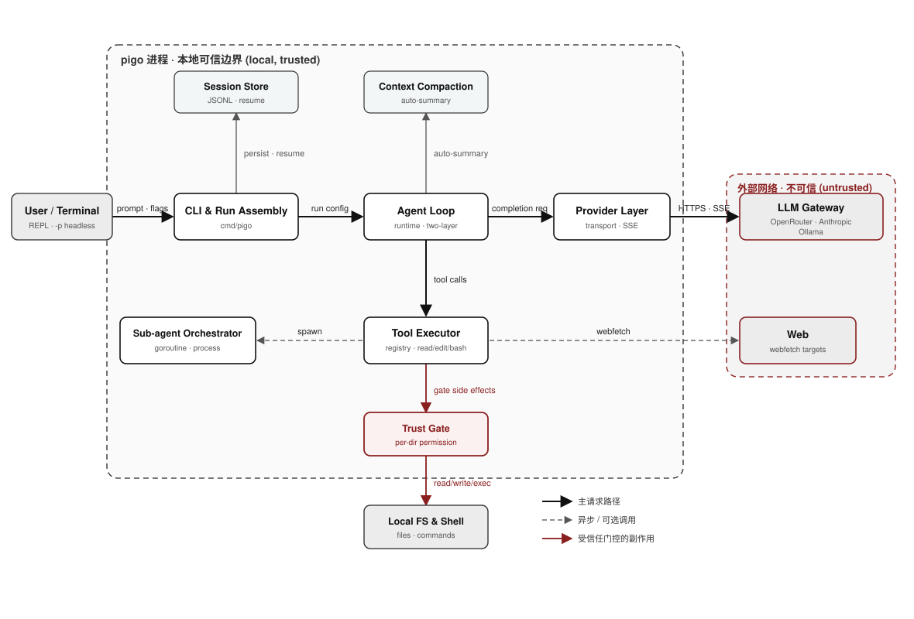
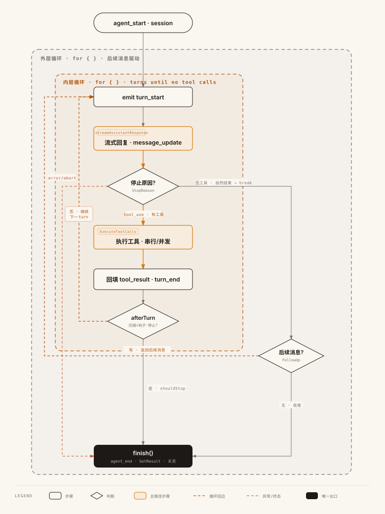

# pigo

[](https://github.com/smallnest/pigo/actions/workflows/ci.yml)
[](https://github.com/smallnest/pigo/actions/workflows/release.yml)

使用 Go 复刻的 [pi](https://pi.dev) AI Agent —— 一个面向命令行的编码智能体，同时支持**无头（headless）脚本模式**与**交互式 REPL**。

pigo 可以读写文件、执行命令、检索代码、抓取网页，并借助大模型完成从"读懂需求"到"改好代码"的闭环。它兼容 OpenAI / Anthropic 等多种协议网关，支持会话续跑、项目信任、技能（Skills）、插件与包管理。

> 模块路径：`github.com/smallnest/pigo` · Go 1.27+

> 📖 配套电子书《用 Go 编写 pi Agent》：[write_pi_agent_in_go.pdf](https://github.com/smallnest/ebooks/blob/master/write_pi_agent_in_go.pdf)


---

## 目录

- [特性一览](#特性一览)
- [架构总览](#架构总览)
- [安装与构建](#安装与构建)
- [快速开始](#快速开始)
- [命令行参数](#命令行参数)
- [模型与 Provider](#模型与-provider)
- [内置工具](#内置工具)
- [运行模式](#运行模式)
- [系统提示词组装](#系统提示词组装)
- [项目信任](#项目信任)
- [技能 Skills](#技能-skills)
- [提示词模板](#提示词模板)
- [插件](#插件)
- [Hooks](#hooks)
- [包管理](#包管理)
- [发布release](#发布release)
- [目录与环境变量](#目录与环境变量)
- [安全说明](#安全说明)

---

## 特性一览

- **两种模式**：无头 `-p` 一次性执行（适合脚本 / CI），或直接进入交互式 REPL。
- **多 Provider**：OpenRouter（默认）、本地 Ollama、NVIDIA NIM、Anthropic、任意 OpenAI 兼容端点。
- **内置工具集**：`read` / `write` / `edit` / `grep` / `find` / `bash` / `todo` / `webfetch`。
- **会话续跑**：`--list-sessions` / `--resume` / `--continue`，无头与 REPL 均可续跑。
- **stream-json 输出**：逐行 JSON 事件，首个事件携带 `session_id`，便于调用方关联。
- **系统提示词分层组装**：base 指令 + 环境块 + `AGENTS.md`（general→specific）+ `--append-system-prompt`。
- **项目信任**：副作用工具（bash/write/edit）在未信任目录需确认，`--approve` 一次性授权。
- **技能与插件**：`~/.agents/skills` 下的 `/slash` 命令、`~/.pigo/plugins` 下的外部插件。
- **提示词模板**：`~/.pigo/prompts`、项目 `.pigo/prompts`（受信任时）、config `prompts`、`--prompt-template` 下的可复用 `/name` 模板，支持 `$1`/`$@`/`${1:-default}`/`${@:N}` 等参数语法。
- **上下文自动压缩**：接近上下文窗口上限时自动摘要，亦可 `/compact` 手动触发。
- **包管理**：`pigo install npm:<pkg>` 安装 pi 生态的 extension / skill / prompt / theme。

---

## 架构总览

pigo 的运行时分层架构：请求路径从用户经 CLI、Agent 循环、Provider 层直达 LLM 网关；工具路径从循环经工具执行器与信任闸门抵达本地环境；辅以会话存储与上下文压缩，并标注信任边界与外部网络边界。



> 更多分层图解（事件骨架、统一 Provider、工具批量执行、子 Agent 委派等）见配套电子书。

### Agent 两层循环

运行时的核心是 `internal/runtime/loop.go` 的两层循环：**内层** turn 循环反复「流式回复 → 停止原因分派 → 执行工具 → 回填」，直到某次助手消息不再发起工具调用；**外层**在内层收敛后消费 `GetFollowUpMessages`，有后续消息则重跑内层，否则结束。所有终止路径（自然结束 / error / aborted / 停止钩子 / 无后续消息）都汇于唯一出口 `finish()`。



> 交互式版本（含摘要卡片）见 [`docs/agent-loop-flowchart.html`](docs/agent-loop-flowchart.html)。

---

## 安装与构建

需要 Go 1.27 或更高版本。

```bash
# 克隆仓库
git clone https://github.com/smallnest/pigo.git
cd pigo

# 构建二进制（生成 ./pigo）
go build ./cmd/pigo

# 或安装到 $GOPATH/bin
go install ./cmd/pigo

# 也可以不构建，直接运行
go run ./cmd/pigo -p "1+1=?"
```

构建后可查看版本信息（版本号在正式发布时由 goreleaser 注入，源码构建显示 `dev`）：

```bash
pigo --version
# pigo dev (commit none, built unknown)
```

### 一键安装脚本（Linux / macOS）

`install.sh` 会自动检测操作系统 / 架构，从 GitHub Releases 下载最新的预编译二进制并安装到常用的 PATH 目录：

```bash
curl -fsSL https://raw.githubusercontent.com/smallnest/pigo/master/install.sh | sh
```

可用环境变量覆盖默认行为：

| 变量 | 说明 |
|------|------|
| `PIGO_VERSION` | 指定安装版本（形如 `v0.2.0`），默认取最新 release |
| `PIGO_INSTALL_DIR` | 安装目录，默认 `/usr/local/bin`（无写权限时回退到 `~/.local/bin`） |
| `GITHUB_TOKEN` | 可选，用于提高 GitHub API 速率限制 |

```bash
# 指定版本与安装目录
PIGO_VERSION=v0.2.0 PIGO_INSTALL_DIR="$HOME/bin" \
  curl -fsSL https://raw.githubusercontent.com/smallnest/pigo/master/install.sh | sh
```

> Windows 请从 Releases 页面下载 `.zip` 手动解压。

### 下载预编译二进制

[Releases](https://github.com/smallnest/pigo/releases) 页面提供 Linux / macOS / Windows 的 amd64 与 arm64 预编译包（由 goreleaser 构建）。下载对应平台的压缩包解压即可使用。

---

## 快速开始

```bash
# 1. 配置默认 Provider（OpenRouter）的 API Key
export OPENROUTER_API_KEY=sk-or-...

# 2. 无头模式跑一个 prompt，打印最终回答
pigo -p "读取 README 并用三句话总结"

# 3. 进入交互式 REPL（不带 -p 且 stdout 是终端时自动进入）
pigo

# 4. 用本地 Ollama 模型，无需联网
pigo -m ollama/qwen2.5-coder -u http://localhost:11434/v1 -p "解释 main.go 做了什么"
```

---

## 命令行参数

| 长参数 | 短参数 | 默认值 | 说明 |
|--------|--------|--------|------|
| `--print` | `-p` | `""` | 无头打印模式的 prompt（也可用位置参数传入） |
| `--model` | `-m` | `openrouter/free` | 使用的模型 id |
| `--base-url` | `-u` | `""` | 覆盖 Provider 的 base URL（如本地 Ollama） |
| `--api-key` | `-k` | `""` | 指定 Provider 的 API Key（覆盖 env/config，否则读 `<PROVIDER>_API_KEY`） |
| `--protocol` | `-P` | `""` | 强制线路协议：`openai` \| `anthropic`（默认由 model id 推断） |
| `--output-format` | `-o` | `text` | 输出格式：`text` \| `stream-json` |
| `--no-tools` | `-n` | `false` | 禁用内置文件/shell 工具（同时跳过插件发现） |
| `--list-sessions` | `-l` | `false` | 列出已存储的会话并退出 |
| `--resume` | `-r` | `""` | 续跑指定 id 的会话 |
| `--continue` | `-c` | `false` | 续跑最近一次的会话 |
| `--approve` | `-a` | `false` | 为本次运行信任工作目录：跳过首次信任提示，副作用工具免逐次确认 |
| `--no-skills` | | `false` | 禁用技能发现（不加载 `~/.agents/skills` 为 `/skill-name` 命令） |
| `--no-prompt-templates` | | `false` | 禁用提示词模板发现（不加载 `~/.pigo/{commands,prompts}`、`.pigo/prompts`、config `prompts`、`--prompt-template`）；内置斜杠命令不受影响 |
| `--prompt-template` | | `nil` | 从文件或目录（非递归）加载提示词模板；可重复（对标 pi `--prompt-template`） |
| `--system-prompt` | | `""` | 用自定义系统提示词替换默认的 coding-assistant 提示词 |
| `--append-system-prompt` | | `nil` | 向系统提示词末尾追加文本或文件内容；可重复 |
| `--version` | `-v` | `false` | 打印版本信息并退出 |

> `--subagent-rpc` 为内部参数（进程隔离子 Agent 的 JSON-RPC 服务端），不用于直接调用。

**使用例子：**

```bash
# 位置参数等价于 -p
pigo "把 utils.go 里的 getUserName 重命名为 getUsername"

# 指定模型
pigo -m anthropic/claude-3.5-sonnet -p "审查 foo.go 的并发安全性"

# 自定义系统提示词（替换默认）
pigo --system-prompt "你是一个只用中文回答的 Go 专家" -p "什么是 goroutine 泄漏"

# 追加系统提示词：可多次，值为文件路径则读取文件内容，否则作字面文本
pigo --append-system-prompt ./CONVENTIONS.md \
     --append-system-prompt "回答尽量简洁" \
     -p "为这个包补充单元测试"

# 一次性授权工作目录，让 bash/write/edit 免逐次确认
pigo -a -p "运行 go test ./... 并修复失败的用例"
```

---

## 模型与 Provider

模型 id 通过启发式规则映射到具体 Provider（`--protocol` 显式指定时优先级最高）：

1. **`--protocol`** 显式选择 → `openai`（需配合 `--base-url`）或 `anthropic`（默认公有 Anthropic API）。
2. **预置目录命中** → 使用预置声明的 Provider（REPL 中可用 `/models` 查看、`/model <id>` 切换）。
3. **`ollama/` 前缀** 或 base URL 含 `11434` → 本地 Ollama。
4. **`nvidia/` 前缀** → NVIDIA NIM。
5. **按模型名推断** → 未设 `--provider`/`--protocol`/`--base-url` 时，从模型名的知名前缀推断其第一方内置 Provider（如 `-m claude-opus-4-8` 直连 Anthropic，无需再写 `--provider`）。
6. **其余** → OpenRouter（默认）。

> **优先级**：显式 flag（`--provider` > `--protocol`）> 预置目录 > `ollama/`/`nvidia/` 前缀 > 模型名推断 > OpenRouter 默认。显式 `--provider` 始终胜出；给了 `--base-url` 会被视为自定义端点信号，跳过第 5 步推断。

**按模型名推断的前缀对照**（仅推断能唯一确定 Provider 的前缀；`llama-*`、`qwq-*`、`gemma-*`、`mixtral-*` 等被多家网关服务的家族，以及形如 `provider/model` 的 routed id，不推断，回落到 OpenRouter 默认）：

| 模型名前缀 | 推断的 Provider |
|-----------|-----------------|
| `claude-*` | anthropic |
| `gpt-*` / `o1-*` / `o3-*` / `o4-*` | openai |
| `gemini-*` | google |
| `deepseek-*` | deepseek |
| `glm-*` | zai |
| `kimi-*` / `moonshot-*` | moonshotai |
| `qwen-*` | dashscope |
| `ernie-*` | qianfan |
| `doubao-*` | volcengine |
| `grok-*` | xai |
| `mistral-*` / `codestral-*` / `devstral-*` | mistral |
| `hunyuan-*` | hunyuan |
| `minimax-*` | minimax |
| `mimo-*` | xiaomi |

匹配大小写不敏感。推断命中后走与显式 `--provider` 相同的解析路径，使用该 Provider 的默认 base URL、协议与 `<PROVIDER>_API_KEY` 环境变量。


| Provider | 线路格式 | 默认 base URL | API Key 环境变量 |
|----------|----------|---------------|------------------|
| OpenRouter（默认） | OpenAI Chat Completions | `https://openrouter.ai/api/v1` | `OPENROUTER_API_KEY` |
| Ollama（本地） | OpenAI 兼容 | `http://localhost:11434/v1` | 无需（本地） |
| NVIDIA NIM | OpenAI 兼容 | `https://integrate.api.nvidia.com/v1` | `NVIDIA_API_KEY` / `NVIDIA_NIM_API_KEY` |
| OpenAI 兼容 | OpenAI Chat Completions | 需自行提供 `--base-url` | `OPENAI_API_KEY` |
| Anthropic | Anthropic Messages | `https://api.anthropic.com/v1` | `ANTHROPIC_API_KEY` / `CLAUDE_API_KEY` |

Key 解析顺序：OAuth token → `--api-key` → 环境变量 → 配置文件。其他 Provider（google/deepseek/xai/groq/mistral 等）遵循 `<PROVIDER>_API_KEY` 约定。

**使用例子：**

```bash
# 默认 OpenRouter
export OPENROUTER_API_KEY=sk-or-...
pigo -p "写一个快排"

# 任意 OpenAI 兼容端点，强制 openai 协议
pigo -P openai -u https://my-gateway.example.com/v1 -m my-model -k $MY_KEY -p "..."

# 公有 Anthropic API
export ANTHROPIC_API_KEY=sk-ant-...
pigo -P anthropic -m claude-3-5-sonnet-20241022 -p "..."
```

---

## 内置工具

工具集根植于当前工作目录，`--no-tools` 可整体禁用。

| 工具 | 说明 |
|------|------|
| `read` | 按路径读取文本文件，支持行 offset/limit，输出带行号，超大文件截断 |
| `write` | 创建或覆盖文件，按需创建父目录 |
| `edit` | 精确字符串替换（`old_string` 需唯一，除非 `replace_all`），返回 diff |
| `grep` | 正则检索文件内容，支持 glob 过滤，跳过 `.gitignore` 路径 |
| `find` | 按文件名 glob 查找文件，跳过 `.gitignore` 路径 |
| `bash` | 执行 shell 命令，流式 stdout/stderr，支持超时与取消 |
| `todo` | 记录/更新结构化任务清单，每次提交整份列表（pending/in_progress/completed） |
| `webfetch` | 抓取 URL 并转为精简 Markdown 正文，HTTP 自动升级 HTTPS |

> `bash` / `write` / `edit` 属于"副作用工具"，在未信任目录下需确认（见[项目信任](#项目信任)）。

---

## 运行模式

```bash
# 无头打印模式：只输出最终回答文本
pigo -p "总结这个仓库的架构"

# stream-json：逐行 JSON 事件，首个事件带 session_id
pigo -p "列出所有 Go 文件" --output-format stream-json

# 交互式 REPL：不带 -p 且 stdout 为终端时进入
pigo

# 会话管理
pigo --list-sessions              # 列出会话
pigo --resume 20260720-1530-abcd  # 续跑指定会话（无头/REPL 均可）
pigo --continue                   # 续跑最近一次会话
```

REPL 中的内置斜杠命令包括 `/model`、`/models`、`/help`、`/compact`、`/fork`、`/clone`、`/tree`、`/export`、`/import`、`/copy`、`/session`、`/status`、`/exit` 等。其中 `/status` 一次性展示运行时模型配置、上下文占用与压缩、项目环境（信任 / 技能 / 插件）、凭据连通性，以及遥测数据（累计与最近一次 run 的轮次、工具耗时、上下文利用率）。

在交互终端输入时，pigo 会用灰色文字提示最近匹配的输入或斜杠命令；
输入 `/model ` 时还会从最近使用的模型和内置模型目录中匹配。按 `Tab`
或右方向键接受当前提示；当有多个匹配时，按上/下方向键可在候选提示之间
循环选择上一个或下一个，继续输入则会实时缩小匹配范围。

---

## 系统提示词组装

系统提示词按三层顺序拼装（`internal/runtime/prompt.go`）：

1. **base 指令**：默认的 coding-assistant 提示词，可用 `--system-prompt` 整体替换。
2. **环境块**：工作目录、OS/架构、当前日期。
3. **`AGENTS.md` 注入**：从仓库根目录到当前工作目录，**由通用到具体**依次拼接——越靠近工作目录（越具体）的 `AGENTS.md` 排在越后，优先级更高。

`--append-system-prompt` 的内容追加在最后，按参数顺序排列；每个值若为存在的普通文件则读取文件内容，否则作为字面文本，空条目跳过。

---

## 项目信任

副作用工具（`bash` / `write` / `edit`）在**未信任**或**未决定**的目录下需要逐次确认。信任状态按目录三态（Trusted / Untrusted / Undecided）持久化为 JSON。

- 首次在某目录启动 REPL 时会提示是否信任。
- `--approve` / `-a` 为本次运行一次性授予会话级信任，跳过首次提示并免逐次确认。

---

## 提示词模板

提示词模板是可复用的 Markdown 片段，在 REPL 中输入 `/name` 即可展开为完整 prompt（对标 [pi prompt templates](https://pi.dev/docs/latest/prompt-templates)）。模板可带 YAML frontmatter，支持位置参数、默认值与切片。

### 发现来源与优先级

pigo 从以下来源非递归加载 `*.md` 模板（文件名去掉 `.md` 即命令名）：

| 来源 | 路径 / 配置 | 优先级 tier |
|------|-------------|-------------|
| 项目级（受信任时） | `.pigo/prompts/*.md`（仅当项目受信任） | project |
| 全局 | `~/.pigo/prompts/*.md` 与 legacy `~/.pigo/commands/*.md` | global |
| 包安装 | `pigo install` 安装到 `~/.pigo/prompts` | global（并入全局） |
| 配置 | `~/.config/pigo/config.toml` 的 `prompts = ["./my-prompts", "/abs/x.md"]` | settings |
| CLI | `--prompt-template <path>`（可重复，文件或目录） | cli |

同名模板按 tier 解析：**project > global > settings > cli**，败者丢弃并在启动时报告；built-in 斜杠命令始终胜出。`--no-prompt-templates` 关闭全部模板发现（内置命令与技能不受影响，与 `--no-skills` 互相独立）。

### 模板格式

````markdown
---
description: Review PRs from URLs with structured issue and code analysis
argument-hint: "<PR-URL>"
---
Review the PR at $1. Focus on:
- Bugs and logic errors
- Security issues
- Error handling gaps
````

- `description`：可选；缺省时回退为正文首个非空行。
- `argument-hint`：可选；在 Tab 补全与 `/help` 中以 `name <hint> - description` 形式展示。用 `<angle>` 表示必选参数、`[square]` 表示可选。
- 正文是 prompt 模板，支持下面的参数语法。

### 参数语法

| 语法 | 含义 |
|------|------|
| `$1`、`$2`、… `$N` | 第 N 个位置参数（1-indexed；越界为空） |
| `$@` / `$ARGUMENTS` | 全部参数以单空格连接 |
| `${1:-default}` | arg1 存在且非空则用 arg1，否则用 `default` |
| `${@:-default}` / `${ARGUMENTS:-default}` | 全部参数非空则用之，否则 `default` |
| `${@:N}` | 从第 N 个起的所有参数 |
| `${@:N:L}` | 从第 N 个起的 L 个参数 |

调用示例：

```
/review https://github.com/owner/repo/pull/123
/component Button "onClick handler" "disabled support"
/summarize            # 模板用 ${1:-7} 时回退为 7 条要点
```

> 分词遵循 shell 引号规则：`Button "click handler"` 被切分为 `["Button", "click handler"]`。未闭合引号会回退为把原始串整体作为 `$ARGUMENTS`，保证可用。

## 技能 Skills

技能是带 YAML frontmatter（`name`、`description`，可选 `allowed-tools`、`model`、`disable-model-invocation`）的 Markdown 文件，位于 `~/.agents/skills`（可用 `PIGO_SKILLS_DIR` 覆盖）：

- 支持扁平的 `*.md` 与嵌套的 `<name>/SKILL.md`。
- 每个技能在 REPL 中暴露为 `/skill-name` 斜杠命令（展开正文为 prompt，支持 `$ARGUMENTS` 替换），也可作为子 Agent 工具运行。
- `--no-skills` 禁用技能发现；格式错误的技能会被非致命地跳过。

### 模型自动调用（渐进式披露）

除了手动的 `/skill-name` 调用，技能还可被模型**自动调用**。pigo 采用渐进式披露：仅将每个技能的 `name`、`description` 和文件路径（location）注入系统提示的 `<available_skills>` 块，模型在任务匹配某技能的描述时，用 `read` 工具按需加载 `SKILL.md` 正文，而非把所有技能正文常驻上下文。

- **仅当 `read` 工具可用时**自动调用才生效（`--no-tools` 或屏蔽 `read` 时不注入 `<available_skills>`），因为模型需要 `read` 才能加载技能正文。
- 在 frontmatter 中设置 `disable-model-invocation: true` 可将某技能排除出 `<available_skills>`（模型不会自动调用它），但它仍可通过 `/skill-name` 斜杠命令显式调用。

---

## 插件

外部插件从 `$PIGO_HOME/plugins`（默认 `~/.pigo/plugins`）发现：

- 容错发现——启动失败的插件会被记录并跳过。
- 插件可提供额外工具，并订阅 Agent 生命周期事件。
- `--no-tools` 会整体跳过插件发现。

---

## Hooks

Hooks 让你在 Agent 生命周期的关键节点运行**自定义 shell 命令**，无需写 Go 或编译插件即可拦截、注入或观察 Agent 行为（对标 Claude Code 的 hooks）。命令以你**当前用户身份**执行，通过 stdin 收到一份 JSON、通过退出码与 stdout JSON 影响 Agent。

### Hook 点一览（9 个）

| 事件 | 触发时机 | 能否阻断 | 关键输入字段 |
|------|---------|:-------:|-------------|
| `PreToolUse` | 工具执行前 | ✅ | `tool_name`, `tool_input` |
| `PostToolUse` | 工具执行后 | 反馈 | `tool_name`, `tool_input`, `tool_response` |
| `UserPromptSubmit` | 用户提交 prompt 后、进入模型前 | ✅ | `prompt` |
| `Stop` | 主 Agent 一轮自然结束时 | ✅（要求继续） | `stop_reason` |
| `SubagentStop` | 子 Agent 结束时 | ✅（要求继续） | `stop_reason` |
| `SessionStart` | 会话开始 / 恢复 | 注入 | `source`（`startup`/`resume`） |
| `SessionEnd` | 会话结束 | 观察 | `stop_reason` |
| `PreCompact` | 上下文压缩前 | 观察 | `trigger`（`manual`/`auto`） |
| `Notification` | Agent 发出通知时 | 观察 | `message` |

### 输入 JSON（写入 hook 的 stdin）

pigo 向 hook 命令的 stdin 写入**单行 JSON**。只包含可观察、非敏感字段，**绝不包含 API Key 或任何凭证**。按事件类型只携带相关字段：

```json
{
  "event_type": "PreToolUse",
  "session_id": "0f9d…",
  "project_dir": "/path/to/repo",
  "tool_name": "bash",
  "tool_input": { "command": "rm -rf /" }
}
```

| 字段 | 说明 |
|------|------|
| `event_type` | 事件名（见上表） |
| `session_id` | 会话 id（子 Agent 无会话时省略） |
| `project_dir` | 当前工作目录 |
| `tool_name` / `tool_input` | 工具名与入参（Pre/PostToolUse） |
| `tool_response` | 工具返回（PostToolUse） |
| `prompt` | 用户输入（UserPromptSubmit） |
| `stop_reason` | 结束原因（Stop/SessionEnd） |
| `source` | `startup` 或 `resume`（SessionStart） |
| `trigger` | `manual` 或 `auto`（PreCompact） |
| `message` | 通知内容（Notification） |

### 输出协议（退出码 + stdout JSON）

hook 通过**退出码**给出决定：

- **`0`**：放行。若 stdout 是合法 JSON，则按下表解析；非 JSON 视为无操作。
- **`2`**：阻断。stderr 作为阻断原因（等价于 stdout 输出 `{"decision":"block"}`）。
- **其它非 0**：执行失败，记录警告并对阻断型 hook **fail-open**（不阻断 Agent）。

退出码 0 时，可选地在 stdout 打印 JSON 精细控制：

| 字段 | 类型 | 作用 |
|------|------|------|
| `decision` | string | `"block"` 阻断；`"approve"` 或空放行 |
| `reason` | string | 阻断原因 / 反馈文本 |
| `additionalContext` | string | 注入给模型的额外上下文（UserPromptSubmit / SessionStart） |
| `continue` | bool | `false` 等价于阻断 |
| `updatedInput` | object | 仅 PreToolUse：改写工具入参后再执行 |

多个 hook 命中同一事件时：任一阻断即阻断；`additionalContext` 按顺序累加；`updatedInput` 以最后一个为准。每个 hook 默认 60s 超时（`timeout` 字段可覆盖），超时按失败处理。

### Matcher 规则

`matcher` 仅对带工具名的事件（Pre/PostToolUse）生效，语义对标 Claude Code：

- 空或 `"*"`：匹配所有工具。
- 精确工具名（如 `bash`）：只匹配该工具。
- `"|"` 分隔列表（如 `bash|write|edit`）：匹配其中任一。
- 其它：作为 **Go 正则**对工具名求值（如 `"Notebook.*"`）。

不带工具名的事件（UserPromptSubmit、Stop、SessionStart 等）忽略 matcher，全部 hook 触发。

### 分层配置

hook 配置写在 `config.json` 的 `hooks` 字段，按 `event → [{matcher, hooks}]` 组织。多层配置**按事件追加合并**（默认 < 全局 < 项目 < 环境），优先级低的先执行：

- **全局**：`$PIGO_HOME/config.json`（默认 `~/.pigo/config.json`），对所有项目生效。
- **项目**：`./.pigo/config.json`，**仅当项目被信任时加载**（见下方安全须知）。

```jsonc
// ~/.pigo/config.json —— 全局：所有会话都注入 git 分支
{
  "hooks": {
    "UserPromptSubmit": [
      { "hooks": [{ "type": "command", "command": "~/.pigo/hooks/inject-branch.sh" }] }
    ]
  }
}
```

```jsonc
// ./.pigo/config.json —— 项目级：仅本仓库拦截危险命令、写文件后跑格式化
{
  "hooks": {
    "PreToolUse": [
      { "matcher": "bash", "hooks": [{ "type": "command", "command": "./.pigo/hooks/block-rm-rf.sh" }] }
    ],
    "PostToolUse": [
      { "matcher": "write|edit", "hooks": [{ "type": "command", "command": "./.pigo/hooks/gofmt.sh", "timeout": 30 }] }
    ]
  }
}
```

单个 hook 条目字段：`type`（当前为 `"command"`，可省略）、`command`（要执行的 shell 命令）、`timeout`（秒，默认 60，非正数忽略）。

### 可运行示例

以下脚本记得 `chmod +x`。

**1. PreToolUse — 拦截 `rm -rf`**（退出码 2 阻断，stderr 作为原因）：

```bash
#!/usr/bin/env bash
# ~/.pigo/hooks/block-rm-rf.sh
payload=$(cat)
cmd=$(printf '%s' "$payload" | jq -r '.tool_input.command // ""')
if printf '%s' "$cmd" | grep -Eq 'rm[[:space:]]+(-[a-zA-Z]*r[a-zA-Z]*[[:space:]]+)*-?[a-zA-Z]*f'; then
  echo "blocked: 'rm -rf' is not allowed by project policy" >&2
  exit 2
fi
exit 0
```

**2. UserPromptSubmit — 注入当前 git 分支**（退出码 0 + stdout JSON 的 `additionalContext`）：

```bash
#!/usr/bin/env bash
# ~/.pigo/hooks/inject-branch.sh
branch=$(git rev-parse --abbrev-ref HEAD 2>/dev/null || echo "no-git")
printf '{"additionalContext": "Current git branch: %s"}\n' "$branch"
exit 0
```

**3. PostToolUse — 写文件后跑格式化**（观察型，读 `tool_input` 里的路径）：

```bash
#!/usr/bin/env bash
# ~/.pigo/hooks/gofmt.sh
payload=$(cat)
path=$(printf '%s' "$payload" | jq -r '.tool_input.path // .tool_input.file_path // ""')
case "$path" in
  *.go) [ -f "$path" ] && gofmt -w "$path" ;;
esac
exit 0
```

### 安全须知

- **以当前用户身份执行**：hook 就是普通 shell 命令，拥有你本人的全部权限。只配置你信任的命令，谨慎对待第三方脚本。
- **payload 不含凭证**：写入 hook stdin 的 JSON 只有可观察的非敏感字段，**绝不包含 API Key 或任何凭证**。
- **项目级 hook 仅受信任项目启用**：`./.pigo/config.json` 里的 hook 只有当项目被信任（`--approve` 或信任存储记录）时才加载；不受信任的目录一律忽略项目级 hook，避免克隆仓库即执行任意命令（fail-closed）。

---

## 包管理

安装 pi 生态的包（extension / skill / prompt / theme）。`install` 需要 PATH 上有 `npm`。

```bash
# 安装（仅支持 npm: 源，支持 scoped 包与指定版本）
pigo install npm:pi-mcp-adapter
pigo install npm:@scope/name@1.2.3

# 列出已安装的包
pigo list

# 更新（无参数则更新全部）
pigo update
pigo update pi-mcp-adapter

# 卸载
pigo uninstall pi-mcp-adapter
```

包类型（`extension` / `skill` / `prompt` / `theme`）会分别分发到对应目录，安装记录写入 lockfile。

---

## 发布（Release）

使用 [goreleaser](https://goreleaser.com) 构建跨平台二进制并发布到 GitHub Release。

```bash
# 校验配置
goreleaser check

# 本地试跑（快照，不发布）
goreleaser release --snapshot --clean

# 正式发布：打 tag 并推送，GitHub Actions 自动触发
git tag -a v0.2.0 -m "v0.2.0"
git push origin v0.2.0
```

推送 `v*` tag 会触发 `.github/workflows/release.yml`，由 goreleaser 构建 Linux/macOS/Windows × amd64/arm64 的归档包、生成 checksums 并创建 Release。版本号 / commit / 构建时间通过 `-ldflags` 注入 `main` 包，可用 `pigo --version` 查看。

---

## 目录与环境变量

| 变量 / 路径 | 用途 |
|-------------|------|
| `PIGO_HOME` | 覆盖 `~/.pigo` 基础目录（影响 plugins、commands、prompts） |
| `PIGO_SKILLS_DIR` | 覆盖技能目录（默认 `~/.agents/skills`） |
| `~/.pigo/sessions` | 会话存储（JSONL） |
| `~/.pigo/plugins` | 外部插件 |
| `~/.pigo/prompts` | 提示词模板（pi 对齐；`pigo install` 的安装目标） |
| `~/.pigo/commands` | 用户自定义命令模板（legacy，仍加载） |
| `.pigo/prompts` | 项目级提示词模板（仅当项目受信任时加载） |
| `~/.config/pigo/config.toml` 的 `prompts` | 配置追加的模板来源（settings tier） |
| `--prompt-template <path>` | CLI 追加的模板来源（cli tier，可重复） |
| `<PROVIDER>_API_KEY` | 各 Provider 的 API Key（见[模型与 Provider](#模型与-provider)） |

### 内置 Provider 一览（`--provider`）

`--provider <name>` 直接选中某个内置 Provider，使用其默认 base URL、协议与 API Key 环境变量（可用 `--base-url` 或 `<PROVIDER>_BASE_URL` 覆盖，`--api-key` 或对应环境变量提供 Key）。下表与注册表 `internal/provider/registry.go` 保持一致，`pigo --help` 也会列出同样的清单。

| provider | 环境变量（按优先级） | 默认 base_url | 协议 |
|----------|----------------------|---------------|------|
| `anthropic` | `ANTHROPIC_OAUTH_TOKEN` / `ANTHROPIC_API_KEY` / `CLAUDE_API_KEY` | `https://api.anthropic.com/v1` | anthropic |
| `openai` | `OPENAI_API_KEY` | `https://api.openai.com/v1` | openai |
| `ant-ling` | `ANT_LING_API_KEY` | `https://api.ant-ling.com/v1` | openai |
| `deepseek` | `DEEPSEEK_API_KEY` | `https://api.deepseek.com` | openai |
| `nvidia` | `NVIDIA_API_KEY` / `NVIDIA_NIM_API_KEY` | `https://integrate.api.nvidia.com/v1` | openai |
| `google` | `GEMINI_API_KEY` / `GOOGLE_API_KEY` | `https://generativelanguage.googleapis.com/v1beta` | openai |
| `groq` | `GROQ_API_KEY` | `https://api.groq.com/openai/v1` | openai |
| `cerebras` | `CEREBRAS_API_KEY` | `https://api.cerebras.ai/v1` | openai |
| `xai` | `XAI_API_KEY` | `https://api.x.ai/v1` | openai |
| `openrouter` | `OPENROUTER_API_KEY` | `https://openrouter.ai/api/v1` | openai |
| `vercel-ai-gateway` | `AI_GATEWAY_API_KEY` | `https://ai-gateway.vercel.sh` | openai |
| `zai` | `ZAI_API_KEY` | `https://api.z.ai/api/coding/paas/v4` | openai |
| `zai-coding-cn` | `ZAI_CODING_CN_API_KEY` | `https://open.bigmodel.cn/api/coding/paas/v4` | openai |
| `mistral` | `MISTRAL_API_KEY` | `https://api.mistral.ai` | openai |
| `minimax` | `MINIMAX_API_KEY` | `https://api.minimax.io/anthropic` | anthropic |
| `minimax-cn` | `MINIMAX_CN_API_KEY` | `https://api.minimaxi.com/anthropic` | anthropic |
| `moonshotai` | `MOONSHOT_API_KEY` | `https://api.moonshot.ai/v1` | openai |
| `moonshotai-cn` | `MOONSHOT_API_KEY` | `https://api.moonshot.cn/v1` | openai |
| `huggingface` | `HF_TOKEN` | `https://router.huggingface.co/v1` | openai |
| `fireworks` | `FIREWORKS_API_KEY` | `https://api.fireworks.ai/inference` | openai |
| `together` | `TOGETHER_API_KEY` | `https://api.together.ai/v1` | openai |
| `opencode` | `OPENCODE_API_KEY` | `https://opencode.ai/zen` | openai |
| `opencode-go` | `OPENCODE_API_KEY` | `https://opencode.ai/zen/go` | openai |
| `kimi-coding` | `KIMI_API_KEY` | `https://api.kimi.com/coding` | openai |
| `xiaomi` | `XIAOMI_API_KEY` | `https://api.xiaomimimo.com/v1` | openai |
| `xiaomi-token-plan-cn` | `XIAOMI_TOKEN_PLAN_CN_API_KEY` | `https://token-plan-cn.xiaomimimo.com/v1` | openai |
| `xiaomi-token-plan-ams` | `XIAOMI_TOKEN_PLAN_AMS_API_KEY` | `https://token-plan-ams.xiaomimimo.com/v1` | openai |
| `xiaomi-token-plan-sgp` | `XIAOMI_TOKEN_PLAN_SGP_API_KEY` | `https://token-plan-sgp.xiaomimimo.com/v1` | openai |
| `qianfan` | `QIANFAN_API_KEY` | `https://qianfan.baidubce.com/v2` | openai |
| `volcengine` | `ARK_API_KEY` / `VOLCENGINE_API_KEY` | `https://ark.cn-beijing.volces.com/api/v3` | openai |
| `dashscope` | `DASHSCOPE_API_KEY` | `https://dashscope.aliyuncs.com/compatible-mode/v1` | openai |
| `hunyuan` | `HUNYUAN_API_KEY` | `https://api.hunyuan.cloud.tencent.com/v1` | openai |
| `azure-openai-responses` | `AZURE_OPENAI_API_KEY`（+ `AZURE_OPENAI_BASE_URL` / `AZURE_OPENAI_RESOURCE_NAME`） | 由环境变量拼接 | openai（Azure） |
| `amazon-bedrock` | `AWS_BEARER_TOKEN_BEDROCK`（或 `AWS_PROFILE` / `AWS_ACCESS_KEY_ID`+`AWS_SECRET_ACCESS_KEY`；`AWS_REGION` 默认 `us-east-1`） | `https://bedrock-runtime.{AWS_REGION}.amazonaws.com` | anthropic |
| `google-vertex` | `GOOGLE_CLOUD_API_KEY`（或 ADC）+ `GOOGLE_CLOUD_PROJECT` + `GOOGLE_CLOUD_LOCATION` | `https://{location}-aiplatform.googleapis.com` | openai |
| `cloudflare-workers-ai` | `CLOUDFLARE_API_KEY` + `CLOUDFLARE_ACCOUNT_ID` | `https://api.cloudflare.com/client/v4/accounts/{account_id}/ai/v1` | openai |
| `cloudflare-ai-gateway` | `CLOUDFLARE_API_KEY` + `CLOUDFLARE_ACCOUNT_ID` + `CLOUDFLARE_GATEWAY_ID` | `https://gateway.ai.cloudflare.com/v1/{account_id}/{gateway_id}/anthropic` | anthropic |

> base_url 覆盖优先级：`--base-url` > provider 专有 `*_BASE_URL` 环境变量 > 泛化 `<PROVIDER>_BASE_URL`（provider 名大写、`-` 转 `_`）> 注册表默认值。任意 Provider 也支持泛化的 `<PROVIDER>_API_KEY` 约定作为 Key 回退。

> 火山方舟（`volcengine`）部分模型需以「推理接入点 ID（endpoint id）」而非模型名调用，此时用 `-m <endpoint-id>` 指定即可；本仓库预置的 `doubao-seed-1-6` 走模型名方式。

---

## 安全说明

- pigo 会向解析出的 Provider 端点发起外部网络请求。
- `bash` / `write` / `edit` 会在本地产生副作用，仅由项目信任机制把关；`--approve` 会跳过逐次确认，请在受信任的目录中使用，权衡便利与安全。
- 处理来自文件、命令输出、网页等外部来源的内容时应视为不可信数据。

---

## 许可证

参见仓库根目录的 [LICENSE](LICENSE)。
