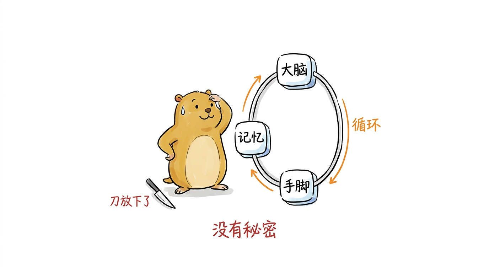
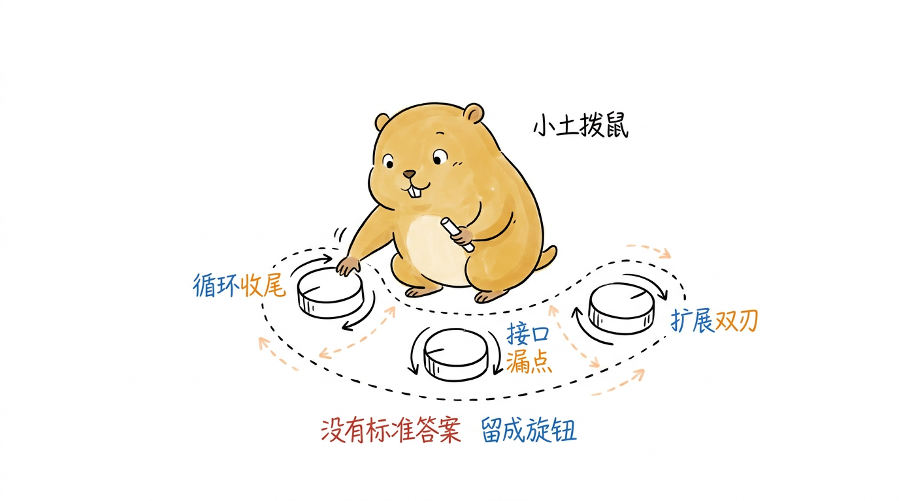
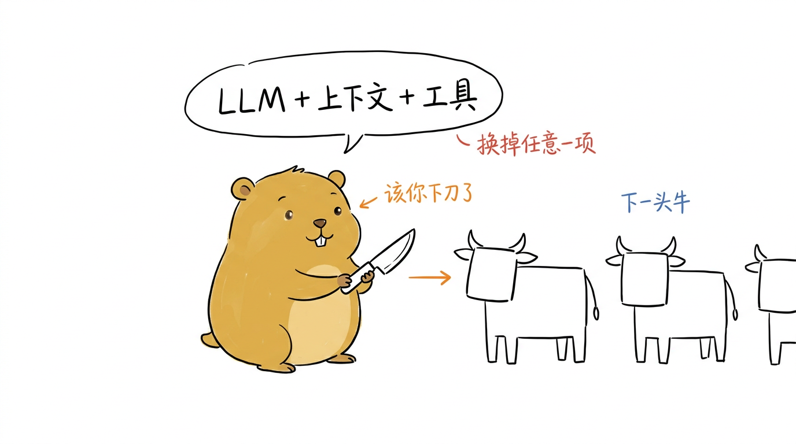

# 后记：解牛之后

刀放下了。

从引言里那句"你在终端敲下一行命令、回车"开始，到第 10 章讲完 Skills 和包管理怎么让 Agent 长出新能力，我们顺着 pigo 的源码纹理，把一个能读代码、能改文件、能跑命令的命令行 Agent 拆到了骨头缝里。回过头看，这台机器其实没什么秘密：一个循环，串起大脑、记忆和手脚，剩下的都是把这三样东西可靠地接起来的工程活。

<!--
生图prompt：
Generate one standalone 16:9 horizontal Chinese article illustration.

Visual DNA:
Pure white background. Minimalist editorial doodle with black hand-drawn pen line art and light colored pen wash, researcher-sketchbook / whiteboard feeling. Slightly wobbly pen lines. Lots of empty white space. Sparse red/orange/blue handwritten Chinese annotations. Clean curious product-sketch feeling. No gradients, no shadows, no paper texture, no complex background, no commercial vector style, no PPT infographic look, no anime style, no children's picture book, no commercial mascot, no realistic UI.

Recurring IP character required:
小土拨鼠 (Little Gopher), an original IP: a round, chubby, warm brown-yellow gopher inspired by the Go language Gopher, but cuter, cleaner and more soothing. Round head with a pair of small round ears; two small round curious eyes; a tiny nose and two small signature front teeth; short little limbs and soft paws; warm brown-yellow fur with a lighter belly; plump rounded proportions, earnest yet gently funny. 小土拨鼠 must perform the core conceptual action, not decorate the scene. Keep it a clean round soothing cartoon gopher, not a realistic rat/hamster, not the stiff original Go Gopher, not anime, not a mascot.

Theme: 解牛之后：刀放下，Agent 这头牛已被拆成一副清清楚楚的骨架——循环串起大脑、记忆、手脚
Structure type: 概念隐喻
Core idea: 全书拆解完成，一台看似神秘的 Agent 被还原成一副透明的简单骨架：一个循环把大脑、记忆、手脚三样东西串起来，没有秘密
Composition: 小土拨鼠像刚收工的庖丁，站在画面中央把一把小刀轻轻放下（刀斜靠在脚边），面前是一副已经被拆解开、摊得清清楚楚的"牛"骨架——但这副骨架其实由几个标了牌子的方块组成：一个大的环形循环轨道当脊梁，串着"大脑""记忆""手脚"三个圆块当骨节；小土拨鼠一手叉腰一手擦汗，满意地端详这副透明骨架
Suggested elements: 放下的小刀 / 环形循环当脊梁 / 大脑·记忆·手脚三个骨节方块 / 小土拨鼠擦汗端详的姿势
Chinese handwritten labels: 刀放下了 / 循环 / 大脑 / 记忆 / 手脚 / 没有秘密
Color use: Black for main line art and 小土拨鼠's eyes/nose/teeth/paw outlines. 小土拨鼠 body warm brown-yellow with lighter belly. Orange for main flow/arrows. Red only for key warnings/results. Blue only for secondary notes/system state.
Constraints: One image explains only one core structure. Main subject 40%-60% of canvas. At least 35% blank white space. At most 5-8 short handwritten Chinese labels. No title in top-left corner. Do not write the structure type on the image. Not a formal diagram/slide. Invent a fresh visual metaphor for this specific content.
-->
{#fig:11-1 width=100%}

可"没有秘密"不等于"没有讲究"。同一个 Agent，pi 用脚本语言写，pigo 用 Go 重造，行为对齐，代码却是两副样子。这篇后记想聊的，就是重造过程里那些被摊到台面上的选择——为什么这么写、放弃了什么、又换回了什么。这些取舍散在正文各章，这里收拢起来重看一遍。

## 重造换来了什么

pigo 不是 pi 的翻译，而是一次带着约束的重写。约束来自 Go，好处也来自 Go。

最外层的形状是一个单体二进制。没有运行时依赖，没有解释器，没有一地的脚本文件，`go build` 出来就能拷到任何一台同架构机器上跑。这个决定的回报在第 9 章看得最清楚：父 Agent 要派生子 Agent 时，直接 `os.Executable()` 拿到自己的路径，带上 `--subagent-rpc` 把自己再拉起一个进程（`internal/runtime/subagent.go`）。"自己 spawn 自己"能成立，前提正是"自己"就是一个自包含、可寻址的可执行文件。换到脚本世界，光是"用哪个解释器、加载哪些依赖"就够折腾一阵。

往里一层是类型带来的契约。第 2 章拆的 `agentcore` 是全书出现频率最高的包，因为它是所有模块共享的类型地基——Message、Content、各种 AgentEvent、Tool、Hooks。动态语言里这些结构靠约定和文档维系，字段拼错了要等到运行时才炸；Go 里它们是编译期就锁死的契约。第 4 章的 Provider 层能把 OpenAI 兼容协议和 Anthropic-Messages 协议塞进同一个接口背后，第 5 章的工具能被注册表统一登记、批量并发执行，靠的都是这层契约先立住。代价也实打实：为了让类型对齐，pigo 写了比 pi 多得多的样板代码，一个密封接口配十来种事件类型，光声明就是一屏。这是静态类型的老账，用前期的啰嗦换后期改动时编译器替你查错。

安全这条线上，pigo 的态度也硬一些。一个能执行 shell 的 Agent 天然危险，它在两处把闸门焊死。第 8 章的信任机制，让 pigo 头一回进入某个目录时先停下来问一句、把决定记在案，之后才肯放工具去碰这个项目。第 9 章的子 Agent 走进程隔离而不是同进程协程——子任务在独立进程里跑，崩了也波及不到父进程，父子之间只通过 stdio 上的 JSON-RPC 交换结构化消息。还有一条不显眼但贯穿始终的细节：密钥从不写进任何可能被日志或事件流打印的结构体里（第 1 章、第 4 章都点到），`stream-json` 的每一行都只挑对外安全的字段往外吐。这些算不上炫技，是一个要动用户机器的程序本该有的分寸。

至于"记得住、跑得久"，落在第 6 章的上下文压缩和第 7 章的会话持久化上。压缩要在逼近 token 上限时挑一个切点，把前文摘要掉又不丢关键信息；会话要能落盘、能 `--resume`、能导出成 HTML 回放。这两块 pi 里也有，pigo 把它们重写成了边界清晰、能单独测试的包。

## 被重造照出来的边界

拆到最后，有几处值得停下来多看一眼，因为它们暴露了这类 Agent 真正的难处不在"能不能做"，而在"边界画在哪"。

一是循环的收尾。第 3 章那两层循环——内层"流式回复→执行工具→回填"，外层"要不要续跑"——听着简单，难在什么时候停。停早了任务没做完，停晚了烧 token，甚至原地打转。pigo 用一组钩子和明确的停止原因（length / error / aborted）把这件事管住，但"这一轮到底该不该继续"本质上没有标准答案，是留给上层策略的旋钮。

二是统一接口的漏点。第 4 章把两套模型协议收进一个 Provider 接口，抽象得挺干净，可现实里每家网关都有自己的脾气：鉴权方式不同（于是有了特殊鉴权 Provider），错误语义不同（于是有了流内错误和构建期错误的双失败模型），字段命名也各说各话。统一接口不是把差异消灭，而是把差异关进尽量小的角落。这层抽象能撑多久，得看下一个要接入的网关有多爱标新立异。

三是扩展性的双刃。第 10 章的 Skills、斜杠命令、Plugins 让 Agent 能被第三方内容和代码撑大能力，这既是它的生命力，也是它的攻击面。一个能装外部包、加载外部插件的 Agent，信任模型必须比"只跑内置工具"时更小心，这也是为什么第 8 章的信任闸门不能算可选项。

这些边界 pigo 没有一劳永逸地解决，大概也解决不了。它给的是一套把问题摆正、把旋钮留好的结构。看懂这套结构，比记住任何一个具体实现都更划算。

<!--
生图prompt：
Generate one standalone 16:9 horizontal Chinese article illustration.

Visual DNA:
Pure white background. Minimalist editorial doodle with black hand-drawn pen line art and light colored pen wash, researcher-sketchbook / whiteboard feeling. Slightly wobbly pen lines. Lots of empty white space. Sparse red/orange/blue handwritten Chinese annotations. Clean curious product-sketch feeling. No gradients, no shadows, no paper texture, no complex background, no commercial vector style, no PPT infographic look, no anime style, no children's picture book, no commercial mascot, no realistic UI.

Recurring IP character required:
小土拨鼠 (Little Gopher), an original IP: a round, chubby, warm brown-yellow gopher inspired by the Go language Gopher, but cuter, cleaner and more soothing. Round head with a pair of small round ears; two small round curious eyes; a tiny nose and two small signature front teeth; short little limbs and soft paws; warm brown-yellow fur with a lighter belly; plump rounded proportions, earnest yet gently funny. 小土拨鼠 must perform the core conceptual action, not decorate the scene. Keep it a clean round soothing cartoon gopher, not a realistic rat/hamster, not the stiff original Go Gopher, not anime, not a mascot.

Theme: 真正的难处不在"能不能做"，而在"边界画在哪"——三处画不死的边界只能靠旋钮微调
Structure type: 概念隐喻
Core idea: Agent 的三个难点（循环何时收尾、统一接口的漏点、扩展性的双刃）都没有标准答案，画不成一条硬线，只能留成可拧的旋钮交给上层
Composition: 小土拨鼠蹲在一块画到一半的地界线前，手里拿着粉笔想把线画死，却发现这条边界线是虚线、还带着三个可以左右拧的旋钮；三个旋钮分别标着"循环收尾""接口漏点""扩展双刃"，小土拨鼠正犹豫地伸爪去拧其中一个，边界线随旋钮位置飘忽移动，说明"没有一劳永逸的定线"
Suggested elements: 一条带旋钮的虚线边界 / 三个可拧的旋钮 / 小土拨鼠拿粉笔犹豫的样子 / 旋钮旁小箭头表示可调
Chinese handwritten labels: 循环收尾 / 接口漏点 / 扩展双刃 / 没有标准答案 / 留成旋钮
Color use: Black for main line art and 小土拨鼠's eyes/nose/teeth/paw outlines. 小土拨鼠 body warm brown-yellow with lighter belly. Orange for main flow/arrows. Red only for key warnings/results. Blue only for secondary notes/system state.
Constraints: One image explains only one core structure. Main subject 40%-60% of canvas. At least 35% blank white space. At most 5-8 short handwritten Chinese labels. No title in top-left corner. Do not write the structure type on the image. Not a formal diagram/slide. Invent a fresh visual metaphor for this specific content.
-->
{#fig:11-2 width=100%}

## 从这里往下走

这本书拆的是一个已经成型的标本。可读源码的终点不该停在"看懂了"，而该走到"能改了"。pigo 是个跑得起来、也改得动的真实项目，下面几个方向能让你在这具标本上接着长自己的东西。

先从顺着已有骨架加东西开始。最小的一步是写个新工具：照第 5 章 `internal/agenttool` 里 `ReadTool`、`BashTool` 的样子，实现一个新 Tool、登记进注册表，让 LLM 能调它。再往前走一步，接一个正文没细讲的模型网关：照第 4 章的 Provider 接口和特殊鉴权那套，把一个新供应商接进来，亲手体会"统一接口"在遇到真实差异时会渗到哪里。

也可以直接往难点上做实验。第 6 章的压缩策略是个好靶子——现在的切点选择和摘要生成只是一种实现，换一套切点启发式，拿长对话跑跑，看压缩前后 Agent 还记不记得住早先的约定。第 3 章的循环停止条件也一样，调调 `shouldStopAfterTurn` 那类钩子，观察 Agent 什么情况下会过早收手、什么情况下会原地打转。

再大胆点，就把边界往外推。第 9 章的子 Agent 现在是父派生子、单向下发任务；要是让子 Agent 也能反过来向父请求信息，或者让好几个子 Agent 并行跑完再汇聚结果，JSON-RPC 那层得怎么改？第 8 章的信任现在是目录粒度的，能不能细到工具粒度、甚至单次命令粒度去确认？这些都是正文留的白，值得动手填。

说到底，别忘了引言那句 **Agent = LLM + 上下文 + 工具**。你现在有本事把这个公式里的任何一项换掉重造：换种上下文组织方式，换套工具协议，换个循环驱动。pigo 只是这个公式的一种解，不是唯一解。

刀法看了这么多章，下一头牛，该你自己下刀了。

<!--
生图prompt：
Generate one standalone 16:9 horizontal Chinese article illustration.

Visual DNA:
Pure white background. Minimalist editorial doodle with black hand-drawn pen line art and light colored pen wash, researcher-sketchbook / whiteboard feeling. Slightly wobbly pen lines. Lots of empty white space. Sparse red/orange/blue handwritten Chinese annotations. Clean curious product-sketch feeling. No gradients, no shadows, no paper texture, no complex background, no commercial vector style, no PPT infographic look, no anime style, no children's picture book, no commercial mascot, no realistic UI.

Recurring IP character required:
小土拨鼠 (Little Gopher), an original IP: a round, chubby, warm brown-yellow gopher inspired by the Go language Gopher, but cuter, cleaner and more soothing. Round head with a pair of small round ears; two small round curious eyes; a tiny nose and two small signature front teeth; short little limbs and soft paws; warm brown-yellow fur with a lighter belly; plump rounded proportions, earnest yet gently funny. 小土拨鼠 must perform the core conceptual action, not decorate the scene. Keep it a clean round soothing cartoon gopher, not a realistic rat/hamster, not the stiff original Go Gopher, not anime, not a mascot.

Theme: Agent = LLM + 上下文 + 工具：把刀递给读者，下一头牛该你自己下刀
Structure type: 概念隐喻
Core idea: 全书收束于一个可替换的公式，作者把庖丁的刀递给读者，前方还排着一头头等待拆解的新"牛"（新项目/新解法），邀请读者亲手上刀
Composition: 小土拨鼠站在画面左侧，郑重地用双爪把一把小刀递向画面右侧（刀朝向读者方向），它头顶飘着一个简短公式气泡"LLM + 上下文 + 工具"；画面右侧远处排着两三头轮廓简单的"牛"（用方块+牛角极简表示，可换成不同项目的样子），第一头牛就在眼前，等待下刀；小土拨鼠眼神鼓励，像在说"该你了"
Suggested elements: 递出的小刀 / LLM+上下文+工具 公式气泡 / 右侧排队等待的简笔牛群 / 小土拨鼠鼓励的眼神
Chinese handwritten labels: LLM+上下文+工具 / 换掉任意一项 / 下一头牛 / 该你下刀了
Color use: Black for main line art and 小土拨鼠's eyes/nose/teeth/paw outlines. 小土拨鼠 body warm brown-yellow with lighter belly. Orange for main flow/arrows. Red only for key warnings/results. Blue only for secondary notes/system state.
Constraints: One image explains only one core structure. Main subject 40%-60% of canvas. At least 35% blank white space. At most 5-8 short handwritten Chinese labels. No title in top-left corner. Do not write the structure type on the image. Not a formal diagram/slide. Invent a fresh visual metaphor for this specific content.
-->
{#fig:11-3 width=100%}
