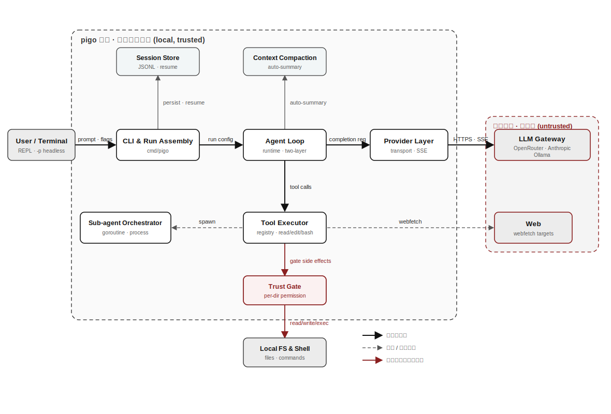
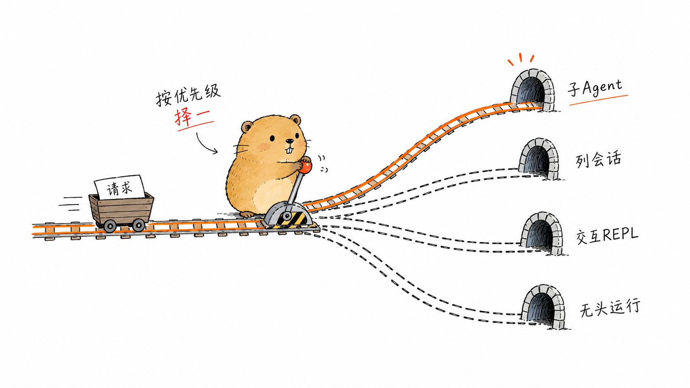
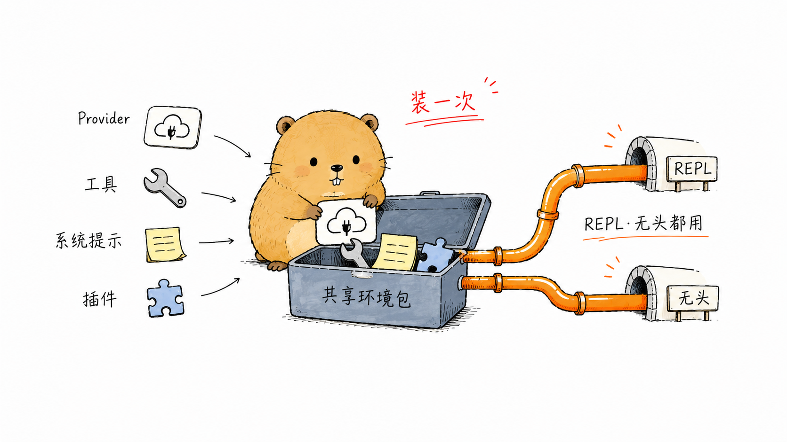
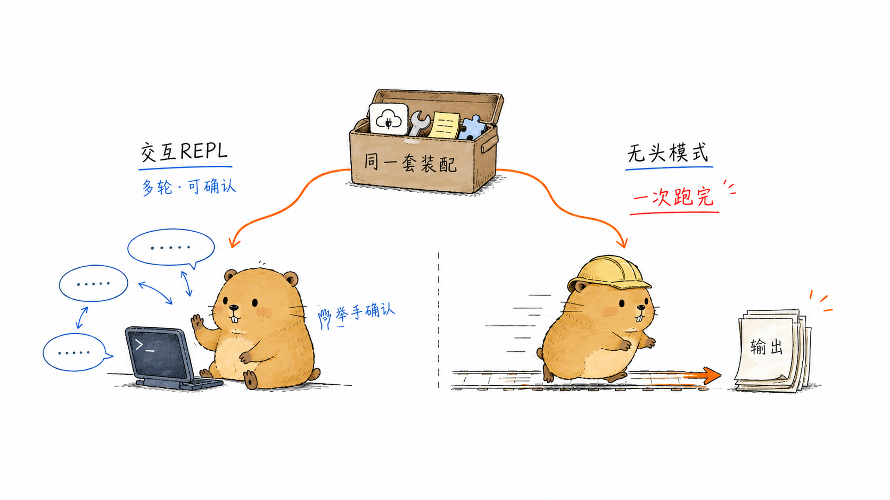
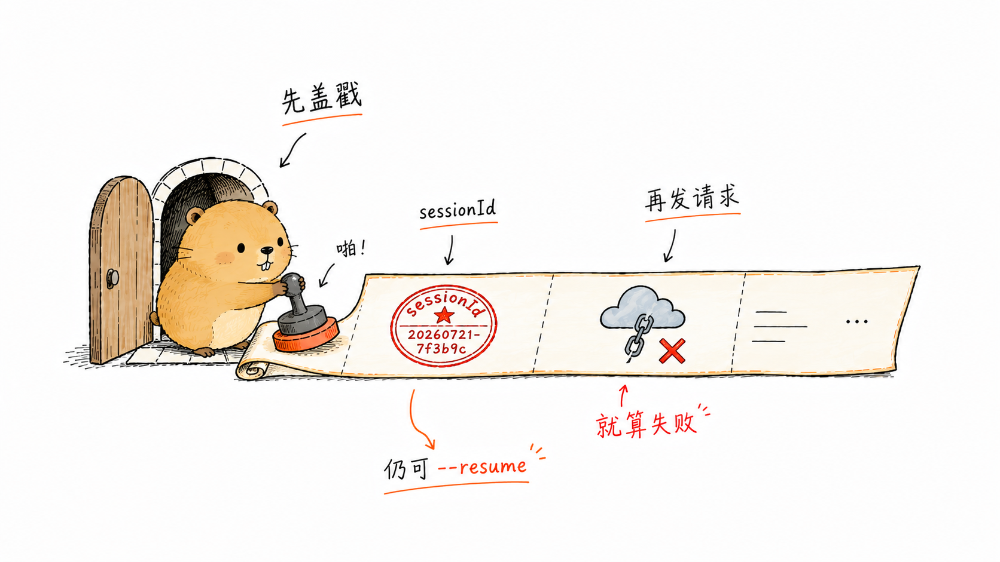

# 全景与骨架：从 main() 到一次对话

> **主线坐标｜第 ①–② 站**：这里是那条河的源头。《主线导读》里"进程启动、解析意图"与"装配一次运行"两步就发生在本章——一条命令如何被解析成一个 `RunConfig`，控制权又如何沿 `StartRun` 交给下一站的 Agent 循环。

引言里我们把 Agent 抽象成一个朴素的公式——**LLM + 上下文 + 工具**，再用一个循环把三者串起来。但公式落到工程上，第一个要回答的问题不是"循环怎么转"，而是"程序怎么搭起来"。一条命令行敲下去，参数怎么被解析成一次运行的意图？Provider、工具、系统提示这些零件，在什么时候、由谁装配？装配完成后，程序又是沿哪条路径把控制权交给 Agent 循环的？

本章是全书的第一刀，落在结构最外层：`cmd/pigo` 这一层 CLI 装配代码。这一层薄得出人意料——`main()` 只解析参数、处理几个一次性动作，就把活儿全交给了 `dispatch()`。我们就顺着这个"短入口"往里走：先看清 pigo 的运行架构长什么样，再拆开"一次运行"如何被一层层装配，最后会发现交互式 REPL 和无头（headless）模式共用同一套装配、只是入口不同。这张形状图立起来，后面每一章都是在图上的某个区域深挖。

## 鸟瞰运行架构

在钻进源码之前，先在脑子里立起一张全景图。pigo 运行时可以拆成三条主线，它们共享同一套核心装配，各自负责不同的数据流向。

{#fig:1-1 width=100%}

图1-1 画出了这三条线：

### 请求路径：从用户到 LLM

最外层是用户输入，经 CLI 入口进入 Agent 循环；循环把消息、系统提示、工具定义组织成一次请求，交给 Provider 层；Provider 层把统一的内部表示翻译成具体大模型网关（OpenAI 兼容或 Anthropic-Messages 协议）的线上格式，再通过 HTTP + SSE 把流式回复送回来。这条线对应引言里的"LLM + 上下文"，是每一次对话的主干。

### 工具路径：从循环到本地环境

当 LLM 决定调用工具时，循环把工具调用交给工具执行器（tool executor），执行器在信任闸门（trust gate）的把关下访问本地环境——读写文件、执行 shell、抓取网页——再把结果作为新的上下文回填给循环。这条线对应引言里的"工具"，是 Agent 能"动手"的关键。

### 支撑边：会话与压缩

除了两条主线，还有两条支撑边贯穿始终：会话存储把一次运行的消息持久化下来（供 `--resume`/`--continue` 复用），上下文压缩在逼近 token 上限时腾出窗口。它们不在请求的关键路径上，却决定了 Agent 能不能"记得住、跑得久"。

本章聚焦的是这张图最左侧的部分：CLI 入口怎么把这些组件装配成一个可运行的整体。循环、Provider、工具、会话、压缩各自的内部机制，留给后面的章节。

## 入口与分派：main() 与 dispatch()

pigo 的可执行入口是 `cmd/pigo/main.go` 里的 `main()`。它出人意料地短：解析参数、处理几个"一次性动作"，然后把真正的工作交给 `dispatch()`。这种"入口只负责解析与分派"的写法，是理解整个 CLI 层的钥匙。

### 包管理子命令的先行剥离

`main()` 做的第一件事，是在 `pflag` 解析之前把包管理子命令挑出来：

```go
if len(os.Args) > 1 && packageSubcommands[os.Args[1]] {
    os.Exit(runPackageCommand(os.Args[1], os.Args[2:], os.Stdout, os.Stderr))
}
```

`pigo install|list|uninstall|update ...` 这类子命令是位置参数式的，跟后面 flag 驱动的 Agent 模式完全不同，所以要在 flag 解析之前先"剥离"出去（`cmd/pigo/pkgcmd.go` 里的 `runPackageCommand`）。这条设计边界值得记住：**pigo 其实是两种 CLI 风格的叠加**，包管理走 Git 风格的子命令，Agent 运行走 flag 风格。

### 参数解析：pflag 与 cliOptions

剥离子命令后，`main()` 用 `github.com/spf13/pflag` 声明一整组标志，全部绑定到一个 `cliOptions` 结构体（定义在 `cmd/pigo/run.go`）。几个贯穿全书的关键标志值得先记住：

- `-p/--print`：要运行的提示词，非空即进入无头模式。
- `-m/--model`：模型 id，默认 `openrouter/free`。
- `-o/--output-format`：`text`（默认）或 `stream-json`。
- `--provider`：按名字选内置 Provider，覆盖模型 id 的启发式推断。
- `-n/--no-tools`、`-a/--approve`、`--no-skills`、`--system-prompt`、`--append-system-prompt` 等运行时开关。

`main()` 还重写了 `flag.Usage`，在标准用法后追加一段 "Supported providers" 列表（`printProviderHelp`），这段列表由 Provider 注册表实时生成，所以永远不会和代码漂移。解析完成后，`--version` 作为一个独立动作直接打印构建元信息并退出；否则把 `opts` 交给 `dispatch()`：

```go
os.Exit(dispatch(context.Background(), opts, os.Stdout, os.Stderr))
```

注意 `main()` 只做"解析 → 分派 → 映射退出码"三件事，不含任何业务逻辑。这让 `dispatch()` 可以脱离全局 flag 集被单独测试（见 `cmd/pigo/run_test.go`）。

### dispatch 的四条岔路

`dispatch()`（`cmd/pigo/run.go`）是"运行装配缝"（run-assembly seam）：所有运行路径都从这里出发。它按优先级依次判断，把请求引向四条岔路之一：

1. `--subagent-rpc`：进入完全独立的子 Agent JSON-RPC 服务模式（`runSubAgentRPC`），是进程隔离子 Agent 的子进程端，与交互/无头路径互不相干（详见第 9 章）。
2. `--list-sessions`：打印已存会话并退出。
3. **无提示词**（`opts.prompt == ""`）：若在终端上，或带 `--resume`，进入交互式 REPL；若 stdout 非终端（管道/CI）又无 resume，则报错退出——因为既没有要跑的东西，也没有可交互的对象。
4. **有提示词**：进入无头模式，按 `--output-format` 决定 `text` 还是 `stream-json` 输出。

把这四条岔路对照到源码，`dispatch` 的骨架是一串按优先级排列的提前返回（early return）：

```go
func dispatch(ctx context.Context, opts cliOptions, out, errOut io.Writer) int {
    // 岔路一：子 Agent JSON-RPC 服务模式，说完协议就退出。
    if opts.subagentRPC {
        return runSubAgentRPC(ctx, os.Stdin, out, errOut)
    }
    // 岔路二：列会话，独立动作。
    if opts.listSessions {
        if err := printSessions(out); err != nil { /* ... */ return 1 }
        return 0
    }
    // ... --continue 解析成最近一次会话 id ...

    // 岔路三：无提示词 → 交互式 REPL（终端或带 --resume 时）。
    if opts.prompt == "" {
        if resumeID == "" && !stdoutIsTerminal() {
            fmt.Fprintln(errOut, "pigo: no prompt (use -p \"...\" or positional args)")
            return 2
        }
        env, err := setupAgentEnv(opts.model, opts.baseURL, /* ... */)
        // ...
        return 0
    }

    // 岔路四：有提示词 → 无头模式。
    mode, err := parseOutputMode(opts.outputFmt)
    // ... setupAgentEnv → openHeadlessSession → newRunConfig → RunHeadless ...
}
```

这四条岔路里，第 3、4 条是本章的主角。它们共享同一套环境装配，却走向两种不同的驱动器。注意每条岔路都以一个整数退出码收尾——`dispatch` 把"该退出还是继续"和"退出码是多少"两件事捏在一起，`main()` 只负责把这个返回值透传给 `os.Exit`。

{#fig:1-2 width=100%}


## 装配一次运行：setupAgentEnv 与 newRunConfig

在重构之前，REPL 分支和无头分支各自把 Provider、工具集、系统提示、`RunConfig` 装配了一遍——同样的装配写了两次，`RunConfig` 字面量还在 `run.go` 和 `repl.go` 之间重复。`cmd/pigo/run.go` 顶部的注释把这段历史讲得很清楚。现在这套装配收敛到了两个函数：`setupAgentEnv` 组装共享环境，`newRunConfig` 构建两条驱动路径都要用的循环配置。

### setupAgentEnv：环境的一次性装配

`setupAgentEnv`（`cmd/pigo/run.go`）返回一个 `agentEnv` 结构体，它是"每次运行都共享的环境"：工作目录、根植于该目录的工具集、解析出的 Provider 与其名字、系统提示，以及可选的外部插件管理器。

```go
func setupAgentEnv(model, baseURL, protocol, providerName string, noTools bool,
    systemPrompt string, appendSystemPrompt []string) (agentEnv, error) {
    cwd, _ := os.Getwd()
    prov, resolvedName, err := resolveProvider(model, baseURL, protocol, providerName)
    // ... 构建系统提示、工具集、发现插件 ...
}
```

它依次做四件事：

1. **解析 Provider**：调用 `resolveProvider`（见下一小节），把模型 id / base URL / protocol / provider 名解析成一个具体的 `provider.Provider` 与其规范名。
2. **构建系统提示**：调用 `runtime.BuildSystemPrompt`（`internal/runtime/prompt.go`），把可选的 `--system-prompt` 作为基础指令，叠加工作目录信息与 `--append-system-prompt` 追加内容。`resolveAppendInstructions` 会把每个追加值当作"存在的文件则读其内容、否则当字面文本"处理，对齐 pi 的行为。
3. **构建工具集**：调用 `builtinTools`（`cmd/pigo/main.go`），返回根植于 cwd 的默认文件/shell 工具集（`ReadTool`/`WriteTool`/`EditTool`/`GrepTool`/`FindTool`/`BashTool`/`TodoTool`/`WebFetchTool`），`--no-tools` 时返回 nil。
4. **发现插件**：非 `--no-tools` 时调用 `plugin.Discover` 追加外部插件工具；插件加载是容错的，启动失败只记录并跳过。

关键在于它返回 `error` 而不是自己退出，把退出码映射的职责留给调用方——这是"入口只负责分派"原则的延续。

{#fig:1-3 width=100%}


### Provider 解析：resolveProvider

`resolveProvider`（`cmd/pigo/main.go`）把"用户想用哪个模型"翻译成"用哪个 Provider 驱动、说哪套协议"。它的优先级链值得记住：

1. 显式 `--provider` 名字最高优先，走 `resolveNamedProvider` 从内置注册表构造驱动（并对 Azure/Bedrock/Vertex/Cloudflare 这类特殊鉴权 Provider 走 `provider.ResolveSpecialProvider`）。
2. 显式 `--protocol`（`openai`/`anthropic`）次之，直接对 base URL 构造对应协议驱动。
3. 都没有时，回落到模型 id 启发式：先查精选目录（`provider.LookupPreset`），再看 `ollama/`、`nvidia/` 前缀，最后默认落到 OpenRouter 这个参照级 OpenAI 兼容网关。

这条优先级链在源码里就是一串自上而下的判断：

```go
func resolveProvider(model, baseURL, protocol, providerName string) (provider.Provider, string, error) {
    // 显式 --provider 最高：从注册表构造，压过 --protocol 与模型 id 启发式。
    if strings.TrimSpace(providerName) != "" {
        return resolveNamedProvider(providerName, model, baseURL, protocol)
    }
    // 0. 显式 --protocol 次之，直接对 base URL 构造对应协议驱动。
    switch protocol {
    case "openai":
        // ... NewOpenAICompatibleProvider(baseURL, ...) ...
    case "anthropic":
        // ... NewAnthropicProvider(baseURL, ...) ...
    case "":
        // 落空，继续走启发式
    default:
        return nil, "", fmt.Errorf("unknown --protocol %q (want openai|anthropic)", protocol)
    }
    // 1. 精选目录命中：一个受管的 id 自己就知道该用哪个 Provider。
    if p, ok := provider.LookupPreset(model); ok { /* nvidia / ollama / openrouter */ }
    // 2. 本地 Ollama：按前缀或 11434 端口。
    if strings.HasPrefix(model, "ollama/") || strings.Contains(baseURL, "11434") { /* ... */ }
    // 3. NVIDIA NIM：按前缀。
    if strings.HasPrefix(model, "nvidia/") { /* ... */ }
    // 4. 兜底：OpenRouter。
    return provider.NewOpenRouterProvider(baseURL, /* ... */), "openrouter", nil
}
```

注意未知的 `--protocol` 值是一个错误（返回 `error` 而非静默兜底），交给调用方做退出码映射。这段解析的细节是第 4 章的主题，本章只需记住一点：`setupAgentEnv` 出来时，Provider 已经是一个可以直接发起流式请求的具体对象了。

### newRunConfig：把装配收敛成 RunConfig

`newRunConfig`（`cmd/pigo/run.go`）是"一次运行如何接线"的**唯一定义**，因此 REPL 与无头驱动不可能各自漂移：

```go
func newRunConfig(model, providerName string, prov provider.Provider,
    creds *provider.CredentialStore, reg *agenttool.ToolRegistry) runtime.RunConfig {
    return runtime.RunConfig{
        LoopConfig: runtime.LoopConfig{
            Model:     model,
            Provider:  providerName,
            Stream:    provider.StreamFnFromProvider(prov),
            GetAPIKey: creds.GetAPIKey,
        },
        Batch: agenttool.BatchConfig{
            ToolExecutorConfig: agenttool.ToolExecutorConfig{Registry: reg},
        },
    }
}
```

它把三样东西拧成一个 `runtime.RunConfig`（定义在 `internal/runtime/loop.go`）：

- **Provider 流函数**：`provider.StreamFnFromProvider(prov)`（`internal/provider/provider_interface.go`）把 Provider 适配成循环需要的流式回调。
- **动态 API Key 解析器**：`creds.GetAPIKey`，运行期按 Provider 名从环境/覆盖里惰性取密钥，且从不写入可能被日志打印的结构体（对齐 US-012 的密钥安全约束）。
- **工具注册表**：`agenttool.BatchConfig`，批量执行工具调用时要用的那张注册表。

`RunConfig` 内嵌的 `LoopConfig` 与四个循环钩子（`GetFollowUpMessages` 等）是第 3 章两层循环的主题；这里只需看到一点：无头驱动直接调用 `newRunConfig`（`run.go` 的 `dispatch` 里），而 REPL 的 `streamRun` 因为要挂 `BeforeToolCall` 信任钩子等，自行拼了一个结构相同的 `RunConfig`——两者的公共骨架是一致的。

## 两条驱动路径：交互式 REPL 与无头模式

装配就绪后，控制权流向两条驱动路径之一。它们共享 `setupAgentEnv` 的环境，却面向完全不同的场景：REPL 是人坐在终端前的多轮对话，无头模式是脚本/CI 里的一次性调用。

{#fig:1-4 width=100%}


### 交互式 REPL：runInteractive → runREPL → streamRun

当 `dispatch` 判定"无提示词且在终端"时，调用 `runInteractive`（`cmd/pigo/interactive.go`）。它负责建立会话、装配 REPL 依赖，最后把控制权交给 `runREPL`：

1. **建立会话**：`--resume` 时从会话存储 `LoadEntries` 重建上下文并锚定活动叶子；否则用 `session.NewID` 创建一个新会话头。
2. **装配 replDeps**：把会话存储、共享的 `agentCtx`、可变运行配置 `liveRunConfig`（`/model` 这类控制命令可在会话中途改它）、工具注册表、斜杠命令注册表、凭据、信任管理器等打包。
3. **信任闸门**：加载项目信任存储；首次进入未决目录时（且无 `--approve`）先问用户信任到什么程度，再放行任何工具。
4. **进入循环**：调用 `runREPL`（`cmd/pigo/repl.go`）。

`runREPL` 是一个跑在主 goroutine 上的同步循环：读一行 → 解析斜杠命令 → 启动一次运行 → 把事件流打印到 stdout → 持久化会话 → 回到提示符。运行中的 `SIGINT` 只取消当前这次运行的 context 并返回提示符，空闲时读到 EOF 则干净退出。每一次真正的对话由 `streamRun` 驱动：它把提示词追加进共享上下文，自行拼一个 `RunConfig`，调用 `runtime.StartRun` 启动循环，再用 `runtime.DrainStream` 把流式文本与工具活动实时渲染出来。

```go
func streamRun(ctx context.Context, out io.Writer, deps replDeps, prompt string) {
    content, _ := buildUserContent(prompt)
    deps.agentCtx.Messages = append(deps.agentCtx.Messages, agentcore.UserMessage{
        RoleField: agentcore.RoleUser, Content: content,
    })
    cfg := runtime.RunConfig{
        LoopConfig: runtime.LoopConfig{
            Model:         deps.live.model,
            Provider:      deps.live.providerName,
            Stream:        provider.StreamFnFromProvider(deps.live.provider),
            GetAPIKey:     deps.creds.GetAPIKey,
            ContextWindow: deps.live.contextWindow,          // REPL 独有
            Compaction:    compaction.DefaultCompactionSettings, // REPL 独有
        },
        Batch: agenttool.BatchConfig{ToolExecutorConfig: agenttool.ToolExecutorConfig{
            Registry:       deps.reg,
            BeforeToolCall: trustBeforeToolCall(...), // REPL 独有：逐次工具确认闸门
        }},
    }
    stream := runtime.StartRun(ctx, deps.agentCtx, cfg)
    runtime.DrainStream(ctx, stream, runtime.StreamHandler{OnEvent, OnText, OnTurnEnd})
}
```

对照 `newRunConfig`，REPL 版多出三个字段：`ContextWindow` 与 `Compaction` 让长对话在逼近 token 上限时能压缩（第 6 章），`BeforeToolCall: trustBeforeToolCall(...)` 是交互模式独有的逐次工具确认闸门（第 8 章）。它们只属于"人坐在终端前反复交互"这一场景——无头模式一次性跑完，既不需要中途压缩多轮历史，也不会停下来问用户"这个工具能不能跑"。

### 无头模式：-p 与 stream-json

当 `dispatch` 拿到非空提示词时，走无头路径（`cmd/pigo/run.go` 的 `dispatch` 后半段）：

1. **确定输出模式**：`parseOutputMode` 把 `--output-format` 映射成 `runtime.PrintMode` 或 `runtime.StreamJSONMode`，未知值报错退出（码 2）。
2. **装配环境**：`setupAgentEnv` + `buildUserContent`（把提示词构造成用户消息内容，支持图片引用等）。
3. **开会话**：`openHeadlessSession`（`cmd/pigo/headless_session.go`）为这次无头运行挂一个会话（详见 1.4.3）。
4. **构建上下文与 RunConfig**：组装 `agentcore.AgentContext`，调用 `newRunConfig` 得到运行配置，把会话 id 写进 `runCfg.SessionID`。
5. **运行**：把 `runCfg` 塞进 `runtime.HeadlessConfig{Mode, Out, Run}`，调用 `runtime.RunHeadless`（`internal/runtime/headless.go`）。

`RunHeadless` 内部启动循环、消费事件流，并按模式产出：

- **PrintMode**：跑到收尾，只把最终一条 assistant 文本写到输出。
- **StreamJSONMode**：每个 `AgentEvent` 被 `writeEventJSON` 序列化成一行 JSON（行分隔），父进程可增量消费。序列化只挑对外安全有用的字段（assistant 文本、工具 id/名、停止原因），**从不输出密钥**。

这个模式分支与收尾错误映射在源码里连成一段：

```go
lastAssistant, resErr := DrainStream(ctx, stream, h)
// ... 处理 writeErr / resErr ...

if cfg.Mode == PrintMode {
    text := ""
    if lastAssistant != nil {
        text = agentcore.ContentToText(lastAssistant.Content)
    }
    io.WriteString(cfg.Out, text) // 只写最终一条 assistant 文本
    // ... 补一个换行 ...
}

if lastAssistant != nil {
    switch lastAssistant.StopReason {
    case agentcore.StopReasonError:
        return &ErrRunFailed{Reason: lastAssistant.ErrorMessage}
    case agentcore.StopReasonAborted:
        return &ErrRunFailed{Reason: "aborted"}
    }
}
return nil
```

（`StreamJSONMode` 的逐行输出发生在 `DrainStream` 的事件处理器 `h` 里，故这里的 `if cfg.Mode == PrintMode` 只补最终文本。）运行结束后，无论成败都会 `hs.persist(agentCtx)` 把这次产生的消息回写会话（部分运行也可 resume）；若运行以 `StopReasonError`/`StopReasonAborted` 收尾，`RunHeadless` 返回 `*ErrRunFailed`，`dispatch` 据此把退出码映射为 1。

### 会话回填与 session_id 的诞生

无头运行也被一个会话文件"托底"，这正是 `session_id` 的来源。`openHeadlessSession` 在 `--resume` 时从磁盘 `LoadEntries` 重建 prior messages 并重新锚定分支叶子，否则用 `session.NewID` 造一个新会话头。这个 id 被写进 `runCfg.SessionID`，而循环在最开始就会发出一个 `agentcore.AgentStartEvent{SessionID: cfg.SessionID}`（`internal/runtime/loop.go` 的 `runLoop`）。在 stream-json 模式下，`eventEnvelope` 会把它序列化成第一行 JSON 里的 `sessionId` 字段（事件 `type` 为 `agent_start`）：

```go
func eventEnvelope(ev agentcore.AgentEvent) map[string]any {
    env := map[string]any{"type": ev.EventType()}
    switch e := ev.(type) {
    case agentcore.AgentStartEvent:
        // 首个事件带上背书会话 id（对标 pi/Claude Code），消费方据此
        // 关联本次输出并日后 --resume；无会话时省略，视作"不可续跑"。
        if e.SessionID != "" {
            env["sessionId"] = e.SessionID
        }
    case agentcore.AgentEndEvent:
        env["messageCount"] = len(e.Messages)
    // ... TurnEndEvent 填 stopReason/text 等 ...
    }
    return env
}
```

这一点很关键：**`agent_start` 事件在任何网络请求之前就被发出**。所以哪怕后续 Provider 调用因缺少密钥而失败，你依然能在第一行看到本次运行的会话 id，它可以被 `--resume`/`--continue` 用来续跑，对齐了 pi / Claude Code 的行为。下面的实验就来亲眼看一看这第一行事件。

{#fig:1-5 width=100%}


### 实验 1-1 ★：在 stream-json 首个事件里捕获 session_id {.unnumbered}

**目标**：验证无头模式下 pigo 会把会话 id 放进 `stream-json` 的第一个 `agent_start` 事件里，并且这个事件在任何模型请求之前就已发出。

**前置**：在仓库根目录下能 `go run ./cmd/pigo`（或已 `go build -o pigo ./cmd/pigo`）。本实验不需要任何真实 API Key，我们只看第一行事件。

**步骤 1**：以 stream-json 模式跑一个提示词，并只取第一行输出。

```bash
go run ./cmd/pigo -p "你好" --output-format stream-json --no-tools 2>/dev/null | head -n 1
```

**预期输出**（id 每次不同，形如；`eventEnvelope` 把事件序列化成 map，`json.Marshal` 会按键名字典序输出，因此 `sessionId` 排在 `type` 前面）：

```json
{"sessionId":"20260721-080320-412306","type":"agent_start"}
```

只要看到 `type` 为 `agent_start` 且带 `sessionId`，就说明会话 id 已随第一个事件发出，即便后续因缺 Key 而报错，这一行也已经落地。

**步骤 2**：把这个 id 抓出来，用 `--resume` 续跑同一个会话。注意这里让第一次运行**完整跑完**（把全部输出收进变量再提取 id），而不是用 `head` 截断。因为 `head` 读到第一行就关闭管道，会话尚未回填到磁盘时 pigo 就可能被 `SIGPIPE` 提前终止，导致后续 `--resume` 找不到会话文件。

```bash
OUT=$(go run ./cmd/pigo -p "第一轮" --output-format stream-json --no-tools 2>/dev/null)
SID=$(printf '%s\n' "$OUT" | grep -o '"sessionId":"[^"]*"' | head -n1 | sed -E 's/.*:"([^"]+)"/\1/')
echo "captured session: $SID"
go run ./cmd/pigo -p "第二轮" --resume "$SID" --output-format stream-json --no-tools 2>/dev/null \
  | head -n 1
```

**预期**：第二次运行的第一行 `agent_start` 事件里的 `sessionId` 与 `$SID` 一致，说明 `--resume` 命中了同一个会话文件（会话由 `openHeadlessSession` 在 `~/.pigo/sessions/<id>.jsonl` 落地）。

**观察点**：对照 `internal/runtime/headless.go` 的 `eventEnvelope`（`agent_start` 分支填 `sessionId`）与 `internal/runtime/loop.go` 中 `runLoop` 开头的 `emit(agentcore.AgentStartEvent{SessionID: cfg.SessionID})`，你会看到这条完整链路：id 在装配期生成（`openHeadlessSession`）→ 写进 `RunConfig.SessionID` → 循环首个事件发出。这正是 1.3 与 1.4 两节装配逻辑的一次端到端印证。

## 本章小结

本章把 pigo 最外层的 CLI 装配骨架彻底拆了一遍：

- **鸟瞰架构**：pigo 运行时由请求路径（用户 → CLI → 循环 → Provider → LLM）、工具路径（循环 → 执行器 → 信任闸门 → 本地环境）与两条支撑边（会话、压缩）构成，见图1-1。
- **入口即分派**：`main()`（`cmd/pigo/main.go`）只解析参数、剥离包管理子命令、处理 `--version`，然后把工作交给 `dispatch()`（`cmd/pigo/run.go`）。`dispatch` 是运行装配缝，按优先级引向子 Agent、列会话、REPL、无头四条岔路。
- **一次装配、两处复用**：`setupAgentEnv` 组装共享环境（Provider、工具、系统提示、插件），`newRunConfig` 收敛出唯一的 `runtime.RunConfig` 定义，杜绝 REPL 与无头两条路径的配置漂移。
- **两条驱动路径**：交互式 REPL（`runInteractive` → `runREPL` → `streamRun`）是人在终端的多轮对话，额外挂了信任确认钩子；无头模式（`-p` + `--output-format`）经 `runtime.RunHeadless` 一次性跑完，支持 `text` 与 `stream-json` 两种输出。
- **session_id 的诞生**：无头运行由 `openHeadlessSession` 托底，会话 id 写进 `RunConfig.SessionID`，随循环首个 `agent_start` 事件在任何网络请求前发出，可用于 `--resume`/`--continue`。

有了这张"程序怎么搭起来"的地图，下一步就该走进地图的中心：第 2 章拆解贯穿全局的 `agentcore` 核心类型契约，第 3 章则揭开真正驱动一次对话的两层 Agent 循环。

## 思考题

1. `main()` 为什么要在 `pflag` 解析之前就把 `pigo install|list|...` 这类包管理子命令剥离出去？如果把它们也做成 flag 会带来什么问题？
2. `setupAgentEnv` 返回 `error` 而不是自己调用 `os.Exit`，这个设计对可测试性与退出码控制分别有什么好处？（可对照 `cmd/pigo/run_test.go` 里对 `dispatch` 的测试。）
3. `newRunConfig` 被称为"一次运行如何接线的唯一定义"，但 REPL 的 `streamRun`（`cmd/pigo/repl.go`）却自己拼了一个 `RunConfig` 而没调用它。对照两处代码，找出 REPL 版多出来的字段（如 `BeforeToolCall`、`Compaction`、`ContextWindow`），并思考为什么这些差异只属于交互模式。
4. 为什么 `agent_start` 事件必须在任何 Provider 网络请求之前发出？如果把它挪到第一次流式回复之后再发，实验 1-1 的第二步（用第一行捕获 `session_id`）会失败吗？
5. 无头模式与 REPL 都用 `session.NewID` 建立会话并支持 `--resume`。对照 `cmd/pigo/headless_session.go` 的 `persist` 与 `cmd/pigo/repl.go` 的 `persistTurn`，说说两者在"把新消息作为分支回填"这件事上是如何保持一致的。
