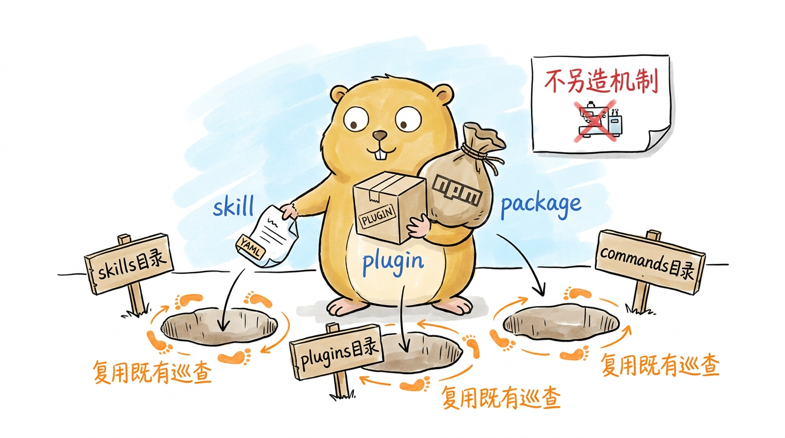
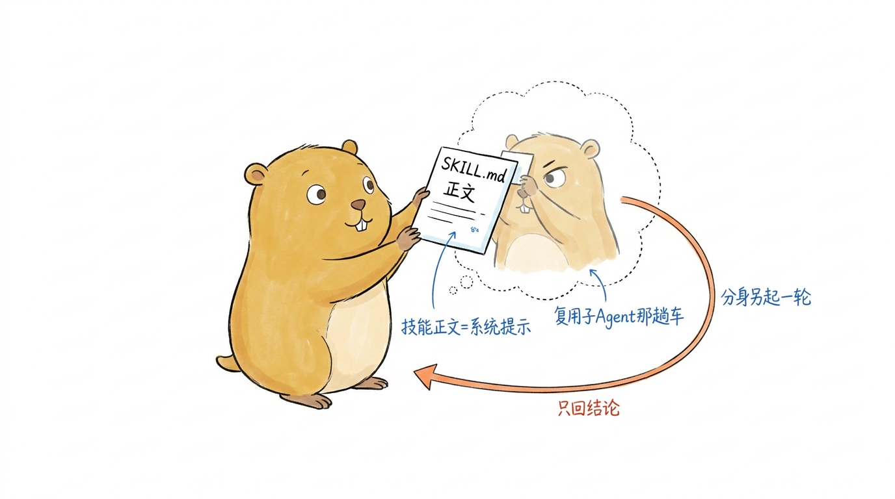
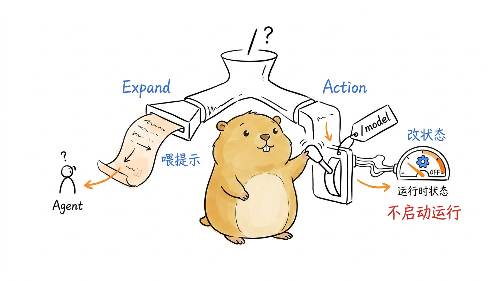
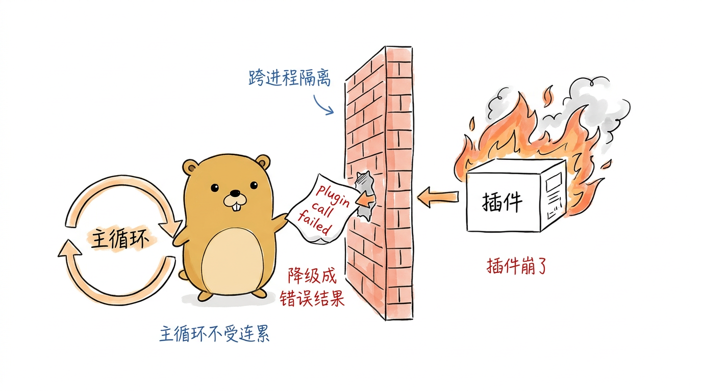
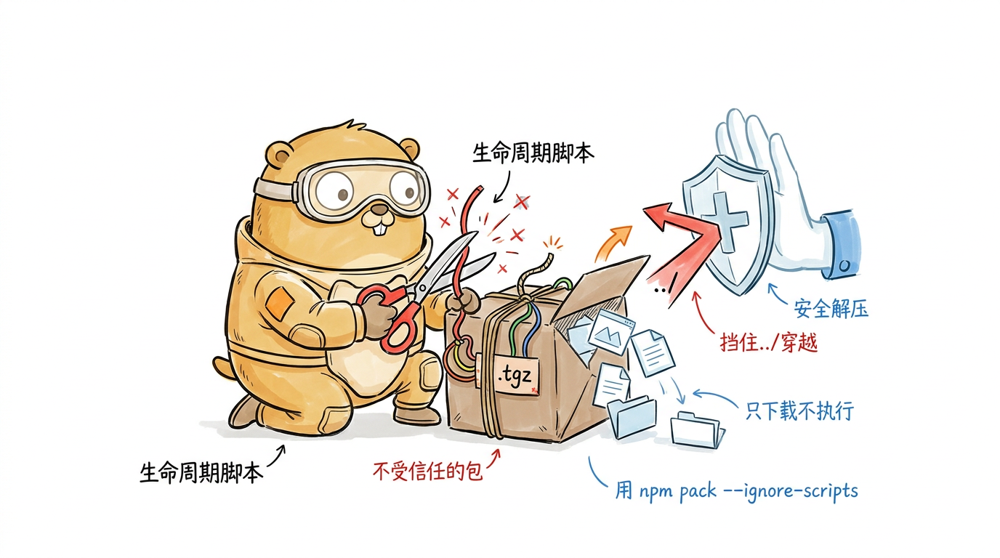

# 可扩展性生态：Skills、Plugins 与包管理

前面九章拆到的都是 pigo 的"内脏"：循环、Provider、工具、压缩、会话、信任，再到把一次委派关进独立进程的子 Agent。这些东西一旦编译进二进制就定死了——想加一个新工具、换一套提示词，得改源码、重新构建。可真正好用的命令行 Agent 不该是这样：它应该能在不碰源码的前提下长出新能力，就像编辑器装插件、Shell 加别名一样。

这一章走向最外层，看 pigo 怎么把"可扩展"这件事拆成三层由轻到重的挂载点：最轻的是 **Skills 与斜杠命令**，一个带 YAML 头的 Markdown 文件就能声明一项能力；中间是 **Plugin**，一个用任意语言写的可执行文件，通过 JSON-RPC 把自定义工具注册进来；最重的是 **包管理器**，把前两者连同提示词、主题打包成 npm 包，一条 `pigo install` 就能拉取、分类、分发、落盘。三层各有各的适用场景，却共享同一套地基——尤其是第 9 章那套 `internal/jsonrpc` 传输，Plugin 复用的正是它。读完本章，你会明白 pigo 是怎么从一个"编译期定死"的程序，变成一台"可插拔地生长"的 Agent。

## 三层扩展点：由轻到重

在钻进代码前，先把这三层的边界划清楚，因为它们回答的是三个不同的问题。

**Skills / 斜杠命令**回答"怎么把一段可复用的提示词或领域流程挂进来"。它是纯声明式的：一个 Markdown 文件，头部一段 YAML 元数据，正文就是给模型的指令。没有进程、没有代码执行，加载它就是读文件、解析、注册。适合"把一类任务的最佳实践固化成一条 `/命令`"这种场景。

**Plugin** 回答"怎么把一段真正要跑代码的能力挂进来"。它是一个独立进程，pigo 用 JSON-RPC 跟它对话——插件声明自己有哪些工具，pigo 把工具调用转发过去。因为跨进程，它能用任何语言写，也能被隔离：插件崩了，Agent 主循环不受连累。这正是 MCP 适配器一类扩展的落点。

**包管理器**回答"这些扩展怎么分发、安装、版本化"。它把前两者（以及提示词模板、主题）当作发布到 npm 上的包，`pigo install npm:<name>` 负责拉取、判断这是什么类型、分发到对应目录，并记进锁文件以便日后卸载升级。

一条线索贯穿始终：**pigo 不为扩展另造发现机制，而是让每种扩展落到一个它本来就会扫描的目录里**。技能落到技能目录（`LoadSkillsDir` 会扫），提示词落到 `commands` 目录（`LoadUserCommandsDir` 会扫），扩展落到 `plugins` 目录（`plugin.Discover` 会扫）。包管理器的"分发"本质上就是把包里的东西摆到正确的位置，剩下的交给既有的加载逻辑。下面就从最轻的一层说起。

<!--
生图prompt：
Generate one standalone 16:9 horizontal Chinese article illustration.

Visual DNA:
Pure white background. Minimalist editorial doodle with black hand-drawn pen line art and light colored pen wash, researcher-sketchbook / whiteboard feeling. Slightly wobbly pen lines. Lots of empty white space. Sparse red/orange/blue handwritten Chinese annotations. Clean curious product-sketch feeling. No gradients, no shadows, no paper texture, no complex background, no commercial vector style, no PPT infographic look, no anime style, no children's picture book, no commercial mascot, no realistic UI.

Recurring IP character required:
小土拨鼠 (Little Gopher), an original IP: a round, chubby, warm brown-yellow gopher inspired by the Go language Gopher, but cuter, cleaner and more soothing. Round head with a pair of small round ears; two small round curious eyes; a tiny nose and two small signature front teeth; short little limbs and soft paws; warm brown-yellow fur with a lighter belly; plump rounded proportions, earnest yet gently funny. 小土拨鼠 must perform the core conceptual action, not decorate the scene. Keep it a clean round soothing cartoon gopher, not a realistic rat/hamster, not the stiff original Go Gopher, not anime, not a mascot.

Theme: pigo 不为扩展另造发现机制，只把三类扩展丢进它本来就会巡查的三个洞
Structure type: 概念隐喻
Core idea: 扩展的"发现"不是新盖的机制，而是复用既有的目录巡查——小土拨鼠只需把不同扩展投进对应的现成洞口
Composition: 小土拨鼠站在地面中央，手里拎着三个大小不同的包裹（一小张纸片、一个方盒子、一个大麻袋），面前地上有三个已经挖好、标着牌子的圆洞；小土拨鼠正把每个包裹分别投进对应的洞，洞口上方有它日常巡逻的脚印箭头绕圈，表示"本来就会扫这些洞"
Suggested elements: 一张带YAML角标的小纸片(skill) / 一个方盒插件(plugin) / 一个npm大麻袋(package) / 三个标了目录名的现成洞口
Chinese handwritten labels: skills目录 / plugins目录 / commands目录 / 复用既有巡查 / 不另造机制
Color use: Black for main line art and 小土拨鼠's eyes/nose/teeth/paw outlines. 小土拨鼠 body warm brown-yellow with lighter belly. Orange for main flow/arrows. Red only for key warnings/results. Blue only for secondary notes/system state.
Constraints: One image explains only one core structure. Main subject 40%-60% of canvas. At least 35% blank white space. At most 5-8 short handwritten Chinese labels. No title in top-left corner. Do not write the structure type on the image. Not a formal diagram/slide. Invent a fresh visual metaphor for this specific content.
-->
{#fig:10-1 width=100%}

## Skills 与斜杠命令：把领域能力挂载进来

一个 skill 是什么？看 `internal/runtime/skills.go` 的定义，它朴素得近乎寒酸——就是一个带 YAML frontmatter 的 Markdown 文件（对标 Claude Code 的 `SKILL.md`）：头部声明元数据，正文是这项能力的系统提示。

```go
// SkillFrontmatter is the YAML metadata block at the head of a skill file.
type SkillFrontmatter struct {
	Name         string     `yaml:"name"`
	Description  string     `yaml:"description"`
	AllowedTools stringList `yaml:"allowed-tools"`
	Model        string     `yaml:"model"`
}
```

`Name` 是这项技能的标识，省略时回落到文件名；`Description` 会被注入模型的能力清单，所以要写成"做什么、何时用"的行动式描述；`AllowedTools` 可选地把技能能用的工具限制到一个白名单；`Model` 可选地把技能钉到某个模型。`ParseSkill` 用 `splitFrontmatter` 切开头部的 `---` 围栏块，YAML 解析元数据，剩下的 Markdown 就是 `Skill.Body`——技能的指令正文。缺 `description` 会直接报错，因为它是"发现"的驱动。

这里有个不起眼却要命的健壮性设计。`AllowedTools` 的类型不是普通的 `[]string`，而是自定义的 `stringList`：

```go
// stringList is a []string that unmarshals from either a YAML sequence
// (- a\n- b) or a single scalar. A scalar is split on commas ...
type stringList []string
```

真实的 Claude Code 技能，`allowed-tools` 既可能写成 YAML 列表，也可能写成一句 `Bash(foo:*), Read` 这样的标量字符串。如果用严格的 `[]string`，遇到标量形式就会解析失败——而 `LoadSkillsDir` 一旦在某个文件上出错就中止，一个格式怪一点的技能就能连累整个目录里其他技能全都加载不出来。`stringList` 通过自定义 `UnmarshalYAML` 同时接受两种写法，正是为了避免"一颗老鼠屎坏一锅粥"。

`LoadSkillsDir` 把这份容错精神贯彻到底：它非递归地扫描目录里的 `*.md`，也认 `<name>/SKILL.md` 的嵌套布局；某个技能文件解析失败**不会中止加载**，而是跳过并把错误累积起来。注释点明了动机——真实的 `~/.agents/skills` 可能装着上百个来源不一、格式参差的技能，绝不能因为一个坏文件就全军覆没。函数总是返回成功解析的技能，错误则用 `errors.Join` 合并，交给调用方当"非致命警告"打印。

### 一个 skill，两种挂法

解析出来的 `Skill` 有意思的地方在于它能以两种完全不同的方式接入 Agent，取决于你想让它"另起炉灶"还是"就地展开"。

第一种是**变成子 Agent 工具**。`SubAgentSpec` 把技能正文当作子 Agent 的系统提示，描述注入父模型的工具清单，工具集是按 `AllowedTools` 过滤后的结果：

```go
func (s *Skill) SubAgentSpec(tools []agentcore.AgentTool, newRunConfig func(tools []agentcore.AgentTool) RunConfig) SubAgentSpec {
	resolved := filterToolsByName(tools, s.Frontmatter.AllowedTools)
	return SubAgentSpec{
		Name:         s.Frontmatter.Name,
		Description:  s.Frontmatter.Description,
		SystemPrompt: s.Body,
		Tools:        resolved,
		NewRunConfig: func() RunConfig { return newRunConfig(resolved) },
	}
}
```

注意它复用的正是第 9 章的 `SubAgentSpec`——`SkillTool` 再把它包成一个 `*SubAgentTool`。也就是说，调用一个技能，本质上是启动一个带着"技能正文当系统提示"的子 Agent 循环。pigo 没有为技能新造第二条执行路径，而是让它搭上子 Agent 那趟车：一个技能就是一个"预置了专门指令的分身"。

<!--
生图prompt：
Generate one standalone 16:9 horizontal Chinese article illustration.

Visual DNA:
Pure white background. Minimalist editorial doodle with black hand-drawn pen line art and light colored pen wash, researcher-sketchbook / whiteboard feeling. Slightly wobbly pen lines. Lots of empty white space. Sparse red/orange/blue handwritten Chinese annotations. Clean curious product-sketch feeling. No gradients, no shadows, no paper texture, no complex background, no commercial vector style, no PPT infographic look, no anime style, no children's picture book, no commercial mascot, no realistic UI.

Recurring IP character required:
小土拨鼠 (Little Gopher), an original IP: a round, chubby, warm brown-yellow gopher inspired by the Go language Gopher, but cuter, cleaner and more soothing. Round head with a pair of small round ears; two small round curious eyes; a tiny nose and two small signature front teeth; short little limbs and soft paws; warm brown-yellow fur with a lighter belly; plump rounded proportions, earnest yet gently funny. 小土拨鼠 must perform the core conceptual action, not decorate the scene. Keep it a clean round soothing cartoon gopher, not a realistic rat/hamster, not the stiff original Go Gopher, not anime, not a mascot.

Theme: 一个技能就是一个"预置了专门指令的分身"——技能正文当系统提示，启动一个子 Agent 分身
Structure type: 角色状态
Core idea: 调用技能不是新造执行路径，而是把技能正文当系统提示塞给一个子 Agent 分身，让分身带着专门指令另跑一轮
Composition: 左边一只正常的小土拨鼠(主 Agent)，手里拿着一张写满指令的卡片(SKILL.md正文)，正把卡片贴到右边一只半透明、气泡框里的小土拨鼠分身的额头上；分身额头被贴上卡片后眼神变得专注，脚下有一条箭头表示它要独立跑开一轮、只带结论回来
Suggested elements: 一张写着指令的SKILL卡片 / 主小土拨鼠 / 气泡框里的分身小土拨鼠 / 分身独立跑出去的回环箭头
Chinese handwritten labels: 技能正文=系统提示 / 分身另起一轮 / 复用子Agent那趟车 / 只回结论
Color use: Black for main line art and 小土拨鼠's eyes/nose/teeth/paw outlines. 小土拨鼠 body warm brown-yellow with lighter belly. Orange for main flow/arrows. Red only for key warnings/results. Blue only for secondary notes/system state.
Constraints: One image explains only one core structure. Main subject 40%-60% of canvas. At least 35% blank white space. At most 5-8 short handwritten Chinese labels. No title in top-left corner. Do not write the structure type on the image. Not a formal diagram/slide. Invent a fresh visual metaphor for this specific content.
-->
{#fig:10-2 width=100%}

第二种是**变成斜杠命令**。`SlashCommand` 把技能暴露成 REPL 里的一条 `/name`，调用时把技能正文（连同参数）作为下一轮用户输入喂给当前对话：

```go
func (s *Skill) SlashCommand() SlashCommand {
	body := s.Body
	return SlashCommand{
		Name:        s.Frontmatter.Name,
		Description: s.Frontmatter.Description,
		Source:      SourceUser,
		Expand: func(args string) string {
			if strings.Contains(body, "$ARGUMENTS") {
				return strings.ReplaceAll(body, "$ARGUMENTS", args)
			}
			if strings.TrimSpace(args) == "" {
				return body
			}
			return body + "\n\n" + args
		},
	}
}
```

两种挂法的区别是语义上的：子 Agent 版让技能带着独立上下文另跑一轮、只回结论；斜杠命令版让技能的指令**就地展开**进当前对话，参数通过 `$ARGUMENTS` 占位符替换（没有占位符就把参数追加到末尾）。pigo 在 REPL 里选的是后者——`cmd/pigo/interactive.go` 的 `loadSkillCommands` 把每个技能都注册成一条 `/skill-name`。

### 斜杠命令注册表：内置优先，动作与提示分家

斜杠命令本身是 pigo REPL 的一等公民，定义在 `internal/runtime/slashcommand.go`。它有两个来源，按固定优先级解析：**内置命令**在编译期通过 `RegisterBuiltin`（在 `init()` 里）注册，永远可用；**用户命令**是从目录加载的声明式 Markdown 模板。冲突规则很明确——同名时内置命令赢，因为内置命令是"承重"的、不能被悄悄遮蔽；一个撞名的用户命令会被记进 `shadowed` 列表提示用户改名，但内置的照旧生效。

更关键的是一条命令有两种"性格"，由设置哪个回调决定：

```go
type SlashCommand struct {
	Name        string
	Description string
	Source      SlashCommandSource
	Expand func(args string) string
	Action func(args string) string
}
```

设 `Expand` 的是**提示命令**（prompt command）：它把参数转成喂给 Agent 的提示文本，是斜杠命令最初的形态。设 `Action` 的是**动作命令**（action command）：它执行一个副作用——比如 `/model` 切换运行时模型——并返回一行状态给用户看，**不启动任何 Agent 运行**。区别在于 `Action` 是一个任意的 Go 闭包，能捕获并改动活的运行时状态，而 `Expand`（一个纯粹的提示生产者）做不到。这个分家是让 `/model` 这类控制命令得以存在的前提——旧设计只能产出提示文本，改不了运行时状态。

<!--
生图prompt：
Generate one standalone 16:9 horizontal Chinese article illustration.

Visual DNA:
Pure white background. Minimalist editorial doodle with black hand-drawn pen line art and light colored pen wash, researcher-sketchbook / whiteboard feeling. Slightly wobbly pen lines. Lots of empty white space. Sparse red/orange/blue handwritten Chinese annotations. Clean curious product-sketch feeling. No gradients, no shadows, no paper texture, no complex background, no commercial vector style, no PPT infographic look, no anime style, no children's picture book, no commercial mascot, no realistic UI.

Recurring IP character required:
小土拨鼠 (Little Gopher), an original IP: a round, chubby, warm brown-yellow gopher inspired by the Go language Gopher, but cuter, cleaner and more soothing. Round head with a pair of small round ears; two small round curious eyes; a tiny nose and two small signature front teeth; short little limbs and soft paws; warm brown-yellow fur with a lighter belly; plump rounded proportions, earnest yet gently funny. 小土拨鼠 must perform the core conceptual action, not decorate the scene. Keep it a clean round soothing cartoon gopher, not a realistic rat/hamster, not the stiff original Go Gopher, not anime, not a mascot.

Theme: 一条斜杠命令的两种性格——Expand 生产提示文本喂给 Agent，Action 直接扳动运行时状态开关
Structure type: 前后对比
Core idea: 同一条命令由设 Expand 还是 Action 决定性格：Expand 只吐出喂给 Agent 的话，Action 是能改活状态的闭包（如 /model）却不启动运行
Composition: 画面中央一只小土拨鼠站在一台带两个出口的分岔装置前；左出口(Expand)吐出一张写着提示文本的纸条，飘向一个 Agent 小人；右出口(Action)是一只手扳动一个物理拨杆开关(标 /model)，开关连到一个"运行时状态"的小仪表盘，但没有任何 Agent 被启动
Suggested elements: 左侧吐出的提示纸条 / 右侧的拨杆开关 / 运行时状态小仪表盘 / 中间的分岔装置
Chinese handwritten labels: Expand=喂提示 / Action=改状态 / 不启动运行 / 如/model
Color use: Black for main line art and 小土拨鼠's eyes/nose/teeth/paw outlines. 小土拨鼠 body warm brown-yellow with lighter belly. Orange for main flow/arrows. Red only for key warnings/results. Blue only for secondary notes/system state.
Constraints: One image explains only one core structure. Main subject 40%-60% of canvas. At least 35% blank white space. At most 5-8 short handwritten Chinese labels. No title in top-left corner. Do not write the structure type on the image. Not a formal diagram/slide. Invent a fresh visual metaphor for this specific content.
-->
{#fig:10-3 width=100%}

`ResolveOutcome` 是解析一行输入的统一入口。它区分三种结局：不是斜杠命令，原样返回让调用方直接运行；是已知的提示命令，返回展开后的提示文本；是已知的动作命令，**当场执行动作**并返回状态消息、不启动运行。未知的 `/name` 则报错。这三态被打包进 `SlashOutcome`，REPL 据此决定"跑一轮"还是"只显示一行"。

装配这一切的是 `cmd/pigo/interactive.go` 的 `buildSlashRegistry`：先用 `NewSlashRegistry` 播种全部编译期内置命令，再挂上 `/model`、`/help` 这类需要捕获活状态的实例内置命令，然后从 `~/.pigo/commands`（或 `$PIGO_HOME/commands`）加载用户声明式模板，最后——除非带了 `--no-skills`——从 `~/.agents/skills` 加载技能并各自注册成一条 `/skill-name`。技能加载遵循前面说的容错约定：加载成功的照常注册，出错的只在 stderr 上报一句警告。这条 `--no-skills` 开关，我们在第 1 章 `dispatch` 的标志里就见过它的名字，这里才落到实处。

## Plugin 系统：进程隔离的外部工具

技能再灵活，也只是提示词——它不能跑代码、连不上外部系统。真要"做事"的扩展得能执行逻辑，还最好能用任意语言写、还不能拖垮主进程。pigo 的答案是 `internal/plugin`：一个插件就是一个独立的可执行文件，pigo 把它作为子进程拉起，在它的 stdio 上说 line-delimited JSON-RPC 2.0——复用的正是第 9 章那套 `internal/jsonrpc` 传输地基。

协议由 `manifest.go` 的包注释定义，只有四个方法，客户端是 pigo、服务端是插件：

- `initialize` → 返回 `Manifest`：握手。插件一次性声明自己提供的一切（名字、版本、工具、命令、订阅的事件）。
- `tools/call {name, arguments}` → `CallResult {content, isError}`：pigo 转发一次工具调用，插件执行后回传文本。
- `event {type, data}`（通知）：pigo 推送一个订阅了的生命周期事件，单向、发后不理。
- `shutdown`（通知）：`Close` 时发出，让守规矩的插件在 stdin EOF 之前先自行退出。

握手在 `plugin.Load` 里完成：启动进程、发 `initialize`、把回包解成 `Manifest`。它有几处防御值得留意：

```go
func Load(command string, args []string, stderr io.Writer) (*Plugin, error) {
	client, err := jsonrpc.NewClient(jsonrpc.Config{Command: command, Args: args, Stderr: stderr})
	if err != nil {
		return nil, fmt.Errorf("plugin: launch %q: %w", command, err)
	}
	ctx, cancel := context.WithTimeout(context.Background(), initTimeout)
	defer cancel()
	raw, err := client.Call(ctx, "initialize", nil)
	// ... 解出 Manifest，name 为空则报错 ...
}
```

`initTimeout`（10 秒）给握手兜底：一个永不应答的插件不能把整个插件发现流程挂死。拿到清单后，`Plugin.Tools()` 把清单里声明的每个工具适配成一个 `pluginTool`——它实现第 5 章那套 `agentcore.AgentTool` 接口，只不过 `Execute` 是把调用通过 RPC 转发给插件进程。

崩溃隔离就落在这个 `Execute` 上：

```go
func (t *pluginTool) Execute(ctx context.Context, id string, args json.RawMessage, onUpdate agentcore.ToolUpdateFunc) (agentcore.AgentToolResult, error) {
	res, err := t.plugin.call(ctx, t.spec.Name, args)
	if err != nil {
		return agentcore.AgentToolResult{
			Content: agentcore.ContentList{agentcore.NewTextContent(
				fmt.Sprintf("%s: plugin call failed: %v", t.spec.Name, err))},
		}, nil
	}
	// ... 正常结果，res.IsError 时标记 Details ...
}
```

注意它对传输错误（比如插件进程崩了）的处理：**降级成一个错误结果、而不是返回 Go error**。这样一来，一个死掉的插件顶多让模型收到一句"plugin call failed"，绝不会把 Agent 主循环带崩。`ExecutionMode` 声明为 `ToolExecutionSequential`——插件调用跨进程、副作用未知，保守起见串行执行，不参与第 5 章那套并发批量。

<!--
生图prompt：
Generate one standalone 16:9 horizontal Chinese article illustration.

Visual DNA:
Pure white background. Minimalist editorial doodle with black hand-drawn pen line art and light colored pen wash, researcher-sketchbook / whiteboard feeling. Slightly wobbly pen lines. Lots of empty white space. Sparse red/orange/blue handwritten Chinese annotations. Clean curious product-sketch feeling. No gradients, no shadows, no paper texture, no complex background, no commercial vector style, no PPT infographic look, no anime style, no children's picture book, no commercial mascot, no realistic UI.

Recurring IP character required:
小土拨鼠 (Little Gopher), an original IP: a round, chubby, warm brown-yellow gopher inspired by the Go language Gopher, but cuter, cleaner and more soothing. Round head with a pair of small round ears; two small round curious eyes; a tiny nose and two small signature front teeth; short little limbs and soft paws; warm brown-yellow fur with a lighter belly; plump rounded proportions, earnest yet gently funny. 小土拨鼠 must perform the core conceptual action, not decorate the scene. Keep it a clean round soothing cartoon gopher, not a realistic rat/hamster, not the stiff original Go Gopher, not anime, not a mascot.

Theme: 插件进程崩溃被隔离在防火墙另一侧，主循环只收到一张"plugin call failed"的降级字条
Structure type: 系统局部
Core idea: 插件跨进程执行，崩溃被降级成一个错误结果而非抛出 error——主循环安然无恙，一个死插件不连累全体
Composition: 画面用一道竖直的砖墙分成两半：左侧小土拨鼠稳稳站在主循环圆环旁边毫发无损；右侧墙那边一个方盒子插件正在冒火冒烟(崩溃)；墙上开一个小传递口，从火场那侧递出一张写着"plugin call failed"的红字小纸条，小土拨鼠淡定地接过纸条继续转圈，火焰被墙完全挡在右侧
Suggested elements: 中间的隔离砖墙 / 冒火的方盒插件 / 递出的红字错误纸条 / 淡定转圈的主循环小土拨鼠
Chinese handwritten labels: 插件崩了 / 降级成错误结果 / 主循环不受连累 / 跨进程隔离
Color use: Black for main line art and 小土拨鼠's eyes/nose/teeth/paw outlines. 小土拨鼠 body warm brown-yellow with lighter belly. Orange for main flow/arrows. Red only for key warnings/results. Blue only for secondary notes/system state.
Constraints: One image explains only one core structure. Main subject 40%-60% of canvas. At least 35% blank white space. At most 5-8 short handwritten Chinese labels. No title in top-left corner. Do not write the structure type on the image. Not a formal diagram/slide. Invent a fresh visual metaphor for this specific content.
-->
{#fig:10-4 width=100%}

发现与管理归 `manager.go` 的 `Manager`。`Discover` 扫描目录里**直接的可执行普通文件**（跳过子目录和非可执行文件），逐个 `Load`；某个插件启动或握手失败会写进 `warnLog` 并跳过，其余照常加载——又一次"一个坏的不连累全体"。目录不存在不算错，返回一个空 `Manager`。这个函数正是第 1 章 `setupAgentEnv` 里那行 `plugin.Discover(pluginsDir(), ...)` 的落点：非 `--no-tools` 时，发现到的插件工具被追加进工具集。

### 事件系统：把循环的心跳广播给插件

工具是"pigo 调插件"，事件则是反过来"pigo 告诉插件发生了什么"。`events.go` 把 Agent 的事件流桥接给订阅了的插件（对标第 2 章的 `AgentEvent`）。插件在清单的 `Events` 字段里声明想要哪些事件类型，pigo 只投递订阅了的。

投递的载荷经过精心裁剪。`eventPayload` 把每种事件映射成一个"只含可观察、非机密字段"的小 map——id、名字、计数、停止原因、流式文本，**从不含密钥**：

```go
func eventPayload(ev agentcore.AgentEvent) map[string]any {
	switch e := ev.(type) {
	case agentcore.ToolExecutionEndEvent:
		return map[string]any{"toolCallId": e.ToolCallID, "toolName": e.ToolName, "isError": e.IsError}
	case agentcore.CompactionEvent:
		return map[string]any{"reason": e.Reason, "tokensBefore": e.TokensBefore, ...}
	// ...
	}
}
```

这套"只给可观察字段、绝不外泄密钥"的纪律，跟第 1 章 stream-json 信封的字段筛选是同一套原则——无论是给外部消费者看的 JSON，还是推给插件的事件，pigo 对"什么能出边界"的判断是一致的。

投递本身是"发后不理"且有界的。`Plugin.SendEvent` 把底层写操作放到自己的 goroutine 上，用 `eventTimeout`（2 秒）兜底：一个读得慢或者卡死的插件，最多给每个事件添 2 秒的有界延迟，超时就丢弃这次投递，绝不阻塞 Agent 循环。`Manager.DispatchEvent` 逐个插件投递，一个插件失败（超时、进程死了）写进 warnLog、不影响给其他插件投递。`EventNotifier` 则是外层的便利封装：没有插件时 `NewEventNotifier` 直接返回 nil，`Handle` 在 nil 上是安全空操作，调用方可以无条件接线；有插件但没人订阅某事件时，它连载荷都不构造。绝大多数情况下根本没装插件，这份"没人听就别费劲"的克制让事件系统在这种常态下几乎零开销。

<!--
生图prompt：
Generate one standalone 16:9 horizontal Chinese article illustration.

Visual DNA:
Pure white background. Minimalist editorial doodle with black hand-drawn pen line art and light colored pen wash, researcher-sketchbook / whiteboard feeling. Slightly wobbly pen lines. Lots of empty white space. Sparse red/orange/blue handwritten Chinese annotations. Clean curious product-sketch feeling. No gradients, no shadows, no paper texture, no complex background, no commercial vector style, no PPT infographic look, no anime style, no children's picture book, no commercial mascot, no realistic UI.

Recurring IP character required:
小土拨鼠 (Little Gopher), an original IP: a round, chubby, warm brown-yellow gopher inspired by the Go language Gopher, but cuter, cleaner and more soothing. Round head with a pair of small round ears; two small round curious eyes; a tiny nose and two small signature front teeth; short little limbs and soft paws; warm brown-yellow fur with a lighter belly; plump rounded proportions, earnest yet gently funny. 小土拨鼠 must perform the core conceptual action, not decorate the scene. Keep it a clean round soothing cartoon gopher, not a realistic rat/hamster, not the stiff original Go Gopher, not anime, not a mascot.

Theme: 推给插件的事件载荷只放可观察字段，密钥在关口被没收，绝不外泄
Structure type: 概念隐喻
Core idea: 事件系统像海关安检：id/名字/计数这类可观察明信片放行，密钥被拦在边界之外，绝不出边界
Composition: 小土拨鼠戴着安检员帽子站在一个边界关口的检查台后，面前传送带上流过一串事件包裹；它挥手放行几张写着"id/名字/计数"的敞开明信片，同时用爪子按住并没收一把标着密钥符号(钥匙图案)的东西，把钥匙丢进旁边的"禁止出境"箱子；关口另一侧站着一个等着接收的插件小人只收到明信片
Suggested elements: 边界检查台 / 放行的明信片(id·名字·计数) / 被没收的钥匙(密钥) / 关口另一侧的插件小人
Chinese handwritten labels: 只放可观察字段 / 密钥不出边界 / 发后不理 / 没人听就不费劲
Color use: Black for main line art and 小土拨鼠's eyes/nose/teeth/paw outlines. 小土拨鼠 body warm brown-yellow with lighter belly. Orange for main flow/arrows. Red only for key warnings/results. Blue only for secondary notes/system state.
Constraints: One image explains only one core structure. Main subject 40%-60% of canvas. At least 35% blank white space. At most 5-8 short handwritten Chinese labels. No title in top-left corner. Do not write the structure type on the image. Not a formal diagram/slide. Invent a fresh visual metaphor for this specific content.
-->
{#fig:10-5 width=100%}

## 包管理器：让扩展可安装可复用

技能是文件、插件是可执行文件——它们怎么分发？总不能让用户手动把文件摆到正确目录。`internal/pkgmgr` 把这件事自动化：pi 生态的扩展发布到 npm，`pigo install npm:<name>` 负责一条龙——解析引用、拉取、分类、分发、记账。

一次安装的骨架在 `install.go` 的 `Install` 里，读起来就是一串清晰的管道：

```go
func Install(rawRef, lockfilePath string, logw io.Writer) (InstallResult, error) {
	ref, err := ParsePackageRef(rawRef)      // 解析 npm:<name>[@version]
	// ...
	fetched, err := Fetch(ref)               // npm pack + 解压到临时目录
	// ...
	defer fetched.Cleanup()
	return installFetched(fetched.Dir, ref, lockfilePath, logf)  // 分类→分发→锁文件
}
```

我们顺着这条管道逐段看。

**解析引用**（`ref.go`）。pi 包发布在 npm 上，所以引用形如 `npm:pi-mcp-adapter`、`npm:@scope/name`，可带 `@version` 后缀。`ParsePackageRef` 刻意严格：不支持的源前缀、非法的 npm 包名都在此处提前拒绝，好让 `install` 快速失败给出清晰提示，而不是把一个坏名字甩给 npm。`validateNPMName` 尤其防的是那些"shell 敌意字符"——反引号、`$`、`;`、`|` 之类——因为这个名字待会儿要交给 `npm` 命令，得先挡掉命令注入的可能。

**拉取**（`fetch.go`）。pigo 不自己实现 npm registry 客户端，而是 shell 出用户装好的 `npm`，具体是 `npm pack`：

```go
cmd := exec.Command(npmExecutable, "pack", spec,
	"--pack-destination", tmp,
	"--ignore-scripts",
	"--loglevel", "error")
```

选 `npm pack` 而非 `npm install` 是有深意的：它只把包下载成 `.tgz`，**不装依赖、不跑生命周期脚本**，所以"下载一个包"这个动作本身不会执行包里的代码。`--ignore-scripts` 更是把打包期脚本执行也堵死。下载后 `extractTarGz` 解压——`safeJoin` 一路守着路径穿越（`../` 逃逸），只解普通文件和目录，符号链接、设备节点一律跳过。这是"拉取一个不受信任的第三方包"该有的谨慎。

<!--
生图prompt：
Generate one standalone 16:9 horizontal Chinese article illustration.

Visual DNA:
Pure white background. Minimalist editorial doodle with black hand-drawn pen line art and light colored pen wash, researcher-sketchbook / whiteboard feeling. Slightly wobbly pen lines. Lots of empty white space. Sparse red/orange/blue handwritten Chinese annotations. Clean curious product-sketch feeling. No gradients, no shadows, no paper texture, no complex background, no commercial vector style, no PPT infographic look, no anime style, no children's picture book, no commercial mascot, no realistic UI.

Recurring IP character required:
小土拨鼠 (Little Gopher), an original IP: a round, chubby, warm brown-yellow gopher inspired by the Go language Gopher, but cuter, cleaner and more soothing. Round head with a pair of small round ears; two small round curious eyes; a tiny nose and two small signature front teeth; short little limbs and soft paws; warm brown-yellow fur with a lighter belly; plump rounded proportions, earnest yet gently funny. 小土拨鼠 must perform the core conceptual action, not decorate the scene. Keep it a clean round soothing cartoon gopher, not a realistic rat/hamster, not the stiff original Go Gopher, not anime, not a mascot.

Theme: 用 npm pack --ignore-scripts 只取包不跑脚本，像拆弹一样剪断生命周期脚本引信
Structure type: 概念隐喻
Core idea: 拉取不受信任的第三方包时，只下载 .tgz 不执行代码——剪断"生命周期脚本"引信，解压时还挡住路径穿越
Composition: 小土拨鼠戴着护目镜像拆弹专家，面前是一个绑着引信的 npm 包裹(.tgz)；它用剪刀正剪断一根标着"生命周期脚本"的引信，让包裹安全打开；打开后只有普通文件和文件夹倒出来，旁边一只手举着挡板拦住一个想溜进"../"上级目录的符号链接箭头
Suggested elements: 绑引信的.tgz包裹 / 被剪断的"脚本"引信 / 倒出的普通文件 / 被挡住的../路径穿越箭头
Chinese handwritten labels: 只下载不执行 / 剪断脚本引信 / 挡住../穿越 / 不受信任的包
Color use: Black for main line art and 小土拨鼠's eyes/nose/teeth/paw outlines. 小土拨鼠 body warm brown-yellow with lighter belly. Orange for main flow/arrows. Red only for key warnings/results. Blue only for secondary notes/system state.
Constraints: One image explains only one core structure. Main subject 40%-60% of canvas. At least 35% blank white space. At most 5-8 short handwritten Chinese labels. No title in top-left corner. Do not write the structure type on the image. Not a formal diagram/slide. Invent a fresh visual metaphor for this specific content.
-->
{#fig:10-6 width=100%}

**分类**（`classify.go`）。同一个包可能同时是好几种类型——npm 目录里就有 `extensionskill` 这样的组合条目——所以 `Classify` 返回的是一个类型**集合**。它先读 `package.json` 里的 `pi` 元数据块（显式声明的 `type`/`types` 或按能力分的键），再叠加**结构性回落**：有 `bin` 入口就当扩展，有 `SKILL.md` 就当技能，有 `commands/` 目录就当提示词。

```go
// 2. Structural fallbacks for packages that under-declare.
if len(pj.Bin) > 0 {
	set[TypeExtension] = true
}
if fileExists(filepath.Join(pkgDir, "SKILL.md")) {
	set[TypeSkill] = true
}
if dirExists(filepath.Join(pkgDir, "commands")) {
	set[TypePrompt] = true
}
```

这份结构性回落让一个"没好好声明元数据、但明摆着是某类型"的包也能被认出来；什么都匹配不上时它宁可报错也不瞎猜，好让 `pigo install` 在一个根本不是 pi 包的东西上清清楚楚地失败。

**分发**（`distribute.go` 及同族文件）。这是包管理器最能体现全章那条线索的地方——分发不是别的，就是**把包里的东西摆到 pigo 本来就会扫描的目录**。`install.go` 的 `distribute` 按类型路由到四个分发器，各自的目标目录由 `layout.go` 定义：扩展进 `$PIGO_HOME/plugins`（`plugin.Discover` 扫）、提示词进 `$PIGO_HOME/commands`（`LoadUserCommandsDir` 扫）、技能进 `~/.agents/skills`（`LoadSkillsDir` 扫）、主题进 `$PIGO_HOME/themes`（暂无运行时消费者，只是先存着）。

技能分发最直白：`DistributeSkill` 就是把包整棵树拷进 `<skillsDir>/<name>/`，因为一个 npm 技能包恰好就是 `LoadSkillsDir` 认得的那种"一个目录一个 `SKILL.md`"布局。扩展分发要多一道弯：`plugin.Discover` 只跑目录里"直接的可执行文件"，可一个 npm 扩展是整棵包树、入口还依赖同级文件，没法只丢一个文件进去。`DistributeExtension` 的解法是摆两样东西——`<name>.pkg/` 放完整包树（是目录，Discover 会跳过），`<name>` 放一个 tiny 的 shell 启动脚本 `exec` 真正的 bin 入口（是文件，Discover 会跑）。每个分发器都会先清掉自己上一次的旧产物再写，所以分发是幂等的，重跑一次 install 不会留下陈货。

**记账**（`lockfile.go`）。分发过程中每落一个文件都被收集起来，最后连同包名、源、版本、类型一起写进锁文件 `$PIGO_HOME/packages.json`。这份锁文件是 list/uninstall/update 的唯一真相来源——尤其是那份**精确到每个文件的路径清单**，让卸载能不多不少地删掉当初装下的东西：

```go
type InstalledPackage struct {
	Name    string        `json:"name"`
	Source  string        `json:"source"`
	Version string        `json:"version"`
	Types   []PackageType `json:"types"`
	Files   []string      `json:"files"`
}
```

锁文件的读写沿用了第 8 章 `internal/trust` 立下的约定：文件不存在等于一个空锁文件（不算错），但存在却损坏就是硬错误——宁可把一个损坏的存储暴露出来，也不静默覆盖。

**CLI 外壳**（`cmd/pigo/pkgcmd.go`）。这四条子命令是薄薄一层壳，真正的活全在 `pkgmgr` 里。它们是位置参数式的子命令，跟 flag 驱动的 Agent 模式格格不入，所以——正如第 1 章开头讲的——`main()` 在 `pflag` 解析之前就把 `install|list|uninstall|update` 剥离出去交给 `runPackageCommand`。每条子命令都遵循同一条待客之道：批量操作时一个包失败**不中止其余**，只把整体退出码标成非零。

## 实验 10-1 ★：把一个 Markdown 文件变成一条斜杠命令 {.unnumbered}

**目标**：不写一行 Go、不联网、不装 npm 包，仅凭一个带 YAML 头的 Markdown 文件，就让 pigo 的 REPL 多出一条 `/name` 斜杠命令，亲手印证 `LoadSkillsDir` → `Skill.SlashCommand` → `SlashRegistry` 这条最轻量的挂载链。

**前置**：在仓库根目录能 `go run ./cmd/pigo`。本实验用 `PIGO_SKILLS_DIR` 把技能目录指到一个临时位置，不碰你真实的 `~/.agents/skills`，也不需要任何 API Key（我们只验证命令被注册，不真正发起对话）。

**步骤 1**：造一个技能文件。技能可以是 `<dir>/<name>/SKILL.md` 的嵌套布局，我们就用它：

```bash
mkdir -p /tmp/pigo-skills/changelog
cat > /tmp/pigo-skills/changelog/SKILL.md <<'EOF'
---
name: changelog
description: 把一段 git log 整理成面向用户的更新日志
---
你是一个发布工程助手。请把下面的 git log 归类为
"新增 / 修复 / 破坏性变更"三节，用简体中文写成面向用户的更新日志：

$ARGUMENTS
EOF
```

注意正文里的 `$ARGUMENTS`：`Skill.SlashCommand` 的 `Expand` 会在调用时把它替换成 `/changelog ` 后面跟的参数。

**步骤 2**：让 pigo 从这个目录加载技能，并进入 REPL 列出可用命令。`/help` 是一条内置动作命令，会打印命令清单：

```bash
PIGO_SKILLS_DIR=/tmp/pigo-skills go run ./cmd/pigo --no-tools <<'EOF'
/help
EOF
```

**预期**：`/help` 输出的命令清单里出现一条 `/changelog`，其描述正是 frontmatter 里写的"把一段 git log 整理成面向用户的更新日志"。这说明 `buildSlashRegistry` 已经通过 `loadSkillCommands` → `LoadSkillsDir` 把这个 Markdown 解析成了技能，并经 `AddUser` 注册成一条用户来源的斜杠命令。

**步骤 3**：验证容错。故意再放一个格式错误的技能（缺 `description`），看它是否**只影响自己**：

```bash
mkdir -p /tmp/pigo-skills/broken
printf -- '---\nname: broken\n---\nbody\n' > /tmp/pigo-skills/broken/SKILL.md
PIGO_SKILLS_DIR=/tmp/pigo-skills go run ./cmd/pigo --no-tools <<'EOF'
/help
EOF
```

**预期**：stderr 上出现一句 `pigo: skills: some skills failed to load: ...`（缺 description 的报错），但 `/changelog` **依然在命令清单里**。这正印证了 `LoadSkillsDir` 那条"一个坏技能不能遮蔽其余技能"的容错约定——错误被累积上报，成功解析的照常注册。

**观察点**：把这条链和 `cmd/pigo/interactive.go` 的 `buildSlashRegistry` 对照——技能走的是 `AddUser`，所以一个和内置命令（如 `/model`、`/help`）撞名的技能会被 shadowed、内置的赢，`Shadowed()` 会在 stderr 上提示你改名。若把 `--no-tools` 换成 `--no-skills`，`/changelog` 就不再出现——技能发现被整体跳过，只有用户命令模板还会加载。

## 本章小结

本章走到 pigo 的最外层，拆解了让它"可插拔生长"的三层扩展生态：

- **三层由轻到重**：Skills/斜杠命令（声明式 Markdown，无进程）→ Plugin（独立进程，JSON-RPC）→ 包管理器（分发与版本化）。一条贯穿始终的线索是：pigo 不为扩展另造发现机制，而是让每种扩展落到一个它本来就会扫描的目录里。
- **Skills 与斜杠命令**：`internal/runtime/skills.go` 把带 YAML 头的 Markdown 解析成 `Skill`，容错加载（`stringList` 兼容标量、`LoadSkillsDir` 跳过坏文件）；一个技能既能经 `SubAgentSpec` 变成子 Agent 工具（复用第 9 章抽象），也能经 `SlashCommand` 就地展开进对话。`slashcommand.go` 的注册表区分内置/用户来源（内置优先）与提示/动作命令（`Expand` vs `Action`），后者让 `/model` 这类控制命令得以改动运行时状态。
- **Plugin 系统**：`internal/plugin` 把插件当作独立进程，用第 9 章那套 `internal/jsonrpc` 说 `initialize`/`tools/call`/`event`/`shutdown` 四方法协议。`Load` 握手取回 `Manifest`，`pluginTool` 把插件工具适配成 `AgentTool` 并把传输错误降级成错误结果（崩溃隔离）；`Manager.Discover` 容错发现；`EventNotifier` 把循环事件以"只给可观察字段、绝不外泄密钥"的载荷发后不理地推给订阅插件。
- **包管理器**：`internal/pkgmgr` 用 `npm pack --ignore-scripts` 无副作用地拉取，`Classify` 按 pi 元数据加结构信号判定类型集合，`distribute` 把各类型摆进对应目录（`layout.go`），锁文件（`lockfile.go`）精确记账每个落盘文件以供 list/uninstall/update。CLI 外壳 `pkgcmd.go` 被 `main()` 在 flag 解析前剥离。

至此，pigo 从入口的 CLI 装配，到内核的循环、Provider、工具、压缩、会话、信任、子 Agent，再到这一章最外层的扩展生态，整只"牛"已被逐层解开。后记里，我们回望这场解剖，聊聊 pigo 相对 pi 的设计取舍，以及读者如何在这具标本上继续生长自己的 Agent。

## 思考题

1. 一个 skill 既可以经 `SubAgentSpec`/`SkillTool` 变成子 Agent 工具，也可以经 `SlashCommand` 就地展开进当前对话。这两种挂法在"上下文隔离"与"结果回填"上有什么本质区别？pigo 的 REPL 为什么选了后者（对照 `loadSkillCommands`）？
2. `AllowedTools` 用自定义的 `stringList` 而非普通 `[]string`。如果换成严格的 `[]string`，一个把 `allowed-tools` 写成标量字符串的技能会发生什么？结合 `LoadSkillsDir` 的错误累积逻辑，说说为什么这个健壮性对"上百个来源不一的技能"尤其重要。
3. `pluginTool.Execute` 遇到传输错误（插件崩溃）时返回的是"一个错误结果 + nil error"，而不是把 error 抛出去。对照第 5 章工具执行器对 error 的处理，说说这个选择如何实现了"一个死插件不连累主循环"。
4. `Classify` 既读 `package.json` 的显式 `pi` 元数据，又叠加"有 bin/SKILL.md/commands 就是某类型"的结构性回落。这两条判据同时命中时会怎样？为什么一个包被判成多种类型（如 `extension`+`skill`）是合理的，而不是一种需要消歧的冲突？
5. 包管理器用 `npm pack` 而不是 `npm install` 来拉取，还加了 `--ignore-scripts`。从"安装一个不受信任的第三方包"的安全角度，解释这两个选择各挡掉了什么风险。再对照 `ParsePackageRef` 里 `validateNPMName` 拒绝的那些字符，说说包名校验防的又是哪一类攻击。
