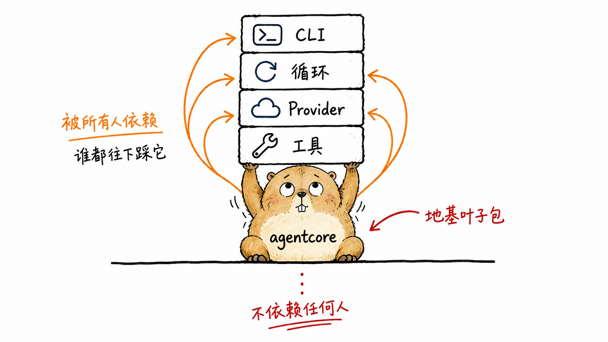
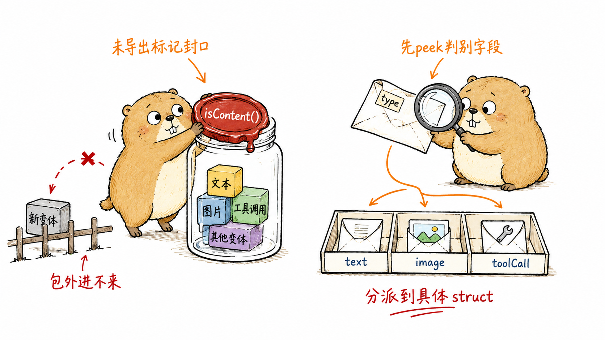
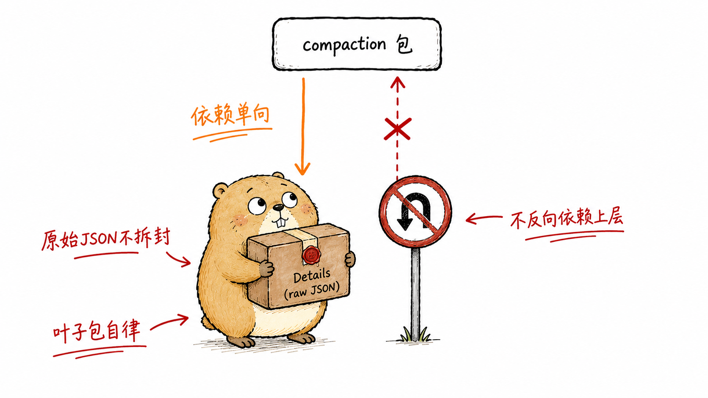
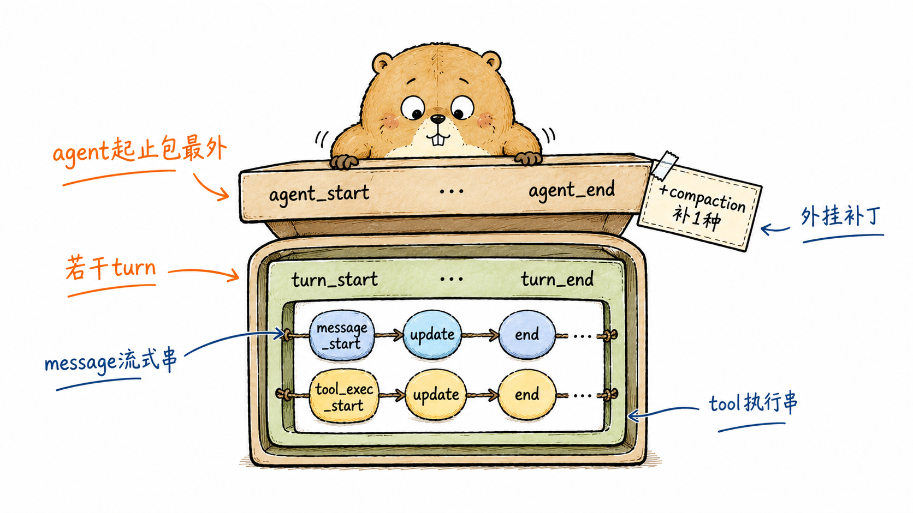
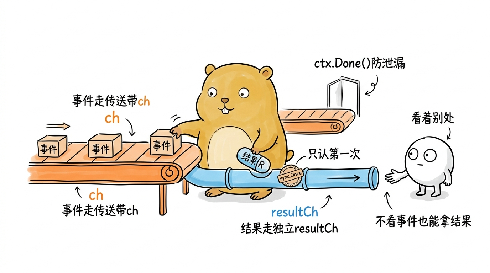
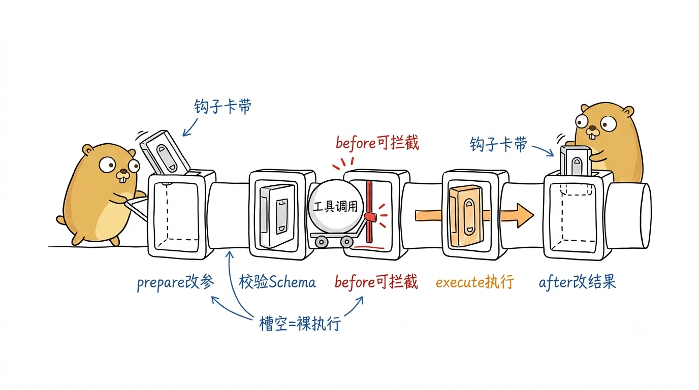
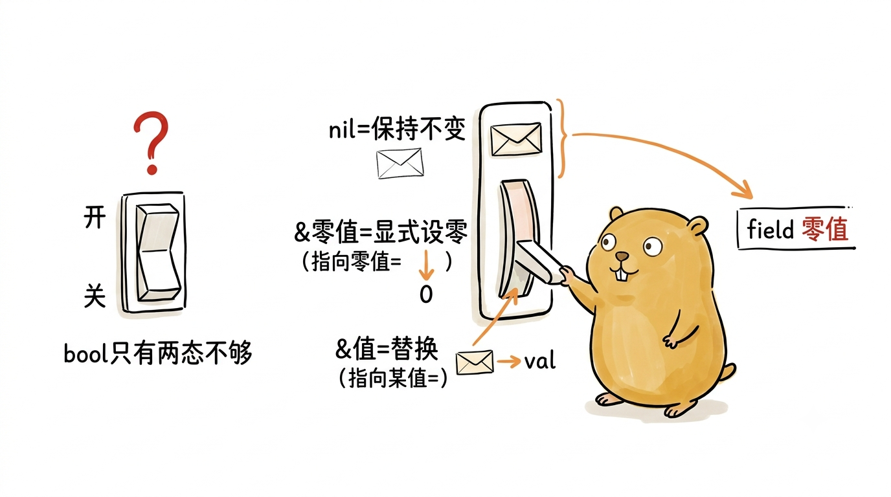

# 贯穿全局的契约：agentcore 抽象

第1章走完了最外层的 CLI 装配：一条命令行如何被解析成一次运行，Provider、工具、系统提示怎样收敛进一个 `RunConfig`，控制权又是沿哪条路径交给循环的。那一章里反复出现却没有展开的，是一批名字：`AgentContext`、`AgentEvent`、`AgentTool`、`ContentList`。它们不属于 CLI，也不属于循环，而是被两者共同依赖的更底层的一层。

这一层就是 `internal/agentcore`。它是全书解剖的"结缔组织"——循环靠它表达一次对话的状态，Provider 靠它承接解码后的消息，工具系统靠它约定输入输出，会话持久化靠它序列化历史。`content.go` 开头的包注释把这层的地位讲得很直白：

```go
// Package agentcore defines the core "leaf" data types and control flow for the
// pigo agent harness ... It is the foundation package that every other agent
// sub-package depends on and imports nothing from them.
```

被所有人依赖、又不依赖任何人，这是分层里很舒服的一个位置。本章就把这块地基逐块撬开：先看消息与内容如何建模一次多模态对话，再看 `AgentEvent` 这个密封接口下的十种事件如何描述循环的每一次心跳，接着拆开承载事件的 `EventStream`，最后落到工具抽象与那一组贯穿循环各阶段的钩子契约上。读完你会发现，后面几章讲的循环、Provider、工具，其实都是在往这批契约的插槽里填实现。

<!--
生图prompt：
Generate one standalone 16:9 horizontal Chinese article illustration.

Visual DNA:
Pure white background. Minimalist editorial doodle with black hand-drawn pen line art and light colored pen wash, researcher-sketchbook / whiteboard feeling. Slightly wobbly pen lines. Lots of empty white space. Sparse red/orange/blue handwritten Chinese annotations. Clean curious product-sketch feeling. No gradients, no shadows, no paper texture, no complex background, no commercial vector style, no PPT infographic look, no anime style, no children's picture book, no commercial mascot, no realistic UI.

Recurring IP character required:
小土拨鼠 (Little Gopher), an original IP: a round, chubby, warm brown-yellow gopher inspired by the Go language Gopher, but cuter, cleaner and more soothing. Round head with a pair of small round ears; two small round curious eyes; a tiny nose and two small signature front teeth; short little limbs and soft paws; warm brown-yellow fur with a lighter belly; plump rounded proportions, earnest yet gently funny. 小土拨鼠 must perform the core conceptual action, not decorate the scene. Keep it a clean round soothing cartoon gopher, not a realistic rat/hamster, not the stiff original Go Gopher, not anime, not a mascot.

Theme: agentcore 是被所有人依赖、却不依赖任何人的叶子地基包
Structure type: 概念隐喻
Core idea: agentcore 蹲在最底层，用后背稳稳托起 CLI、循环、Provider、工具四座小楼，而它自己脚下不踩任何别的包
Composition: 小土拨鼠蹲坐在画面下方正中，弓着背用双手和后背同时顶起头顶一摞四块标着不同名字的方形积木小楼；它自己脚下是一条干净的地面线，线下方空空如也没有任何支撑物；一根向上的箭头从它身上分出四路分别指向四座小楼，表示"所有人都往下依赖它"
Suggested elements: 被托起的四块积木小楼(CLI/循环/Provider/工具) / 小土拨鼠拱起的后背 / 向上分叉的依赖箭头 / 脚下空无一物的地面线
Chinese handwritten labels: 被所有人依赖 / 不依赖任何人 / 地基叶子包 / 谁都往下踩它
Color use: Black for main line art and 小土拨鼠's eyes/nose/teeth/paw outlines. 小土拨鼠 body warm brown-yellow with lighter belly. Orange for main flow/arrows. Red only for key warnings/results. Blue only for secondary notes/system state.
Constraints: One image explains only one core structure. Main subject 40%-60% of canvas. At least 35% blank white space. At most 5-8 short handwritten Chinese labels. No title in top-left corner. Do not write the structure type on the image. Not a formal diagram/slide. Invent a fresh visual metaphor for this specific content.
-->
{#fig:2-1 width=100%}

## 一个反复出现的手法：密封接口 + 判别式解码

在钻进具体类型之前，先认得一个手法——它在 `agentcore` 里出现了至少三遍（消息、内容、事件），认得它，后面的代码就都是同一个模子。

pi 的原始实现是 TypeScript，消息和内容都是判别联合（discriminated union）：一个带 `type` 或 `role` 字段的对象，靠这个字段区分是哪种变体。Go 没有联合类型，pigo 用的是**密封接口（sealed interface）**：定义一个接口，让它带一个未导出的标记方法，这样包外的类型无法实现它，变体集合就被"封"在了包内。以内容块为例：

```go
// Content is a sealed interface implemented by every content block kind.
// Consumers dispatch with a type switch. The interface is sealed via the
// unexported isContent marker so no type outside this package can satisfy it.
type Content interface {
	isContent()
}
```

`isContent()` 是未导出方法，只有 `agentcore` 包内的类型能实现，于是"内容块一共有哪几种"这件事被牢牢锁在包里。消费者拿到一个 `Content`，用 `switch c := c.(type)` 分派处理——编译器虽然不强制穷尽（这是 Go 相对 Rust `match` 的短板），但变体集合封闭这一点保证了不会有第三方偷偷塞进一个新变体。

密封接口解决了"表达"问题，却留下一个"序列化"问题：Go 的 `encoding/json` 不认识判别字段，反序列化到接口类型时它不知道该造哪个具体结构。pigo 的解法是给每个装着接口切片的容器写自定义 `UnmarshalJSON`：先只解出判别字段（peek），再据此解到具体类型。这个"peek 判别字段 → 分派到具体 struct"的两步解码，就是本章会反复见到的第二个模子。把这两个手法记在脑子里，下面的类型都是它们的实例。

<!--
生图prompt：
Generate one standalone 16:9 horizontal Chinese article illustration.

Visual DNA:
Pure white background. Minimalist editorial doodle with black hand-drawn pen line art and light colored pen wash, researcher-sketchbook / whiteboard feeling. Slightly wobbly pen lines. Lots of empty white space. Sparse red/orange/blue handwritten Chinese annotations. Clean curious product-sketch feeling. No gradients, no shadows, no paper texture, no complex background, no commercial vector style, no PPT infographic look, no anime style, no children's picture book, no commercial mascot, no realistic UI.

Recurring IP character required:
小土拨鼠 (Little Gopher), an original IP: a round, chubby, warm brown-yellow gopher inspired by the Go language Gopher, but cuter, cleaner and more soothing. Round head with a pair of small round ears; two small round curious eyes; a tiny nose and two small signature front teeth; short little limbs and soft paws; warm brown-yellow fur with a lighter belly; plump rounded proportions, earnest yet gently funny. 小土拨鼠 must perform the core conceptual action, not decorate the scene. Keep it a clean round soothing cartoon gopher, not a realistic rat/hamster, not the stiff original Go Gopher, not anime, not a mascot.

Theme: 密封接口用未导出标记封住变体，解码时先 peek 判别字段再分派到具体 struct
Structure type: Workflow
Core idea: 左手小土拨鼠往一只透明罐子里盖上蜡封"isContent()"锁住变体集合，包外的类型被挡在罐外进不去；右手它拆一封信先偷看信角的小"type"标签，再把信投进对应的分格盒子
Composition: 画面分左右两幕。左幕：小土拨鼠踮脚给一只装着几块内容变体积木的透明玻璃罐口盖上一枚写着 isContent() 的蜡封，罐外一块新积木被一道小栅栏挡住投不进来。右幕：同一只小土拨鼠拿着一封信，用放大镜先看信角一个小小的"type"标签，一条橙色箭头从信引向下方三个分别标着 text/image/toolCall 的分格投递盒
Suggested elements: 盖蜡封的透明变体罐 / 被栅栏挡在外面的新积木 / 信角的 type 小标签与放大镜 / 下方三个具体 struct 分格盒
Chinese handwritten labels: 未导出标记封口 / 包外进不来 / 先peek判别字段 / 分派到具体struct
Color use: Black for main line art and 小土拨鼠's eyes/nose/teeth/paw outlines. 小土拨鼠 body warm brown-yellow with lighter belly. Orange for main flow/arrows. Red only for key warnings/results. Blue only for secondary notes/system state.
Constraints: One image explains only one core structure. Main subject 40%-60% of canvas. At least 35% blank white space. At most 5-8 short handwritten Chinese labels. No title in top-left corner. Do not write the structure type on the image. Not a formal diagram/slide. Invent a fresh visual metaphor for this specific content.
-->
{#fig:2-2 width=100%}

## 消息模型：四种角色的密封接口

一次对话在 pigo 里是一列消息（message），每条消息有一个角色（role）。`message.go` 顶部先把角色常量列齐，它们直接对齐 pi 的线上格式：

```go
const (
	RoleUser       = "user"
	RoleAssistant  = "assistant"
	RoleToolResult = "toolResult"
	RoleCompaction = "compaction"
)
```

消息本身是一个密封接口，只暴露两个方法：

```go
type Message interface {
	isMessage()
	// Role returns the discriminant ("user" | "assistant" | "toolResult").
	Role() string
}

// AgentMessage is the loop-level message type. It is the same as Message ...
type AgentMessage = Message
```

`AgentMessage` 是 `Message` 的类型别名（`=`，不是新类型）。这个别名不加任何行为，纯粹是文档意图：在处理循环级消息的调用点写 `AgentMessage`，在处理裸 LLM 消息处写 `Message`，读代码的人一眼能看出语境。源码注释也点明了，这是刻意用别名替代 pi 里"声明合并（declaration merging）"那套 Go 没有的机制。

接口的四个实现，正好对应四种角色。**用户消息**最简单：

```go
type UserMessage struct {
	RoleField string      `json:"role"`
	Content   ContentList `json:"content"`
	Timestamp int64       `json:"timestamp"`
}

func (UserMessage) isMessage()     {}
func (m UserMessage) Role() string { return RoleUser }
```

注意字段叫 `RoleField` 而非 `Role`——因为 `Role()` 已经是方法名，字段得让路，但 JSON tag 仍是 `"role"`，线上格式不受影响。`Content` 是一个 `ContentList`（下一节详述），源码注释说明它在构造时被约束为只含 text/image 块，这是一条运行时约束而非用单独的接口去表达。

**助手消息**是模型的回复，字段最多，因为它要承载跨 Provider 的可观测信息：

```go
type AssistantMessage struct {
	RoleField    string      `json:"role"`
	Content      ContentList `json:"content"`
	API          string      `json:"api,omitempty"`
	Provider     string      `json:"provider,omitempty"`
	Model        string      `json:"model,omitempty"`
	Usage        *Usage      `json:"usage,omitempty"`
	StopReason   string      `json:"stopReason,omitempty"`
	ErrorMessage string      `json:"errorMessage,omitempty"`
	Timestamp    int64       `json:"timestamp"`

	ResponseModel string `json:"responseModel,omitempty"`
	ResponseID    string `json:"responseId,omitempty"`
}
```

`StopReason` 记录本轮为何结束，取值与 pi 一致；`Usage` 是一个指针，指向 token 计数的 `{InputTokens, OutputTokens}`；`ResponseModel`/`ResponseID` 是给跨 Provider 回放与观测留的诊断字段。`AssistantMessage` 还挂了一个便捷方法，把内容里的工具调用块挑出来：

```go
func (m AssistantMessage) ToolCalls() []ToolCallContent {
	var calls []ToolCallContent
	for _, c := range m.Content {
		if tc, ok := c.(ToolCallContent); ok {
			calls = append(calls, tc)
		}
	}
	return calls
}
```

循环判断"这一轮助手要不要调工具"，靠的就是 `len(m.ToolCalls()) > 0`——这条判断是第3章内层循环收尾的关键。

`StopReason` 的取值集合值得单列出来，它们是循环状态机的输入：

```go
const (
	StopReasonEndTurn = "end_turn"
	StopReasonToolUse = "tool_use"
	StopReasonLength  = "length"
	StopReasonError   = "error"
	StopReasonAborted = "aborted"
)
```

`end_turn` 是自然收尾，`tool_use` 表示还要执行工具后续跑，`length` 是撞上了输出上限，`error`/`aborted` 是失败与被取消。第1章讲无头模式退出码时提到的"以 error/aborted 收尾就返回 `*ErrRunFailed`"，判断的正是这里的 `StopReason`。

**工具结果消息**承载一次工具执行的产出：

```go
type ToolResultMessage struct {
	RoleField  string      `json:"role"`
	ToolCallID string      `json:"toolCallId"`
	ToolName   string      `json:"toolName"`
	Content    ContentList `json:"content"`
	Details    any         `json:"details,omitempty"`
	IsError    bool        `json:"isError"`
	Timestamp  int64       `json:"timestamp"`
}
```

`ToolCallID` 把结果和助手消息里的某个 `ToolCallContent.ID` 对应起来——这条对应关系是回填工具结果时不能错位的关键。`IsError` 让失败以数据形式随消息回到模型，而不是抛成 Go error 中断循环。

第四种角色 **压缩消息** 稍微特殊，它不是对话的一方发出的，而是一个"摘要检查点"，就地替换掉它之前被压缩掉的那段历史：

```go
type CompactionMessage struct {
	RoleField    string `json:"role"`
	Summary      string `json:"summary"`
	TokensBefore int    `json:"tokensBefore,omitempty"`
	// Details is opaque at this layer (the compaction package owns its shape);
	// kept as raw JSON so agentcore stays free of a compaction dependency.
	Details   json.RawMessage `json:"details,omitempty"`
	Timestamp int64           `json:"timestamp"`
}
```

`Details` 这里用 `json.RawMessage` 而非 `any`，用意很讲究：它的真正形状归 `compaction` 包所有，如果 `agentcore` 直接引入那个类型，就会反向依赖上层包，破坏"地基不依赖任何人"的原则。存成原始 JSON，`agentcore` 就对压缩包的内部结构一无所知，依赖方向保持单向。这是"叶子包"自律的一个微观样本，第6章讲压缩时会从另一头接上这根线。

<!--
生图prompt：
Generate one standalone 16:9 horizontal Chinese article illustration.

Visual DNA:
Pure white background. Minimalist editorial doodle with black hand-drawn pen line art and light colored pen wash, researcher-sketchbook / whiteboard feeling. Slightly wobbly pen lines. Lots of empty white space. Sparse red/orange/blue handwritten Chinese annotations. Clean curious product-sketch feeling. No gradients, no shadows, no paper texture, no complex background, no commercial vector style, no PPT infographic look, no anime style, no children's picture book, no commercial mascot, no realistic UI.

Recurring IP character required:
小土拨鼠 (Little Gopher), an original IP: a round, chubby, warm brown-yellow gopher inspired by the Go language Gopher, but cuter, cleaner and more soothing. Round head with a pair of small round ears; two small round curious eyes; a tiny nose and two small signature front teeth; short little limbs and soft paws; warm brown-yellow fur with a lighter belly; plump rounded proportions, earnest yet gently funny. 小土拨鼠 must perform the core conceptual action, not decorate the scene. Keep it a clean round soothing cartoon gopher, not a realistic rat/hamster, not the stiff original Go Gopher, not anime, not a mascot.

Theme: Details 存成原始 JSON，agentcore 对压缩包内部结构一无所知，依赖方向保持单向
Structure type: 概念隐喻
Core idea: 小土拨鼠收下一个贴着"Details 原始JSON"封条的不透明包裹，坚决不拆封原样收好；一块"禁止掉头"的路牌拦住了它反向去依赖上层 compaction 包的路
Composition: 小土拨鼠站在画面左侧，双手捧着一个用封条封死、写着 Details(raw JSON) 的不透明棕色包裹，脸上一副乖乖不拆的表情；它上方有一个标着 compaction 包的方框，一条被红色叉掉的向上箭头从小土拨鼠指向那个方框，箭头处立着一块"禁止掉头"的圆形路牌；另一条橙色箭头顺畅地从上层单向流下来给它，表示依赖只朝一个方向
Suggested elements: 封条封死的 Details 不透明包裹 / 上方 compaction 包方框 / 被红叉禁止的反向箭头与禁止掉头路牌 / 单向流下的橙色依赖箭头
Chinese handwritten labels: 原始JSON不拆封 / 不反向依赖上层 / 依赖单向 / 叶子包自律
Color use: Black for main line art and 小土拨鼠's eyes/nose/teeth/paw outlines. 小土拨鼠 body warm brown-yellow with lighter belly. Orange for main flow/arrows. Red only for key warnings/results. Blue only for secondary notes/system state.
Constraints: One image explains only one core structure. Main subject 40%-60% of canvas. At least 35% blank white space. At most 5-8 short handwritten Chinese labels. No title in top-left corner. Do not write the structure type on the image. Not a formal diagram/slide. Invent a fresh visual metaphor for this specific content.
-->
{#fig:2-3 width=100%}

压缩消息不会原样发给模型，而是在构建 LLM 请求时被渲染成一条用户文本消息：

```go
func (m CompactionMessage) AsUserMessage() UserMessage {
	return UserMessage{
		RoleField: RoleUser,
		Content:   ContentList{NewTextContent(compactionSummaryPrefix + m.Summary + compactionSummarySuffix)},
		Timestamp: m.Timestamp,
	}
}
```

前后缀是两个包内常量，把摘要包进一段 `<summary>...</summary>` 说明里，对齐 pi 的 `COMPACTION_SUMMARY_PREFIX`/`SUFFIX`。所以一条持久化的压缩检查点，在下一次请求时是以"之前的历史被压缩成了如下摘要"的用户消息身份重新入场的，而不是被丢弃。

有了四种消息，就轮到那个"序列化"问题。一列消息是 `MessageList`，它的自定义解码正是前面说的两步模子：

```go
type MessageList []Message

func (ml *MessageList) UnmarshalJSON(data []byte) error {
	var raws []json.RawMessage
	if err := json.Unmarshal(data, &raws); err != nil {
		return err
	}
	out := make(MessageList, 0, len(raws))
	for i, raw := range raws {
		m, err := decodeMessage(raw)
		if err != nil {
			return fmt.Errorf("message[%d]: %w", i, err)
		}
		out = append(out, m)
	}
	*ml = out
	return nil
}
```

`decodeMessage` 先解出 `role` 判别字段，再 `switch` 到对应的具体结构去二次解码；碰到空 role 报"missing role discriminant"，碰到未知 role 报"unknown role"。会话持久化存取历史、`AgentContext` 装载消息，走的都是这条解码路径。

## 内容块：多模态的四种形态

消息的 `Content` 字段是一列内容块，这才是多模态真正落地的地方。内容块的密封接口 `Content` 我们在开头已经见过，它的四个变体覆盖了一次对话里能出现的所有内容形态，判别字段是 `type`：

```go
const (
	ContentTypeText     = "text"
	ContentTypeThinking = "thinking"
	ContentTypeToolCall = "toolCall"
	ContentTypeImage    = "image"
)
```

**文本块** 是最常见的一种，除了正文还带一个可选的签名字段（某些 Provider 要求回传）：

```go
type TextContent struct {
	Type          string `json:"type"`
	Text          string `json:"text"`
	TextSignature string `json:"textSignature,omitempty"`
}
```

**思考块** 承载模型的推理过程，注释里特意强调"永不折叠进文本（Never folded into text）"——推理内容和最终回答在数据层就是分开的两种块，不会被拼成一段：

```go
type ThinkingContent struct {
	Type              string `json:"type"`
	Thinking          string `json:"thinking"`
	ThinkingSignature string `json:"thinkingSignature,omitempty"`
	Redacted          bool   `json:"redacted,omitempty"`
}
```

`Redacted` 标记这段思考是否被 Provider 打码（有些模型只回一个占位而不给明文推理）。第1章图1-1 里那条"从循环到 Provider"的请求路径，回程带回来的流式增量，最终就是被组装成这一个个 Text/Thinking 块的。

**工具调用块** 是模型"想动手"的信号，参数刻意存成原始 JSON：

```go
type ToolCallContent struct {
	Type             string          `json:"type"`
	ID               string          `json:"id"`
	Name             string          `json:"name"`
	Arguments        json.RawMessage `json:"arguments"`
	ThoughtSignature string          `json:"thoughtSignature,omitempty"`
}
```

`Arguments` 用 `json.RawMessage` 而不是 `map[string]any`，因为校验（JSON Schema）和塑形要留到下游工具执行器里做——地基这层只负责如实搬运原始参数，不擅自解释。这一点在第5章工具执行时会兑现：拿到这段原始 JSON，先用工具自带的 Schema 校验，再解码到具体参数结构。

**图片块** 让多模态输入成为可能：

```go
type ImageContent struct {
	Type     string `json:"type"`
	Data     string `json:"data"`
	MimeType string `json:"mimeType"`
}
```

`Data` 是 base64 编码的图像数据，配 `MimeType` 说明格式。第1章无头模式里那个 `buildUserContent`"支持图片引用"，产出的正是把图片读成 `ImageContent` 塞进用户消息的 `ContentList`。

四个变体各自实现空的 `isContent()` 完成密封，然后 pigo 给每种块配了一个构造函数，全部替调用方把 `Type` 判别字段填好，杜绝"手写结构体时忘了设 type"这类错位：

```go
func NewTextContent(text string) TextContent {
	return TextContent{Type: ContentTypeText, Text: text}
}

func NewToolCallContent(id, name string, arguments json.RawMessage) ToolCallContent {
	return ToolCallContent{Type: ContentTypeToolCall, ID: id, Name: name, Arguments: arguments}
}
// NewThinkingContent / NewImageContent 同理
```

内容块的解码和消息如出一辙。`decodeContent` peek 出 `type` 再分派，注释里点明它是"每个持有 Content 的容器共用的唯一分派点"——消息、工具结果、会话条目、Provider 解析,全都汇到这一个函数：

```go
func decodeContent(raw json.RawMessage) (Content, error) {
	var probe struct {
		Type string `json:"type"`
	}
	if err := json.Unmarshal(raw, &probe); err != nil {
		return nil, fmt.Errorf("content: peek type: %w", err)
	}
	switch probe.Type {
	case ContentTypeText:
		var c TextContent
		// ... 解到具体结构 ...
	// thinking / toolCall / image 分支同构
	case "":
		return nil, fmt.Errorf("content: missing type discriminant")
	default:
		return nil, fmt.Errorf("content: unknown type %q", probe.Type)
	}
}
```

外层同样有个 `ContentList` 承接自定义解码，逐个元素调 `decodeContent`。至此，"密封接口 + 两步判别式解码"这套模子在消息和内容上都完整跑通了一遍。

`helpers.go` 里还有一个绕不开的小工具 `ContentToText`，它把内容列表里的文本块拍平成一个字符串：

```go
func ContentToText(list ContentList) string {
	var b strings.Builder
	for _, c := range list {
		if tc, ok := c.(TextContent); ok {
			b.WriteString(tc.Text)
		}
	}
	return b.String()
}
```

注释说得很实在：这是"每个 OpenAI 兼容网关都接受的最低公分母表示"。当 Provider 只认纯文本、或无头模式要打印最终回答时，就靠它把结构化内容降维成一段文字，思考块和工具调用块则通过各自的字段另行呈现，所以这里被跳过。同文件里的 `LastAssistantOf` 则是从消息列表尾部倒着找最后一条助手消息，循环和渲染层判断"最新回复"时会用到。

## AgentEvent：密封事件接口与十种事件

消息和内容描述的是"对话的静态状态"，`AgentEvent` 描述的则是"循环运行的动态过程"。它又是一个密封接口，用的还是同一个模子，只是这次判别方法叫 `EventType()`：

```go
// AgentEvent is the sealed interface implemented by every event the loop emits.
// Consumers dispatch with a type switch, consistent with Content. pigo covers
// all 10 of pi's event types (PRD FR-24).
type AgentEvent interface {
	isAgentEvent()
	EventType() string
}
```

注释里那句"covers all 10 of pi's event types"是本节的锚：pigo 要覆盖 pi 事件全集。有意思的是，`event.go` 里的判别常量其实列了**十一个**——多出来的是 `compaction`：

```go
const (
	EventAgentStart          = "agent_start"
	EventAgentEnd            = "agent_end"
	EventTurnStart           = "turn_start"
	EventTurnEnd             = "turn_end"
	EventMessageStart        = "message_start"
	EventMessageUpdate       = "message_update"
	EventMessageEnd          = "message_end"
	EventToolExecutionStart  = "tool_execution_start"
	EventToolExecutionUpdate = "tool_execution_update"
	EventToolExecutionEnd    = "tool_execution_end"
	EventCompaction          = "compaction"
)
```

前十个是 pi 的事件全集，对应"agent 起止 / turn 起止 / message 起止与更新 / tool 执行起止与更新"这三组生命周期；`compaction` 是 pigo 为上下文压缩额外补上的一种（对应第6章），因此严格说是"pi 的 10 种 + pigo 的 1 种"。这些事件按嵌套层级可以这样理解：一次 run 由 `agent_start`/`agent_end` 包住，中间是若干个 turn（`turn_start`/`turn_end`），每个 turn 里有一条流式消息（`message_start` → 若干 `message_update` → `message_end`）和随后的工具执行（`tool_execution_start` → `tool_execution_update` → `tool_execution_end`）。

<!--
生图prompt：
Generate one standalone 16:9 horizontal Chinese article illustration.

Visual DNA:
Pure white background. Minimalist editorial doodle with black hand-drawn pen line art and light colored pen wash, researcher-sketchbook / whiteboard feeling. Slightly wobbly pen lines. Lots of empty white space. Sparse red/orange/blue handwritten Chinese annotations. Clean curious product-sketch feeling. No gradients, no shadows, no paper texture, no complex background, no commercial vector style, no PPT infographic look, no anime style, no children's picture book, no commercial mascot, no realistic UI.

Recurring IP character required:
小土拨鼠 (Little Gopher), an original IP: a round, chubby, warm brown-yellow gopher inspired by the Go language Gopher, but cuter, cleaner and more soothing. Round head with a pair of small round ears; two small round curious eyes; a tiny nose and two small signature front teeth; short little limbs and soft paws; warm brown-yellow fur with a lighter belly; plump rounded proportions, earnest yet gently funny. 小土拨鼠 must perform the core conceptual action, not decorate the scene. Keep it a clean round soothing cartoon gopher, not a realistic rat/hamster, not the stiff original Go Gopher, not anime, not a mascot.

Theme: 事件按嵌套层级：agent 包住 turn，turn 里包住流式 message 与 tool 执行
Structure type: 方法分层
Core idea: 小土拨鼠像拆俄罗斯套娃一样把事件一层层套开：最外层 agent 起止的大盒里装着若干 turn 中盒，每个 turn 盒里又装着 message 小串珠和 tool 执行小串珠
Composition: 画面中央小土拨鼠双手捧着并拆开一组同心嵌套的方盒。最外一圈大盒两端标 agent_start / agent_end；里面一个 turn 中盒两端标 turn_start / turn_end；turn 盒内并排两串小串珠，一串是 message_start→update→end，另一串是 tool_execution_start→update→end；一枚小小的 compaction 标签作为外挂补丁贴在大盒边角
Suggested elements: 最外层 agent 大盒 / 中间 turn 套盒 / turn 内两串生命周期小串珠(message与tool) / 边角外挂的 compaction 补丁标签
Chinese handwritten labels: agent起止包最外 / 若干turn / message流式串 / tool执行串 / +compaction补1种
Color use: Black for main line art and 小土拨鼠's eyes/nose/teeth/paw outlines. 小土拨鼠 body warm brown-yellow with lighter belly. Orange for main flow/arrows. Red only for key warnings/results. Blue only for secondary notes/system state.
Constraints: One image explains only one core structure. Main subject 40%-60% of canvas. At least 35% blank white space. At most 5-8 short handwritten Chinese labels. No title in top-left corner. Do not write the structure type on the image. Not a formal diagram/slide. Invent a fresh visual metaphor for this specific content.
-->
{#fig:2-4 width=100%}

几个关键事件的结构值得看。**起始事件** 带会话 id，这正是第1章实验 1-1 里那第一行 JSON 的来源：

```go
type AgentStartEvent struct {
	SessionID string
}
```

第1章我们已经验证过：这个事件在任何网络请求之前就被发出，`SessionID` 随之落进 stream-json 的第一行。**结束事件** 则捎带本次 run 新产出的全部消息：

```go
type AgentEndEvent struct {
	Messages []AgentMessage
}
```

**turn 结束事件** 是循环状态机里信息量最大的一个，它同时带上本轮的助手消息和执行出的工具结果：

```go
type TurnEndEvent struct {
	Message     AssistantMessage
	ToolResults []ToolResultMessage
}
```

**消息更新事件** 是流式增量的载体，它有一个 `any` 字段专门用来透传 Provider 层的原始事件：

```go
type MessageUpdateEvent struct {
	Message               AgentMessage
	AssistantMessageEvent any
}
```

`Message` 是"当前累积的部分消息"，`AssistantMessageEvent` 是"产生这次增量的那个 Provider 级原始事件"——渲染层既能拿累积态刷新画面，也能触到底层增量做精细控制。三个工具执行事件（start/update/end）则分别带 `ToolCallID`、`ToolName` 和不同粒度的结果，`ToolExecutionEndEvent` 还带一个 `IsError` 标志。

**压缩事件** 是 pigo 补的那一种，字段最丰富，因为它要同时服务"成功压缩"和"压缩失败"两种情形：

```go
type CompactionEvent struct {
	Reason          string // "manual" | "threshold" | "overflow"
	TokensBefore    int
	TokensAfter     int
	SummarizedCount int
	KeptCount       int
	ErrorMessage    string
}
```

注释点出一个设计细节：压缩失败时这个事件**照样发出**，只是 `ErrorMessage` 非空、token 字段描述未变的上下文——这样消费者能看到失败，会话却不因此中断。这是"错误当数据传"思路在事件层的又一次体现，和 `ToolResultMessage.IsError` 是一脉相承的。

十一种事件在文件末尾用两组紧凑的方法声明完成"密封"和"判别"，一种类型两行，整整齐齐——`isAgentEvent()` 封住集合，`EventType()` 返回判别字符串。第1章讲到的 stream-json 序列化（`writeEventJSON`/`eventEnvelope`），分派的正是这个 `EventType()`。

## EventStream：Go 版的异步生成器

事件定义好了，还得有个东西把它们从"生产者（循环）"送到"消费者（渲染/序列化）"。这就是 `event_stream.go` 里的 `EventStream[T, R]`——一个用泛型写的、带最终结果的事件流。它的定位，注释说得很清楚：pi 用 async generator 表达"边产事件、最后给一个结果 R"，Go 没有 async generator，pigo 用 channel + 一次性 result 复刻：

```go
type EventStream[T any, R any] struct {
	ch chan T

	IsComplete    func(event T) bool
	ExtractResult func(event T) R

	resultOnce sync.Once
	result     R
	resultErr  error
	resultCh   chan struct{}
}
```

两个类型参数分工明确：`T` 是流上滚动的事件类型，`R` 是流终结时给出的一个结果。循环里那个 `LoopEventStream` 就是它的一个具体化：

```go
// (internal/runtime/loop.go)
type LoopEventStream = agentcore.EventStream[agentcore.AgentEvent, []agentcore.AgentMessage]
```

也就是"流上跑的是 `AgentEvent`，终结时给出本次 run 新产的 `[]AgentMessage`"。这个设计的精妙处在于**结果不走事件通道**：`Result(ctx)` 阻塞等一个独立的 `resultCh`，所以哪怕消费者中途不再读事件，仍能拿到最终结果。第1章无头模式的 PrintMode"只打印最终一条 assistant 文本"，能忽略中间事件直接取结果，靠的就是这条分离设计。

生产者用 `Emit` 推事件，它在发送时同时盯着 `ctx.Done()`：

```go
func (s *EventStream[T, R]) Emit(ctx context.Context, event T) error {
	if s.IsComplete != nil && s.IsComplete(event) && s.ExtractResult != nil {
		s.SetResult(s.ExtractResult(event))
	}
	select {
	case s.ch <- event:
		return nil
	case <-ctx.Done():
		return ctx.Err()
	}
}
```

这个 `select` 是防"生产者 goroutine 泄漏"的关键：如果消费者被取消、不再收事件，`Emit` 不会永远卡在 `s.ch <- event` 上，而是从 `ctx.Done()` 分支返回错误退出。第1章讲 REPL 里 SIGINT"只取消当前运行的 context"能干净收场，底层就是这里在兜底。

结果的写入用 `sync.Once` 保证"只认第一次"——无论是正常的 `SetResult`、失败的 `SetError`，还是生产者忘了设结果时 `Close` 兜底写入的 `ErrStreamIncomplete`，三者竞争，谁先谁赢，`Result` 永远返回同一个确定的结局。`NewEventStream(buffer)` 的缓冲大小也有讲究：传 0 就是完全同步的背压（每次 `Emit` 都阻塞到有人接收），刻意对齐 pi 里 `await emit(...)` 那种一次一个、顺序处理的语义。第3章讲循环如何被驱动时，会从生产者一侧把 `runLoop` → `emit` → `finish` 这条链完整走一遍，那时再回看这里的消费者接口会格外清楚。

<!--
生图prompt：
Generate one standalone 16:9 horizontal Chinese article illustration.

Visual DNA:
Pure white background. Minimalist editorial doodle with black hand-drawn pen line art and light colored pen wash, researcher-sketchbook / whiteboard feeling. Slightly wobbly pen lines. Lots of empty white space. Sparse red/orange/blue handwritten Chinese annotations. Clean curious product-sketch feeling. No gradients, no shadows, no paper texture, no complex background, no commercial vector style, no PPT infographic look, no anime style, no children's picture book, no commercial mascot, no realistic UI.

Recurring IP character required:
小土拨鼠 (Little Gopher), an original IP: a round, chubby, warm brown-yellow gopher inspired by the Go language Gopher, but cuter, cleaner and more soothing. Round head with a pair of small round ears; two small round curious eyes; a tiny nose and two small signature front teeth; short little limbs and soft paws; warm brown-yellow fur with a lighter belly; plump rounded proportions, earnest yet gently funny. 小土拨鼠 must perform the core conceptual action, not decorate the scene. Keep it a clean round soothing cartoon gopher, not a realistic rat/hamster, not the stiff original Go Gopher, not anime, not a mascot.

Theme: EventStream 事件走传送带、最终结果走独立气动管，消费者中途不看也能拿到结果
Structure type: 系统局部
Core idea: 小土拨鼠一边把一个个事件小箱放上传送带送给消费者，一边把最终结果封进另一条独立的气动管直送出口；就算消费者不再看传送带，结果照样送达，旁边还留着一道 ctx.Done() 逃生门防止它卡死
Composition: 小土拨鼠站在中间当分拣员。它左手把标着"事件"的小箱放上一条橙色传送带(ch)通向右侧一个看着别处的消费者；右手把一个标着"结果R"的胶囊塞进一条独立的蓝色气动管(resultCh)直通右下出口，不经过传送带。传送带旁画一扇小小的、写着 ctx.Done() 的逃生门。结果胶囊上盖着一枚 sync.Once 的小圆戳
Suggested elements: 送事件的橙色传送带ch / 送结果的独立蓝色气动管resultCh / 看着别处仍收到结果的消费者 / ctx.Done() 逃生门与 sync.Once 圆戳
Chinese handwritten labels: 事件走传送带ch / 结果走独立resultCh / 不看事件也能拿结果 / ctx.Done()防泄漏 / 只认第一次
Color use: Black for main line art and 小土拨鼠's eyes/nose/teeth/paw outlines. 小土拨鼠 body warm brown-yellow with lighter belly. Orange for main flow/arrows. Red only for key warnings/results. Blue only for secondary notes/system state.
Constraints: One image explains only one core structure. Main subject 40%-60% of canvas. At least 35% blank white space. At most 5-8 short handwritten Chinese labels. No title in top-left corner. Do not write the structure type on the image. Not a formal diagram/slide. Invent a fresh visual metaphor for this specific content.
-->
{#fig:2-5 width=100%}

## 工具抽象：AgentTool 契约

Agent 能"动手"，靠的是工具。`tool.go` 先定义了一次 run 的输入状态 `AgentContext`——它把系统提示、消息历史、可用工具三样打包，正是第1章 `newRunConfig` 之外、真正喂给循环的那份状态：

```go
type AgentContext struct {
	SystemPrompt string      `json:"systemPrompt"`
	Messages     MessageList `json:"messages"`
	Tools        []AgentTool `json:"-"`
}
```

`Tools` 的 JSON tag 是 `"-"`——工具不参与序列化，因为它们是行为而非数据，会话持久化只存消息不存工具。工具本身是一个接口，这是"内置工具"和"插件工具"能被同一套循环平等调用的契约：

```go
type AgentTool interface {
	Name() string
	Description() string
	// Schema returns the JSON Schema (as raw JSON) for the tool's arguments.
	Schema() json.RawMessage
	// ExecutionMode reports whether this tool forces sequential execution.
	ExecutionMode() ToolExecutionMode
	// Execute runs the tool. onUpdate may be nil.
	Execute(ctx context.Context, id string, args json.RawMessage, onUpdate ToolUpdateFunc) (AgentToolResult, error)
}
```

五个方法各司其职：`Name`/`Description`/`Schema` 是喂给模型的元信息（模型据此决定调不调、怎么填参数），`ExecutionMode` 决定这个工具能否和别的并发跑，`Execute` 是真正的执行入口。`ExecutionMode` 只有两个取值：

```go
const (
	ToolExecutionParallel   ToolExecutionMode = "parallel"
	ToolExecutionSequential ToolExecutionMode = "sequential"
)
```

只读工具（读文件、搜索）可以并行，写工具（改文件、跑 shell）往往声明 sequential 强制整批串行——这条区分是第5章批量执行器调度并发的依据。`Execute` 的 `onUpdate ToolUpdateFunc` 是可选的进度回调，工具执行到一半可以推部分结果，循环把它转成前面见过的 `tool_execution_update` 事件。

工具的输入是 `AgentToolCall`（`ToolCallContent` 的循环级视图），输出是 `AgentToolResult`：

```go
type AgentToolCall struct {
	ID        string          `json:"id"`
	Name      string          `json:"name"`
	Arguments json.RawMessage `json:"arguments"`
}

type AgentToolResult struct {
	Content   ContentList `json:"content"`
	Details   any         `json:"details,omitempty"`
	Terminate *bool       `json:"terminate,omitempty"`
}
```

`Terminate` 用 `*bool` 而非 `bool`，是为了区分"没设"和"显式设成 false"——注释说明，循环只有在**一整批工具结果全部 `Terminate=true`** 时才提前终止 run。这个"指针三态"的手法（nil 表示未提供，非 nil 表示明确取值）在下一节的钩子契约里会成组出现，是 pigo 把 pi 里 `??` 空值合并语义翻译成 Go 的通用译法。

## 钩子契约：贯穿循环各阶段的扩展点

工具怎么执行是死的，但"执行前后能插进去做什么"是活的——这就是钩子（hook）。`agentcore` 只定义钩子的**类型契约**，不含实现；具体挂什么钩子由上层（第1章的 `RunConfig`、第5章的执行器）决定。钩子分两组：一组贴着单次工具调用的生命周期，另一组贴着循环的每一轮。

工具调用这一组定义在 `helpers.go`，正好卡在"准备 → 执行前 → 执行后"三个点上。**准备参数** 钩子可以在校验前改写原始参数（比如注入默认值）：

```go
type PrepareArgumentsFunc func(ctx context.Context, toolName string, args json.RawMessage) (json.RawMessage, error)
```

**执行前** 钩子在校验之后跑，可以拦下这次调用——这正是第1章 REPL 里 `BeforeToolCall: trustBeforeToolCall(...)` 那个信任闸门的类型：

```go
type BeforeToolCallDecision struct {
	Block   bool
	Content *ContentList
	Details *any
}

type BeforeToolCallFunc func(ctx context.Context, call AgentToolCall) *BeforeToolCallDecision
```

返回 nil 放行，返回 `Block: true` 就拦下、不执行、产一个错误结果。权限确认、沙箱检查都挂在这里。**执行后** 钩子能逐字段覆盖执行结果，覆盖规则用的是 `hooks.go` 里的 `AfterToolCallResult`：

```go
type AfterToolCallResult struct {
	Content   *ContentList
	Details   *any
	Terminate *bool
	IsError   *bool
}

// (helpers.go)
type AfterToolCallFunc func(ctx context.Context, call AgentToolCall, result AgentToolResult, isError bool) *AfterToolCallResult
```

这里每个字段都是指针，注释解释得很到位：pi 用 `??` 表达"没提供就保留原值"，Go 只能靠指针区分 nil（未提供）和"提供了、哪怕是零值"。而且覆盖是**逐字段替换、不做深合并**——设了哪个就换哪个，没设的保持不动。

这三个钩子在第5章的执行器里是这样串起来的（`internal/agenttool/tool_executor.go` 把它们收进 `ToolExecutorConfig`）：

```go
type ToolExecutorConfig struct {
	Registry         *ToolRegistry
	PrepareArguments agentcore.PrepareArgumentsFunc
	BeforeToolCall   agentcore.BeforeToolCallFunc
	AfterToolCall    agentcore.AfterToolCallFunc
}
```

执行一次工具调用就是"prepare → 校验 → before → execute → after"这条流水线，每个钩子都是可选的（nil 即默认行为）。全部为 nil 时，工具就是裸执行；挂上钩子，就能在不改工具本身的前提下叠加权限、审计、结果改写等横切能力。

<!--
生图prompt：
Generate one standalone 16:9 horizontal Chinese article illustration.

Visual DNA:
Pure white background. Minimalist editorial doodle with black hand-drawn pen line art and light colored pen wash, researcher-sketchbook / whiteboard feeling. Slightly wobbly pen lines. Lots of empty white space. Sparse red/orange/blue handwritten Chinese annotations. Clean curious product-sketch feeling. No gradients, no shadows, no paper texture, no complex background, no commercial vector style, no PPT infographic look, no anime style, no children's picture book, no commercial mascot, no realistic UI.

Recurring IP character required:
小土拨鼠 (Little Gopher), an original IP: a round, chubby, warm brown-yellow gopher inspired by the Go language Gopher, but cuter, cleaner and more soothing. Round head with a pair of small round ears; two small round curious eyes; a tiny nose and two small signature front teeth; short little limbs and soft paws; warm brown-yellow fur with a lighter belly; plump rounded proportions, earnest yet gently funny. 小土拨鼠 must perform the core conceptual action, not decorate the scene. Keep it a clean round soothing cartoon gopher, not a realistic rat/hamster, not the stiff original Go Gopher, not anime, not a mascot.

Theme: 工具执行是 prepare→校验→before→execute→after 的流水线，每个钩子槽可选
Structure type: Workflow
Core idea: 小土拨鼠推着一次工具调用沿流水线走过五个插槽，往 prepare/before/after 三个空槽里可插可不插钩子卡带，其中 before 槽能把调用拦下
Composition: 一条横贯画面的流水线，小土拨鼠推着一辆载着"工具调用"小球的小推车从左向右经过五个方形插槽，依次标 prepare、校验、before、execute、after；prepare 和 after 槽上小土拨鼠正往里插一张钩子卡带，before 槽伸出一只小挡杆做出拦停手势(红色)，其余空槽用虚线表示可留空=裸执行；末端小球变成"结果"从 after 槽滚出
Suggested elements: 载着工具调用的小推车 / 五个依次排列的流水线插槽 / 可插拔的钩子卡带 / before 槽的红色拦停挡杆
Chinese handwritten labels: prepare改参 / 校验Schema / before可拦截 / execute执行 / after改结果 / 槽空=裸执行
Color use: Black for main line art and 小土拨鼠's eyes/nose/teeth/paw outlines. 小土拨鼠 body warm brown-yellow with lighter belly. Orange for main flow/arrows. Red only for key warnings/results. Blue only for secondary notes/system state.
Constraints: One image explains only one core structure. Main subject 40%-60% of canvas. At least 35% blank white space. At most 5-8 short handwritten Chinese labels. No title in top-left corner. Do not write the structure type on the image. Not a formal diagram/slide. Invent a fresh visual metaphor for this specific content.
-->
{#fig:2-6 width=100%}

另一组钩子贴着循环的每一轮，类型定义在 `hooks.go`。**下一轮准备** 钩子能在两轮之间换掉上下文、模型或思考等级：

```go
type AgentLoopTurnUpdate struct {
	Context       *AgentContext
	Model         *string
	ThinkingLevel *ThinkingLevel
}
```

又是一组指针字段，语义同前：nil 保持不变，非 nil 才替换。其中 `ThinkingLevel` 是三态的——nil 保持、`&"off"` 关闭、`&level` 设为某档。思考等级本身是一个统一枚举，保留了 pi 的全部六档：

```go
type ThinkingLevel string

const (
	ThinkingOff     ThinkingLevel = "off"
	ThinkingMinimal ThinkingLevel = "minimal"
	ThinkingLow     ThinkingLevel = "low"
	ThinkingMedium  ThinkingLevel = "medium"
	ThinkingHigh    ThinkingLevel = "high"
	ThinkingXHigh   ThinkingLevel = "xhigh"
)
```

统一枚举之外还有一个映射类型，把统一档位翻译成各 Provider 自己的线上值：

```go
type ThinkingLevelMap map[ThinkingLevel]*string
```

这个 `*string` 值同样是"指针区分三态"的实例，注释讲得很细：nil 值表示"这一档支持但在此关闭"，而键根本不存在表示"这个模型不支持这一档"——正因要区分这两种情况，值必须是 `*string` 而非 `string`。第4章讲 Provider 时，会看到每个模型带着自己的 `ThinkingLevelMap` 把统一枚举落到 OpenAI/Anthropic 各自的字段上。

<!--
生图prompt：
Generate one standalone 16:9 horizontal Chinese article illustration.

Visual DNA:
Pure white background. Minimalist editorial doodle with black hand-drawn pen line art and light colored pen wash, researcher-sketchbook / whiteboard feeling. Slightly wobbly pen lines. Lots of empty white space. Sparse red/orange/blue handwritten Chinese annotations. Clean curious product-sketch feeling. No gradients, no shadows, no paper texture, no complex background, no commercial vector style, no PPT infographic look, no anime style, no children's picture book, no commercial mascot, no realistic UI.

Recurring IP character required:
小土拨鼠 (Little Gopher), an original IP: a round, chubby, warm brown-yellow gopher inspired by the Go language Gopher, but cuter, cleaner and more soothing. Round head with a pair of small round ears; two small round curious eyes; a tiny nose and two small signature front teeth; short little limbs and soft paws; warm brown-yellow fur with a lighter belly; plump rounded proportions, earnest yet gently funny. 小土拨鼠 must perform the core conceptual action, not decorate the scene. Keep it a clean round soothing cartoon gopher, not a realistic rat/hamster, not the stiff original Go Gopher, not anime, not a mascot.

Theme: 指针三态：nil=保持不变 / 指向零值=显式设零 / 指向某值=替换，一个 bool 表达不了
Structure type: 前后对比
Core idea: 小土拨鼠面对一个三档拨杆，指针能停在三个位置(不变/显式设零/替换)，而旁边那个只有开关两态的普通 bool 明显不够用
Composition: 画面右侧小土拨鼠伸手扳动一个竖直三档拨杆：最上档写 nil=不变(空手)，中档写 &零值=显式设零，下档写 &值=替换成新值，每档旁画一个小信封示意指针指向；画面左侧对照画一个只有 开/关 两个位置的普通小开关，上面打一个红色问号表示"两态不够用"。中间一条橙色箭头从三档拨杆指向一个被正确设置的字段
Suggested elements: 三档指针拨杆(nil/零值/值) / 每档旁的指向小信封 / 左侧只有两态的普通bool开关+红问号 / 被正确落定的字段
Chinese handwritten labels: nil=保持不变 / &零值=显式设零 / &值=替换 / bool只有两态不够
Color use: Black for main line art and 小土拨鼠's eyes/nose/teeth/paw outlines. 小土拨鼠 body warm brown-yellow with lighter belly. Orange for main flow/arrows. Red only for key warnings/results. Blue only for secondary notes/system state.
Constraints: One image explains only one core structure. Main subject 40%-60% of canvas. At least 35% blank white space. At most 5-8 short handwritten Chinese labels. No title in top-left corner. Do not write the structure type on the image. Not a formal diagram/slide. Invent a fresh visual metaphor for this specific content.
-->
{#fig:2-7 width=100%}

值得点明的是：`hooks.go` 里定义的这些是**类型契约**，真正把钩子接到循环里的字段（`GetFollowUpMessages`、`PrepareNextTurn`、`ShouldStopAfterTurn` 等）挂在第3章的 `runtime.RunConfig` 上。地基这层只负责"约定形状"，接线是上层的事——这条边界，正是"叶子包不依赖任何人"的又一次贯彻。

## 实验 2-1 ★：让判别式解码亲手复活一列多模态消息 {.unnumbered}

**目标**：亲眼看清"密封接口 + 两步判别式解码"这个模子——把一段手写的 JSON 反序列化成 `MessageList`，观察它如何按 `role`/`type` 判别字段还原出具体的消息与内容块，以及碰到未知判别字段时如何报错。

**前置**：在 pigo 仓库根目录下能 `go test`。本实验不需要任何 API Key，纯粹在本地验证 `agentcore` 的解码逻辑。

**步骤 1**：在仓库根目录建一个临时测试文件 `internal/agentcore/exp2_1_test.go`，喂给 `MessageList` 一段含文本块和图片块的用户消息、以及一条带工具调用块的助手消息：

```go
package agentcore

import (
	"encoding/json"
	"testing"
)

func TestExp2_1_Decode(t *testing.T) {
	raw := []byte(`[
	  {"role":"user","content":[
	    {"type":"text","text":"这张图里是什么?"},
	    {"type":"image","data":"AAAA","mimeType":"image/png"}
	  ]},
	  {"role":"assistant","content":[
	    {"type":"text","text":"让我看看"},
	    {"type":"toolCall","id":"call_1","name":"read","arguments":{"path":"a.png"}}
	  ],"stopReason":"tool_use"}
	]`)

	var ml MessageList
	if err := json.Unmarshal(raw, &ml); err != nil {
		t.Fatalf("decode: %v", err)
	}
	if len(ml) != 2 {
		t.Fatalf("want 2 messages, got %d", len(ml))
	}
	// 第一条应还原成 UserMessage，且含一个 text、一个 image 块。
	u, ok := ml[0].(UserMessage)
	if !ok {
		t.Fatalf("msg[0] not UserMessage: %T", ml[0])
	}
	t.Logf("user content blocks: %d", len(u.Content))
	// 第二条应还原成 AssistantMessage，ToolCalls() 应挑出那一个工具调用。
	a := ml[1].(AssistantMessage)
	t.Logf("assistant stopReason=%q toolCalls=%d", a.StopReason, len(a.ToolCalls()))
}
```

**步骤 2**：运行它，看解码结果。

```bash
go test ./internal/agentcore/ -run TestExp2_1_Decode -v
```

**预期**：测试通过，日志里能看到 `user content blocks: 2`、`assistant stopReason="tool_use" toolCalls=1`——说明 `role` 判别把两条消息分派到了 `UserMessage`/`AssistantMessage`，`type` 判别又把内容还原成了 text/image/toolCall 三种具体块，`ToolCalls()` 正确挑出了工具调用。

**步骤 3**：把某个 `"type":"image"` 改成 `"type":"video"`（一个不存在的判别值）再跑一次。这次应当解码失败，错误信息形如 `content[1]: content: unknown type "video"`——这正是 `decodeContent` 的 `default` 分支在拦截未知变体，密封的边界在运行时也守得住。

**观察点**：对照 `content.go` 的 `decodeContent` 与 `message.go` 的 `decodeMessage`，你会看到同一个模子跑了两遍——外层按 `role` 分派消息，内层按 `type` 分派内容块，两层解码嵌套咬合。这就是第4章 Provider 解析流式回复、第7章会话从磁盘加载历史时共用的那条解码主干。**实验做完记得删掉这个临时测试文件**，别把它留在仓库里。

## 本章小结

本章把 `agentcore` 这块"被所有人依赖、不依赖任何人"的地基逐块拆开：

- **一个手法，三处复用**：密封接口（未导出标记方法封住变体集合）+ 两步判别式解码（peek 判别字段 → 分派到具体 struct），在消息（`role`）、内容（`type`）、事件（`EventType`）上各跑了一遍。认得这个模子，`agentcore` 的类型就都是它的实例。
- **消息模型**：`Message` 接口下四种角色——`UserMessage`/`AssistantMessage`/`ToolResultMessage`/`CompactionMessage`；`AgentMessage` 是 `Message` 的意图别名；`StopReason` 的五个取值是循环状态机的输入；压缩消息把 `Details` 存成 `json.RawMessage` 以维持依赖单向。
- **内容块**：`Content` 接口下 text/thinking/toolCall/image 四种形态承载多模态；构造函数替调用方填好判别字段；`ContentToText` 把结构化内容降维成 OpenAI 兼容网关认的纯文本。
- **事件与流**：`AgentEvent` 覆盖 pi 的 10 种事件、pigo 另补 `compaction` 一种；`EventStream[T,R]` 用 channel + 一次性 result 复刻 pi 的 async generator，结果不走事件通道、`Emit` 盯着 `ctx.Done()` 防泄漏，`LoopEventStream` 是它在循环里的具体化。
- **工具与钩子**：`AgentTool` 接口让内置工具与插件工具被平等调用，`AgentToolResult.Terminate` 用指针三态表达提前终止；两组钩子（工具调用的 prepare/before/after、循环每轮的 turn-update）只在这层定义形状，接线留给上层——`ThinkingLevelMap` 的 `*string` 值是"指针区分三态"的典型。

把第1章的"程序怎么搭起来"和本章的"贯穿全局的类型契约"合到一起，我们就有了理解 pigo 运转的两块基石。下一步走进真正让这些类型动起来的地方：第3章拆解两层 Agent 循环——内层如何"流式回复 → 执行工具 → 回填"，外层如何靠后续消息续跑，本章定义的事件、消息、钩子将在那里被逐一点亮。

## 思考题

1. `agentcore` 用"密封接口 + 未导出标记方法"来封住变体集合，相比 Go 里另一种常见做法（一个结构体带 `Type` 字段和一堆可空指针成员），前者在类型安全和序列化上各有什么得失？为什么 pigo 选了前者？
2. `CompactionMessage.Details` 用的是 `json.RawMessage`，而 `ToolResultMessage.Details` 和 `AgentToolResult.Details` 用的是 `any`。对照三处注释，说说为什么压缩消息偏偏要用原始 JSON——这和"叶子包不依赖任何人"的依赖方向有什么关系？
3. `EventStream` 的最终结果 `R` 刻意不走事件通道，而是用独立的 `resultCh` + `sync.Once` 暴露。如果把结果也当成一个特殊事件塞进 `ch`，第1章无头模式 PrintMode"忽略中间事件、只取最终文本"的写法会遇到什么麻烦？
4. `AgentToolResult.Terminate`、`AfterToolCallResult` 的全部字段、`ThinkingLevelMap` 的值都用了指针来区分"未提供"和"提供了零值"。这套"指针三态"是在翻译 pi 的哪个语言特性？如果 pigo 改用 `bool`/值类型，会在哪些具体场景下丢失语义？
5. `hooks.go` 只定义钩子的类型契约，真正的接线字段（`GetFollowUpMessages` 等）却挂在第3章的 `runtime.RunConfig` 上。这种"地基定形状、上层做接线"的分工，对 `agentcore` 作为"不依赖任何人的叶子包"这一目标有什么帮助？如果把接线也放进 `agentcore`，依赖图会变成什么样？
