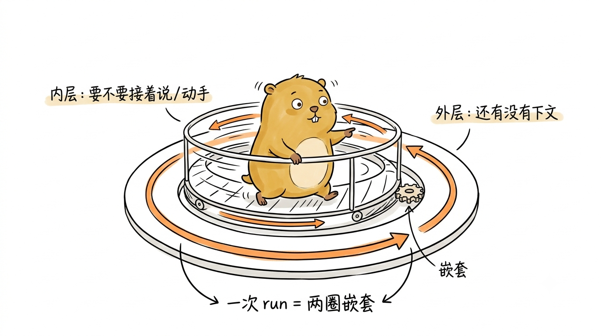
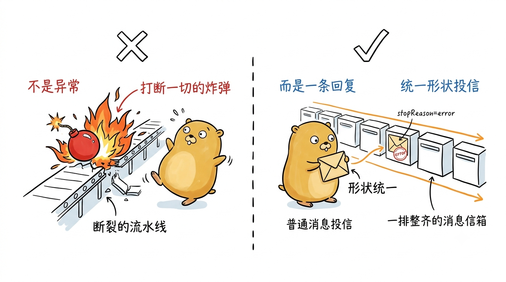
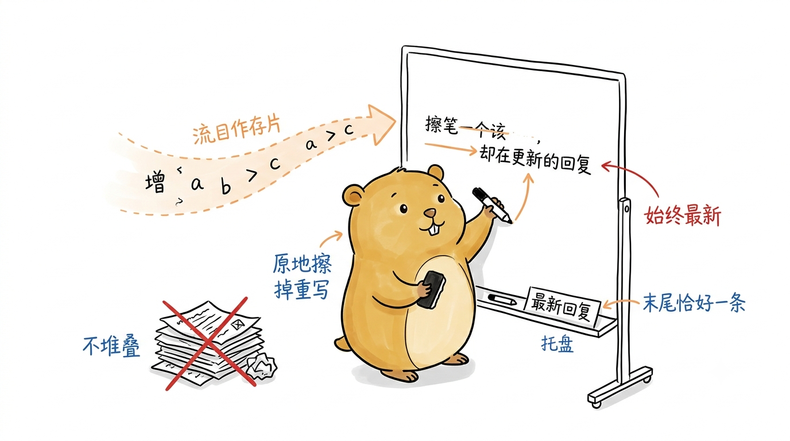
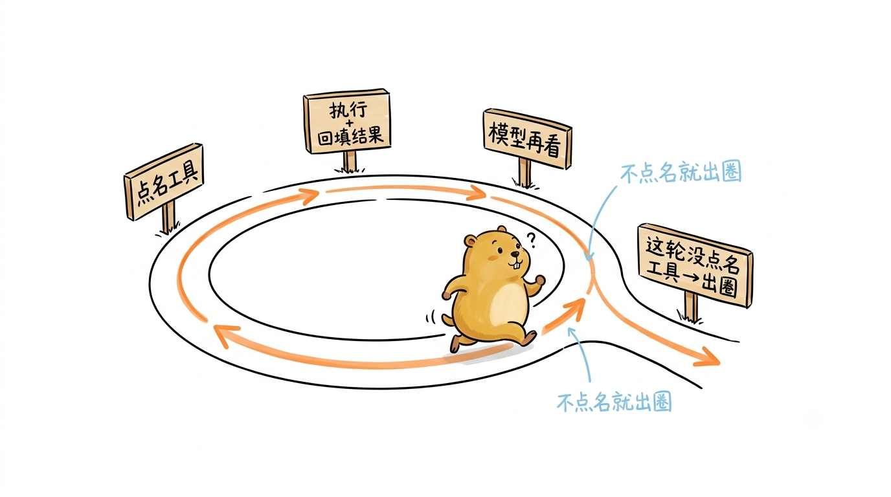
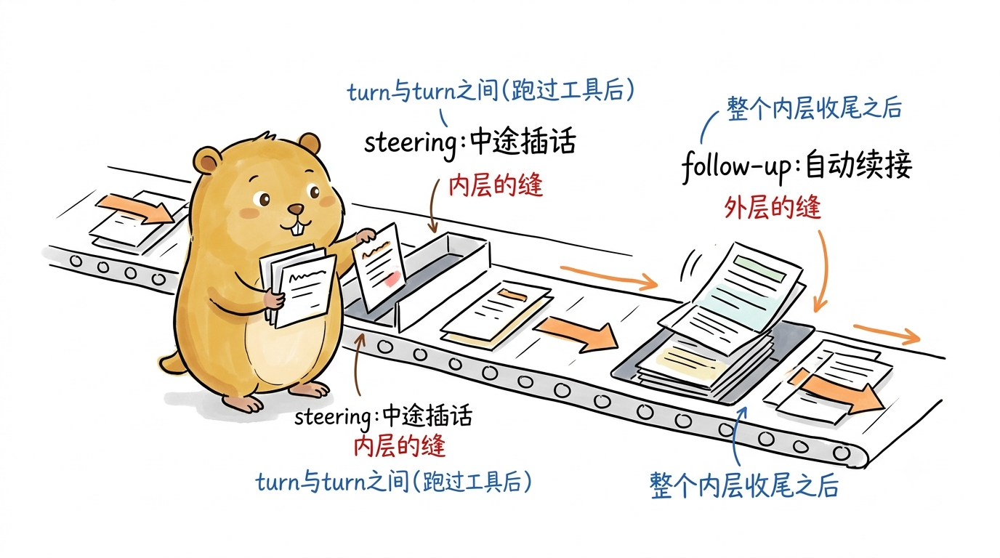
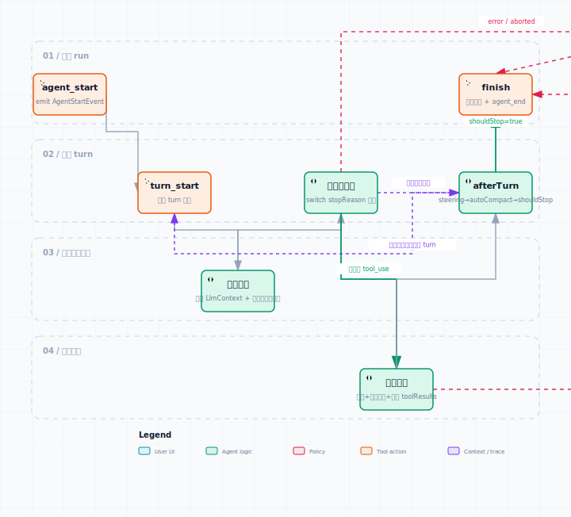
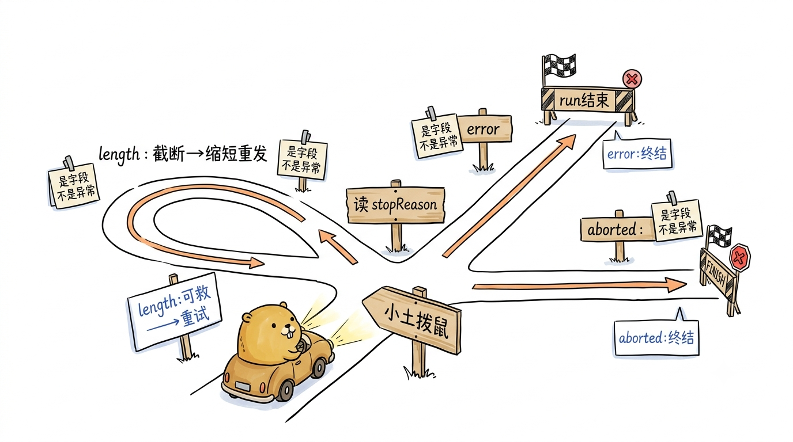

# 两层循环：一次 run 是怎么转起来的

第1章把 pigo 从 `main()` 到 `dispatch()` 的装配骨架拆了一遍，第2章又把 `agentcore` 里那套贯穿全局的类型契约——消息、内容、事件、工具、钩子——摆到了台面上。装配就绪、契约在手，接下来该问最核心的一个问题了：一次对话到底是怎么"转"起来的？

引言里那个朴素公式——LLM + 上下文 + 工具，靠一个循环串起来——在这一章要落到真正的代码上。但真读进 `internal/runtime/loop.go`，你会发现它不是一个循环，而是**两个嵌套的循环**：内层管"一轮回复到底要不要接着说"，外层管"这一轮说完了还有没有下文"。这两层各自回答一个问题，合起来才构成 pigo 所谓的一次 run。

本章就沿着这两层循环走一遍。先钻到最里面，看单次流式回复 `streamAssistantResponse` 是怎么把上下文塑形成请求、又怎么把流式碎片回填成一条完整消息的；再退一步看内层循环怎么在"回复→执行工具→回填"之间转圈，直到某一轮不再点名任何工具而自然收尾；然后退到最外层，看 `getFollowUpMessages` 与 steering 消息如何让一个已经收尾的 run 又接着跑下去；最后把散落在各处的六个钩子和三种"非正常"停止原因收拢成一张全景图。锚定的源码是 `internal/runtime` 下的 `loop.go`、`stream_response.go`、`prompt.go` 与 `render.go` 四个文件。

{#fig:3-1 width=100%}

## 先看最里面：一次流式回复

两层循环的最小单元不是"循环"，而是一次流式回复。`stream_response.go` 里的 `streamAssistantResponse` 就干这件事：把当前上下文塑形成一次 provider 请求，驱动流式响应，边流边把半成品回填进上下文，最后交出一条完整的 assistant 消息。它的函数签名把职责说得很清楚：

```go
func streamAssistantResponse(ctx context.Context, agentCtx *agentcore.AgentContext, cfg LoopConfig, emit agentcore.EmitFunc) (agentcore.AssistantMessage, error)
```

值得先记住一个反直觉的约定：**它几乎从不为"请求失败"返回 error**。网络挂了、密钥缺了、上游 500 了，这些失败都会被折叠成一条 `stopReason` 为 `error`/`aborted` 的终态 assistant 消息返回，而返回值里的 `error` 只在一种情况下非空——`emit` 因 context 取消而中断。这个设计让上层循环永远拿到一条"形状统一"的 assistant 消息去记账，把"失败"降格成"一种回复"，而不是一条需要特殊 `if err != nil` 分支去打断控制流的异常。


{#fig:3-2 width=100%}

函数体是一条严格有序的流水线，源码注释直接把它标成了七步。前五步是"塑形与发起"：

```go
// 1. transformContext (optional, must not error).
msgs := agentCtx.Messages
if cfg.TransformContext != nil {
    msgs = cfg.TransformContext(ctx, msgs)
}
// 2. convertToLlm (filter UI-only; default identity).
if cfg.ConvertToLlm != nil {
    msgs = cfg.ConvertToLlm(msgs)
}
// 3. shape the LLM context.
llm := provider.LlmContext{
    SystemPrompt: agentCtx.SystemPrompt,
    Messages:     msgs,
    Tools:        agentCtx.Tools,
}
// 4. resolve API key dynamically, fall back to static.
key := cfg.APIKey
if cfg.GetAPIKey != nil {
    if dyn := cfg.GetAPIKey(ctx, cfg.Provider); dyn != "" {
        key = dyn
    }
}
// 5. build the provider stream.
stream, err := cfg.Stream(ctx, cfg.Model, llm, provider.StreamConfig{
    APIKey:        key,
    ThinkingLevel: cfg.ThinkingLevel,
    Extra:         cfg.Extra,
})
if err != nil {
    return newErrorAssistantMessage(cfg, err), nil
}
```

第 1、2 步是两个可选的上下文改写钩子：`TransformContext` 用来裁剪或注入消息（第6章的压缩就挂在这条缝上），`ConvertToLlm` 用来把"只给人看"的 UI 消息滤掉。两者的契约都是**不许返回 error**——它们要么成功改写，要么原样返回一个安全的兜底值，绝不能在这条热路径上抛异常。第 3 步把系统提示、消息、工具打包成 `provider.LlmContext`，这是循环层递给 provider 层的统一表示（它的翻译是第4章的主题）。第 4 步是密钥解析：动态解析器 `GetAPIKey` 优先，拿不到再回落到静态 `APIKey`——这样短时令牌（short-lived token）每次请求都能拿到新鲜的值，而密钥本身从不写进任何可能被日志打印的结构体。第 5 步真正发起流，注意这里就出现了第一处失败折叠：如果连 stream 都建不起来（比如 URL 非法），直接用 `newErrorAssistantMessage` 合成一条终态消息返回，`error` 位仍是 `nil`。

### 回填：从流式碎片到一条完整消息

第 6 步是这个函数的核心，也是"流式"二字的落点。provider 的流吐出的是一连串事件，每个事件都带一个"到目前为止的半成品消息"（`Partial`）。`streamAssistantResponse` 的做法是：**始终只在上下文里维护这一条消息的最新版本**——第一次追加，之后原地替换：

```go
addedPartial := false
backfill := func(partial agentcore.AssistantMessage) {
    if !addedPartial {
        agentCtx.Messages = append(agentCtx.Messages, partial)
        addedPartial = true
    } else {
        agentCtx.Messages[len(agentCtx.Messages)-1] = partial
    }
}
```

这个 `backfill` 闭包是理解回填的钥匙。它保证无论流吐出多少个增量事件，上下文末尾永远只有一条 assistant 消息，且始终是最新的半成品。于是循环遍历流事件，按类型分派：

```go
for ev := range stream.Events() {
    switch e := ev.(type) {
    case provider.StreamStartEvent:
        backfill(e.Partial)
        if err := emit(ctx, agentcore.MessageStartEvent{Message: e.Partial}); err != nil {
            return agentcore.AssistantMessage{}, err
        }
    case provider.StreamTextEvent:
        backfill(e.Partial)
        if err := emit(ctx, agentcore.MessageUpdateEvent{Message: e.Partial, AssistantMessageEvent: e}); err != nil {
            return agentcore.AssistantMessage{}, err
        }
    // StreamThinkingEvent / StreamToolCallEvent 同理：回填 + 发 message_update
    case provider.StreamDoneEvent:
        finalizeMessage(agentCtx, e.Message, &addedPartial)
        if err := emit(ctx, agentcore.MessageEndEvent{Message: e.Message}); err != nil {
            return agentcore.AssistantMessage{}, err
        }
        return e.Message, nil
    case provider.StreamErrorEvent:
        finalizeMessage(agentCtx, e.Message, &addedPartial)
        if err := emit(ctx, agentcore.MessageEndEvent{Message: e.Message}); err != nil {
            return agentcore.AssistantMessage{}, err
        }
        return e.Message, nil
    }
}
```

这里有几处值得盯住的细节。其一，provider 层的流事件（`StreamStartEvent`/`StreamTextEvent`/…）和循环层的 `AgentEvent`（`MessageStartEvent`/`MessageUpdateEvent`/…）是**两套事件**：前者是 provider 内部的流协议，后者才是对外广播、被 REPL 和 stream-json 消费的语义事件。`streamAssistantResponse` 站在两者之间做翻译，顺手把原始流事件塞进 `MessageUpdateEvent.AssistantMessageEvent` 字段，留给需要更细粒度的消费者。其二，`emit` 返回 error 时函数**立即返回**并把 error 上抛——这是唯一会让返回值 error 非空的路径，语义是"消费方（context）已经取消，不必再流了"。其三，`StreamDoneEvent` 和 `StreamErrorEvent` 走的是**同一套收尾逻辑**：都调 `finalizeMessage` 把占位半成品换成终态消息，都发 `MessageEndEvent`，都直接 `return e.Message`。区别只在那条终态消息的 `stopReason`——正常结束是 `end_turn`/`tool_use`，出错则是 `error`。失败与成功在这里被抹平成"同一种收尾"，正是前面说的"把失败降格成一种回复"。

`finalizeMessage` 处理了一个边界：如果 provider 没发 start 就直接给了 done/error（半成品从未落地过），它得负责把终态消息追加进去而不是原地替换：

```go
func finalizeMessage(agentCtx *agentcore.AgentContext, final agentcore.AssistantMessage, addedPartial *bool) {
    if *addedPartial {
        agentCtx.Messages[len(agentCtx.Messages)-1] = final
    } else {
        agentCtx.Messages = append(agentCtx.Messages, final)
        *addedPartial = true
    }
}
```

第 7 步是流的"意外结束"兜底：如果 `range stream.Events()` 循环跑完了却既没见到 done 也没见到 error，就去问 `stream.Result(ctx)` 要最终结果，结果出错则又是一条合成的终态错误消息。至此，无论走哪条路径，`streamAssistantResponse` 都保证：上下文末尾多了恰好一条 assistant 消息，且返回的就是它。这条不变量（invariant）是内层循环敢放心往下走的地基。

{#fig:3-3 width=100%}

## 内层循环：回复、执行工具、回填，直到收尾

有了"一次流式回复"这块积木，内层循环就好懂了。它做的事一句话概括：**流式回复 → 执行这条回复点名的工具 → 把结果回填 → 再来一轮，直到某轮回复不点名任何工具**。这段逻辑在 `loop.go` 的 `runLoop` 里，是外层 `for` 里嵌的那个 `for`：

```go
for { // outer loop: pending / follow-up messages
    for { // inner loop: turns until no tool calls
        if err := emit(agentcore.TurnStartEvent{}); err != nil {
            finish()
            return
        }

        assistant, err := streamAssistantResponse(ctx, agentCtx, cfg.LoopConfig, func(c context.Context, ev agentcore.AgentEvent) error {
            return stream.Emit(c, ev)
        })
        if err != nil {
            finish()
            return
        }
        // ... 见下：先按 stopReason 分派，再看有没有工具调用 ...
    }
    // ... 内层收尾后：consult follow-up messages ...
}
```

每一轮内层循环叫一个 **turn**（轮次）：以一个 `TurnStartEvent` 开场，中间是一次完整的 `streamAssistantResponse`，以一个 `TurnEndEvent` 收尾。turn 拿到 assistant 消息后，先不急着看工具，而是**先按 `stopReason` 分派**：

```go
switch assistant.StopReason {
case agentcore.StopReasonLength:
    // Truncated by the token cap: fail every tool call so the model
    // resends, then continue feeding back.
    toolResults := failToolCallsFromTruncatedMessage(agentCtx, assistant)
    if err := emit(agentcore.TurnEndEvent{Message: assistant, ToolResults: toolResults}); err != nil {
        finish()
        return
    }
    if afterTurn(ctx, agentCtx, &cfg, true, emit) {
        finish()
        return
    }
    continue
case agentcore.StopReasonError, agentcore.StopReasonAborted:
    // Terminal failure: emit the turn end and stop.
    _ = emit(agentcore.TurnEndEvent{Message: assistant})
    finish()
    return
}
```

这个 `switch` 把三种"非正常"停止先拦下来（它们的完整含义留到本章后面统一讲）：

- `length`：回复被输出 token 上限**截断**了。这时如果消息里还带着没写完的工具调用，直接执行是危险的——参数可能是残缺的。pigo 的处理是调 `failToolCallsFromTruncatedMessage`，给每个被截断的工具调用**造一条错误结果**，告诉模型"你上一条被截断了，这个工具没执行，请缩短后重发"，然后 `continue` 回到 turn 开头让模型重试。这是三种里唯一"拦下来还接着跑"的。
- `error` / `aborted`：终态失败。发一个 `TurnEndEvent` 记录这条消息，然后 `finish()` 直接结束整个 run。

只有当 `stopReason` 不是这三种（也就是正常的 `end_turn` 或 `tool_use`）时，才轮到看工具调用：

```go
calls := toAgentToolCalls(assistant.ToolCalls())
if len(calls) == 0 {
    // Natural turn end: no tools to run.
    if err := emit(agentcore.TurnEndEvent{Message: assistant}); err != nil {
        finish()
        return
    }
    if afterTurn(ctx, agentCtx, &cfg, false, emit) {
        finish()
        return
    }
    break // exit inner loop → consult follow-up messages
}
```

**这就是内层循环的自然收尾条件：一轮回复不点名任何工具。** 模型说完了、不需要动手了，`calls` 为空，发完 `TurnEndEvent`、跑完收尾钩子，就 `break` 跳出内层循环，把控制权交给外层去问"还有没有后续消息"。反过来，只要还有工具要跑，循环就不会停：

```go
toolResults, allTerminate := agenttool.ExecuteToolCalls(ctx, cfg.Batch, calls, func(c context.Context, ev agentcore.AgentEvent) error {
    return stream.Emit(c, ev)
})
for _, tr := range toolResults {
    agentCtx.Messages = append(agentCtx.Messages, tr)
}
if err := emit(agentcore.TurnEndEvent{Message: assistant, ToolResults: toolResults}); err != nil {
    finish()
    return
}
if allTerminate {
    // Every tool asked to terminate the run.
    finish()
    return
}
if afterTurn(ctx, agentCtx, &cfg, true, emit) {
    finish()
    return
}
// Feed the tool results back into the next turn.
```

工具执行交给 `agenttool.ExecuteToolCalls`（第5章细讲），它返回两样东西：每个工具调用对应的结果消息，以及一个 `allTerminate` 标志。结果被逐条**回填**进上下文（`append` 到 `agentCtx.Messages`），然后发一个带 `ToolResults` 的 `TurnEndEvent`。这里的回填是内层循环得以转圈的关键：工具结果进了上下文，下一轮 `streamAssistantResponse` 塑形请求时就会带上它们，模型于是能"看到"工具跑出了什么、再决定下一步。这正是引言里"工具"那条边的闭环——模型点名、循环执行、结果回填、模型再看。

{#fig:3-4 width=100%}

`allTerminate` 是一个"逃生阀"：当**这一批工具调用全都**要求终止 run 时（比如某个显式的退出工具），循环直接 `finish()`。注意是"全都"——`ExecuteToolCalls` 的语义是只有每个结果都 `terminate=true` 才返回 `true`，与 pi 对齐。如果没终止，就走 `afterTurn` 收尾钩子（注意这次传的是 `true`，表示"这一轮跑了工具"），然后自然地进入下一轮 turn，把工具结果喂回去。

### 批量执行工具：全终止才终止

顺带把 `ExecuteToolCalls` 的收尾语义看一眼，它解释了上面那个 `allTerminate` 从哪来（`batch_executor.go`）：

```go
// Whole batch terminates only when every result terminates (pi semantics).
allTerminate := true
for _, t := range terminates {
    if !t {
        allTerminate = false
        break
    }
}
return results, allTerminate
```

一批工具调用可能顺序执行也可能并行执行（取决于工具声明的 `ExecutionMode`），但无论怎么跑，`allTerminate` 只在**所有**结果都标了 `terminate=true` 时才为真。这个"全终止才终止"的语义避免了单个工具误杀整个 run：只要还有一个工具没喊停，循环就认为"还有事要做"，继续把结果喂回去让模型接着判断。

### turn 的收尾钩子：afterTurn

前面几处都出现了 `afterTurn(...)`，它是每个 turn 结束后统一跑的收尾逻辑，把四件事按固定顺序串起来：

```go
func afterTurn(ctx context.Context, agentCtx *agentcore.AgentContext, cfg *RunConfig, hadToolExecution bool, emit func(agentcore.AgentEvent) error) (stop bool) {
    if hadToolExecution && cfg.GetSteeringMessages != nil {
        if steer := cfg.GetSteeringMessages(ctx); len(steer) > 0 {
            agentCtx.Messages = append(agentCtx.Messages, steer...)
        }
    }
    if cfg.PrepareNextTurn != nil {
        if upd := cfg.PrepareNextTurn(ctx, agentCtx); upd != nil {
            applyTurnUpdate(agentCtx, cfg, upd)
        }
    }
    maybeAutoCompact(ctx, agentCtx, cfg, emit)
    if cfg.ShouldStopAfterTurn != nil {
        return cfg.ShouldStopAfterTurn(ctx, agentCtx)
    }
    return false
}
```

四步依次是：

1. **拉 steering 消息**（仅当这一轮跑了工具，`hadToolExecution` 为真）。`GetSteeringMessages` 是"转向"钩子——在一轮工具执行之后、下一轮之前，允许外部塞入新消息（比如用户在长任务跑到一半时补了一句指令）。拉到就 `append` 进上下文，下一轮自然带上。它与外层的 `getFollowUpMessages` 是两回事：steering 是**turn 之间**的注入，follow-up 是**run 收尾后**的续跑，后面会对比。
2. **prepareNextTurn**：允许在下一轮之前换掉上下文、系统提示、工具集、模型或思考等级。返回一个 `*TurnUpdate`，非 nil 字段就替换对应状态。
3. **maybeAutoCompact**：上下文涨过窗口阈值时就地压缩（第6章的主题），压缩失败也不致命，发一个带 `ErrorMessage` 的 `CompactionEvent` 让失败可观测，run 照跑。
4. **shouldStopAfterTurn**：最后问一句"该停了吗"，返回 `true` 就让调用方 `finish()`。这是钩子驱动的优雅停止点，区别于 `error`/`aborted` 那种被动终止。

`prepareNextTurn` 能换哪些东西，看 `TurnUpdate` 的定义和 `applyTurnUpdate` 就清楚了——每个字段都是指针，非 nil 才替换，精确表达"只改我给的这几样"：

```go
type TurnUpdate struct {
    Messages      *agentcore.MessageList
    SystemPrompt  *string
    Tools         *[]agentcore.AgentTool
    Model         *string
    ThinkingLevel *agentcore.ThinkingLevel
}
```

这几个字段合起来意味着：pigo 的循环允许**在两轮之间热切换模型或思考等级**——比如前一轮用小模型试探、发现任务变难了，下一轮换大模型。这是很多 Agent 框架做不到的动态性，而它在 pigo 里只是 `afterTurn` 里一个可选钩子的自然结果。

## 外层循环：让收尾的 run 接着跑

内层循环 `break` 出来，不代表 run 结束——只代表"模型这一波说完了，不再点名工具了"。外层循环这时问一个问题：**还有没有后续消息（follow-up）要接着喂？**

```go
// Inner loop settled: consult follow-up messages.
if cfg.GetFollowUpMessages != nil {
    if follow := cfg.GetFollowUpMessages(ctx, agentCtx); len(follow) > 0 {
        agentCtx.Messages = append(agentCtx.Messages, follow...)
        continue // outer loop with the follow-ups as new input
    }
}
break
```

逻辑极简：调 `GetFollowUpMessages`，如果它返回了消息，就 `append` 进上下文并 `continue`——回到外层 `for` 的顶部，重新进入内层循环，把这些 follow-up 当成新一轮输入跑。如果没有，`break` 出外层，`runLoop` 走到最后的 `finish()`，run 才真正结束。

这就是"外层循环"的全部机制，但它的用途值得多想一层。`getFollowUpMessages` 让**一次 run 内部**能自我延续：内层循环解决"模型要不要接着动手"，外层循环解决"这轮对话完了要不要自动开启下一轮"。典型场景是队列式任务——第一波指令跑完，follow-up 钩子从队列里取下一条，run 就无缝接上，不需要外部重新发起。它和 steering 的分工可以这样记：

- **steering**（`getSteeringMessages`）：turn 与 turn 之间、且仅在跑过工具后注入。管的是"一次持续工作过程中的中途插话"。
- **follow-up**（`getFollowUpMessages`）：内层循环整个收尾之后注入。管的是"一轮对话结束后的自动续接"。

两者都是往 `agentCtx.Messages` 里 append，但触发时机和语义层级不同，一个在内层的缝里，一个在外层的缝里。

{#fig:3-5 width=100%}

### run 的事件骨架

把两层循环连起来，一次 run 从头到尾发出的事件有一个稳定的骨架，`runLoop` 开头和 `finish` 把它框住：

```go
if err := emit(agentcore.AgentStartEvent{SessionID: cfg.SessionID}); err != nil {
    finish()
    return
}
// ... 两层循环,每轮 turn 一对 TurnStart/TurnEnd,turn 内若干 MessageStart/Update/End ...

finish := func() {
    msgs := newMessages()
    _ = emit(agentcore.AgentEndEvent{Messages: msgs})
    stream.SetResult(msgs)
    stream.Close()
}
```

所以骨架是：`agent_start`（带 session id，第1章的实验就抓的这一条）→ 若干个 `turn_start … turn_end` 对，每个 turn 内嵌 `message_start`/若干 `message_update`/`message_end`，跑了工具还会有 `tool_execution_start`/`end` → 最后一个 `agent_end`。`finish()` 是所有退出路径的唯一出口：它计算这次 run 新产生的消息、发 `agent_end`、把结果塞进 stream 供 `DrainStream` 取用、关流。无论是正常收尾、终态错误、还是 `emit` 中途取消，都收敛到这一个 `finish()`，保证事件流"有始有终"、消费方不会永久阻塞。

{#fig:3-7 width=100%}

顺带说，消费这条事件流的是 `render.go` 里的 `DrainStream`——REPL、无头驱动、子 Agent 工具都靠它。它把 `MessageUpdateEvent` 的流式文本做增量计算（只吐新增的后缀），把 `TurnEndEvent` 交给消费者渲染工具活动，是"三处消费者共享一个抽干循环"的收口。它属于第1章讲的驱动层，这里不展开，只需知道：循环发事件，`DrainStream` 收事件，两者靠上面这套骨架对齐。

## 六个钩子与三种停止原因

现在把散落在两层循环里的扩展点收拢成一张全景图。pigo 的循环之所以能被 REPL、无头、子 Agent 三种驱动器复用，靠的就是这套可选钩子——每个都是 nil 即默认、非 nil 才生效的"接缝"。

### 六个钩子

按它们在循环里被调用的位置，从外到里排开：

| 钩子 | 定义处 | 触发时机 | 作用 |
| --- | --- | --- | --- |
| `GetFollowUpMessages` | `RunConfig` | 内层循环收尾后 | 返回后续消息则续跑外层，否则结束 run |
| `GetSteeringMessages` | `RunConfig` | 每个跑过工具的 turn 结束后 | 注入中途"转向"消息 |
| `PrepareNextTurn` | `RunConfig` | 每个 turn 结束后 | 换上下文/系统提示/工具/模型/思考等级 |
| `ShouldStopAfterTurn` | `RunConfig` | 每个 turn 结束后 | 决定是否优雅停止 run |
| `BeforeToolCall` | `ToolExecutorConfig` | 工具校验后、执行前 | 拦截工具调用（权限/沙箱闸门） |
| `AfterToolCall` | `ToolExecutorConfig` | 工具执行后 | 逐字段覆盖工具结果（不深合并） |

前四个是**循环层**钩子，挂在 `RunConfig` 上，管一个 turn 收尾后的"续跑→注入→换装→停止"；后两个是**工具层**钩子，挂在 `agenttool` 的执行器上，管一个工具调用的"执行前拦截→执行后改结果"。工具层其实还有第三个 `PrepareArguments`（执行前、校验前改写原始参数，比如注入默认值），但它不在 pigo 循环注释所说的"六个钩子"之列，算是执行器自己的准备相扩展点。这些钩子的类型签名散在 `agentcore/helpers.go` 和 `runtime/loop.go` 里，例如：

```go
// 循环层：turn 收尾后决定是否停止
ShouldStopAfterTurn func(ctx context.Context, agentCtx *agentcore.AgentContext) bool
// 工具层：执行前可拦截
type BeforeToolCallFunc func(ctx context.Context, call AgentToolCall) *BeforeToolCallDecision
```

有意思的是，pigo 里真正**用**这些钩子的地方，大多在测试里（`loop_test.go`、`faux_provider_test.go`），而两个生产驱动器反而克制。看 REPL 的 `streamRun`（`cmd/pigo/repl.go`），它拼的 `RunConfig` 只挂了一个钩子：

```go
Batch: agenttool.BatchConfig{
    ToolExecutorConfig: agenttool.ToolExecutorConfig{
        Registry:       deps.reg,
        BeforeToolCall: trustBeforeToolCall(deps.trust, deps.cwd, deps.in, out, deps.confirmMu),
    },
},
```

`BeforeToolCall` 挂的是信任闸门（第8章），`GetFollowUpMessages`/`GetSteeringMessages`/`PrepareNextTurn`/`ShouldStopAfterTurn` 全是 nil。这不是遗漏，而是取舍：REPL 的多轮对话靠"每敲一次提示词就调一次 `streamRun`、启一个全新的 run"来实现，而不是靠外层 follow-up 在一个 run 里续跑。换句话说，**REPL 用不上外层循环的续跑机制，它用更外层的"人在终端"当外层循环**。这些钩子是留给需要程序化驱动的场景——队列任务、批处理、子 Agent 编排——以及测试去精确验证循环行为的。理解这一点，你就明白为什么 `loop.go` 把钩子做得如此周全，却又在最常见的两条驱动路径上大半闲置：它们是**能力储备**，不是**当前用量**。

### 三种停止原因

再把 `stopReason` 的处理收拢一遍。正常的 `end_turn`/`tool_use` 不必多说——前者让内层循环自然收尾去问 follow-up，后者让循环执行工具再回填。真正需要循环特殊对待的是三种"非正常"停止，常量都定义在 `agentcore/message.go`：

```go
const (
    StopReasonEndTurn = "end_turn"
    StopReasonToolUse = "tool_use"
    StopReasonLength  = "length"
    StopReasonError   = "error"
    StopReasonAborted = "aborted"
)
```

三种非正常停止的处理各不相同：

- **`length`（被 token 上限截断）**：唯一"能救回来"的。循环调 `failToolCallsFromTruncatedMessage`，给每个残缺的工具调用造一条 `IsError=true` 的结果消息，内容是提示模型"上一条被截断、此工具未执行、请缩短后重发"，然后 `continue` 让模型重试。这段处理与 pi 的 `failToolCallsFromTruncatedMessage` 对齐：

  ```go
  results = append(results, agentcore.ToolResultMessage{
      RoleField:  agentcore.RoleToolResult,
      ToolCallID: c.ID,
      ToolName:   c.Name,
      Content: agentcore.ContentList{agentcore.NewTextContent(
          "The previous response was truncated because it hit the output token limit, " +
              "so this tool call was not executed. Please send a shorter response and retry.")},
      IsError: true,
  })
  ```

  为什么不直接执行截断消息里的工具调用？因为参数可能只流到一半，是残缺的 JSON，执行它要么解析失败要么行为不可预测。把它标成错误让模型重发，比冒险执行安全得多。

- **`error`（请求/流出错）**：终态。发一个 `TurnEndEvent` 记录这条错误消息，`finish()` 结束 run。错误的具体内容在消息的 `ErrorMessage` 字段里。无头驱动 `RunHeadless` 收尾时会检查最后一条消息的 `stopReason`，若是 `error` 就返回 `*ErrRunFailed`，让 CLI 把退出码映射成 1。

- **`aborted`（被取消）**：同样是终态，处理路径和 `error` 合并在同一个 `case` 里。典型触发是用户在 REPL 里按 `Ctrl+C` 取消了当前 run 的 context，或上层主动取消。`RunHeadless` 对它单独返回 `&ErrRunFailed{Reason: "aborted"}`。

三者的共性是都会让 run 停下，差异在于：`length` 停的是"这一轮"然后重试，`error`/`aborted` 停的是"整个 run"。而且这三种停止原因**从不逃逸成 Go 的 error**——它们都是 assistant 消息的一个字段，循环靠 `switch assistant.StopReason` 去读，而不是靠 `if err != nil` 去接。这与本章开头 `streamAssistantResponse` "把失败降格成一种回复"的设计一脉相承：整条控制流里，失败是数据，不是异常。

{#fig:3-6 width=100%}

### 实验 3-1 ★：在 stream-json 里观察 run 的事件骨架 {.unnumbered}

**目标**：亲眼看到一次 run 从 `agent_start` 到 `agent_end` 的事件骨架，并验证"请求失败被折叠成一条 `stopReason=error` 的 assistant 消息、而非中断控制流"这一设计。

**前置**：在仓库根目录下能 `go run ./cmd/pigo`（或已 `go build -o pigo ./cmd/pigo`）。本实验**故意不配置任何真实 API Key**——因为我们想看的正是"请求失败时循环怎么收尾"。

**步骤**：以 stream-json 模式跑一个提示词，禁用工具以让事件骨架最干净，并把每行事件的 `type` 抽出来。

```bash
go run ./cmd/pigo -p "你好" --output-format stream-json --no-tools 2>/dev/null \
  | grep -o '"type":"[^"]*"'
```

**预期输出**（顺序稳定，具体行数取决于 provider 是否吐出过 message 事件）：

```
"type":"agent_start"
"type":"turn_start"
"type":"turn_end"
"type":"agent_end"
```

**观察点**：

1. 即便没有 Key、请求必然失败，事件流依然**有始有终**——`agent_start` 打头、`agent_end` 收尾，中间夹着恰好一对 `turn_start`/`turn_end`。这正是 `runLoop` 里 `finish()` 作为唯一出口的效果：任何退出路径都会补上 `agent_end`。
2. 只有一对 `turn_start`/`turn_end`，说明循环在第一个 turn 拿到 `stopReason=error` 的消息后，走的是 `case StopReasonError` 那条"发 turn_end 然后 finish"的路径，没有进入第二个 turn。
3. 把 `turn_end` 那一行完整打出来看看它的 `stopReason`：

   ```bash
   go run ./cmd/pigo -p "你好" --output-format stream-json --no-tools 2>/dev/null \
     | grep '"type":"turn_end"'
   ```

   你会看到 `"stopReason":"error"`（由 `eventEnvelope` 的 `TurnEndEvent` 分支填入）。这就是"失败是数据不是异常"的实证：失败没有让程序崩溃或让事件流断裂，它只是变成了 `turn_end` 事件里的一个字段值。

对照 `internal/runtime/loop.go` 的 `runLoop`（`switch assistant.StopReason` 与 `finish`）和 `internal/runtime/headless.go` 的 `eventEnvelope`（`turn_end` 分支填 `stopReason`），你就把本章内层循环的收尾逻辑与第1章的 stream-json 输出串成了一条完整链路。

## 本章小结

本章把 pigo 的两层 Agent 循环从最里层拆到最外层：

- **一次流式回复**（`stream_response.go` 的 `streamAssistantResponse`）：七步流水线把上下文塑形成请求、动态解析密钥、驱动流、边流边**回填**半成品，最后交出一条完整 assistant 消息。核心约定是"把请求失败折叠成一条 `stopReason=error` 的终态消息"，而非返回 Go error。
- **内层循环**（`loop.go` 的 `runLoop` 内层 `for`）：流式回复 → 执行工具 → 回填结果 → 再来一轮，以"一轮不点名任何工具"为**自然收尾条件**。工具批次通过 `ExecuteToolCalls` 执行，"全终止才终止"。
- **外层循环**（`runLoop` 外层 `for`）：内层收尾后调 `getFollowUpMessages`，有 follow-up 就 append 并 `continue` 续跑，没有则 `finish()` 结束 run。
- **turn 收尾钩子**（`afterTurn`）：按序跑 steering 注入、`prepareNextTurn` 换装、自动压缩、`shouldStopAfterTurn` 优雅停止。
- **六个钩子**：四个循环层（`getFollowUpMessages`/`getSteeringMessages`/`prepareNextTurn`/`shouldStopAfterTurn`）+ 两个工具层（`beforeToolCall`/`afterToolCall`），另有执行器自带的 `prepareArguments` 准备相钩子。它们是能力储备，REPL 只用了信任闸门那一个。
- **三种停止原因**：`length` 拦下并让模型重发（唯一可救），`error`/`aborted` 终结 run；三者都是 assistant 消息的字段，循环靠 `switch stopReason` 读它，失败始终是数据而非异常。

有了这台"发动机"，下一步该看它烧的是什么"油"了：第4章走进 Provider 层，看统一接口之下 OpenAI 兼容与 Anthropic-Messages 两套协议、SSE 传输与鉴权是怎么把 `streamAssistantResponse` 递下来的 `LlmContext` 翻译成线上请求、又把线上响应翻译回一条条流事件的。

## 思考题

1. `streamAssistantResponse` 为什么坚持"请求失败不返回 Go error，而是折叠成 `stopReason=error` 的消息"？如果改成返回 error，`runLoop` 里的 `switch assistant.StopReason` 和 `RunHeadless` 的退出码映射要各改成什么样？这会让控制流更简单还是更复杂？
2. 内层循环的自然收尾条件是"一轮回复不点名任何工具"。设想一个模型每轮都点名至少一个工具、永不自然收尾的极端情况，循环会无限转下去吗？对照 `afterTurn` 里的 `shouldStopAfterTurn` 和 `allTerminate`，说说有哪些机制能打断它。
3. `getSteeringMessages` 只在 `hadToolExecution` 为真时才拉，而 `getFollowUpMessages` 在内层完全收尾后才拉。为什么 steering 要绑定"跑过工具"这个条件？如果把它改成每个 turn 都拉，会对"没有工具调用、纯文本对话"的一轮产生什么影响？
4. `prepareNextTurn` 能在两轮之间换掉模型和思考等级。对照 `TurnUpdate` 与 `applyTurnUpdate`，设计一个"前一轮用便宜小模型探路、发现要写代码就下一轮换大模型"的 `PrepareNextTurn` 实现，它需要读 `agentCtx` 里的什么信息来做判断？
5. REPL 的 `streamRun` 把 `GetFollowUpMessages`/`GetSteeringMessages` 都留成 nil，靠"每次提示词启一个新 run"实现多轮。对照实验 3-1 的事件骨架，想想：如果改用外层 follow-up 在**一个 run 内**驱动多轮，`agent_start`/`agent_end` 事件的数量会怎么变？这对下游按 run 计费或记录会话的消费者意味着什么？
