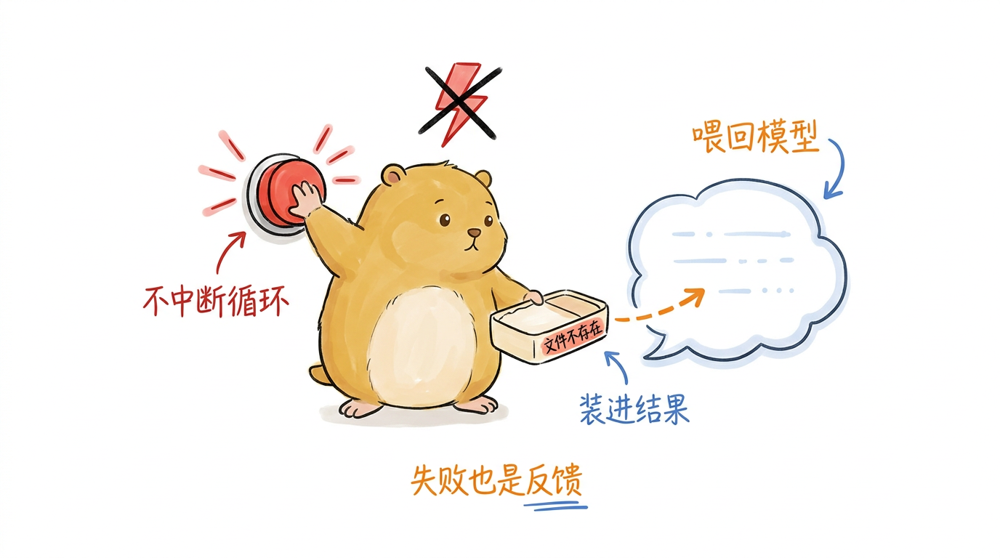
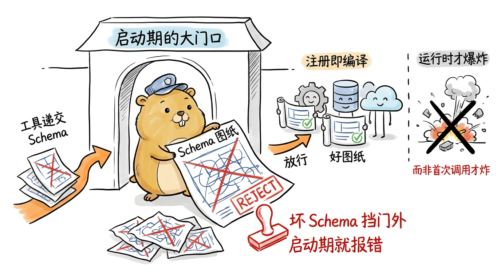
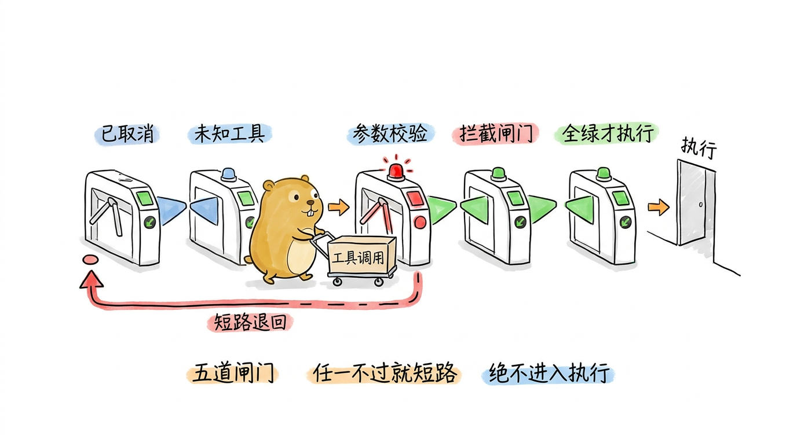
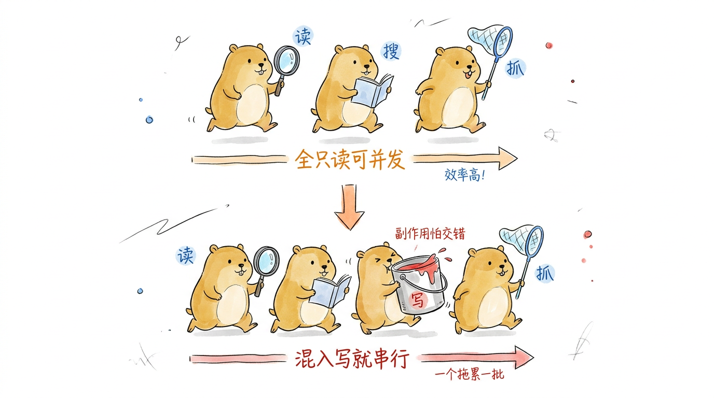
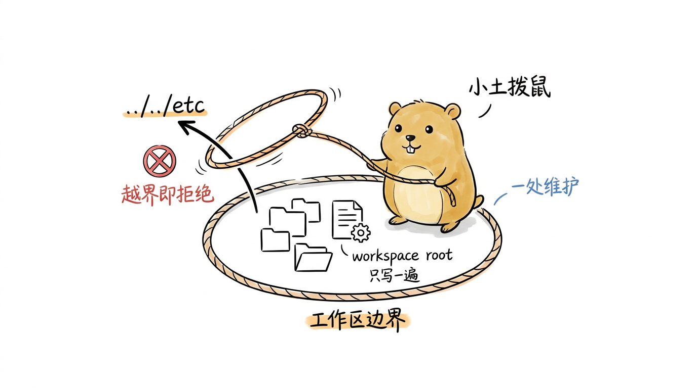
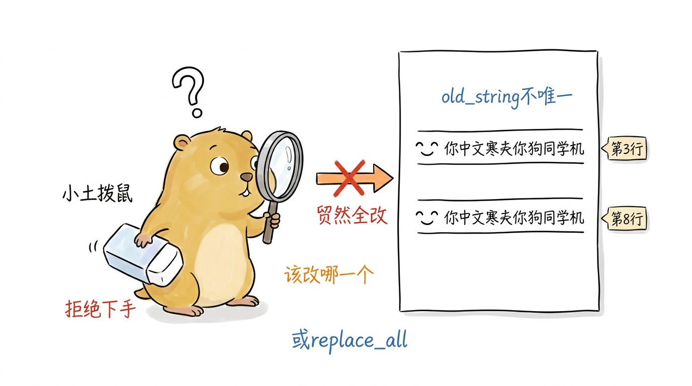
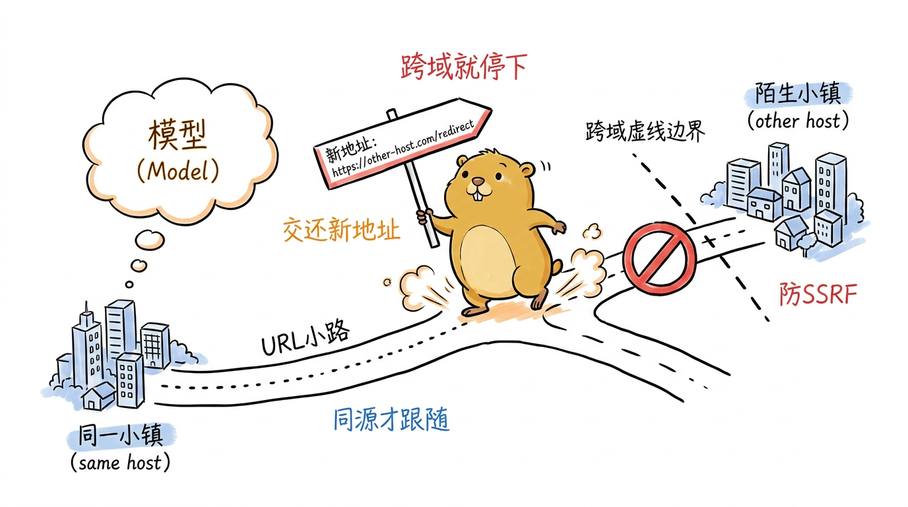

# 工具系统：让 Agent 长出手脚

第 3 章拆两层循环时，我们把"执行工具调用"当成了一个黑盒：循环从流式回复里收集到一批工具调用，交给某个执行器跑一遍，再把结果作为新消息回填。这一章就来打开这个黑盒。引言里的公式 **LLM + 上下文 + 工具** 中，工具是让 Agent 从"能说"跨到"能做"的那一环——没有工具，模型只能吐字；有了工具，它才能读文件、改代码、跑命令、抓网页。

pigo 把这一环收进了 `internal/agenttool` 包。它要回答四个层层递进的问题：一个工具怎么**被登记**、参数怎么**被校验**（`registry.go`）；单个工具调用怎么走完**准备→执行→收尾**三步（`tool_executor.go`）；一批调用怎么在**串行与并发**之间选择（`batch_executor.go`）；以及具体的读、写、改、搜、跑、抓、记七类能力各自的**实现要点**（`read_tool.go` 等八个文件）。我们就按这个顺序解剖：先看骨架（注册表与执行器），再看肌肉（各个工具）。读完本章，你会明白一个"安全、可校验、不会因为工具崩溃而拖垮整轮对话"的工具系统是怎么装配起来的。

## 一切从 AgentTool 接口开始

在钻进注册表之前，先看清所有工具都要遵守的契约。第 2 章介绍过 `agentcore.AgentTool`，这里把它完整摆出来（`internal/agentcore/tool.go`）：

```go
type AgentTool interface {
	Name() string
	Description() string
	// Schema returns the JSON Schema (as raw JSON) for the tool's arguments.
	Schema() json.RawMessage
	// ExecutionMode reports whether this tool forces sequential execution.
	ExecutionMode() ToolExecutionMode
	// Execute runs the tool. onUpdate may be nil.
	Execute(ctx context.Context, id string, args json.RawMessage, onUpdate ToolUpdateFunc) (AgentToolResult, error)
}
```

五个方法各司其职：`Name` 是模型调用时用的名字，也是注册表的键；`Description` 与 `Schema` 一起被送进 Provider 的工具声明，告诉模型"这个工具是干什么的、参数长什么样"；`ExecutionMode` 声明它能不能和别人并发跑，这是下文批量执行的关键；`Execute` 是真正干活的方法。第四个参数 `onUpdate ToolUpdateFunc` 有点意思，它让一个长跑的工具（比如 Bash）在跑到一半时就把部分输出流式吐回来，不必等全部结束。

`Execute` 的返回值 `(AgentToolResult, error)` 藏着一条贯穿全章的约定。通读全包你会发现，几乎所有工具都把失败编码进 `AgentToolResult`，而把 Go 的 `error` 返回 `nil`。这不是偷懒。模型需要看到"文件不存在"这样的反馈才能纠正下一步，所以失败得变成一条能喂回上下文的结果，而不是一个会中断循环的 Go 错误。先记住它。

<!--
生图prompt：
Generate one standalone 16:9 horizontal Chinese article illustration.

Visual DNA:
Pure white background. Minimalist editorial doodle with black hand-drawn pen line art and light colored pen wash, researcher-sketchbook / whiteboard feeling. Slightly wobbly pen lines. Lots of empty white space. Sparse red/orange/blue handwritten Chinese annotations. Clean curious product-sketch feeling. No gradients, no shadows, no paper texture, no complex background, no commercial vector style, no PPT infographic look, no anime style, no children's picture book, no commercial mascot, no realistic UI.

Recurring IP character required:
小土拨鼠 (Little Gopher), an original IP: a round, chubby, warm brown-yellow gopher inspired by the Go language Gopher, but cuter, cleaner and more soothing. Round head with a pair of small round ears; two small round curious eyes; a tiny nose and two small signature front teeth; short little limbs and soft paws; warm brown-yellow fur with a lighter belly; plump rounded proportions, earnest yet gently funny. 小土拨鼠 must perform the core conceptual action, not decorate the scene. Keep it a clean round soothing cartoon gopher, not a realistic rat/hamster, not the stiff original Go Gopher, not anime, not a mascot.

Theme: 工具失败不该拉警报中断循环，而应被打包成一条能喂回模型的结果
Structure type: 概念隐喻
Core idea: 一个失败（如"文件不存在"）被小土拨鼠温柔地装进一个便当盒，递还给模型继续对话，而不是拉响红色的中断警报
Composition: 画面中央小土拨鼠一只爪子把一个贴着"文件不存在"小标签的失败便当盒轻轻递向右侧一个代表模型的对话气泡；它另一只爪子按住左上角一个红色警报按钮不让它响起，头顶画一个被划掉的中断闪电。信息从便当盒流向对话气泡
Suggested elements: 装着失败的便当盒 / 被按住不响的红色警报按钮 / 被划掉的中断闪电 / 接住便当盒的对话气泡
Chinese handwritten labels: 失败也是反馈 / 不中断循环 / 装进结果 / 喂回模型
Color use: Black for main line art and 小土拨鼠's eyes/nose/teeth/paw outlines. 小土拨鼠 body warm brown-yellow with lighter belly. Orange for main flow/arrows. Red only for key warnings/results. Blue only for secondary notes/system state.
Constraints: One image explains only one core structure. Main subject 40%-60% of canvas. At least 35% blank white space. At most 5-8 short handwritten Chinese labels. No title in top-left corner. Do not write the structure type on the image. Not a formal diagram/slide. Invent a fresh visual metaphor for this specific content.
-->
{#fig:5-1 width=100%}

工具产出的结果类型是 `AgentToolResult`：

```go
type AgentToolResult struct {
	Content   ContentList `json:"content"`
	Details   any         `json:"details,omitempty"`
	Terminate *bool       `json:"terminate,omitempty"`
}
```

`Content` 是给模型看的文本（或多模态）内容，`Details` 是给 UI/日志用的结构化附带信息（比如编辑了几处、退出码是多少），`Terminate` 是一个 `*bool`。用指针是为了区分"没设置"和"显式设为 false"：只有当一批调用里每一个都要求终止时，循环才会提前收尾。

## 注册表：按名登记与 Schema 校验

工具集在启动期由 `builtinTools`（`cmd/pigo/main.go`）构造，再逐个塞进注册表。注册表 `ToolRegistry`（`internal/agenttool/registry.go`）干两件事：按名字存放工具、按每个工具声明的 JSON Schema 校验调用参数。

```go
type ToolRegistry struct {
	mu       sync.RWMutex
	tools    map[string]agentcore.AgentTool
	compiled map[string]*jsonschema.Schema
}
```

两张 map、一把读写锁——注册表要被多个 goroutine 并发读（并发执行工具时都会来 `Get`），所以用 `sync.RWMutex` 护住。`tools` 存工具本身，`compiled` 存预编译好的 Schema。

### 注册即编译：把坏 Schema 挡在启动期

`Register` 的关键在于它**在注册时就把 Schema 编译好**，而不是等到第一次调用：

```go
func (r *ToolRegistry) Register(tool agentcore.AgentTool) error {
	name := tool.Name()
	if name == "" {
		return fmt.Errorf("registry: tool has empty name")
	}
	r.mu.Lock()
	defer r.mu.Unlock()
	if _, exists := r.tools[name]; exists {
		return fmt.Errorf("registry: tool %q already registered", name)
	}
	if raw := tool.Schema(); len(bytes.TrimSpace(raw)) > 0 && !bytes.Equal(bytes.TrimSpace(raw), []byte("null")) {
		sch, err := compileSchema(name, raw)
		if err != nil {
			return fmt.Errorf("registry: tool %q schema: %w", name, err)
		}
		r.compiled[name] = sch
	}
	r.tools[name] = tool
	return nil
}
```

三道关卡：空名字拒绝、重名拒绝、Schema 编译失败拒绝。"注册即编译"意味着一个写错了 Schema 的工具会在程序启动时就报错，而不是等模型第一次调用它时才炸。错误被左移到了最早能发现的时刻。而一个 `Schema()` 返回空（或 `null`）的工具会被登记为"无校验"，直接放行任意参数。

<!--
生图prompt：
Generate one standalone 16:9 horizontal Chinese article illustration.

Visual DNA:
Pure white background. Minimalist editorial doodle with black hand-drawn pen line art and light colored pen wash, researcher-sketchbook / whiteboard feeling. Slightly wobbly pen lines. Lots of empty white space. Sparse red/orange/blue handwritten Chinese annotations. Clean curious product-sketch feeling. No gradients, no shadows, no paper texture, no complex background, no commercial vector style, no PPT infographic look, no anime style, no children's picture book, no commercial mascot, no realistic UI.

Recurring IP character required:
小土拨鼠 (Little Gopher), an original IP: a round, chubby, warm brown-yellow gopher inspired by the Go language Gopher, but cuter, cleaner and more soothing. Round head with a pair of small round ears; two small round curious eyes; a tiny nose and two small signature front teeth; short little limbs and soft paws; warm brown-yellow fur with a lighter belly; plump rounded proportions, earnest yet gently funny. 小土拨鼠 must perform the core conceptual action, not decorate the scene. Keep it a clean round soothing cartoon gopher, not a realistic rat/hamster, not the stiff original Go Gopher, not anime, not a mascot.

Theme: 注册即编译 Schema，把坏图纸挡在启动期的大门口而非运行时才炸
Structure type: 前后对比
Core idea: 小土拨鼠站在"启动期"大门口当门卫，逐个检验每个工具递上来的 Schema 图纸；一张画错的图纸被当场盖上红色拒绝章挡在门外，好图纸盖上绿章放进屋
Composition: 画面用一道门把左右分开。门口小土拨鼠站着，正把一张画歪的"坏 Schema"图纸盖上红色 REJECT 章、挡在门外（左侧，标"启动期就报错"）；门内已经放行的好工具排排坐。右侧远处画一个小小的、被划掉的"运行时才爆炸"的对比场景。信息从图纸流向门内
Suggested elements: 大门与门卫小土拨鼠 / 被盖红章拒绝的坏图纸 / 门内放行的好工具 / 远处被划掉的运行时爆炸
Chinese handwritten labels: 注册即编译 / 坏Schema挡门外 / 启动期就报错 / 而非首次调用才炸
Color use: Black for main line art and 小土拨鼠's eyes/nose/teeth/paw outlines. 小土拨鼠 body warm brown-yellow with lighter belly. Orange for main flow/arrows. Red only for key warnings/results. Blue only for secondary notes/system state.
Constraints: One image explains only one core structure. Main subject 40%-60% of canvas. At least 35% blank white space. At most 5-8 short handwritten Chinese labels. No title in top-left corner. Do not write the structure type on the image. Not a formal diagram/slide. Invent a fresh visual metaphor for this specific content.
-->
{#fig:5-2 width=100%}

编译用的是 `santhosh-tekuri/jsonschema/v6` 库。`compileSchema` 有个小技巧：它给每个工具的 Schema 造一个合成的内存 URL `mem:///<name>.json`，这样不同工具的 Schema 永远不会互相冲突。

`Get` 与 `List` 是配套的读方法。`List` 特意按名字排序返回：

```go
func (r *ToolRegistry) List() []agentcore.AgentTool {
	// ... 收集所有工具 ...
	sort.Slice(out, func(i, j int) bool { return out[i].Name() < out[j].Name() })
	return out
}
```

排序是为了让送给 Provider 的工具声明有确定性顺序，否则每次运行工具列表次序都在变，既不利于调试，也可能影响某些 Provider 的缓存命中。

### 校验：把违规变成模型能读懂的反馈

`Validate` 是注册表的另一半价值。它拿参数去撞工具的 Schema，返回的不是一句笼统的"参数错了"，而是一组定位到具体字段的错误：

```go
func (r *ToolRegistry) Validate(name string, args json.RawMessage) []FieldError {
	r.mu.RLock()
	_, known := r.tools[name]
	sch, hasSchema := r.compiled[name]
	r.mu.RUnlock()

	if !known {
		return []FieldError{{Field: "", Message: fmt.Sprintf("unknown tool %q", name)}}
	}
	if !hasSchema {
		return nil
	}

	var inst any
	dec := json.NewDecoder(bytes.NewReader(nonEmptyJSON(args)))
	dec.UseNumber()
	if err := dec.Decode(&inst); err != nil {
		return []FieldError{{Field: "", Message: fmt.Sprintf("arguments are not valid JSON: %v", err)}}
	}

	if err := sch.Validate(inst); err != nil {
		// ... 把 jsonschema.ValidationError 树摊平成一组 FieldError ...
	}
	return nil
}
```

几个细节值得留意。`dec.UseNumber()` 让 JSON 数字保留原样而不是一律解成 `float64`，避免整数校验时的精度问题。`nonEmptyJSON` 把空参数当成空对象 `{}`，这样一个"只有可选属性"的 Schema 能校验通过，同时"缺必填字段"的违规也能被正确报出来。

校验失败时，`flattenValidationError` 会递归遍历 jsonschema 返回的错误树，只取最叶子（也就是最具体）的失败原因，每个生成一条 `FieldError{Field, Message}`，其中 `Field` 是一个 JSON 指针（如 `/path`）。最后 `ValidationErrorResult` 把这些字段错误拼成一段人类可读的文本：

```go
func ValidationErrorResult(toolName string, errs []FieldError) agentcore.AgentToolResult {
	var b strings.Builder
	fmt.Fprintf(&b, "Invalid arguments for tool %q:\n", toolName)
	for _, e := range errs {
		field := e.Field
		if field == "" {
			field = "(root)"
		}
		fmt.Fprintf(&b, "  - %s: %s\n", field, e.Message)
	}
	return agentcore.AgentToolResult{
		Content: agentcore.ContentList{agentcore.NewTextContent(strings.TrimRight(b.String(), "\n"))},
		Details: errs,
	}
}
```

注意它返回的 `Terminate` 是 nil。参数校验失败绝不该结束整轮对话；恰恰相反，模型看到"哪个字段错了、为什么错"之后，正好可以在下一轮改对再试。这又是那条"失败即反馈"约定的体现。

## 单个工具的执行：准备→执行→收尾

注册表管的是"有哪些工具、参数对不对"，真正把一次调用跑起来的是 `tool_executor.go` 里的 `executeToolCall`。它把一次执行切成三个阶段，中间还嵌了三个可选钩子。先看它的配置：

```go
type ToolExecutorConfig struct {
	Registry         *ToolRegistry
	PrepareArguments agentcore.PrepareArgumentsFunc
	BeforeToolCall   agentcore.BeforeToolCallFunc
	AfterToolCall    agentcore.AfterToolCallFunc
}
```

三个钩子都可选（nil 即默认行为）。`PrepareArguments` 在校验前改写参数（比如注入默认值），`BeforeToolCall` 在校验后、执行前拦截（第 8 章的信任闸门就挂在这里，交互式 REPL 靠它逐次确认危险操作），`AfterToolCall` 在执行后逐字段覆盖结果。主流程一目了然：

```go
func executeToolCall(ctx context.Context, cfg ToolExecutorConfig, call agentcore.AgentToolCall, emit agentcore.EmitFunc) (agentcore.ToolResultMessage, bool) {
	// 1. prepare: lookup, prepareArguments, validate, beforeToolCall.
	tool, args, prep, isError := prepareToolCall(ctx, cfg, call)
	if prep != nil {
		// Prepare short-circuited: finalize the error result without executing.
		return finalizeToolCall(ctx, cfg, call, *prep, isError, emit)
	}

	// 2. execute.
	if emit != nil {
		if err := emit(ctx, agentcore.ToolExecutionStartEvent{ToolCallID: call.ID, ToolName: call.Name, Args: args}); err != nil {
			return errorToolResult(call, "aborted before execution: "+err.Error()), false
		}
	}
	result, isError := runTool(ctx, tool, call, args, emit)

	// 3. finalize: afterToolCall overrides.
	return finalizeToolCall(ctx, cfg, call, result, isError, emit)
}
```

返回的第二个值是个 `bool`，表示这次调用是否请求终止整轮。还要注意它的注释：它永远不返回 Go error，每一种失败都被编码进返回的消息里，`IsError=true`。这样循环拿到的永远是一条可回填的 `ToolResultMessage`，不会因为某个工具出岔子而断流。

### 准备阶段：五道闸门，任一失败就短路

`prepareToolCall` 是三阶段里最"防御"的一段，它按顺序过五道闸门，任何一道不过就返回一个非 nil 的错误结果，让主流程跳过执行直接收尾：

```go
func prepareToolCall(ctx context.Context, cfg ToolExecutorConfig, call agentcore.AgentToolCall) (agentcore.AgentTool, json.RawMessage, *agentcore.AgentToolResult, bool) {
	if ctx.Err() != nil {
		r := errorResult(fmt.Sprintf("tool %q aborted before execution", call.Name))
		return nil, nil, &r, true
	}

	tool, ok := cfg.Registry.Get(call.Name)
	if !ok {
		r := errorResult(fmt.Sprintf("unknown tool %q", call.Name))
		return nil, nil, &r, true
	}

	args := call.Arguments
	if cfg.PrepareArguments != nil {
		prepared, err := cfg.PrepareArguments(ctx, call.Name, args)
		if err != nil {
			r := errorResult(fmt.Sprintf("prepareArguments for %q failed: %v", call.Name, err))
			return nil, nil, &r, true
		}
		args = prepared
	}

	if errs := cfg.Registry.Validate(call.Name, args); len(errs) > 0 {
		r := ValidationErrorResult(call.Name, errs)
		return nil, nil, &r, true
	}

	if cfg.BeforeToolCall != nil {
		if dec := cfg.BeforeToolCall(ctx, agentcore.AgentToolCall{ID: call.ID, Name: call.Name, Arguments: args}); dec != nil && dec.Block {
			// ... 用 dec.Content/dec.Details 构造被拦截的结果 ...
		}
	}

	return tool, args, nil, false
}
```

五道闸门依次是：上下文已取消（用户按了 Ctrl-C）、未知工具、PrepareArguments 出错、Schema 校验失败、BeforeToolCall 拦截。前四道都直接短路，最后一道 `BeforeToolCall` 若返回 `Block=true`，还允许用钩子给出的 `Content`/`Details` 定制拦截消息（否则填一句默认的"blocked by beforeToolCall"）。这一整段的价值在于：等到工具的 `Execute` 真正跑起来时，参数一定是合法的、调用一定是被放行的。

<!--
生图prompt：
Generate one standalone 16:9 horizontal Chinese article illustration.

Visual DNA:
Pure white background. Minimalist editorial doodle with black hand-drawn pen line art and light colored pen wash, researcher-sketchbook / whiteboard feeling. Slightly wobbly pen lines. Lots of empty white space. Sparse red/orange/blue handwritten Chinese annotations. Clean curious product-sketch feeling. No gradients, no shadows, no paper texture, no complex background, no commercial vector style, no PPT infographic look, no anime style, no children's picture book, no commercial mascot, no realistic UI.

Recurring IP character required:
小土拨鼠 (Little Gopher), an original IP: a round, chubby, warm brown-yellow gopher inspired by the Go language Gopher, but cuter, cleaner and more soothing. Round head with a pair of small round ears; two small round curious eyes; a tiny nose and two small signature front teeth; short little limbs and soft paws; warm brown-yellow fur with a lighter belly; plump rounded proportions, earnest yet gently funny. 小土拨鼠 must perform the core conceptual action, not decorate the scene. Keep it a clean round soothing cartoon gopher, not a realistic rat/hamster, not the stiff original Go Gopher, not anime, not a mascot.

Theme: 准备阶段的五道闸门，任一不过就短路退回，绝不进入执行
Structure type: Workflow
Core idea: 小土拨鼠推着一个工具调用小车依次穿过五道排成一列的检票闸机，任何一道亮红灯都会被弹回原地，只有全绿才通往最右侧的"执行"房间
Composition: 从左到右画五道地铁式检票闸机横向排开，小土拨鼠推着一个贴着"工具调用"标签的小车正通过其中一道；每道闸机上方标一个检查名。其中一道亮红灯把车弹回（画一条折返的红色回退箭头），其余绿灯。最右侧是一个门口写着"执行"的小房间。信息从左向右流
Suggested elements: 五道检票闸机 / 推着工具调用小车的小土拨鼠 / 一道红灯弹回的折返箭头 / 最右侧的执行房间
Chinese handwritten labels: 已取消 / 未知工具 / 参数校验 / 拦截闸门 / 全绿才执行
Color use: Black for main line art and 小土拨鼠's eyes/nose/teeth/paw outlines. 小土拨鼠 body warm brown-yellow with lighter belly. Orange for main flow/arrows. Red only for key warnings/results. Blue only for secondary notes/system state.
Constraints: One image explains only one core structure. Main subject 40%-60% of canvas. At least 35% blank white space. At most 5-8 short handwritten Chinese labels. No title in top-left corner. Do not write the structure type on the image. Not a formal diagram/slide. Invent a fresh visual metaphor for this specific content.
-->
{#fig:5-3 width=100%}

### 执行阶段：连 panic 都要接住

`runTool` 负责真正调 `tool.Execute`，它的第一行就是一个 `defer recover()`：

```go
func runTool(ctx context.Context, tool agentcore.AgentTool, call agentcore.AgentToolCall, args json.RawMessage, emit agentcore.EmitFunc) (result agentcore.AgentToolResult, isError bool) {
	defer func() {
		if r := recover(); r != nil {
			result = errorResult(fmt.Sprintf("tool %q panicked: %v", call.Name, r))
			isError = true
		}
	}()

	onUpdate := func(partial agentcore.AgentToolResult) {
		if emit == nil {
			return
		}
		_ = emit(ctx, agentcore.ToolExecutionUpdateEvent{ToolCallID: call.ID, ToolName: call.Name, PartialResult: partial})
	}

	res, err := tool.Execute(ctx, call.ID, args, onUpdate)
	if err != nil {
		return errorResult(fmt.Sprintf("tool %q failed: %v", call.Name, err)), true
	}
	return res, false
}
```

两层保险：一个第三方插件工具即便写出了会 panic 的代码，也会被 `recover` 接住变成一条错误结果，而不会带崩整个进程；一个工具若返回了非 nil 的 Go error（比如 Bash 的非零退出码），这里也把它转成 `isError=true` 的结果。同时，`runTool` 把 `onUpdate` 回调接到事件流上——工具每吐一段部分结果，就发一个 `ToolExecutionUpdateEvent`，这就是 Bash 输出能在终端实时滚动的底层机制。

### 收尾阶段：字段级覆盖，不做深合并

`finalizeToolCall` 应用 `AfterToolCall` 钩子、发出结束事件、构造最终消息：

```go
func finalizeToolCall(ctx context.Context, cfg ToolExecutorConfig, call agentcore.AgentToolCall, result agentcore.AgentToolResult, isError bool, emit agentcore.EmitFunc) (agentcore.ToolResultMessage, bool) {
	if cfg.AfterToolCall != nil {
		if ov := cfg.AfterToolCall(ctx, call, result, isError); ov != nil {
			if ov.Content != nil {
				result.Content = *ov.Content
			}
			if ov.Details != nil {
				result.Details = *ov.Details
			}
			if ov.Terminate != nil {
				result.Terminate = ov.Terminate
			}
			if ov.IsError != nil {
				isError = *ov.IsError
			}
		}
	}
	// ... emit ToolExecutionEndEvent ...
	terminate := result.Terminate != nil && *result.Terminate
	return agentcore.ToolResultMessage{ /* ... */ }, terminate
}
```

覆盖是逐字段的：只有钩子显式给出的字段才被替换，其余保持不变，没有深合并，语义清晰。最后把 `Terminate` 解引用成一个普通 bool 返回给调用方。这套 prepare→execute→finalize 三阶段与三钩子，正是对齐 pi 的 agent-loop 工具处理语义。

## 批量执行：串行与并发的取舍

模型的一条回复里可能同时发起多个工具调用（比如一次读三个文件）。循环把它们收成一个切片，交给 `ExecuteToolCalls`（`batch_executor.go`）。批量执行的核心决策是：这批调用能不能并发跑？

```go
type BatchConfig struct {
	ToolExecutorConfig
	ForceSequential bool
}
```

`BatchConfig` 内嵌单个执行器的配置，再加一个 `ForceSequential` 全局开关。判断逻辑是：

```go
func ExecuteToolCalls(ctx context.Context, cfg BatchConfig, calls []agentcore.AgentToolCall, emit agentcore.EmitFunc) ([]agentcore.ToolResultMessage, bool) {
	if len(calls) == 0 {
		return nil, false
	}
	results := make([]agentcore.ToolResultMessage, len(calls))
	terminates := make([]bool, len(calls))

	if cfg.ForceSequential || batchRequiresSequential(cfg.Registry, calls) {
		for i, call := range calls {
			if ctx.Err() != nil {
				// Abort: 剩余调用填成 aborted 错误结果，保证每个调用都有结果。
				for j := i; j < len(calls); j++ {
					results[j] = errorToolResult(calls[j], "tool call aborted")
					terminates[j] = false
				}
				break
			}
			results[i], terminates[i] = executeToolCall(ctx, cfg.ToolExecutorConfig, call, emit)
		}
	} else {
		var wg sync.WaitGroup
		for i, call := range calls {
			wg.Add(1)
			go func(i int, call agentcore.AgentToolCall) {
				defer wg.Done()
				results[i], terminates[i] = executeToolCall(ctx, cfg.ToolExecutorConfig, call, emit)
			}(i, call)
		}
		wg.Wait()
	}

	// 只有每个结果都要求终止，整批才终止（pi 语义）。
	allTerminate := true
	for _, t := range terminates {
		if !t {
			allTerminate = false
			break
		}
	}
	return results, allTerminate
}
```

这段代码里藏着三个关键设计。

**串行的触发条件是"或"关系**：要么调用方强制 `ForceSequential`，要么这批调用里只要有一个工具声明了 `ToolExecutionSequential`，整批就退化成串行。`batchRequiresSequential` 遍历一遍就能判定：

```go
func batchRequiresSequential(reg *ToolRegistry, calls []agentcore.AgentToolCall) bool {
	for _, call := range calls {
		if tool, ok := reg.Get(call.Name); ok && tool.ExecutionMode() == agentcore.ToolExecutionSequential {
			return true
		}
	}
	return false
}
```

为什么"一个拖累一批"？因为并发执行时无法保证顺序，而写文件、跑命令这类有副作用的操作一旦和别的操作交错，就可能产生竞态。保守起见，只要批里混入一个有副作用的工具，就整批老实排队。而全是只读操作（读文件、搜索、抓网页）的批次则可以放心并发，把 IO 等待重叠起来。

<!--
生图prompt：
Generate one standalone 16:9 horizontal Chinese article illustration.

Visual DNA:
Pure white background. Minimalist editorial doodle with black hand-drawn pen line art and light colored pen wash, researcher-sketchbook / whiteboard feeling. Slightly wobbly pen lines. Lots of empty white space. Sparse red/orange/blue handwritten Chinese annotations. Clean curious product-sketch feeling. No gradients, no shadows, no paper texture, no complex background, no commercial vector style, no PPT infographic look, no anime style, no children's picture book, no commercial mascot, no realistic UI.

Recurring IP character required:
小土拨鼠 (Little Gopher), an original IP: a round, chubby, warm brown-yellow gopher inspired by the Go language Gopher, but cuter, cleaner and more soothing. Round head with a pair of small round ears; two small round curious eyes; a tiny nose and two small signature front teeth; short little limbs and soft paws; warm brown-yellow fur with a lighter belly; plump rounded proportions, earnest yet gently funny. 小土拨鼠 must perform the core conceptual action, not decorate the scene. Keep it a clean round soothing cartoon gopher, not a realistic rat/hamster, not the stiff original Go Gopher, not anime, not a mascot.

Theme: 一批工具调用只要混入一个有副作用的写操作，整批就退化成串行排队
Structure type: 前后对比
Core idea: 几只只读小土拨鼠本可以并排冲刺，但队伍里只要挤进一只拎着油漆桶（写操作）的，为了不弄脏彼此，全队立刻收缩成一列纵队老实排队
Composition: 画面上半部分：三只只读小土拨鼠（各举放大镜/书本，代表读、搜、抓）并排横向奔跑，标"全只读可并发"。画面下半部分：同样几只，但队伍里插进一只拎着油漆桶的小土拨鼠，于是所有鼠被迫排成一条单列纵队，标"混入写就串行"。上下用一个对比箭头连接
Suggested elements: 上排并排奔跑的只读小土拨鼠 / 拎油漆桶的写操作小土拨鼠 / 下排被迫排成的单列纵队 / 上下之间的对比箭头
Chinese handwritten labels: 全只读可并发 / 混入写就串行 / 副作用怕交错 / 一个拖累一批
Color use: Black for main line art and 小土拨鼠's eyes/nose/teeth/paw outlines. 小土拨鼠 body warm brown-yellow with lighter belly. Orange for main flow/arrows. Red only for key warnings/results. Blue only for secondary notes/system state.
Constraints: One image explains only one core structure. Main subject 40%-60% of canvas. At least 35% blank white space. At most 5-8 short handwritten Chinese labels. No title in top-left corner. Do not write the structure type on the image. Not a formal diagram/slide. Invent a fresh visual metaphor for this specific content.
-->
{#fig:5-4 width=100%}

**并发模式靠"按索引回填"保序**。注意并发分支里 goroutine 直接写 `results[i]` 和 `terminates[i]`：每个 goroutine 只碰自己那个下标，互不重叠，所以既不需要加锁，返回的结果切片又严格保持了调用的原始顺序。模型不会因为工具并发就收到乱序的结果。

**中止时也要给每个调用一个交代**。串行分支里若中途发现 `ctx.Err() != nil`，它不是简单地 break，而是把剩下的每个调用都填成一条 "tool call aborted" 的错误结果。这呼应了那条铁律：每个工具调用都必须有一条对应的结果消息回填，否则模型的对话历史里就会出现"发起了调用却没有结果"的空洞。

最后的终止判定是 pi 的语义：只有当每一个结果都要求终止时，整批才终止。这很符合直觉——只要还有一个工具希望对话继续，循环就不该在这里停下。

## 文件工具家族：读、写、编辑

骨架看完，来看肌肉。最基础的三个是文件读写编辑，它们共享同一套"工作区边界"防护。

### 共享的边界守卫：resolveWithin

三个文件工具（以及下面的搜索工具）都不允许把路径指向工作区之外。这道守卫收敛在 `search_tool.go` 的 `resolveWithin` 里，是**唯一**的路径穿越防护策略：

```go
func resolveWithin(root, p string) (string, error) {
	if root == "" {
		wd, err := os.Getwd()
		if err != nil {
			return "", fmt.Errorf("cannot determine working directory: %w", err)
		}
		root = wd
	}
	absRoot, err := filepath.Abs(root)
	// ...
	var full string
	if filepath.IsAbs(p) {
		full = filepath.Clean(p)
	} else {
		full = filepath.Join(absRoot, p)
	}
	rel, err := filepath.Rel(absRoot, full)
	if err != nil || rel == ".." || strings.HasPrefix(rel, ".."+string(filepath.Separator)) {
		return "", fmt.Errorf("path %q is outside the workspace root", p)
	}
	return full, nil
}
```

它把目标路径解析成绝对路径后，再算出它相对工作区根的相对路径——如果这个相对路径以 `..` 开头，说明它逃到了根之外，直接拒绝。`ReadTool`、`WriteTool`、`EditTool` 各自的 `resolvePath` 方法只是薄薄地转调它，所以"不能越界"这条规则只写了一遍、也只需在一处维护。

<!--
生图prompt：
Generate one standalone 16:9 horizontal Chinese article illustration.

Visual DNA:
Pure white background. Minimalist editorial doodle with black hand-drawn pen line art and light colored pen wash, researcher-sketchbook / whiteboard feeling. Slightly wobbly pen lines. Lots of empty white space. Sparse red/orange/blue handwritten Chinese annotations. Clean curious product-sketch feeling. No gradients, no shadows, no paper texture, no complex background, no commercial vector style, no PPT infographic look, no anime style, no children's picture book, no commercial mascot, no realistic UI.

Recurring IP character required:
小土拨鼠 (Little Gopher), an original IP: a round, chubby, warm brown-yellow gopher inspired by the Go language Gopher, but cuter, cleaner and more soothing. Round head with a pair of small round ears; two small round curious eyes; a tiny nose and two small signature front teeth; short little limbs and soft paws; warm brown-yellow fur with a lighter belly; plump rounded proportions, earnest yet gently funny. 小土拨鼠 must perform the core conceptual action, not decorate the scene. Keep it a clean round soothing cartoon gopher, not a realistic rat/hamster, not the stiff original Go Gopher, not anime, not a mascot.

Theme: resolveWithin 用一圈绳圈住工作区，任何指向界外(..)的路径都被拽回来
Structure type: 系统局部
Core idea: 小土拨鼠用一根绳子在地上圈出"工作区"地界，一条想沿着写着 ../.. 的小路溜到圈外的路径被它一把绳套拽了回来
Composition: 画面中央一个用手绘绳圈围出的圆形"工作区"地界，圈内标"workspace root"，里面安放着几个文件图标。一条路径箭头贴着"../../etc"想冲出圈外，小土拨鼠站在边界上甩出绳套把这条越界箭头套住拽回，界外画一个红色禁止圈
Suggested elements: 圈出工作区的绳圈 / 想逃到圈外的 ../.. 路径箭头 / 甩绳套拽回的小土拨鼠 / 界外的红色禁止圈
Chinese handwritten labels: 工作区边界 / 越界即拒绝 / 只写一遍 / 一处维护
Color use: Black for main line art and 小土拨鼠's eyes/nose/teeth/paw outlines. 小土拨鼠 body warm brown-yellow with lighter belly. Orange for main flow/arrows. Red only for key warnings/results. Blue only for secondary notes/system state.
Constraints: One image explains only one core structure. Main subject 40%-60% of canvas. At least 35% blank white space. At most 5-8 short handwritten Chinese labels. No title in top-left corner. Do not write the structure type on the image. Not a formal diagram/slide. Invent a fresh visual metaphor for this specific content.
-->
{#fig:5-5 width=100%}

### 读：分页、行号与截断

`ReadTool.Execute`（`read_tool.go`）读一个文本文件，支持行偏移与行数上限，输出带行号，超大文件自动截断。它把只读属性声明为可并发：

```go
func (t *ReadTool) ExecutionMode() agentcore.ToolExecutionMode {
	return agentcore.ToolExecutionParallel
}
```

真正读取的是 `readNumbered`。它从 1-based 的 `offset` 行开始，最多返回 `limit` 行（且不超过硬上限 `readToolMaxLines = 2000`），每行前缀行号：

```go
const readToolMaxLines = 2000
const readToolMaxLineLen = 2000

func readNumbered(r io.Reader, offset, limit int) (string, bool) {
	if offset < 1 {
		offset = 1
	}
	max := limit
	if max <= 0 || max > readToolMaxLines {
		max = readToolMaxLines
	}
	sc := bufio.NewScanner(r)
	sc.Buffer(make([]byte, 0, scanBufInit), readScanBufMax)
	// ... 逐行扫描，行号 < offset 的跳过，达到 max 就置 truncated 并停 ...
	// ... 单行超过 readToolMaxLineLen 也截断并加标记 ...
}
```

两道上限、一道行长限制，都是为了保护模型的上下文窗口不被一个巨型文件塞爆。`scanBufInit` 到 `readScanBufMax`（16MB）的缓冲区上限则是为了应对压缩过的 JS/JSON 这类超长单行文件——读的时候不能因为一行太长就报错中断。分页（offset）与截断标记配合，让模型可以"翻页"读完大文件。

### 写：先探测覆盖，再落盘

`WriteTool`（`write_tool.go`）创建或覆盖文件，按需创建父目录。它有副作用，所以声明为串行执行。它的一个细节是**先探测是否覆盖**：

```go
overwrote := false
if info, statErr := os.Stat(full); statErr == nil {
	if info.IsDir() {
		return errorResult(fmt.Sprintf("write: %q is a directory, not a file", a.Path)), nil
	}
	overwrote = true
}
// ... MkdirAll 建父目录、WriteFile 落盘 ...
verb := "Created"
if overwrote {
	verb = "Overwrote"
}
```

写之前先 stat 一下：如果目标已存在且是文件，记下"这是一次覆盖"；如果是目录，直接报错。这样结果消息能明确告诉模型是"Created"还是"Overwrote"——覆盖一个已有文件是危险操作，让模型（和用户）看得见。

### 编辑：精确字符串替换 + 唯一性检查

`EditTool`（`edit_tool.go`）是三者里最讲究的。它做的是**精确字符串替换**：给定 `old_string`，在文件里找到它并换成 `new_string`。关键约束是唯一性：

```go
count := strings.Count(original, a.OldString)
if count == 0 {
	return errorResult(fmt.Sprintf("edit: old_string not found in %q", a.Path)), nil
}
if count > 1 && !a.ReplaceAll {
	return errorResult(fmt.Sprintf("edit: old_string is not unique in %q (%d matches); provide more context or set replace_all", a.Path, count)), nil
}
```

如果 `old_string` 在文件里出现了多次而模型没有设 `replace_all`，编辑会被拒绝，并提示"要么给更多上下文让它唯一，要么显式 replace_all"。这一条防的是"本想改第 3 行、结果把长得一样的第 8 行也改了"的隐蔽 bug。执行前还有一道更早的检查：`old_string == new_string` 时直接拒绝（"什么都没改"）。

<!--
生图prompt：
Generate one standalone 16:9 horizontal Chinese article illustration.

Visual DNA:
Pure white background. Minimalist editorial doodle with black hand-drawn pen line art and light colored pen wash, researcher-sketchbook / whiteboard feeling. Slightly wobbly pen lines. Lots of empty white space. Sparse red/orange/blue handwritten Chinese annotations. Clean curious product-sketch feeling. No gradients, no shadows, no paper texture, no complex background, no commercial vector style, no PPT infographic look, no anime style, no children's picture book, no commercial mascot, no realistic UI.

Recurring IP character required:
小土拨鼠 (Little Gopher), an original IP: a round, chubby, warm brown-yellow gopher inspired by the Go language Gopher, but cuter, cleaner and more soothing. Round head with a pair of small round ears; two small round curious eyes; a tiny nose and two small signature front teeth; short little limbs and soft paws; warm brown-yellow fur with a lighter belly; plump rounded proportions, earnest yet gently funny. 小土拨鼠 must perform the core conceptual action, not decorate the scene. Keep it a clean round soothing cartoon gopher, not a realistic rat/hamster, not the stiff original Go Gopher, not anime, not a mascot.

Theme: 编辑时 old_string 若不唯一就拒绝下手，逼调用方给更多上下文或显式 replace_all
Structure type: 角色状态
Core idea: 文件里有两句长得一模一样的双胞胎行，小土拨鼠举着放大镜停在半空，橡皮擦举着不敢落下，因为它分不清该改哪一句
Composition: 画面右侧画一页文件，里面两行内容完全相同（画成一对双胞胎行，各挂一个"第3行""第8行"小标签）。左侧小土拨鼠一爪举放大镜端详、一爪举着橡皮擦悬在空中犹豫不下手，头顶一个大问号。一条被红叉划掉的"贸然全改"箭头指向两行
Suggested elements: 两行完全相同的双胞胎行 / 举放大镜的小土拨鼠 / 悬空不敢落下的橡皮擦 / 头顶的问号
Chinese handwritten labels: old_string不唯一 / 该改哪一个 / 拒绝下手 / 或replace_all
Color use: Black for main line art and 小土拨鼠's eyes/nose/teeth/paw outlines. 小土拨鼠 body warm brown-yellow with lighter belly. Orange for main flow/arrows. Red only for key warnings/results. Blue only for secondary notes/system state.
Constraints: One image explains only one core structure. Main subject 40%-60% of canvas. At least 35% blank white space. At most 5-8 short handwritten Chinese labels. No title in top-left corner. Do not write the structure type on the image. Not a formal diagram/slide. Invent a fresh visual metaphor for this specific content.
-->
{#fig:5-6 width=100%}

替换成功后，它返回一段 unified 风格的 diff 给 UI 渲染。diff 由 `diffLines` 用标准的最长公共子序列（LCS）动态规划算出：

```go
func diffLines(a, b []string) []diffOp {
	n, m := len(a), len(b)
	lcs := make([][]int, n+1)
	// ... 填 LCS 表：lcs[i][j] = a[i:] 与 b[j:] 的最长公共子序列长度 ...
	// ... 从 (0,0) 回溯，逐行发出 equal/delete/insert 三种 op ...
}
```

这不是一个完整的 unified diff（没有 hunk 合并），但足够 UI 用 `-`/`+`/空格 三种前缀把改动画出来。

## 搜索工具：grep、find、ls

搜索三件套（`search_tool.go`）都是只读、可并发。其中 grep 和 find 还会尊重工作区的 `.gitignore`（ls 只是平铺列目录，不做过滤）。它们共用两个基础设施：上面的 `resolveWithin` 边界守卫，和一个轻量的 gitignore 匹配器。

`loadGitignore` 读工作区根的 `.gitignore`，解析成一组规则。它实现了 gitignore 的常用子集：跳过空行与 `#` 注释、前导 `/` 锚定到根、尾随 `/` 只匹配目录、`!` 取反重新包含。它刻意**不是**完整实现（不支持 `**` 跨层、不支持嵌套 `.gitignore`）——够用即可。有个小优化值得一提：规则里的 `matchFull` 在加载时就预计算好（锚定的、或含 `/` 的规则匹配全路径，其余按 basename 或路径段匹配），把这个判断从"每个文件 × 每条规则"的热循环里提了出来。

`GrepTool` 用 Go 正则搜文件内容。它用 `filepath.WalkDir` 遍历，对每个条目先过滤：

```go
walkErr := filepath.WalkDir(start, func(path string, d os.DirEntry, err error) error {
	if err != nil {
		return nil // skip unreadable entries
	}
	rel, _ := filepath.Rel(root, path)
	if rel == "." {
		return nil
	}
	if rel == ".git" || strings.HasPrefix(rel, ".git"+string(filepath.Separator)) {
		if d.IsDir() {
			return filepath.SkipDir
		}
		return nil
	}
	if gi.ignored(rel, d.IsDir()) {
		if d.IsDir() {
			return filepath.SkipDir
		}
		return nil
	}
	// ... glob 过滤、逐行匹配、命中记为 "rel:行号:行内容" ...
})
```

`.git` 目录整棵跳过，被 gitignore 命中的目录用 `filepath.SkipDir` 整棵剪掉（而不是进去再逐个丢弃，省了大量遍历）。命中结果攒到 `searchMaxResults = 1000` 就用 `filepath.SkipAll` 停手，防止一个太宽的正则把模型上下文淹没。`FindTool` 与之几乎同构，只是把"逐行正则匹配"换成"对文件名做 glob 匹配"，结果排序后返回。`LsTool` 最简单：列一个目录，把目录名加尾斜杠、和文件名分开排序后返回，并统计各自数量。

## Bash 工具：流式输出、超时与取消

`BashTool`（`bash_tool.go`）是副作用最大的工具——它跑任意 shell 命令，所以声明为串行执行。它要同时满足三件事：把输出**流式**吐回、受**超时**约束、能被**取消**。

超时有默认值也有上限：

```go
const bashDefaultTimeout = 2 * time.Minute
const bashMaxTimeout = 10 * time.Minute
```

请求里的 `timeout_ms` 可以覆盖默认值，但会被夹到 10 分钟上限。执行时用 `context.WithTimeout` 派生一个子 context，再用 `exec.CommandContext` 起进程——这样超时或上层取消都能杀掉子进程。流式输出靠一个自定义的 `streamWriter`，它把 stdout 和 stderr 合并到同一个缓冲区，每写入一块就回调 `onUpdate` 吐出当前的全量快照：

```go
func (w streamWriter) Write(p []byte) (int, error) {
	w.mu.Lock()
	w.buf.Write(p)
	snapshot := w.buf.String()
	w.mu.Unlock()
	if w.onUpdate != nil {
		w.onUpdate(agentcore.AgentToolResult{Content: agentcore.ContentList{agentcore.NewTextContent(snapshot)}})
	}
	return len(p), nil
}
```

因为 stdout 和 stderr 两个流会并发往同一个缓冲区写，所以 `streamWriter` 用一把互斥锁护住。命令跑完后，`Execute` 按优先级判定结果：超时（`DeadlineExceeded`）最优先、其次是被取消（`Canceled`）、再次是非零退出码。非零退出会返回一个 Go error 携带退出码与输出——回到 `runTool` 那里，这个 error 会被转成 `isError=true` 的结果。注意这里 `Details` 里带了 `exitCode`，让 UI 和模型都能看到命令到底是成功还是失败、失败在第几号退出码。

## 网络抓取与 HTML→Markdown

`WebFetchTool`（`webfetch_tool.go`）抓一个 URL，把正文转成简化的 Markdown 返回。pi 本身没有这个工具，它对标的是 Claude Code 的 WebFetch。它是只读的，声明为可并发。这个工具的重头戏是安全约束：

```go
const (
	webFetchTimeout     = 30 * time.Second
	webFetchMaxBytes    = 5 * 1024 * 1024
	webFetchMaxMarkdown = 100 * 1024
)
```

三道量的闸门：请求超时、响应体读取上限（5MB）、渲染后的 Markdown 上限（100KB）。此外还有两条策略性约束。

先看 URL 规范化。`normalizeFetchURL` 解析 URL，把 `http` 方案改写成 `https`，并拒绝任何不是绝对 http(s)、或没有 host 的 URL。

再看重定向。跨域重定向不自动跟随：`newWebFetchClient` 给 `http.Client` 装了一个 `CheckRedirect`，只有同 host 同 scheme 的重定向才放行，一旦要跳到别的源，就用一个自定义错误 `errRedirectBlocked` 携带目标 URL 停下来：

```go
CheckRedirect: func(req *http.Request, via []*http.Request) error {
	if len(via) == 0 {
		return nil
	}
	orig := via[0].URL
	if req.URL.Host != orig.Host || req.URL.Scheme != orig.Scheme {
		return &errRedirectBlocked{target: req.URL.String()}
	}
	if len(via) >= 10 {
		return errors.New("stopped after 10 redirects")
	}
	return nil
},
```

被拦下时，`Execute` 用 `errors.As` 把这个错误从 `http.Client` 包裹的 `*url.Error` 里解出来，把重定向目标作为结果返回给模型，由模型决定要不要显式再抓那个新地址，而不是工具自作主张跟过去。这是一条防 SSRF、防隐私泄露的谨慎默认。

<!--
生图prompt：
Generate one standalone 16:9 horizontal Chinese article illustration.

Visual DNA:
Pure white background. Minimalist editorial doodle with black hand-drawn pen line art and light colored pen wash, researcher-sketchbook / whiteboard feeling. Slightly wobbly pen lines. Lots of empty white space. Sparse red/orange/blue handwritten Chinese annotations. Clean curious product-sketch feeling. No gradients, no shadows, no paper texture, no complex background, no commercial vector style, no PPT infographic look, no anime style, no children's picture book, no commercial mascot, no realistic UI.

Recurring IP character required:
小土拨鼠 (Little Gopher), an original IP: a round, chubby, warm brown-yellow gopher inspired by the Go language Gopher, but cuter, cleaner and more soothing. Round head with a pair of small round ears; two small round curious eyes; a tiny nose and two small signature front teeth; short little limbs and soft paws; warm brown-yellow fur with a lighter belly; plump rounded proportions, earnest yet gently funny. 小土拨鼠 must perform the core conceptual action, not decorate the scene. Keep it a clean round soothing cartoon gopher, not a realistic rat/hamster, not the stiff original Go Gopher, not anime, not a mascot.

Theme: 抓取遇到跨域重定向不自动跟随，而是停下把新地址交还给模型决定
Structure type: 地图路线
Core idea: 小土拨鼠沿着一条 URL 小路走，走到岔口发现路突然拐向另一个陌生小镇（跨域），它当机立断刹住脚，把写着新地址的路牌拔下来递回给模型，绝不擅自走过去
Composition: 手绘地图风格：一条小路从左侧同一个小镇（标 same host）延伸，走到中间岔口，路牌指向右侧一个陌生小镇（标 other host），中间画一道跨域虚线边界。小土拨鼠在岔口急刹车、扬起尘土，一爪把新地址路牌拔下递回左侧的模型对话气泡；通往陌生小镇的路上画一个红色禁止圈
Suggested elements: 从同源小镇延伸的URL小路 / 岔口急刹的小土拨鼠 / 被拔下递回的新地址路牌 / 通往陌生小镇被红圈拦住的路
Chinese handwritten labels: 同源才跟随 / 跨域就停下 / 交还新地址 / 防SSRF
Color use: Black for main line art and 小土拨鼠's eyes/nose/teeth/paw outlines. 小土拨鼠 body warm brown-yellow with lighter belly. Orange for main flow/arrows. Red only for key warnings/results. Blue only for secondary notes/system state.
Constraints: One image explains only one core structure. Main subject 40%-60% of canvas. At least 35% blank white space. At most 5-8 short handwritten Chinese labels. No title in top-left corner. Do not write the structure type on the image. Not a formal diagram/slide. Invent a fresh visual metaphor for this specific content.
-->
{#fig:5-7 width=100%}

拿到响应体后，如果 Content-Type 含 html（或 `looksLikeHTML` 嗅探出是 HTML），就交给 `htmlToMarkdown` 转换。这个转换在 `htmlmarkdown.go` 里，包装了 `JohannesKaufmann/html-to-markdown/v2` 库：

```go
var mdConverter = sync.OnceValue(func() *converter.Converter {
	conv := converter.NewConverter(
		converter.WithPlugins(
			base.NewBasePlugin(),
			commonmark.NewCommonmarkPlugin(),
		),
	)
	for _, tag := range chromeElements {
		conv.Register.TagType(tag, converter.TagTypeRemove, converter.PriorityStandard)
	}
	return conv
})
```

两个细节：一是用 `sync.OnceValue` 把转换器只构造一次（注册插件和标签处理器有开销，而转换器本身可并发使用），二是在 base 插件已经剥掉 script/style 等之外，额外把 `nav/footer/header/aside/svg/form/template` 这些页面"外壳"元素也整个删掉，只留下可读正文。转换失败时它兜底返回原始字节，保证调用方总能拿到可用文本。

## 待办工具：唯一有状态的工具

前面所有工具都是无状态的（每次调用互不影响），`TodoTool`（`todo_tool.go`）是唯一的例外——它维护一份跨调用存活的任务清单。它对标 Claude Code 的 TodoWrite：模型**每次提交整份清单**（而非增量修改），每项含一个 `content` 和一个 `status`（pending / in_progress / completed）。

状态存在一个并发安全的 `TodoStore` 里：

```go
type TodoStore struct {
	mu    sync.RWMutex
	items []TodoItem
}

func (s *TodoStore) Set(items []TodoItem) {
	s.mu.Lock()
	defer s.mu.Unlock()
	s.items = append(s.items[:0:0], items...)
}
```

`Set` 里的 `append(s.items[:0:0], items...)` 是一个惯用法：`[:0:0]` 把长度和容量都截成 0，强制 `append` 分配新底层数组，从而**深拷贝**一份，避免和调用方共享切片。为什么要加锁？因为这个工具可能在批量执行里跑（虽然它声明为串行，但 REPL 的渲染器可能同时来读清单），读写要互斥。这个 store 在 `builtinTools` 里被创建一次、由唯一的 `TodoTool` 实例持有，所以一次运行内清单会一直累积、后一次写替换前一次。

`Execute` 先逐项校验（内容非空、状态合法），存进 store，再渲染成一个复选框进度块返回。渲染逻辑在 `RenderTodoList`：

```go
func RenderTodoList(items []TodoItem) string {
	if len(items) == 0 {
		return "Todos: (no tasks)"
	}
	var b strings.Builder
	done := 0
	b.WriteString("Todos:")
	for _, it := range items {
		mark := " "
		switch it.Status {
		case TodoInProgress:
			mark = "~"
		case TodoCompleted:
			mark = "x"
			done++
		}
		fmt.Fprintf(&b, "\n  [%s] %s", mark, it.Content)
	}
	fmt.Fprintf(&b, "\n(%d/%d completed)", done, len(items))
	return b.String()
}
```

三种标记 `[ ]`/`[~]`/`[x]` 对应待办/进行中/完成，末尾附一个 `(已完成/总数)` 计数。空清单也会渲染成一行 `(no tasks)`——因为模型主动清空清单也是一种有意义的动作，得让它可见。

## 实验 5-1 ★：让注册表当场识破一个非法参数 {.unnumbered}

**目标**：亲眼看到"注册即编译 + 参数校验"这条链路——一个参数不合 Schema 的工具调用，会在执行前就被拦成一条字段级错误结果，而工具的 `Execute` 根本不会被调到。

**前置**：在仓库根目录能 `go test ./internal/agenttool/`。本实验只用标准库和已有依赖，不需要任何 API Key。

**步骤 1**：先跑一遍工具包的测试，确认注册表与执行器的行为符合预期。

```bash
go test ./internal/agenttool/ -run 'Registry|Executor|Batch' -v 2>&1 | tail -n 30
```

你会看到注册表校验、单个执行三阶段、批量串并行的用例逐个通过。

**步骤 2**：写一小段临时程序，手动搭一个只含 `read` 工具的注册表，然后喂给它一个**缺 `path`**（read 的必填字段）的调用，观察 `Validate` 的返回：

```go
reg := agenttool.NewToolRegistry()
_ = reg.Register(&agenttool.ReadTool{Root: "."})
errs := reg.Validate("read", []byte(`{"offset": 1}`)) // 缺必填的 path
for _, e := range errs {
	fmt.Printf("field=%q msg=%q\n", e.Field, e.Message)
}
```

**预期**：`errs` 非空，其中一条会指出根对象缺少必需属性 `path`。这条错误如果发生在真实循环里，会被 `ValidationErrorResult` 包成一段 "Invalid arguments for tool \"read\"" 的文本回填给模型——而 `ReadTool.Execute` 一次都没被调用。

**观察点**：对照 `internal/agenttool/registry.go` 的 `Register`（注册时 `compileSchema`）与 `Validate`，再对照 `tool_executor.go` 的 `prepareToolCall` 里"校验失败即短路"的那一段，你会看到一条完整的防线：坏 Schema 在启动期就被挡下，坏参数在执行期之前就被挡下，两者都不会污染到工具真正的副作用。这正印证了本章开头那条"失败即反馈，而非中断"的约定。

## 本章小结

本章把 pigo 的工具系统从骨架到肌肉拆了一遍：

- **统一契约**：所有工具实现 `agentcore.AgentTool` 接口（Name/Description/Schema/ExecutionMode/Execute），并普遍遵守"把失败编码进结果、Go error 返回 nil"的约定，让循环永远拿到可回填的结果消息。
- **注册表**：`ToolRegistry`（`registry.go`）按名登记工具，注册时即编译 JSON Schema（坏 Schema 左移到启动期暴露），`Validate` 把违规摊平成定位到字段的 `FieldError`，`List` 排序保证工具声明的确定性。
- **单个执行**：`executeToolCall`（`tool_executor.go`）走 prepare→execute→finalize 三阶段，准备阶段过"取消/未知工具/参数改写/校验/拦截"五道闸门，执行阶段用 `recover` 接住 panic 并流式吐部分结果，收尾阶段做字段级（非深合并）覆盖。
- **批量执行**：`ExecuteToolCalls`（`batch_executor.go`）里，只要批内有一个工具声明串行、整批就串行，否则并发跑并靠"按索引回填"保序；中止时给每个未跑的调用补一条 aborted 结果；仅当每个结果都要求终止时整批才终止。
- **各类能力**：读/写/编辑（`resolveWithin` 统一的越界守卫、分页截断、覆盖探测、精确替换 + 唯一性 + LCS diff）、grep/find/ls（`.gitignore` 感知 + 结果上限）、Bash（流式 + 超时 + 取消 + 退出码）、webfetch（HTTPS 升级 + 跨域重定向不跟随 + HTML→Markdown 剥壳）、todo（唯一有状态、整份替换、进度渲染）。

工具让 Agent 长出了手脚，但也带来了新问题：一轮轮读文件、跑命令、抓网页，上下文会越堆越长，迟早撞上模型的 token 上限。下一章（第6章）就来看 pigo 如何在逼近上限时选切点、做摘要，把上下文压缩下来而不丢掉关键信息。

## 思考题

1. 注册表为什么选择"注册即编译 Schema"，而不是"首次调用时惰性编译"？这两种策略在错误暴露时机、启动成本、并发安全上各有什么权衡？
2. `prepareToolCall` 把 `BeforeToolCall` 钩子放在 Schema 校验**之后**。如果把它挪到校验之前会怎样？（提示：想想第 8 章的信任闸门要拦截的是"合法但危险"的调用，还是"参数就非法"的调用。）
3. 批量执行规定"只要有一个工具声明串行、整批就串行"。设想模型在一条回复里同时发起两个 `read` 和一个 `write`——为什么不能让两个 read 并发、只把 write 串起来？实现这种"混合调度"需要付出什么代价？
4. `EditTool` 在 `old_string` 非唯一且未设 `replace_all` 时拒绝执行。对照 `WriteTool` 的"直接覆盖"，说说为什么编辑要唯一性检查、而写不需要——两者面对的失误模式有何不同？
5. `WebFetchTool` 默认不跟随跨域重定向，而是把目标 URL 交还给模型。这个设计在安全性（防 SSRF）与易用性（模型要多花一轮才能拿到内容）之间做了取舍。如果换成"自动跟随但记录重定向链"，会引入哪些新风险？
