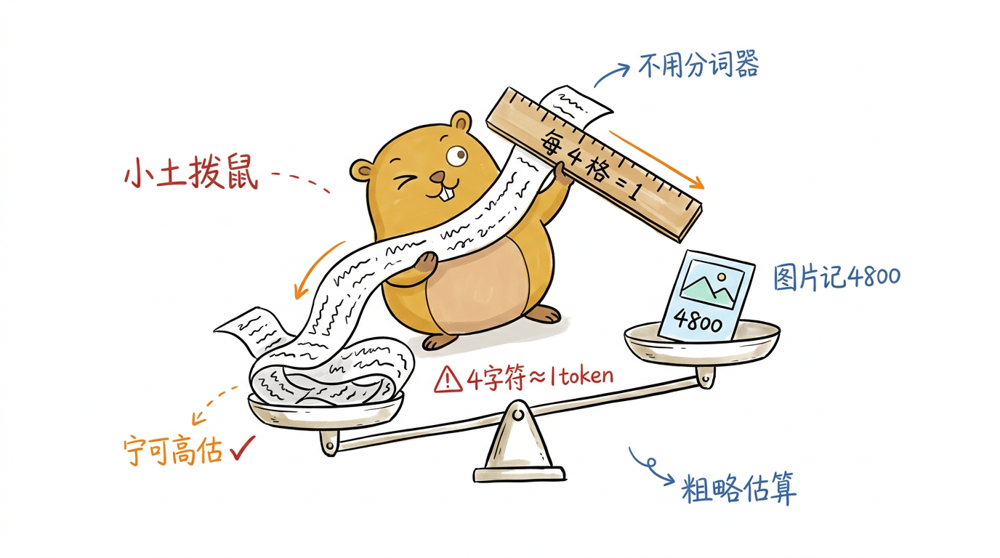
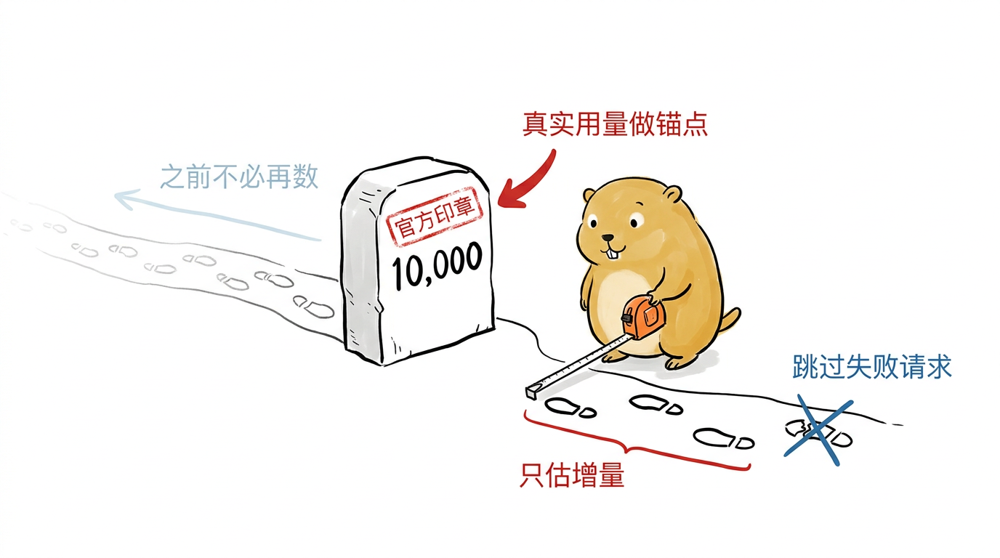
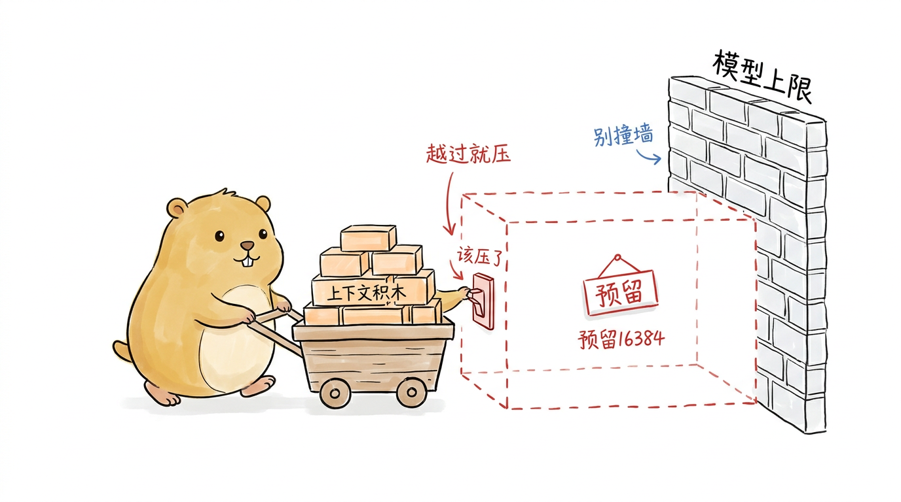
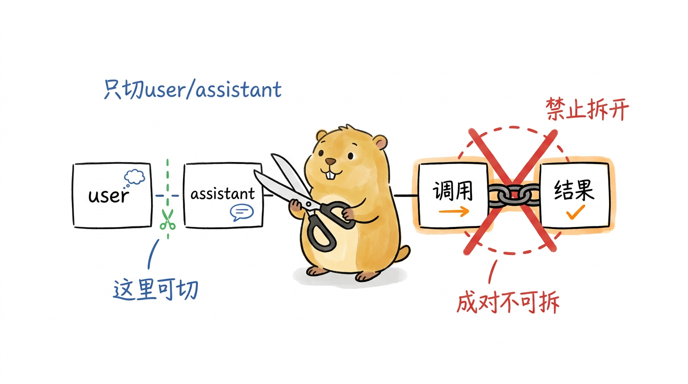
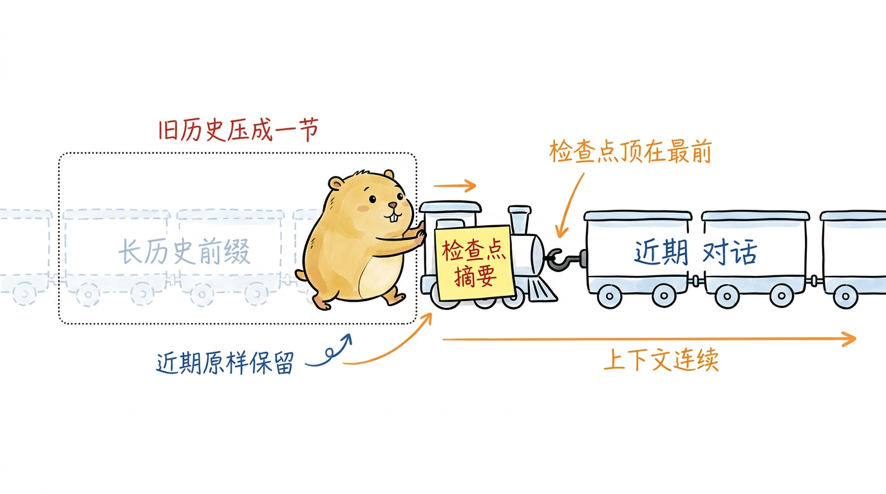
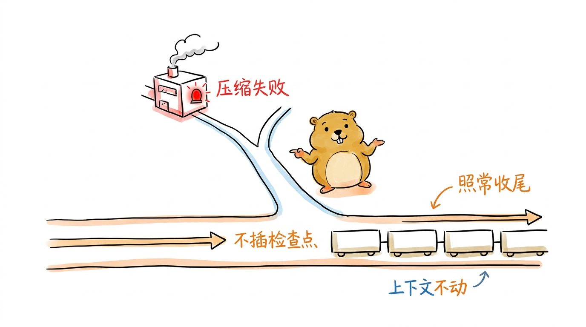

# 上下文压缩：在 token 上限前腾出窗口

> **主线坐标｜第 ⑩ 站的一个逐轮钩子**：《主线导读》里，每轮对话收尾进入 `afterTurn` 时挂着 `maybeAutoCompact`——本章拆的就是这个钩子。它不在请求主干上，却在上下文顶到 token 上限时被唤醒，选切点、做摘要、`RebuildContext`，为主线腾出继续跑下去的窗口。

第5章结尾留了个尾巴：工具让 Agent 长出了手脚，可一轮轮读文件、跑命令、抓网页，消息只增不减，上下文迟早会撞上模型的 token 上限。撞上之后会怎样？轻则请求被 Provider 拒绝（`length` 停止原因），重则更早的关键信息被挤出窗口，模型"忘了"最初要干什么。第 1 章的架构图里，"会话与压缩"被画成两条支撑边——它们不在请求的关键路径上，却决定了 Agent 能不能"记得住、跑得久"。这一章就来拆其中的压缩边。

pigo 把这件事收进了 `internal/compaction` 包，四个文件各管一段：`tokens.go` 算账（估 token、判断是否该压），`cutpoint.go` 选切点（在哪一条消息上下刀），`summary.go` 做摘要（把待压缩的历史交给模型总结成一段结构化文本），`compact.go` 把前三者拧成一次完整压缩。最后由 `internal/runtime/loop.go` 把整套机制挂进 Agent 循环，在每一轮对话收尾时顺手检查、按需触发。这套实现对齐 pi 的 `harness/compaction`，只是把 pi 基于 entry id 的做法改写成了 pigo 扁平消息列表上的索引操作。我们就按 算账 → 选切点 → 做摘要 → 组装 → 嵌入循环 的顺序解剖它。

## 算账：把上下文换算成 token 预算

压缩的第一个问题是"什么时候该压"。要回答它，先得知道当前上下文占了多少 token。pigo 不依赖精确的分词器，而是用一个字符启发式估算——这既避开了为每个模型配一套 tokenizer 的麻烦，又足够保守。

核心常量只有两个（`tokens.go`）：

```go
// estimatedImageChars is the fixed character budget attributed to an image
// block, matching pi's ESTIMATED_IMAGE_CHARS.
const estimatedImageChars = 4800

// charsPerToken is the conservative characters-per-token divisor pi uses.
const charsPerToken = 4
```

"四个字符约等于一个 token"是英文文本的经验值，对中文偏保守（中文往往一两个字就是一个 token），但压缩场景里宁可高估也不能低估——高估只是压得早一点，低估却可能真的撞墙。图片没有字符，就按固定的 4800 字符折算，对应 pi 的 `ESTIMATED_IMAGE_CHARS`。

<!--
生图prompt：
Generate one standalone 16:9 horizontal Chinese article illustration.

Visual DNA:
Pure white background. Minimalist editorial doodle with black hand-drawn pen line art and light colored pen wash, researcher-sketchbook / whiteboard feeling. Slightly wobbly pen lines. Lots of empty white space. Sparse red/orange/blue handwritten Chinese annotations. Clean curious product-sketch feeling. No gradients, no shadows, no paper texture, no complex background, no commercial vector style, no PPT infographic look, no anime style, no children's picture book, no commercial mascot, no realistic UI.

Recurring IP character required:
小土拨鼠 (Little Gopher), an original IP: a round, chubby, warm brown-yellow gopher inspired by the Go language Gopher, but cuter, cleaner and more soothing. Round head with a pair of small round ears; two small round curious eyes; a tiny nose and two small signature front teeth; short little limbs and soft paws; warm brown-yellow fur with a lighter belly; plump rounded proportions, earnest yet gently funny. 小土拨鼠 must perform the core conceptual action, not decorate the scene. Keep it a clean round soothing cartoon gopher, not a realistic rat/hamster, not the stiff original Go Gopher, not anime, not a mascot.

Theme: 用"4 字符≈1 token"的粗略启发式给上下文称重
Structure type: 概念隐喻
Core idea: 不用精确分词器，而是用一把粗刻度的尺子把文本和图片估算成 token，宁可高估也不低估
Composition: 小土拨鼠站在中央，手里举着一把刻着"每 4 格 = 1"的木尺，正把一段流动的文字丝带塞进旁边的一个天平托盘；另一只托盘上放着一张小图片卡片，卡片上写着固定的"4800"；天平明显偏向高估的一侧，小土拨鼠满意地眯眼
Suggested elements: 粗刻度木尺 / 文字丝带 / 天平两端的托盘 / 写着4800的图片卡片
Chinese handwritten labels: 4字符≈1token / 宁可高估 / 图片记4800 / 不用分词器
Color use: Black for main line art and 小土拨鼠's eyes/nose/teeth/paw outlines. 小土拨鼠 body warm brown-yellow with lighter belly. Orange for main flow/arrows. Red only for key warnings/results. Blue only for secondary notes/system state.
Constraints: One image explains only one core structure. Main subject 40%-60% of canvas. At least 35% blank white space. At most 5-8 short handwritten Chinese labels. No title in top-left corner. Do not write the structure type on the image. Not a formal diagram/slide. Invent a fresh visual metaphor for this specific content.
-->
{#fig:6-1 width=100%}

单条消息的估算是 `EstimateTokens`。它按消息类型把内容的字符数加起来，再 `ceil(chars / 4)`：

```go
func EstimateTokens(msg agentcore.Message) int {
	switch m := msg.(type) {
	case agentcore.UserMessage:
		return ceilDiv(contentListChars(m.Content), charsPerToken)
	case agentcore.AssistantMessage:
		return ceilDiv(contentListChars(m.Content), charsPerToken)
	case agentcore.ToolResultMessage:
		return ceilDiv(contentListChars(m.Content), charsPerToken)
	case agentcore.CompactionMessage:
		// A compaction checkpoint replays as its summary text; estimate from it.
		return ceilDiv(len(m.Summary), charsPerToken)
	default:
		return 0
	}
}
```

其中 `contentListChars` 逐块累加：文本块和 thinking 块按各自文本长度算，工具调用块算"名字 + 序列化后的参数"，图片块记 4800。最后一个分支值得留意——一条 `CompactionMessage`（压缩检查点）本身也要占预算，因为它回放给模型时会展开成一段摘要文本，所以按 `Summary` 的长度估。这保证了"压缩后的检查点"也被纳入下一次压缩的账里，不会凭空消失。

### 优先信任 Provider 报告的用量

字符估算再准也只是估。如果 Provider 在回复里报告了真实的 token 用量（`Usage`），那当然应该用真实值。`EstimateContextTokens` 就做这件事：它从最新消息往回找，找到最近一条带有效 `Usage` 的 assistant 消息，用它报告的用量作为基数，只对它之后的消息做字符估算。

```go
func EstimateContextTokens(msgs []agentcore.Message) ContextUsageEstimate {
	lastIdx := -1
	var lastUsage agentcore.Usage
	for i := len(msgs) - 1; i >= 0; i-- {
		if u, ok := assistantUsage(msgs[i]); ok {
			lastIdx = i
			lastUsage = u
			break
		}
	}

	if lastIdx < 0 {
		estimated := 0
		for _, m := range msgs {
			estimated += EstimateTokens(m)
		}
		return ContextUsageEstimate{Tokens: estimated, TrailingTokens: estimated, LastUsageIndex: -1}
	}

	usageTokens := calculateContextTokens(lastUsage)
	trailing := 0
	for i := lastIdx + 1; i < len(msgs); i++ {
		trailing += EstimateTokens(msgs[i])
	}
	return ContextUsageEstimate{
		Tokens:         usageTokens + trailing,
		UsageTokens:    usageTokens,
		TrailingTokens: trailing,
		LastUsageIndex: lastIdx,
	}
}
```

思路是"锚点 + 增量"：最近一次 Provider 回复报告的用量，已经精确涵盖了那条消息及其之前的全部上下文，所以拿它当锚点，只需再估算锚点之后新增的几条消息（`trailing`）。这比对整段历史逐条字符估算要准得多，也更省事。`assistantUsage` 会跳过 aborted/error 的回复和零用量，避免把一次失败请求的残缺用量当成锚点。只有当整段历史里一条可用的 `Usage` 都没有时，才退回到"逐条全估"。

<!--
生图prompt：
Generate one standalone 16:9 horizontal Chinese article illustration.

Visual DNA:
Pure white background. Minimalist editorial doodle with black hand-drawn pen line art and light colored pen wash, researcher-sketchbook / whiteboard feeling. Slightly wobbly pen lines. Lots of empty white space. Sparse red/orange/blue handwritten Chinese annotations. Clean curious product-sketch feeling. No gradients, no shadows, no paper texture, no complex background, no commercial vector style, no PPT infographic look, no anime style, no children's picture book, no commercial mascot, no realistic UI.

Recurring IP character required:
小土拨鼠 (Little Gopher), an original IP: a round, chubby, warm brown-yellow gopher inspired by the Go language Gopher, but cuter, cleaner and more soothing. Round head with a pair of small round ears; two small round curious eyes; a tiny nose and two small signature front teeth; short little limbs and soft paws; warm brown-yellow fur with a lighter belly; plump rounded proportions, earnest yet gently funny. 小土拨鼠 must perform the core conceptual action, not decorate the scene. Keep it a clean round soothing cartoon gopher, not a realistic rat/hamster, not the stiff original Go Gopher, not anime, not a mascot.

Theme: 以 Provider 报告的真实用量为锚点，只估算锚点之后的增量
Structure type: 系统局部
Core idea: 不必从头逐条数，找到最近一个盖着"官方印章"的里程碑当基数，只测量它之后新走的几步
Composition: 一条从左到右延伸的消息小路，路上有一串脚印；路中偏右立着一块盖了红色官方印章的里程碑石，写着一个大数字；小土拨鼠站在里程碑旁，背对着已经量过的左侧长路（左侧路上飘着"不必再数"的淡字），只用一把小卷尺量向右侧里程碑之后的三两个新脚印
Suggested elements: 消息脚印小路 / 盖红印章的里程碑石 / 小卷尺 / 里程碑之后的新脚印
Chinese handwritten labels: 真实用量做锚点 / 只估增量 / 之前不必再数 / 跳过失败请求
Color use: Black for main line art and 小土拨鼠's eyes/nose/teeth/paw outlines. 小土拨鼠 body warm brown-yellow with lighter belly. Orange for main flow/arrows. Red only for key warnings/results. Blue only for secondary notes/system state.
Constraints: One image explains only one core structure. Main subject 40%-60% of canvas. At least 35% blank white space. At most 5-8 short handwritten Chinese labels. No title in top-left corner. Do not write the structure type on the image. Not a formal diagram/slide. Invent a fresh visual metaphor for this specific content.
-->
{#fig:6-2 width=100%}

### 判定：越过可用窗口就该压

有了当前 token 数，判定就一行逻辑（`ShouldCompact`）：

```go
func ShouldCompact(contextTokens, contextWindow int, settings CompactionSettings) bool {
	if !settings.Enabled {
		return false
	}
	if contextWindow <= 0 {
		return false
	}
	return contextTokens > contextWindow-settings.ReserveTokens
}
```

关键是那个减法：真正能用的窗口不是模型标称的 `contextWindow`，而是 `contextWindow - ReserveTokens`。`ReserveTokens`（默认 16384）是给"压缩这件事本身"预留的余量——生成摘要时要把待压缩的历史连同摘要指令一起发给模型，这本身就要消耗 token；再加上下一轮回复的输出空间。默认配置：

```go
var DefaultCompactionSettings = CompactionSettings{
	Enabled:          true,
	ReserveTokens:    16384,
	KeepRecentTokens: 20000,
}
```

还有两条短路值得记住：`Enabled` 为 false 时永不压缩；`contextWindow <= 0`（模型窗口未知）时也永不压缩——宁可不压，也不拿一个瞎猜的窗口去误伤上下文。这条"窗口未知即禁用"的约定在循环那头还会再出现一次。

<!--
生图prompt：
Generate one standalone 16:9 horizontal Chinese article illustration.

Visual DNA:
Pure white background. Minimalist editorial doodle with black hand-drawn pen line art and light colored pen wash, researcher-sketchbook / whiteboard feeling. Slightly wobbly pen lines. Lots of empty white space. Sparse red/orange/blue handwritten Chinese annotations. Clean curious product-sketch feeling. No gradients, no shadows, no paper texture, no complex background, no commercial vector style, no PPT infographic look, no anime style, no children's picture book, no commercial mascot, no realistic UI.

Recurring IP character required:
小土拨鼠 (Little Gopher), an original IP: a round, chubby, warm brown-yellow gopher inspired by the Go language Gopher, but cuter, cleaner and more soothing. Round head with a pair of small round ears; two small round curious eyes; a tiny nose and two small signature front teeth; short little limbs and soft paws; warm brown-yellow fur with a lighter belly; plump rounded proportions, earnest yet gently funny. 小土拨鼠 must perform the core conceptual action, not decorate the scene. Keep it a clean round soothing cartoon gopher, not a realistic rat/hamster, not the stiff original Go Gopher, not anime, not a mascot.

Theme: 真正可用的窗口要在模型上限前预留一段余量
Structure type: 前后对比
Core idea: 触发线不是模型标称窗口本身，而是窗口减去为"压缩这件事"预留的空间，越过预留线就该压
Composition: 画面右侧是一堵写着"模型上限"的砖墙；墙前用红色虚线圈出一段明显空着的缓冲带，上面挂着"预留"的牌子；小土拨鼠推着一车上下文积木从左往右堆放，积木刚顶到红色缓冲带的边缘，它伸出小爪按下一个写着"该压了"的开关；缓冲带保持空白不被积木占用
Suggested elements: 模型上限砖墙 / 红色预留缓冲带 / 上下文积木小推车 / 该压了的开关
Chinese handwritten labels: 模型上限 / 预留16384 / 越过就压 / 别撞墙
Color use: Black for main line art and 小土拨鼠's eyes/nose/teeth/paw outlines. 小土拨鼠 body warm brown-yellow with lighter belly. Orange for main flow/arrows. Red only for key warnings/results. Blue only for secondary notes/system state.
Constraints: One image explains only one core structure. Main subject 40%-60% of canvas. At least 35% blank white space. At most 5-8 short handwritten Chinese labels. No title in top-left corner. Do not write the structure type on the image. Not a formal diagram/slide. Invent a fresh visual metaphor for this specific content.
-->
{#fig:6-3 width=100%}

## 选切点：在哪一条消息上下刀

判定该压之后，第二个问题是"从哪里切"。压缩的本质是把一段较早的历史换成一句摘要，那就得先划一条线：线之前的被摘要吞掉，线之后的原样保留。这条线就是切点（cut point），由 `cutpoint.go` 负责选。

选切点有一条硬规则：**绝不能把一个 toolCall 和它的 toolResult 拆开**。模型发起的工具调用与其结果必须成对出现在上下文里，否则 Provider 会因为"有结果却找不到对应调用"而报错。所以切点只能落在 user 或 assistant 消息上，绝不能落在 toolResult 上：

```go
func isValidCutPoint(msg agentcore.Message) bool {
	switch msg.Role() {
	case agentcore.RoleUser, agentcore.RoleAssistant:
		return true
	default: // toolResult and any custom kinds are not cuttable.
		return false
	}
}
```

<!--
生图prompt：
Generate one standalone 16:9 horizontal Chinese article illustration.

Visual DNA:
Pure white background. Minimalist editorial doodle with black hand-drawn pen line art and light colored pen wash, researcher-sketchbook / whiteboard feeling. Slightly wobbly pen lines. Lots of empty white space. Sparse red/orange/blue handwritten Chinese annotations. Clean curious product-sketch feeling. No gradients, no shadows, no paper texture, no complex background, no commercial vector style, no PPT infographic look, no anime style, no children's picture book, no commercial mascot, no realistic UI.

Recurring IP character required:
小土拨鼠 (Little Gopher), an original IP: a round, chubby, warm brown-yellow gopher inspired by the Go language Gopher, but cuter, cleaner and more soothing. Round head with a pair of small round ears; two small round curious eyes; a tiny nose and two small signature front teeth; short little limbs and soft paws; warm brown-yellow fur with a lighter belly; plump rounded proportions, earnest yet gently funny. 小土拨鼠 must perform the core conceptual action, not decorate the scene. Keep it a clean round soothing cartoon gopher, not a realistic rat/hamster, not the stiff original Go Gopher, not anime, not a mascot.

Theme: 切点绝不能把 toolCall 和它的 toolResult 拆开
Structure type: 角色状态
Core idea: 只能在 user/assistant 消息之间下刀，成对的工具调用与结果像连体一样必须一起留或一起压
Composition: 一排横向排列的消息卡片串成链条，其中两张卡片被一根短链条紧紧拴成一对（一张写"调用"、一张写"结果"）；小土拨鼠举着一把大剪刀，正准备在两张普通卡片的缝隙间干净地剪一刀（那里画着绿色的合法虚线）；而在拴在一起的那对卡片中间，画着红色大叉，表示不能从这里剪；小土拨鼠眼神认真地避开那对连体卡片
Suggested elements: 消息卡片链 / 拴在一起的调用+结果卡片对 / 大剪刀 / 合法切口虚线与红色禁剪叉
Chinese handwritten labels: 只切user/assistant / 成对不可拆 / 这里可切 / 禁止拆开
Color use: Black for main line art and 小土拨鼠's eyes/nose/teeth/paw outlines. 小土拨鼠 body warm brown-yellow with lighter belly. Orange for main flow/arrows. Red only for key warnings/results. Blue only for secondary notes/system state.
Constraints: One image explains only one core structure. Main subject 40%-60% of canvas. At least 35% blank white space. At most 5-8 short handwritten Chinese labels. No title in top-left corner. Do not write the structure type on the image. Not a formal diagram/slide. Invent a fresh visual metaphor for this specific content.
-->
{#fig:6-4 width=100%}

有了合法切点的判据，`FindCutPoint` 的策略是"尽量多留近期、但对齐到合法边界"。它从最新的消息往回累加 token，一旦累积量够了 `keepRecentTokens`（默认 20000），就把切点吸附到那个位置**或其之后**最近的一个合法切点上：

```go
func FindCutPoint(msgs []agentcore.Message, keepRecentTokens int) CutPointResult {
	cutPoints := findValidCutPoints(msgs)
	if len(cutPoints) == 0 {
		return CutPointResult{FirstKeptIndex: 0, TurnStartIndex: -1, IsSplitTurn: false}
	}

	// Default to the earliest valid cut point when the budget is never reached.
	cutIndex := cutPoints[0]

	accumulated := 0
	for i := len(msgs) - 1; i >= 0; i-- {
		accumulated += EstimateTokens(msgs[i])
		if accumulated >= keepRecentTokens {
			// Snap to the nearest valid cut point at or after i.
			for _, c := range cutPoints {
				if c >= i {
					cutIndex = c
					break
				}
			}
			break
		}
	}
	// ... 计算 turnStart 与 IsSplitTurn ...
}
```

这里有两个边界要留意。一是"预算从没被填满"——如果整段历史加起来都不到 `keepRecentTokens`，循环走完也没触发吸附，`cutIndex` 就停在初始值 `cutPoints[0]`（最早的合法切点），意味着"能留则尽量留"。二是"一条合法切点都没有"——比如整段历史全是 toolResult（极端情况），那就返回 `FirstKeptIndex: 0`，等于什么都不切、全部保留。宁可不压，也不做出会破坏上下文结构的切割，这和 `ShouldCompact` 那两条短路是同一套保守思路。

`CutPointResult` 还带了 `TurnStartIndex` 与 `IsSplitTurn` 两个字段。当切点落在 assistant 消息上（而非干净的 user 回合边界）时，`findTurnStartIndex` 会往回找到这一回合起始的那条 user 消息，并标记 `IsSplitTurn = true`，表示这次切割把一个进行中的回合从中间劈开了。这两个字段是给上层做更细的展示或诊断用的，切割本身仍以 `FirstKeptIndex` 为准。

## 做摘要：让模型总结被压缩的历史

切点定了，`[起点, FirstKeptIndex)` 这段历史就要被摘要吞掉。摘要不是简单截断，而是把这段对话交给模型，让它产出一份结构化的"检查点摘要"——`summary.go` 负责这件事。

### 结构化的提示词

摘要质量的关键在提示词。pigo 直接搬用了 pi 的模板，系统提示先把模型的角色钉死："你是一个上下文摘要助手，只输出结构化摘要，不要续写对话、不要回答对话里的任何问题。"这道约束很重要——否则模型看到一段对话，很容易顺着往下接，而不是跳出来做总结。

首次摘要的模板 `summarizationPrompt` 规定了一个固定的六段式格式：`## Goal`（用户想达成什么）、`## Constraints & Preferences`（约束与偏好）、`## Progress`（Done / In Progress / Blocked 三态进度）、`## Key Decisions`（关键决策及理由）、`## Next Steps`（有序的下一步）、`## Critical Context`（继续工作所需的数据/引用）。模板末尾特意叮嘱：保留确切的文件路径、函数名和错误信息。这套结构的用意是让"另一个 LLM 能照着它继续工作"——摘要不是给人读的备忘，而是给模型接力的交接单。

pigo 还准备了第二套模板 `updateSummarizationPrompt`，用于迭代式压缩：当已经存在一份旧摘要时，不从头再总结，而是把新消息增量并进旧摘要——把 In Progress 的项挪到 Done、更新 Next Steps、但**保留**旧摘要里的既有信息。`GenerateSummary` 根据 `previousSummary` 是否为空自动在两套模板间切换。

### 把对话序列化成文本

要喂给摘要模型的不是原始消息对象，而是一段纯文本转录。`serializeConversation` 把消息列表摊平成 `[User]:` / `[Assistant]:` / `[Assistant thinking]:` / `[Assistant tool calls]:` / `[Tool result]:` 这样带角色前缀的段落。其中工具结果有一道长度闸门：

```go
// toolResultMaxChars caps a tool result's serialized text in the summarization
// prompt, matching pi's TOOL_RESULT_MAX_CHARS.
const toolResultMaxChars = 2000

func truncateForSummary(text string, maxChars int) string {
	if len(text) <= maxChars {
		return text
	}
	return fmt.Sprintf("%s\n\n[... %d more characters truncated]", text[:maxChars], len(text)-maxChars)
}
```

工具结果往往很长（想想一个 `read` 读进来的整份文件），全塞进摘要提示词既浪费又可能反过来撑爆窗口，所以每条工具结果最多取前 2000 字符，超出的部分用一句"还有 N 字符被截断"带过。工具调用则由 `formatToolCall` 渲染成 `name(key=value, ...)` 的形式，并且对参数的键做了排序——因为 Go 的 map 遍历顺序是随机的，不排序的话同一次调用每次序列化出来的字符串都不一样，既不利于调试，也可能影响 Provider 侧的缓存命中。

### 顺手记下动过哪些文件

摘要之外，压缩还额外抽取一份"文件操作清单"。`extractFileOpsFromMessage` 遍历 assistant 消息的工具调用，按工具名把路径归类：`read` 记入读过的文件、`write` 记入写过的、`edit` 记入改过的。

```go
func extractFileOpsFromMessage(msg agentcore.Message, ops FileOperations) {
	a, ok := msg.(agentcore.AssistantMessage)
	if !ok {
		return
	}
	for _, call := range a.ToolCalls() {
		path := toolCallPath(call.Arguments)
		if path == "" {
			continue
		}
		switch call.Name {
		case "read":
			ops.Read[path] = struct{}{}
		case "write":
			ops.Written[path] = struct{}{}
		case "edit":
			ops.Edited[path] = struct{}{}
		}
	}
}
```

`computeFileLists` 再把它们整理成两份排序过的列表：改过的文件（edit 与 write 的并集）单独一组，读过但没改过的另一组（改过的会从只读组里剔除，避免重复）。最后 `formatFileOperations` 把它们渲染成 `<read-files>` / `<modified-files>` 两个标签块，附在摘要文本末尾。这份清单的价值在下一节的"迭代压缩"里才充分体现：它让长期存活的文件读写记录能跨越一次次压缩传递下去，模型即便忘了对话细节，也仍知道"这个会话动过哪些文件"。

### 驱动一次摘要流

`GenerateSummary` 把上述部件组装成一次 Provider 请求：拼出 `<conversation>...</conversation>` 包裹的转录（迭代模式下再加一段 `<previous-summary>`），配上对应模板，以 `SUMMARIZATION_SYSTEM_PROMPT` 为系统提示发起流式请求。输出长度也被夹住：

```go
// Bound the summary output to min(0.8*reserveTokens, model max output).
maxTokens := (reserveTokens * 8) / 10
if model.MaxOutputTokens > 0 && model.MaxOutputTokens < maxTokens {
	maxTokens = model.MaxOutputTokens
}
```

摘要的输出上限取 `0.8 × ReserveTokens` 与模型最大输出的较小值——留两成余量给提示词本身，也不超过模型的硬上限。发起请求后，`GenerateSummary` 先把事件流排空（`for range s.Events() {}`），再读最终消息。这里有一个呼应第 4 章的细节：Provider 的失败是"骑在流上"的终态消息，而不一定是返回的 error，所以它检查 `final.StopReason` 是不是 `StopReasonAborted` / `StopReasonError`，而不能只看返回的 err。摘要为空也算失败——一次没产出内容的压缩没有意义。

## 组装：一次完整的压缩

`compact.go` 的 `Compact` 把前面三段拧成一次可执行的压缩。它的签名参数不少，但主线很清晰：

```go
func Compact(
	ctx context.Context, stream provider.StreamFn, model provider.Model,
	msgs []agentcore.Message, settings CompactionSettings,
	prevCompactionIndex int, prevDetails *CompactionDetails,
	previousSummary string, cfg provider.StreamConfig,
) (*CompactionResult, error) {
	cut := FindCutPoint(msgs, settings.KeepRecentTokens)

	start := prevCompactionIndex + 1
	if start < 0 {
		start = 0
	}
	if start >= cut.FirstKeptIndex {
		// Nothing new to summarize.
		return nil, nil
	}
	toSummarize := msgs[start:cut.FirstKeptIndex]
	// ... 抽取文件操作、生成摘要、拼接元数据 ...
}
```

`prevCompactionIndex` 是上一次已应用的压缩点索引（没有则为 -1），摘要范围从它之后开始——这样每次压缩只覆盖新累积的那段历史，不重复总结已经压过的部分。这正是迭代压缩的骨架：配合 `prevDetails`（上次压缩的文件清单）作种子、`previousSummary`（上次的摘要）走更新模板，一次次压缩就能滚雪球式地维护一份始终最新的检查点，而不是每次推倒重来。当摘要范围为空（`start >= FirstKeptIndex`，即切点之前没有新内容），`Compact` 返回 `(nil, nil)`，表示"没什么可压的"。

产出是一个 `CompactionResult`：摘要文本（已附上文件元数据）、保留区起点 `FirstKeptIndex`、压缩前的 token 估算、以及抽取出的文件清单。它的两个方法完成"落地"与"重建"。`Message` 把结果打包成一条可持久化的 `CompactionMessage`（检查点）；`RebuildContext` 则给出压缩后的新消息列表：

```go
func (r *CompactionResult) RebuildContext(msgs []agentcore.Message, now int64) agentcore.MessageList {
	out := make(agentcore.MessageList, 0, len(msgs)-r.FirstKeptIndex+1)
	out = append(out, r.Message(now))
	out = append(out, msgs[r.FirstKeptIndex:]...)
	return out
}
```

逻辑很直白：被摘要的前缀整段丢掉，换成单独一条压缩检查点，后面接上保留的近期消息。上下文因此保持连续——检查点顶在最前面代替被压掉的历史，近期对话原封不动跟在后面。

<!--
生图prompt：
Generate one standalone 16:9 horizontal Chinese article illustration.

Visual DNA:
Pure white background. Minimalist editorial doodle with black hand-drawn pen line art and light colored pen wash, researcher-sketchbook / whiteboard feeling. Slightly wobbly pen lines. Lots of empty white space. Sparse red/orange/blue handwritten Chinese annotations. Clean curious product-sketch feeling. No gradients, no shadows, no paper texture, no complex background, no commercial vector style, no PPT infographic look, no anime style, no children's picture book, no commercial mascot, no realistic UI.

Recurring IP character required:
小土拨鼠 (Little Gopher), an original IP: a round, chubby, warm brown-yellow gopher inspired by the Go language Gopher, but cuter, cleaner and more soothing. Round head with a pair of small round ears; two small round curious eyes; a tiny nose and two small signature front teeth; short little limbs and soft paws; warm brown-yellow fur with a lighter belly; plump rounded proportions, earnest yet gently funny. 小土拨鼠 must perform the core conceptual action, not decorate the scene. Keep it a clean round soothing cartoon gopher, not a realistic rat/hamster, not the stiff original Go Gopher, not anime, not a mascot.

Theme: 用一条检查点摘要顶替被压掉的长历史前缀
Structure type: 前后对比
Core idea: 一长串旧车厢被摘成一节短短的检查点车头挂在最前，近期车厢原样跟在后面，列车依然连贯
Composition: 一列横向火车，右侧保留着几节写着"近期对话"的完整车厢；左侧原本一长串旧车厢被虚线框住淡化，小土拨鼠正把这一长串旧车厢折叠压成一节小小的、贴着便签摘要的车头，并把这节车头稳稳挂到近期车厢的最前面；车头与后面车厢用挂钩连成一条连续的列车
Suggested elements: 保留的近期车厢 / 被淡化折叠的旧车厢群 / 贴着摘要便签的短车头 / 连接挂钩
Chinese handwritten labels: 旧历史压成一节 / 检查点顶在最前 / 近期原样保留 / 上下文连续
Color use: Black for main line art and 小土拨鼠's eyes/nose/teeth/paw outlines. 小土拨鼠 body warm brown-yellow with lighter belly. Orange for main flow/arrows. Red only for key warnings/results. Blue only for secondary notes/system state.
Constraints: One image explains only one core structure. Main subject 40%-60% of canvas. At least 35% blank white space. At most 5-8 short handwritten Chinese labels. No title in top-left corner. Do not write the structure type on the image. Not a formal diagram/slide. Invent a fresh visual metaphor for this specific content.
-->
{#fig:6-5 width=100%}

那么这条检查点消息回放给模型时长什么样？答案在 `agentcore.CompactionMessage.AsUserMessage`：它把摘要包进一段固定的 user 文本里。

```go
const compactionSummaryPrefix = "The conversation history before this point was compacted into the following summary:\n\n<summary>\n"

func (m CompactionMessage) AsUserMessage() UserMessage {
	return UserMessage{
		RoleField: RoleUser,
		Content:   ContentList{NewTextContent(compactionSummaryPrefix + m.Summary + compactionSummarySuffix)},
		Timestamp: m.Timestamp,
	}
}
```

Provider 编码器在构造请求时调用它，于是一条持久化的压缩检查点会以"之前的历史被压成了这段摘要"的 user 消息形式回放给模型，而不是被悄悄丢弃。压缩对模型是透明的：它看到的是一段交接摘要 + 最近的原始对话，足以无缝接着干。

## 嵌入循环：在回合收尾时顺手一压

压缩机制本身是被动的，真正按下开关的是 Agent 循环。第 3 章讲过外层循环在每个回合结束后会跑一串收尾钩子，压缩就挂在其中。`afterTurn`（`internal/runtime/loop.go`）在 `PrepareNextTurn` 之后、`ShouldStopAfterTurn` 之前调用 `maybeAutoCompact`：

```go
func maybeAutoCompact(ctx context.Context, agentCtx *agentcore.AgentContext, cfg *RunConfig, emit func(agentcore.AgentEvent) error) {
	if !cfg.Compaction.Enabled || cfg.ContextWindow <= 0 {
		return
	}
	before := compaction.EstimateContextTokens(agentCtx.Messages).Tokens
	if !compaction.ShouldCompact(before, cfg.ContextWindow, cfg.Compaction) {
		return
	}
	res, err := runCompaction(ctx, agentCtx.Messages, cfg)
	kept := len(agentCtx.Messages)
	if err != nil {
		_ = emit(agentcore.CompactionEvent{
			Reason: "threshold", TokensBefore: before, TokensAfter: before,
			KeptCount: kept, ErrorMessage: err.Error(),
		})
		return
	}
	if res == nil {
		return // Nothing to summarize; leave context as-is.
	}
	now := nowMillis()
	rebuilt := res.RebuildContext(agentCtx.Messages, now)
	summarized := len(agentCtx.Messages) - (len(rebuilt) - 1)
	agentCtx.Messages = rebuilt
	after := compaction.EstimateContextTokens(rebuilt).Tokens
	_ = emit(agentcore.CompactionEvent{
		Reason: "threshold", TokensBefore: before, TokensAfter: after,
		SummarizedCount: summarized, KeptCount: len(rebuilt) - 1,
	})
}
```

这段代码把前面所有部件串成了一条完整链路：先 `EstimateContextTokens` 算账，`ShouldCompact` 判定，越线才 `runCompaction` 生成结果，`RebuildContext` 原地替换 `agentCtx.Messages`，最后发一个 `CompactionEvent` 汇报 前/后 token 数与 摘要/保留 的消息条数。整个过程发生在两次模型请求之间，正在进行的对话对它毫无察觉。

这里最值得琢磨的是**失败处理**。压缩要额外调一次模型来生成摘要，这次调用完全可能失败（网络抖动、摘要模型不可用、缺 Key）。pigo 的选择是：压缩失败绝不拖垮整轮对话。失败分支里，它保留原始上下文一字不动，只发一个带 `ErrorMessage` 的 `CompactionEvent`，`TokensAfter` 等于 `TokensBefore`（明示没变化），然后正常返回。`internal/runtime/compaction_test.go` 的 `TestAutoCompactionFailureIsNonFatal` 精确锁定了这个契约：即便摘要流构建失败，本轮 run 仍以 `agent_end` 正常收尾，且不会插入任何检查点。这与第 5 章工具系统"失败即反馈，而非中断"的哲学一脉相承——压缩是锦上添花的优化，不该成为新的失败点。

<!--
生图prompt：
Generate one standalone 16:9 horizontal Chinese article illustration.

Visual DNA:
Pure white background. Minimalist editorial doodle with black hand-drawn pen line art and light colored pen wash, researcher-sketchbook / whiteboard feeling. Slightly wobbly pen lines. Lots of empty white space. Sparse red/orange/blue handwritten Chinese annotations. Clean curious product-sketch feeling. No gradients, no shadows, no paper texture, no complex background, no commercial vector style, no PPT infographic look, no anime style, no children's picture book, no commercial mascot, no realistic UI.

Recurring IP character required:
小土拨鼠 (Little Gopher), an original IP: a round, chubby, warm brown-yellow gopher inspired by the Go language Gopher, but cuter, cleaner and more soothing. Round head with a pair of small round ears; two small round curious eyes; a tiny nose and two small signature front teeth; short little limbs and soft paws; warm brown-yellow fur with a lighter belly; plump rounded proportions, earnest yet gently funny. 小土拨鼠 must perform the core conceptual action, not decorate the scene. Keep it a clean round soothing cartoon gopher, not a realistic rat/hamster, not the stiff original Go Gopher, not anime, not a mascot.

Theme: 压缩失败也绝不拖垮整轮对话
Structure type: 概念隐喻
Core idea: 压缩是主路旁的一条可选支线，支线塌了主路照样通行，原始上下文一字不动
Composition: 画面横向一条宽阔的主路，上面几节对话车厢平稳向右行驶，主路完好无损；主路上方岔出一条细细的支线通往一台写着"压缩"的小机器，机器冒着一缕小烟、亮着红色故障灯，显然出故障了；小土拨鼠站在岔路口，一只手指着仍在正常通行的主路（旁边写"照常收尾"），对支线上的小故障只是轻松耸肩，没有惊慌；主路上没有出现任何新的检查点车厢
Suggested elements: 完好的主路对话车厢 / 岔出的压缩支线小机器 / 红色故障灯与小烟 / 耸肩的小土拨鼠
Chinese handwritten labels: 压缩失败 / 上下文不动 / 照常收尾 / 不插检查点
Color use: Black for main line art and 小土拨鼠's eyes/nose/teeth/paw outlines. 小土拨鼠 body warm brown-yellow with lighter belly. Orange for main flow/arrows. Red only for key warnings/results. Blue only for secondary notes/system state.
Constraints: One image explains only one core structure. Main subject 40%-60% of canvas. At least 35% blank white space. At most 5-8 short handwritten Chinese labels. No title in top-left corner. Do not write the structure type on the image. Not a formal diagram/slide. Invent a fresh visual metaphor for this specific content.
-->
{#fig:6-6 width=100%}

`runCompaction` 是循环与压缩包之间的适配层。它优先用专门的 `SummaryStream` / `SummaryModel`，未配置时回落到主对话的 `Stream` / `Model`，并且像正常回合一样解析 API Key（动态 Key 优先，静态 Key 兜底），确保摘要请求能对需要鉴权的 Provider 正常认证：

```go
func runCompaction(ctx context.Context, msgs agentcore.MessageList, cfg *RunConfig) (*compaction.CompactionResult, error) {
	stream := cfg.SummaryStream
	if stream == nil {
		stream = cfg.Stream
	}
	// ... 解析 model 与 API key ...
	return compaction.Compact(ctx, stream, model, msgs, cfg.Compaction, -1, nil, "", scfg)
}
```

注意它传的 `prevCompactionIndex` 是 -1、`prevDetails` 与 `previousSummary` 都为空——当前循环里的自动压缩每次都走首次摘要模板，把当前消息列表里从头到切点的那段（若上一轮压过，这段的开头就是那条检查点消息）当作待总结的范围。迭代式压缩所需的那几个参数在包层已经备好，为将来更精细的滚动压缩留了接口。

除了自动触发，用户也能手动压缩。交互式 REPL 里的 `/compact` 命令（`cmd/pigo/repl.go` 的 `runManualCompact`）直接调 `compaction.Compact`，用当前 Provider/模型生成摘要，替换共享上下文，并把"压缩前后的 token 数、总结了多少条、保留了多少条"打印出来。它和自动压缩走的是同一套 `Compact` + `RebuildContext`，只是触发时机由人决定、结果打到终端而非事件流。

## 实验 6-1 ★：亲眼看着上下文被压回窗口内 {.unnumbered}

**目标**：观察自动压缩的完整触发链——喂给循环一段超长历史，看它在回合收尾时越过阈值、生成检查点、把 token 数压回窗口内，并发出一个 `CompactionEvent`。

**前置**：在仓库根目录能 `go test ./internal/runtime/`。本实验只用仓库自带的测试桩（scripted stream + summary stream），不需要任何真实 API Key。

**步骤 1**：先跑压缩相关的测试，确认从阈值触发到失败兜底的行为都符合预期。

```bash
go test ./internal/runtime/ -run 'AutoCompaction|CompactionEventEnvelope' -v 2>&1 | tail -n 20
```

你会看到四个用例逐个通过：阈值触发压缩、窗口未知时禁用、事件信封字段正确、压缩失败非致命。

**步骤 2**：重点读 `internal/runtime/compaction_test.go` 里的 `TestAutoCompactionFiresOnThreshold`。它把窗口设成很小的 2000、预留 500、保留 100，再塞进 12 条各 800 字符的 user 消息——这样 `EstimateContextTokens` 轻松越过 `2000 - 500` 的可用窗口。跑完循环后它断言：

```go
if ce.TokensAfter >= ce.TokensBefore {
	t.Errorf("compaction should reduce tokens: before=%d after=%d", ce.TokensBefore, ce.TokensAfter)
}
// The context must now begin with a compaction checkpoint.
if len(agentCtx.Messages) == 0 || agentCtx.Messages[0].Role() != agentcore.RoleCompaction {
	t.Errorf("context should start with a compaction checkpoint, got %+v", agentCtx.Messages)
}
```

两条断言正好对应本章两个核心结论：压缩后 token 数确实下降，且上下文的第一条消息变成了压缩检查点（`RoleCompaction`）——这正是 `RebuildContext` 把"检查点顶在最前、近期消息跟在后面"落到实处的证据。

**观察点**：把 `TestAutoCompactionDisabledWhenWindowUnknown`（`ContextWindow = 0`）和上面对照着读，你会看到 `ShouldCompact` 那条"窗口未知即禁用"短路的实际后果——同样一段超长历史，窗口未知时压缩根本不触发，上下文只多出一条 assistant 回复。这印证了本章开头 `tokens.go` 与循环里两处 `contextWindow <= 0` 判断的一致约定：宁可不压，也不拿一个未知的窗口去误伤上下文。

## 本章小结

本章把 pigo 的上下文压缩从算账到落地拆了一遍：

- **token 计数**（`tokens.go`）：用"4 字符 ≈ 1 token、图片记 4800 字符"的保守启发式估算；`EstimateContextTokens` 优先以最近一次 Provider 报告的 `Usage` 为锚点、只估其后的增量；`ShouldCompact` 判定 `contextTokens > contextWindow - ReserveTokens`，且在禁用或窗口未知（`<= 0`）时永不触发。
- **切点选择**（`cutpoint.go`）：切点只能落在 user/assistant 消息上，绝不拆开 toolCall 与 toolResult；`FindCutPoint` 从最新消息往回累加，够 `KeepRecentTokens` 后吸附到最近的合法切点，够不到则尽量多留，无合法切点则全保留。
- **摘要生成**（`summary.go`）：借用 pi 的六段式结构化模板（Goal/Progress/Next Steps 等），首次与迭代两套；`serializeConversation` 把历史摊平成带角色前缀的转录并对工具结果截断到 2000 字符；顺带抽取 `<read-files>`/`<modified-files>` 文件清单；`GenerateSummary` 驱动一次摘要流并按 `StopReason` 判定成败。
- **组装**（`compact.go`）：`Compact` 定切点、划摘要范围（支持从上一压缩点之后增量）、生成摘要、拼文件元数据，产出 `CompactionResult`；`RebuildContext` 用"检查点 + 保留尾部"重建上下文；检查点经 `AsUserMessage` 以摘要 user 消息形式回放给模型。
- **嵌入循环**（`loop.go`）：`maybeAutoCompact` 在每回合收尾时算账、判定、按需原地压缩并发 `CompactionEvent`；压缩失败非致命（保留原上下文、只报错、run 照常收尾）；REPL 的 `/compact` 提供手动入口，共用同一套 `Compact`。

压缩让 Agent 能在有限的窗口里跑得更久，但它压掉的历史去了哪里、又怎么被完整保存下来供 `--resume` 复用？这就要看第 7 章的会话持久化——压缩检查点是一条特殊消息，全靠会话存储才能落盘、才能回放。

## 思考题

1. `EstimateTokens` 对 `CompactionMessage` 按其 `Summary` 长度估算 token。如果改成"压缩检查点不计入 token 预算"，在一个反复触发压缩的长会话里会发生什么？（提示：想想 `ShouldCompact` 的判定基数会如何漂移。）
2. `FindCutPoint` 规定切点绝不落在 toolResult 上。假如允许在 toolResult 上切、把它连同前面的 toolCall 一起留在保留区，会引入什么新的复杂度？如果连 toolCall 也一起压掉呢？
3. `ShouldCompact` 与 `maybeAutoCompact` 两处都判断 `contextWindow <= 0` 即不压缩。为什么"窗口未知"要选择"不压"而不是"用一个默认窗口猜着压"？对照 `TestAutoCompactionDisabledWhenWindowUnknown` 说说这个取舍的代价与收益。
4. 摘要用的是"结构化六段式模板 + 只输出摘要不续写"的系统提示。如果去掉那句"不要续写对话"，摘要模型最可能产出什么？这会怎样污染 `RebuildContext` 后的上下文？
5. `Compact` 预留了 `prevCompactionIndex` / `prevDetails` / `previousSummary` 三个迭代压缩参数，但循环里的 `runCompaction` 每次都传 -1 / nil / ""。对照 `updateSummarizationPrompt` 的"保留旧摘要、增量并入新消息"，设想一套真正的滚动压缩该如何维护这三个值，它相比每次全量重压能省下什么？
