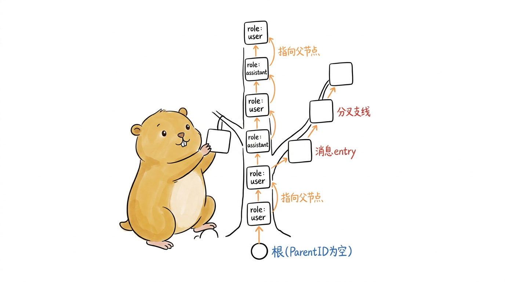
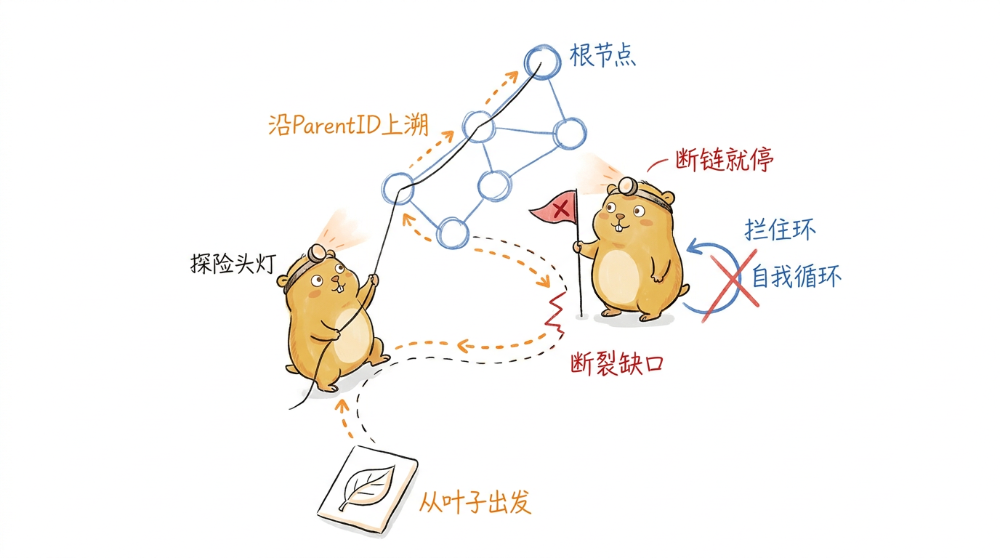
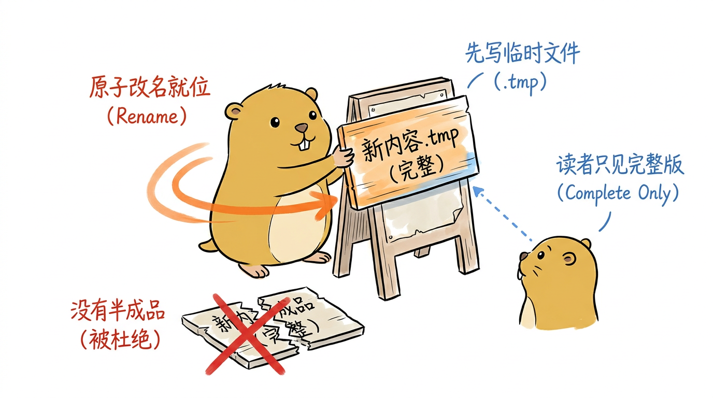
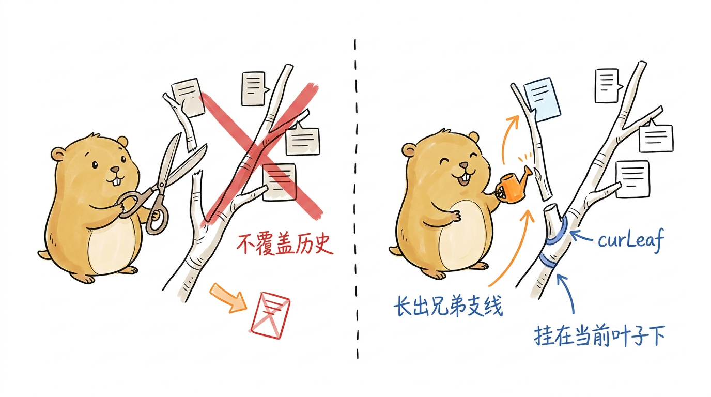
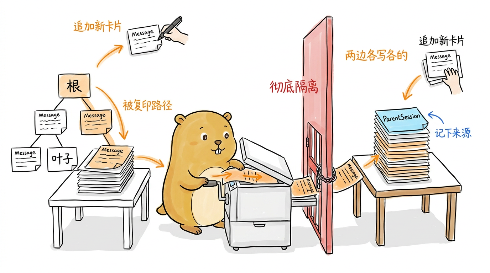
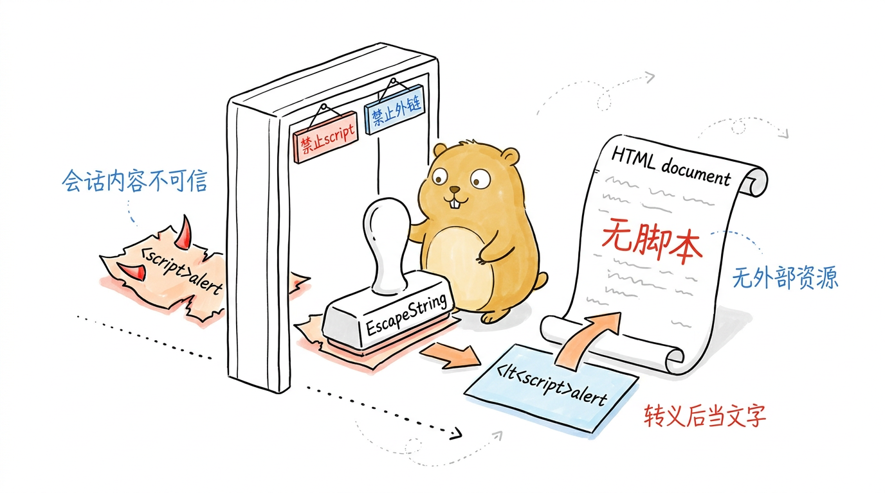

# 会话持久化：让一次对话被记住、被复现

> **主线坐标｜第 ⑫ 站**：《主线导读》的终点——`finish()` 收尾时，本轮消息被会话存储作为分支追加进 JSONL 文件。它是主线落幕后的"记忆"，让明天的 `--resume` 还能接上今天这条河。

第1章鸟瞰架构时，我们在两条主线之外画了两条"支撑边"：上下文压缩和会话存储。第 6 章拆完了压缩，这一章轮到会话。它不在请求的关键路径上——一次对话就算完全不落盘也能跑完——但少了它，Agent 就成了一个失忆的工具：关掉终端，这轮读了哪些文件、改了哪些代码、聊到哪一步，全部烟消云散。`--resume`/`--continue` 之所以能续上昨天的活儿，`/export` 之所以能把一次排障过程存成一份可分享的 HTML，靠的都是 `internal/session` 这个包。

pigo 把会话持久化收敛成一件事：**一个会话就是磁盘上的一个 JSONL 文件**。第一行是元数据头，后面每一行是一条消息。听上去朴素，但这个文件要同时满足几个并不轻松的诉求——它要能被增量追加而不必每次重写、要能在多个进程并发读时永远看到完整内容、要能表达"从某条历史消息分叉出一条新支线"的树形结构、还要能向前兼容早期版本写下的旧文件。于是"把对话存下来"这件听起来一行 `os.WriteFile` 就能了事的小事，被拆成了三块硬骨头：一棵能分叉的消息树、一组并发安全的读写原语（存、取、追加、分叉），以及一份能脱离 pigo 独立打开的 HTML 回放。本章就按这个顺序啃。

## 会话是一棵树：数据模型

先看文件的形状。一个会话文件的第一行是 `SessionHeader`，把"列出、恢复一个会话"需要的元数据都放在这里，这样列会话时不必去读它的消息体（`internal/session/session.go`）：

```go
type SessionHeader struct {
	Version       int       `json:"version"`
	ID            string    `json:"id"`
	CreatedAt     time.Time `json:"createdAt"`
	UpdatedAt     time.Time `json:"updatedAt"`
	Model         string    `json:"model,omitempty"`
	Provider      string    `json:"provider,omitempty"`
	SystemPrompt  string    `json:"systemPrompt,omitempty"`
	ParentSession string    `json:"parentSession,omitempty"`
}
```

`Version` 排在最前面，是整个格式演进的钥匙。`SchemaVersion` 常量当前是 3，读文件时若发现头里的版本号比它还大，直接报硬错误——**宁可拒绝，也不让一个新版二进制写出的文件被旧版悄悄误读**。`Model`/`Provider`/`SystemPrompt` 记录这次会话是在什么模型、什么系统提示下跑的，恢复时据此还原运行配置；`ParentSession` 则记录血缘：一个由 fork/clone 派生出来的会话，会在这里写下它源自哪个会话。

header 之后的每一行是一个 `Entry`。这是 schema v3 引入的关键包装——它给每条消息套上了一层树形元数据：

```go
type Entry struct {
	ID        string
	ParentID  string
	Timestamp time.Time
	Message   agentcore.Message
}
```

`ID` 是这条 entry 的稳定标识，`ParentID` 指向它的上一条 entry。这两个字段把一串消息织成了一棵树。注释里点破了它最简单的样子：所谓线性会话，不过是"每条 entry 的 ParentID 都指向前一条"的一棵树，第一条 entry 的 ParentID 为空，就是树根。为什么要费这个劲上一棵树？因为有了 ParentID 链，一个会话才能从中途某条消息分叉出真正的支线（fork/clone），而不是只能一条道往后追加。

<!--
生图prompt：
Generate one standalone 16:9 horizontal Chinese article illustration.

Visual DNA:
Pure white background. Minimalist editorial doodle with black hand-drawn pen line art and light colored pen wash, researcher-sketchbook / whiteboard feeling. Slightly wobbly pen lines. Lots of empty white space. Sparse red/orange/blue handwritten Chinese annotations. Clean curious product-sketch feeling. No gradients, no shadows, no paper texture, no complex background, no commercial vector style, no PPT infographic look, no anime style, no children's picture book, no commercial mascot, no realistic UI.

Recurring IP character required:
小土拨鼠 (Little Gopher), an original IP: a round, chubby, warm brown-yellow gopher inspired by the Go language Gopher, but cuter, cleaner and more soothing. Round head with a pair of small round ears; two small round curious eyes; a tiny nose and two small signature front teeth; short little limbs and soft paws; warm brown-yellow fur with a lighter belly; plump rounded proportions, earnest yet gently funny. 小土拨鼠 must perform the core conceptual action, not decorate the scene. Keep it a clean round soothing cartoon gopher, not a realistic rat/hamster, not the stiff original Go Gopher, not anime, not a mascot.

Theme: 一个会话不是一条链，而是一棵消息树；线性对话只是它退化的一根主干
Structure type: 概念隐喻
Core idea: 每条消息 entry 靠 ParentID 指向父节点，串成一棵可以分叉的树，线性会话是最退化的形态
Composition: 小土拨鼠像园丁一样蹲在一棵手绘小树旁边，正踮脚往一根树枝上挂新的方形消息卡片；树干从底部一个空心圆根节点长上来，主干是一串卡片首尾用箭头(ParentID)相连，中途某个节点分叉出一根侧枝也挂着卡片；每张卡片上写着 role: user / assistant；小土拨鼠一只爪子握着刚要挂上去的新卡片
Suggested elements: 空心圆根节点 / 方形消息卡片 / 卡片间指向父节点的小箭头 / 一根分叉出去的侧枝
Chinese handwritten labels: 根(ParentID为空) / 消息entry / 指向父节点 / 分叉支线
Color use: Black for main line art and 小土拨鼠's eyes/nose/teeth/paw outlines. 小土拨鼠 body warm brown-yellow with lighter belly. Orange for main flow/arrows. Red only for key warnings/results. Blue only for secondary notes/system state.
Constraints: One image explains only one core structure. Main subject 40%-60% of canvas. At least 35% blank white space. At most 5-8 short handwritten Chinese labels. No title in top-left corner. Do not write the structure type on the image. Not a formal diagram/slide. Invent a fresh visual metaphor for this specific content.
-->
{#fig:7-1 width=100%}

这里有个第 2 章埋下的伏笔要收一下。`agentcore.Message` 是一个密封接口（sealed interface），没有默认的反序列化器——JSON 反序列化时无法知道一行 `{"role":"user",...}` 该解成哪个具体类型。`Entry` 的 `UnmarshalJSON` 用了一个巧妙的转调：把消息对象包进一个单元素数组，再交给 `agentcore.MessageList` 那套按 `role` 判别的解码逻辑：

```go
var one agentcore.MessageList
if err := json.Unmarshal([]byte("["+string(w.Message)+"]"), &one); err != nil {
	return fmt.Errorf("session: decode entry message: %w", err)
}
if len(one) != 1 {
	return fmt.Errorf("session: entry decoded to %d messages, want 1", len(one))
}
e.Message = one[0]
```

复用而非重写：消息的多态解码只在 `agentcore` 里写一次，会话包借道即可，两处永远不会漂移。

entry 的 id 由 `newEntryID` 生成——4 个随机字节、8 个十六进制字符。注释解释了为什么不用 pi 那样的 uuidv7：entry 的先后顺序已经由 ParentID 链给定了，不需要 id 自带时间序，一个简单随机值足矣，单文件内碰撞的概率微乎其微。而会话 id（文件名）走的是另一套 `NewID`，它要的恰恰是时间序，好让 `List` 按创建时间排序：

```go
func NewID(now time.Time) string {
	return fmt.Sprintf("%s-%06d", now.UTC().Format("20060102-150405"), now.UTC().Nanosecond()/1000%1_000_000)
}
```

形如 `20260710-142530-uniq`，字典序即时间序，尾缀区分同一秒内创建的多个会话。这个 id 正是第 1 章实验 1-1 里从 stream-json 首个事件捕获到的那个 `sessionId`。

顺着 ParentID 链往回走，就能从任意一个叶子重建出喂给它的那条线性对话——这是整棵树的核心操作 `PathToLeaf`：

```go
func PathToLeaf(entries []Entry, leafID string) []Entry {
	if leafID == "" {
		return nil
	}
	byID := make(map[string]Entry, len(entries))
	for _, e := range entries {
		byID[e.ID] = e
	}
	var rev []Entry
	seen := make(map[string]bool, len(entries))
	for id := leafID; id != ""; {
		e, ok := byID[id]
		if !ok || seen[id] {
			break // missing parent or a cycle: stop at the last good ancestor
		}
		seen[id] = true
		rev = append(rev, e)
		id = e.ParentID
	}
	for i, j := 0, len(rev)-1; i < j; i, j = i+1, j-1 {
		rev[i], rev[j] = rev[j], rev[i]
	}
	return rev
}
```

它从 `leafID` 出发沿 ParentID 逐级上溯到根，再把收集到的 leaf→root 序列反转成 root→leaf。两个防御细节值得留意：`seen` map 挡住了环（万一文件被写坏成一个循环引用），而遇到缺失的父节点时它选择**停在最后一个能解析到的祖先**而不是报错——一个部分损坏的文件，仍能捞回可恢复的前缀。这种"尽量少失败"的姿态，在整个会话包里反复出现。

<!--
生图prompt：
Generate one standalone 16:9 horizontal Chinese article illustration.

Visual DNA:
Pure white background. Minimalist editorial doodle with black hand-drawn pen line art and light colored pen wash, researcher-sketchbook / whiteboard feeling. Slightly wobbly pen lines. Lots of empty white space. Sparse red/orange/blue handwritten Chinese annotations. Clean curious product-sketch feeling. No gradients, no shadows, no paper texture, no complex background, no commercial vector style, no PPT infographic look, no anime style, no children's picture book, no commercial mascot, no realistic UI.

Recurring IP character required:
小土拨鼠 (Little Gopher), an original IP: a round, chubby, warm brown-yellow gopher inspired by the Go language Gopher, but cuter, cleaner and more soothing. Round head with a pair of small round ears; two small round curious eyes; a tiny nose and two small signature front teeth; short little limbs and soft paws; warm brown-yellow fur with a lighter belly; plump rounded proportions, earnest yet gently funny. 小土拨鼠 must perform the core conceptual action, not decorate the scene. Keep it a clean round soothing cartoon gopher, not a realistic rat/hamster, not the stiff original Go Gopher, not anime, not a mascot.

Theme: PathToLeaf 从一片叶子沿 ParentID 一路上溯回根，重建喂给它的那条线性对话
Structure type: 地图路线
Core idea: 从叶子节点顺着父指针逐级往上爬到根，遇到断链就停在最后一个能走到的祖先，绝不整个失败
Composition: 小土拨鼠戴着探险头灯，正沿着一条从底部叶子卡片向上蜿蜒的虚线小径往上攀爬，手里牵着一根线；小径经过几个圆形节点，最上方是根节点；路径中途有一处断裂的缺口(缺失父节点)，缺口边小土拨鼠停下脚步立了一面小旗；旁边一个打叉的自我循环箭头被挡住表示环被拦截
Suggested elements: 探险头灯 / 从叶到根的上溯虚线小径 / 断裂缺口处的小旗 / 被打叉拦截的循环箭头
Chinese handwritten labels: 从叶子出发 / 沿ParentID上溯 / 断链就停 / 拦住环
Color use: Black for main line art and 小土拨鼠's eyes/nose/teeth/paw outlines. 小土拨鼠 body warm brown-yellow with lighter belly. Orange for main flow/arrows. Red only for key warnings/results. Blue only for secondary notes/system state.
Constraints: One image explains only one core structure. Main subject 40%-60% of canvas. At least 35% blank white space. At most 5-8 short handwritten Chinese labels. No title in top-left corner. Do not write the structure type on the image. Not a formal diagram/slide. Invent a fresh visual metaphor for this specific content.
-->
{#fig:7-2 width=100%}

## 存与取：Store 的读写原语

数据模型之上是 `Store`，它把会话作为 JSONL 文件持久化到一个目录（通常是 `~/.pigo/sessions`）。它对外暴露的写原语分两档：`Save` 是整份写入，`Append`/`AppendBranch` 是增量追加。所有写入都经过同一段管道 `atomicWrite`：

```go
func (s *Store) atomicWrite(id string, write func(w io.Writer) error) error {
	tmp := s.path(id) + ".tmp"
	f, err := os.Create(tmp)
	// ... 写入 tmp、Flush、Close ...
	// Atomic replace so a reader never sees a half-written file.
	if err := os.Rename(tmp, s.path(id)); err != nil {
		os.Remove(tmp)
		return fmt.Errorf("session: commit %s: %w", id, err)
	}
	return nil
}
```

先写临时文件、再原子 `rename` 就位。这道设计防的是并发读：REPL 一边追加会话、另一个 `pigo --list-sessions` 一边扫目录，靠 `rename` 的原子性，读者要么看到旧文件、要么看到新文件，永远不会撞见一个写了一半的残缺文件。

<!--
生图prompt：
Generate one standalone 16:9 horizontal Chinese article illustration.

Visual DNA:
Pure white background. Minimalist editorial doodle with black hand-drawn pen line art and light colored pen wash, researcher-sketchbook / whiteboard feeling. Slightly wobbly pen lines. Lots of empty white space. Sparse red/orange/blue handwritten Chinese annotations. Clean curious product-sketch feeling. No gradients, no shadows, no paper texture, no complex background, no commercial vector style, no PPT infographic look, no anime style, no children's picture book, no commercial mascot, no realistic UI.

Recurring IP character required:
小土拨鼠 (Little Gopher), an original IP: a round, chubby, warm brown-yellow gopher inspired by the Go language Gopher, but cuter, cleaner and more soothing. Round head with a pair of small round ears; two small round curious eyes; a tiny nose and two small signature front teeth; short little limbs and soft paws; warm brown-yellow fur with a lighter belly; plump rounded proportions, earnest yet gently funny. 小土拨鼠 must perform the core conceptual action, not decorate the scene. Keep it a clean round soothing cartoon gopher, not a realistic rat/hamster, not the stiff original Go Gopher, not anime, not a mascot.

Theme: atomicWrite 先写临时文件再原子改名就位，让并发的读者永远看不到写了一半的残缺文件
Structure type: 系统局部
Core idea: 新内容先偷偷写进 .tmp 草稿，写完一瞬间用 rename 把招牌一次性换上，读者要么看到旧的要么看到新的，绝无半成品
Composition: 小土拨鼠站在一块菜单招牌前，正一把把写满字的新木牌(标 .tmp)整块盖换到旧招牌的位置，动作是"一瞬间替换";旁边另一只更小的读者小土拨鼠正抬头看招牌,它眼里要么完整旧牌要么完整新牌;地上散落着一张被划掉的"写一半的残牌"表示被这套机制杜绝
Suggested elements: 写满字的新招牌(.tmp) / 一次性替换的大箭头(rename) / 抬头看牌的读者小土拨鼠 / 被打叉丢弃的半成品残牌
Chinese handwritten labels: 先写临时文件 / 原子改名就位 / 读者只见完整版 / 没有半成品
Color use: Black for main line art and 小土拨鼠's eyes/nose/teeth/paw outlines. 小土拨鼠 body warm brown-yellow with lighter belly. Orange for main flow/arrows. Red only for key warnings/results. Blue only for secondary notes/system state.
Constraints: One image explains only one core structure. Main subject 40%-60% of canvas. At least 35% blank white space. At most 5-8 short handwritten Chinese labels. No title in top-left corner. Do not write the structure type on the image. Not a formal diagram/slide. Invent a fresh visual metaphor for this specific content.
-->
{#fig:7-3 width=100%}

写有两种语义，对应两个内部函数。`writeSession`（被 `Save` 调用）从一个 `agentcore.MessageList` 出发，**现生成一串全新的 id、把 ParentID 依次链成线性链**——它把一个线性会话持久化成一棵线性树。而 `writeSessionEntries`（被 `SaveEntries` 调用）则**原样写入已有的 entries，保留它们的 id/parentId**。区别很关键：前者用于"我有一堆消息，存成新会话"，后者用于"我已经有一棵树，照搬到新文件"——后者正是 fork 需要的。

读的入口是 `readSession`，它同时扛起了向前兼容的担子：

```go
// v3+ lines are wrapped entries; v1/v2 lines are bare messages that we migrate.
wrapped := header.Version >= 3
```

v3 的每一行是包装好的 `Entry`；而 v1/v2 的旧文件每一行是一条裸消息（没有 id/parentId）。`readSession` 读到旧文件时，就地迁移：给每条裸消息合成一个 id、把 ParentID 链到上一条，于是旧会话照样能加载、能恢复，行为和当年一模一样。`Load` 返回线性的消息视图，`LoadEntries` 则暴露带 id/parentId 的树——恢复会话时用后者，因为要拿最后一条 entry 的 id 作为续跑的锚点叶子。

增量追加是日常最高频的操作。`Append` 简单粗暴——load-modify-save 整份重写（会话规模不大，够用），但它会把树拍平成线性链。真正维系树形结构的是 `AppendBranch`：

```go
func (s *Store) AppendBranch(header SessionHeader, parentLeafID string, messages agentcore.MessageList) (string, error) {
	if header.ID == "" {
		return "", fmt.Errorf("session: header ID must not be empty")
	}
	var entries []Entry
	if _, existing, err := s.LoadEntries(header.ID); err == nil {
		entries = existing
	} else if !errors.Is(err, os.ErrNotExist) {
		return "", err
	}
	now := time.Now().UTC()
	parent := parentLeafID
	leaf := parentLeafID
	for _, m := range messages {
		e := Entry{ID: newEntryID(), ParentID: parent, Timestamp: now, Message: m}
		entries = append(entries, e)
		parent = e.ID
		leaf = e.ID
	}
	if err := s.SaveEntries(header, entries); err != nil {
		return "", err
	}
	return leaf, nil
}
```

它把新消息作为一条链挂在 `parentLeafID` 之下，保留文件里所有既有 entry（也就保住了其他分支），返回新叶子的 id 供调用方追踪当前活动分支。无论是无头运行收尾时的 `headlessSession.persist`（`cmd/pigo/headless_session.go`），还是 REPL 每轮结束时的 `persistTurn`（`cmd/pigo/repl.go`），走的都是这条路——它们各自维护一个 `curLeaf` 游标和一个 `persisted` 计数，每轮只把 `Messages[persisted:]` 这段新消息作为一条分支追加下去。这就是为什么在 REPL 里切回一条历史消息再继续，长出来的是一条真正的兄弟支线，而不是把后面的历史截断覆盖。

<!--
生图prompt：
Generate one standalone 16:9 horizontal Chinese article illustration.

Visual DNA:
Pure white background. Minimalist editorial doodle with black hand-drawn pen line art and light colored pen wash, researcher-sketchbook / whiteboard feeling. Slightly wobbly pen lines. Lots of empty white space. Sparse red/orange/blue handwritten Chinese annotations. Clean curious product-sketch feeling. No gradients, no shadows, no paper texture, no complex background, no commercial vector style, no PPT infographic look, no anime style, no children's picture book, no commercial mascot, no realistic UI.

Recurring IP character required:
小土拨鼠 (Little Gopher), an original IP: a round, chubby, warm brown-yellow gopher inspired by the Go language Gopher, but cuter, cleaner and more soothing. Round head with a pair of small round ears; two small round curious eyes; a tiny nose and two small signature front teeth; short little limbs and soft paws; warm brown-yellow fur with a lighter belly; plump rounded proportions, earnest yet gently funny. 小土拨鼠 must perform the core conceptual action, not decorate the scene. Keep it a clean round soothing cartoon gopher, not a realistic rat/hamster, not the stiff original Go Gopher, not anime, not a mascot.

Theme: AppendBranch 把每轮新消息作为一条支线挂在当前叶子下，切回历史再续会长出兄弟枝而非覆盖
Structure type: 前后对比
Core idea: 从中途一个旧节点续接时不是砍掉后面重写，而是并排长出一条新的兄弟支线，两条枝共存
Composition: 画面用一根竖直分割虚线分左右;左边小土拨鼠拿着剪刀作势要剪掉一根枝上半段再覆盖(被一个红叉否定,表示错误做法);右边小土拨鼠开心地从枝干中途的同一个分叉节点上,新嫁接出一根并排的兄弟枝并挂上新卡片,原来那根老枝完好保留;分叉节点标 curLeaf 游标
Suggested elements: 中间竖直分割虚线 / 左侧被红叉否定的剪枝覆盖 / 右侧新长出的兄弟支线 / 分叉节点上的curLeaf游标标记
Chinese handwritten labels: 不覆盖历史 / 挂在当前叶子下 / 长出兄弟支线 / curLeaf
Color use: Black for main line art and 小土拨鼠's eyes/nose/teeth/paw outlines. 小土拨鼠 body warm brown-yellow with lighter belly. Orange for main flow/arrows. Red only for key warnings/results. Blue only for secondary notes/system state.
Constraints: One image explains only one core structure. Main subject 40%-60% of canvas. At least 35% blank white space. At most 5-8 short handwritten Chinese labels. No title in top-left corner. Do not write the structure type on the image. Not a formal diagram/slide. Invent a fresh visual metaphor for this specific content.
-->
{#fig:7-4 width=100%}

顺带一提，`persistTurn` 在无新消息时会**刻意什么都不做**，而不是重写文件——因为 `Save` 会重新生成 entry id 并拍平树，那会让 `curLeaf` 失效、丢掉其他分支。这个"没变化就别乱动"的克制，是树形结构能稳住的前提。

`List` 是列会话的读方法，它只读每个文件的头一行（`loadHeader`，列表场景下很便宜），按 `UpdatedAt` 降序排、最近用的排在前面。它对损坏文件的处理同样是"跳过而非失败"：一个解析不了的会话被略过，不会连累整个列表都列不出来。

## 分叉与克隆：让历史长出枝杈

有了树模型和 `SaveEntries`，分叉就水到渠成。`Fork` 是 `/fork` 与 `/clone` 两个斜杠命令背后的同一个原语：

```go
func (s *Store) Fork(sourceID, leafID string, now time.Time) (SessionHeader, []Entry, error) {
	srcHeader, entries, err := s.LoadEntries(sourceID)
	if err != nil {
		return SessionHeader{}, nil, err
	}
	path := PathToLeaf(entries, leafID)
	newHeader := SessionHeader{
		ID:            NewID(now),
		CreatedAt:     now,
		UpdatedAt:     now,
		Model:         srcHeader.Model,
		Provider:      srcHeader.Provider,
		SystemPrompt:  srcHeader.SystemPrompt,
		ParentSession: sourceID,
	}
	if err := s.SaveEntries(newHeader, path); err != nil {
		return SessionHeader{}, nil, err
	}
	return newHeader, path, nil
}
```

它用 `PathToLeaf` 取出从根到 `leafID` 的那条线性路径，原样（保留 id/parentId）写进一个全新的会话文件，并在新 header 里记下 `ParentSession = sourceID`。两个命令的差别只在传入的 `leafID` 不同：`/clone` 传当前叶子 id，于是整段当前对话被复制成一个独立会话；`/fork` 传某条历史用户消息的**父** id，于是新会话只含到那条消息之前的内容，用户可以从那个点重新提问、走一条新支线。因为复制落进全新文件，往源会话或分叉会话任何一方追加，都不会碰到另一方——两条支线彻底隔离。

<!--
生图prompt：
Generate one standalone 16:9 horizontal Chinese article illustration.

Visual DNA:
Pure white background. Minimalist editorial doodle with black hand-drawn pen line art and light colored pen wash, researcher-sketchbook / whiteboard feeling. Slightly wobbly pen lines. Lots of empty white space. Sparse red/orange/blue handwritten Chinese annotations. Clean curious product-sketch feeling. No gradients, no shadows, no paper texture, no complex background, no commercial vector style, no PPT infographic look, no anime style, no children's picture book, no commercial mascot, no realistic UI.

Recurring IP character required:
小土拨鼠 (Little Gopher), an original IP: a round, chubby, warm brown-yellow gopher inspired by the Go language Gopher, but cuter, cleaner and more soothing. Round head with a pair of small round ears; two small round curious eyes; a tiny nose and two small signature front teeth; short little limbs and soft paws; warm brown-yellow fur with a lighter belly; plump rounded proportions, earnest yet gently funny. 小土拨鼠 must perform the core conceptual action, not decorate the scene. Keep it a clean round soothing cartoon gopher, not a realistic rat/hamster, not the stiff original Go Gopher, not anime, not a mascot.

Theme: Fork 把一段从根到某叶子的路径原样誊到一个全新文件，两条会话从此彻底隔离互不干扰
Structure type: 前后对比
Core idea: 分叉不是共用同一份，而是把选中的一段路径复印进一个独立新文件，新文件记住它的来源，之后两边各写各的互不波及
Composition: 小土拨鼠站在一台手摇复印机前,把左边源文件里从根到某个叶子的一段消息卡片路径复印出来,右边吐出一份一模一样的全新文件;两份文件放在两张不同的桌上,中间用一道竖直隔离墙分开;新文件顶部贴着一张便签写 ParentSession 指回源文件;每边各有一只小手正往自己那份上追加新卡片,箭头彼此不相交
Suggested elements: 手摇复印机 / 从根到叶的被复印路径 / 中间的隔离墙 / 新文件上指回源头的ParentSession便签
Chinese handwritten labels: 复制到全新文件 / 记下来源 / 两边各写各的 / 彻底隔离
Color use: Black for main line art and 小土拨鼠's eyes/nose/teeth/paw outlines. 小土拨鼠 body warm brown-yellow with lighter belly. Orange for main flow/arrows. Red only for key warnings/results. Blue only for secondary notes/system state.
Constraints: One image explains only one core structure. Main subject 40%-60% of canvas. At least 35% blank white space. At most 5-8 short handwritten Chinese labels. No title in top-left corner. Do not write the structure type on the image. Not a formal diagram/slide. Invent a fresh visual metaphor for this specific content.
-->
{#fig:7-5 width=100%}

树本身要给人看时，`RenderTreeLines` 把 entry 森林渲染成带 `├─`/`└─` 连接线的纯文本行（`/tree` 命令用它），并给 id 等于当前叶子的那条打上 `← current` 标记。它是为纯行式 REPL 设计的——没有 TUI、没有光标控制，一行一条，子节点按时间戳再按 id 排序以保证输出稳定。返回的切片顺序即打印顺序，所以第 `n` 行对应下标 `n-1`，用户敲一个 1-based 序号就能选中对应 entry。

## 导出与导入：把会话带走

会话文件躺在 `~/.pigo/sessions` 里，但有时你想把它带出去——存档、分享、或搬到另一台机器。`export.go` 提供了这条通路。JSONL 导出用的就是 store 落盘的同一套 schema，所以导出再导入是**无损往返**：

```go
func WriteJSONL(w io.Writer, header SessionHeader, entries []Entry) error {
	header.Version = SchemaVersion
	return writeSessionEntries(w, header, entries)
}

func ReadJSONL(r io.Reader) (SessionHeader, []Entry, error) {
	return readSession(r)
}
```

`WriteJSONL` 复用 `writeSessionEntries`（保留 id/parentId），`ReadJSONL` 复用 `readSession`（连 v1/v2 迁移都一并继承）——导出/导入不过是把内部读写原语接到任意 `io.Writer`/`io.Reader` 上，没有另起一套格式。

对外的门面是 `Export` 与 `Import`。`Export` 按输出路径的扩展名选格式：`.html`/`.htm` 走 HTML 回放，其余（含 `.jsonl`）走 JSONL；它返回写出的 entry 数，好让调用方报告进度（`/export` 命令就打印 `exported N entries to ...`）。`Import` 则把一个 JSONL 导出物化成 store 里的一个全新会话：分配新 id、把原 id 记为 `ParentSession`、entries 原样写入，于是这棵树——以及 `PathToLeaf`/恢复行为——和源会话完全一致。喂给 `Import` 一个 HTML 文件会解析失败并报错，而不是导入一堆垃圾——因为 HTML 不是合法的 JSONL 首行 header。

## HTML 回放：一份自足的成绩单

JSONL 是给机器读的，HTML 才是给人看的。`WriteHTML` 把一个会话渲染成一份**自足**的 HTML 文档——这个词是这一节的关键。所谓自足，是指整份文档没有任何外部依赖：CSS 全部内联在一个 `<style>` 块里，没有 `<script>` 标签，没有外部字体，没有任何网络请求。它离线打开与联网打开长得一模一样，也绝不会"回家报信"。

主流程很直白：

```go
func WriteHTML(w io.Writer, header SessionHeader, entries []Entry) error {
	var b strings.Builder
	b.WriteString(htmlHead(header))
	for _, e := range entries {
		b.WriteString(renderEntryHTML(e))
	}
	b.WriteString(htmlFoot())
	_, err := io.WriteString(w, b.String())
	return err
}
```

头部（`htmlHead`）内联一段极简 CSS，并按角色给消息块配色——用户、助手、工具结果、压缩检查点四种角色各有一套边框与背景色（`.msg.user`/`.msg.assistant`/`.msg.tool`/`.msg.compaction`）。每条 entry 由 `renderEntryHTML` 按类型分派渲染：

```go
func renderEntryHTML(e Entry) string {
	switch m := e.Message.(type) {
	case agentcore.UserMessage:
		return msgBlock("user", "User", html.EscapeString(agentcore.ContentToText(m.Content)), "")
	case agentcore.AssistantMessage:
		var tools strings.Builder
		for _, c := range m.ToolCalls() {
			args := strings.TrimSpace(string(c.Arguments))
			tools.WriteString(fmt.Sprintf(`<div class="toolcall"><span class="tname">→ %s</span> %s</div>`,
				html.EscapeString(c.Name), html.EscapeString(args)))
		}
		return msgBlock("assistant", "Assistant", html.EscapeString(agentcore.ContentToText(m.Content)), tools.String())
	case agentcore.ToolResultMessage:
		label := "Tool Result"
		if m.ToolName != "" {
			label = "Tool Result: " + m.ToolName
		}
		return msgBlock("tool", html.EscapeString(label), html.EscapeString(agentcore.ContentToText(m.Content)), "")
	case agentcore.CompactionMessage:
		return msgBlock("compaction", "Compaction", html.EscapeString(m.Summary), "")
	default:
		return msgBlock("assistant", html.EscapeString(e.Message.Role()), "", "")
	}
}
```

助手消息会额外把它发起的工具调用渲染成一个个 `.toolcall` 块，标出工具名与参数；工具结果带上 `ToolName` 标签；`CompactionMessage`（第 6 章那个压缩检查点）渲染成一个独立的 compaction 块。这样一份 HTML 回放，把整轮对话的"说了什么、调了什么工具、压缩过没有"都摊在一页里。

真正值得停下来看的是**转义**。每一处来自会话的文本——用户输入、助手回复、工具名、工具参数、工具结果——都先过一遍 `html.EscapeString` 才写进文档。为什么这么较真？因为会话内容是不可信的：模型可能吐出一段 `</script><script>...` 的文本，用户可能粘贴过带尖括号的代码。如果不转义，这些内容就能冲出它该待的位置、甚至注入能执行的脚本。`msgBlock` 的文档注释把这条契约写得很死：调用方**必须**传入已转义的 text/label，只有 `extra` 参数是这里用已转义的碎片拼出来的可信 HTML。转义、无脚本、无外部资源，这三条一起，挡住的是"一份可能被塞了恶意标记的会话"。这和第 8 章项目信任的出发点是一样的：pigo 对流经自己的外部内容，默认不信任。

<!--
生图prompt：
Generate one standalone 16:9 horizontal Chinese article illustration.

Visual DNA:
Pure white background. Minimalist editorial doodle with black hand-drawn pen line art and light colored pen wash, researcher-sketchbook / whiteboard feeling. Slightly wobbly pen lines. Lots of empty white space. Sparse red/orange/blue handwritten Chinese annotations. Clean curious product-sketch feeling. No gradients, no shadows, no paper texture, no complex background, no commercial vector style, no PPT infographic look, no anime style, no children's picture book, no commercial mascot, no realistic UI.

Recurring IP character required:
小土拨鼠 (Little Gopher), an original IP: a round, chubby, warm brown-yellow gopher inspired by the Go language Gopher, but cuter, cleaner and more soothing. Round head with a pair of small round ears; two small round curious eyes; a tiny nose and two small signature front teeth; short little limbs and soft paws; warm brown-yellow fur with a lighter belly; plump rounded proportions, earnest yet gently funny. 小土拨鼠 must perform the core conceptual action, not decorate the scene. Keep it a clean round soothing cartoon gopher, not a realistic rat/hamster, not the stiff original Go Gopher, not anime, not a mascot.

Theme: 导出 HTML 前把每处会话文本经 html.EscapeString 转义，让藏在会话里的恶意 script 标签只能当文字显示
Structure type: 系统局部
Core idea: 一段危险的 <script> 文本进入渲染前先被转义成 &lt;script&gt;，尖牙(尖括号)被拔掉，浏览器只当纯文字看不会执行
Composition: 小土拨鼠站在一道安检闸门旁,一段写着 <script>alert 的凶恶纸条(带小尖牙表示尖括号)想混进右侧那份 HTML 文档;小土拨鼠用一把 EscapeString 印章重重盖下,纸条上的尖括号 < > 被替换成 &lt; &gt; ,凶相立刻变成一张老实的纯文字便签,乖乖贴进文档;闸门上还挂着两块牌子:禁止script、禁止外链
Suggested elements: 安检闸门 / 带尖牙的危险<script>纸条 / EscapeString印章把<>变成&lt;&gt; / 禁止script与禁止外链的牌子
Chinese handwritten labels: 会话内容不可信 / 转义后当文字 / 无脚本 / 无外部资源
Color use: Black for main line art and 小土拨鼠's eyes/nose/teeth/paw outlines. 小土拨鼠 body warm brown-yellow with lighter belly. Orange for main flow/arrows. Red only for key warnings/results. Blue only for secondary notes/system state.
Constraints: One image explains only one core structure. Main subject 40%-60% of canvas. At least 35% blank white space. At most 5-8 short handwritten Chinese labels. No title in top-left corner. Do not write the structure type on the image. Not a formal diagram/slide. Invent a fresh visual metaphor for this specific content.
-->
{#fig:7-6 width=100%}

## 实验 7-1 ★：导出一份会话，验证 HTML 回放的自足与转义 {.unnumbered}

**目标**：亲手把一个会话导出成 HTML，验证两件事——它是自足的（无 `<script>`、无外部网络资源），以及会话里的尖括号内容被转义、无法注入活动脚本。

**前置**：在仓库根目录能 `go test ./internal/session/`。本实验只用标准库，不需要任何 API Key。

**步骤 1**：先跑一遍会话包的测试，确认读写往返、树遍历、导出的行为符合预期。

```bash
go test ./internal/session/ -v 2>&1 | tail -n 30
```

你会看到 Save/Load 往返、`PathToLeaf`、`Fork`、`WriteJSONL`/`ReadJSONL` 往返与 HTML 导出的用例逐个通过。

**步骤 2**：写一小段临时程序，存一个含"恶意"文本的会话，导出成 HTML，再检查产物：

```go
store, _ := session.NewStore("/tmp/pigo-exp-7-1")
now := time.Now().UTC()
h := session.SessionHeader{ID: session.NewID(now), CreatedAt: now, UpdatedAt: now}
msgs := agentcore.MessageList{
	agentcore.UserMessage{RoleField: agentcore.RoleUser, Content: agentcore.ContentList{
		agentcore.NewTextContent("<script>alert('x')</script> 你好")}},
}
_ = store.Save(h, msgs)
n, _ := store.Export(h.ID, "/tmp/pigo-exp-7-1/out.html")
fmt.Printf("exported %d entries\n", n)
```

**步骤 3**：检查导出的 HTML——它不该含有可执行的 `<script>`，而那段用户文本应被转义成 `&lt;script&gt;`：

```bash
grep -c '<script' /tmp/pigo-exp-7-1/out.html   # 期望 0：没有活动脚本标签
grep -o '&lt;script&gt;' /tmp/pigo-exp-7-1/out.html | head -n1  # 期望命中：用户文本被转义
grep -c 'http://\|https://' /tmp/pigo-exp-7-1/out.html  # 期望 0：无外部网络资源
```

**预期**：第一条计数为 0（文档里没有真正的 `<script>` 标签），第二条命中 `&lt;script&gt;`（那段危险文本被 `html.EscapeString` 转义成了纯文本，浏览器只会把它当字符显示、不会执行），第三条也为 0（CSS 全内联，无任何 http(s) 外链）。

**观察点**：对照 `internal/session/export_html.go` 里 `renderEntryHTML` 对每处文本调用 `html.EscapeString`、以及 `htmlHead` 内联 CSS、全程不写 `<script>` 标签，你会看到"自足 + 转义"这条防线是如何在渲染的每一步落实的——一份会话哪怕塞满了构造好的标记，导出的 HTML 也只是老老实实把它当文字显示。

## 本章小结

本章拆解了 pigo 的会话持久化——`internal/session` 这个支撑边：

- **数据模型**：一个会话是一个 JSONL 文件，首行 `SessionHeader`（版本 + 元数据），其后每行一个 `Entry`（id/parentId + 消息）。`Entry` 的 id/parentId 把消息织成一棵树，线性会话是其退化形态；`PathToLeaf` 沿 ParentID 链重建喂给任一叶子的线性对话，并对环与断链做防御。消息的多态解码借道 `agentcore.MessageList` 的判别逻辑，不重复造轮子。
- **读写原语**：所有写入经 `atomicWrite`（临时文件 + 原子 rename）保证并发读永不撞见半成品。`Save`/`writeSession` 从消息列表生成线性树；`SaveEntries`/`writeSessionEntries` 原样保留已有树；`AppendBranch` 把新消息作为分支挂在指定叶子下，是 REPL 与无头运行增量落盘的共同底座。`readSession` 就地迁移 v1/v2 旧文件，向前兼容。
- **分叉与导出**：`Fork` 用 `PathToLeaf` + `SaveEntries` 把一段路径复制成独立会话，支撑 `/fork` 与 `/clone`；`RenderTreeLines` 渲染 `/tree` 视图。`WriteJSONL`/`ReadJSONL` 复用内部读写原语实现无损往返，`Export`/`Import` 按扩展名选格式。
- **HTML 回放**：`WriteHTML` 产出一份自足文档——CSS 内联、无脚本、无网络、按角色配色；每一处会话文本都经 `html.EscapeString` 转义，正面防御一份可能含恶意标记的会话。

会话让 Agent 记得住、跑得久，也和上一章的压缩形成配合：压缩过的 `CompactionMessage` 会作为一条 entry 落进会话、在 HTML 回放里显示为压缩块。下一章（第 8 章）转向另一条支撑边——项目信任：在真正执行 Bash、写文件这类有副作用的操作之前，pigo 如何决定"这个目录可不可信"，把安全闸门插在工具执行之前。

## 思考题

1. `Entry` 为什么要区分"会话 id"（`NewID`，时间序）与"entry id"（`newEntryID`，随机）两套标识？如果 entry id 也改用时间序的 uuidv7，会带来什么好处与代价？
2. `AppendBranch` 与 `Append` 都能往会话追加消息，但 `persistTurn` 在无新消息时刻意不调用 `Save` 重写文件。对照 `writeSession`（重新生成 id、拍平树）与 `SaveEntries`（保留 id），说说为什么"没变化就重写"会破坏树形结构。
3. `readSession` 遇到缺失父节点时选择"停在最后一个能解析的祖先"而不是报错，`List` 遇到损坏文件选择跳过而不是失败。这种"尽量少失败"的取舍在会话持久化场景下有什么价值？它在什么情况下反而可能掩盖问题？
4. `WriteHTML` 坚持"无脚本、无外部资源、全文转义"。如果为了更好看而引入一个外部 CSS 框架或一段折叠交互的 JavaScript，会各自引入哪些新风险？（提示：想想一份会话可能来自不可信来源。）
5. `Fork` 通过复制到全新文件实现两条支线的完全隔离。设想改成"同一文件内多分支共存"（其实 `AppendBranch` 已支持），对照两种方案在隔离性、磁盘占用、以及"误删一条支线会不会波及另一条"上的差异。
