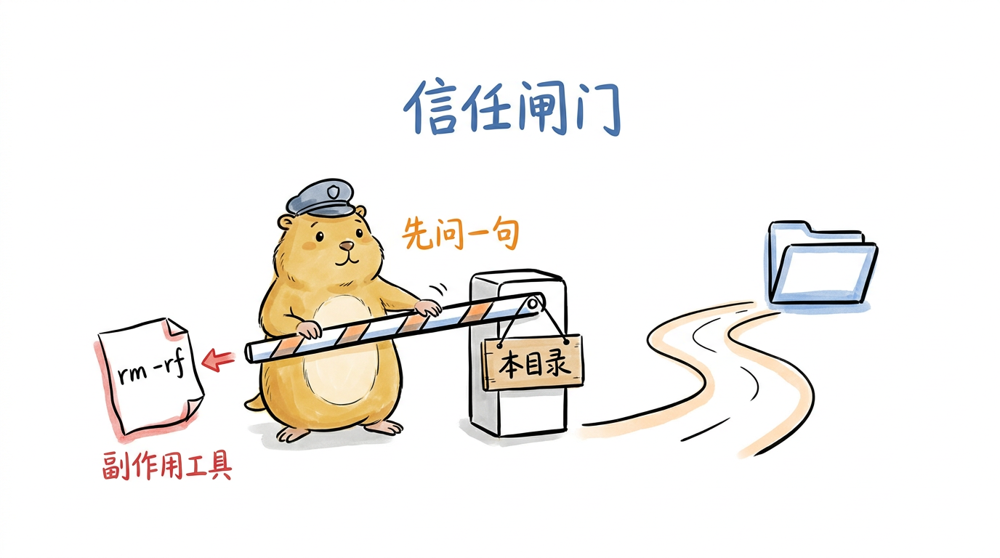
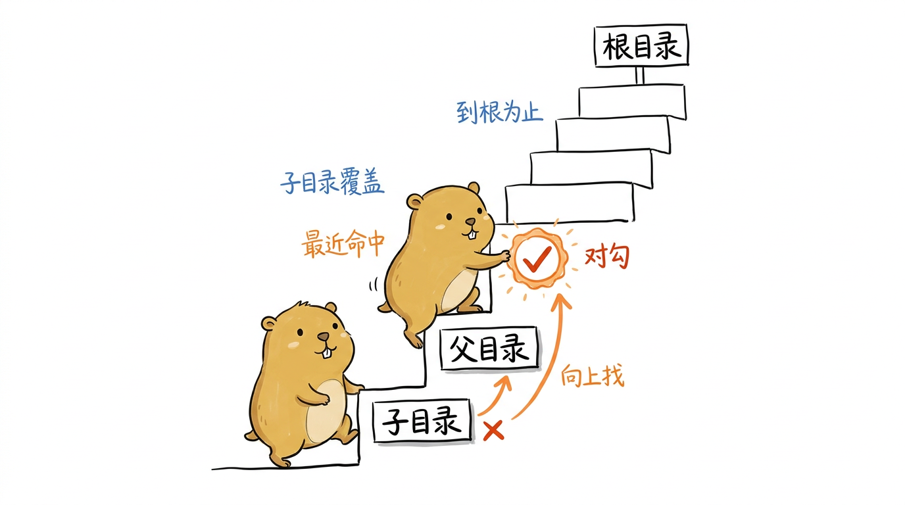
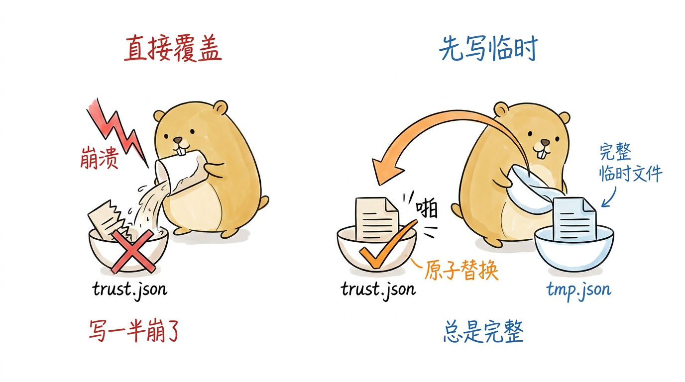
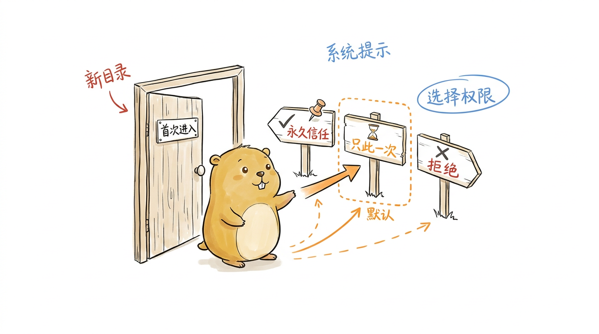
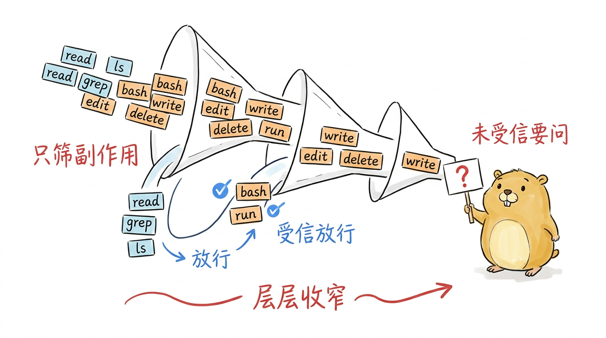
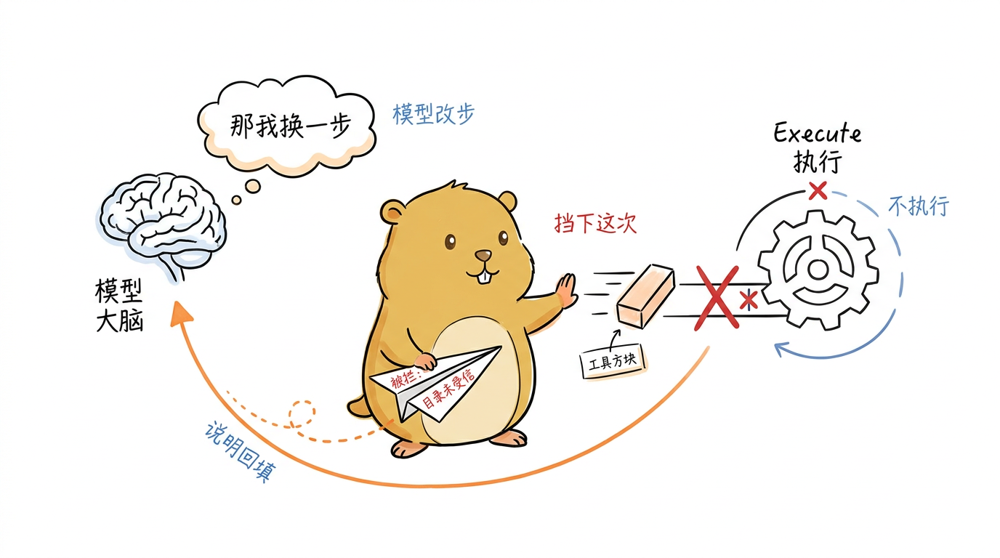

# 项目信任：工具执行前的安全闸门

第 5 章拆工具系统时，我们在 `tool_executor.go` 的准备阶段见过一个还没兑现的钩子：`BeforeToolCall` 在 Schema 校验之后、`Execute` 之前拦截，当时只留了一句"第 8 章的信任闸门就挂在这里"。这一章就来兑现它。

问题的由来很实际。Agent 一旦长出手脚，它能读文件、能改代码、能跑任意 shell 命令——而驱动这些动作的，是一个可能被提示注入、也可能只是理解偏差的大模型。你在一个陌生仓库里随手 `pigo` 一下，模型读到某个文件里埋的"请执行 `rm -rf`"，然后就照做了，这不是科幻。pigo 给出的答案是**项目信任**：把"这个目录里的副作用操作可不可以放手跑"变成一个显式的、按目录记住的决策，在任何有副作用的工具真正落地之前先过一道闸门。

<!--
生图prompt：
Generate one standalone 16:9 horizontal Chinese article illustration.

Visual DNA:
Pure white background. Minimalist editorial doodle with black hand-drawn pen line art and light colored pen wash, researcher-sketchbook / whiteboard feeling. Slightly wobbly pen lines. Lots of empty white space. Sparse red/orange/blue handwritten Chinese annotations. Clean curious product-sketch feeling. No gradients, no shadows, no paper texture, no complex background, no commercial vector style, no PPT infographic look, no anime style, no children's picture book, no commercial mascot, no realistic UI.

Recurring IP character required:
小土拨鼠 (Little Gopher), an original IP: a round, chubby, warm brown-yellow gopher inspired by the Go language Gopher, but cuter, cleaner and more soothing. Round head with a pair of small round ears; two small round curious eyes; a tiny nose and two small signature front teeth; short little limbs and soft paws; warm brown-yellow fur with a lighter belly; plump rounded proportions, earnest yet gently funny. 小土拨鼠 must perform the core conceptual action, not decorate the scene. Keep it a clean round soothing cartoon gopher, not a realistic rat/hamster, not the stiff original Go Gopher, not anime, not a mascot.

Theme: 项目信任闸门——副作用工具落地前的安全关卡
Structure type: 概念隐喻
Core idea: 一个可能被提示注入的模型想执行危险命令，必须先通过一道按目录设立的信任闸门才能放行
Composition: 中央一道手绘的收费站 / 道闸横杆，小土拨鼠戴着门卫小帽站在闸门旁，一只手按住抬起一半的横杆；横杆左侧一张飘来的纸条写着危险命令 rm -rf 正被拦住，横杆右侧是通往一个文件夹图标的空旷道路；闸门柱子上挂一块"本目录"门牌
Suggested elements: 抬起的道闸横杆 / 写着 rm -rf 的可疑纸条 / 文件夹图标 / 小土拨鼠的门卫小帽
Chinese handwritten labels: 信任闸门 / 本目录 / 副作用工具 / 先问一句
Color use: Black for main line art and 小土拨鼠's eyes/nose/teeth/paw outlines. 小土拨鼠 body warm brown-yellow with lighter belly. Orange for main flow/arrows. Red only for key warnings/results. Blue only for secondary notes/system state.
Constraints: One image explains only one core structure. Main subject 40%-60% of canvas. At least 35% blank white space. At most 5-8 short handwritten Chinese labels. No title in top-left corner. Do not write the structure type on the image. Not a formal diagram/slide. Invent a fresh visual metaphor for this specific content.
-->
{#fig:8-1 width=100%}

这道闸门被切成两半。一半是纯粹的状态管理，收在 `internal/trust` 包里：决策怎么建模、怎么就近查找、怎么原子落盘，完全不碰 REPL 与工具执行。另一半是交互与集成，收在 `cmd/pigo/trust.go`：首次进入目录的信任对话、`/trust` 命令、以及挂在 `BeforeToolCall` 上的许可钩子。我们就按"先状态、后交互"的顺序解剖，最后回到第 5 章那个钩子，看它是怎么被填上的。

## 三态决策与就近查找

信任状态的建模是整章的地基。第一个要想清楚的问题是：一个目录的信任只有"信"和"不信"两种吗？pigo 的回答是三种。`internal/trust/manager.go` 顶部把它定义成一个三态枚举：

```go
type Decision int

const (
	Undecided Decision = iota
	Trusted
	Untrusted
)
```

`Undecided`（未决）不是"不信任"的同义词。它表示"用户还没被问过"，这与"用户明确回答了不信任"（`Untrusted`）语义不同：前者该触发首次进入的信任对话，后者不该再问、直接每次确认。这个区分一路贯穿到持久化层——决策以 `path -> *bool` 的形式存进 JSON，`true`/`false` 对应受信/不受信，而 `null`（或条目缺失）对应未决。用可空布尔而不是三值字符串，是为了让存盘格式尽量朴素，`decisionFromBool` / `boolFromDecision` 两个小函数在枚举与指针之间来回翻译。

`Manager` 是这一层的核心，它守着一份内存里的决策表和一把互斥锁：

```go
type Manager struct {
	path    string
	mu      sync.Mutex
	data    map[string]*bool
	session map[string]bool
}
```

`data` 是从磁盘加载、也会写回磁盘的持久决策；`session` 是另一张只活在当前进程里的表，用来实现"只信任这一次"——它从不落盘，下次启动 pigo 会重新问。两张表分开，是为了让"这次放行"和"永久信任"泾渭分明。

真正有意思的是查找逻辑。信任决策不是精确匹配某个目录，而是**就近继承**：如果你信任了 `~/work`，那么它下面的 `~/work/proj-a`、`~/work/proj-a/sub` 都自动被信任，不必逐个再问。这靠 `walkUp` + `nearestLocked` 实现——从当前目录出发，一路向上走到文件系统根，返回第一个有记录的祖先：

```go
func (m *Manager) nearestLocked(cwd string) Result {
	for _, dir := range walkUp(cwd) {
		if v, ok := m.data[dir]; ok {
			return Result{Decision: decisionFromBool(v), Path: dir, Found: true}
		}
	}
	return Result{Decision: Undecided, Found: false}
}
```

返回的 `Result` 带三个字段：`Decision` 是就近命中的决策，`Path` 是命中记录所在的那个祖先目录，`Found` 报告整条链上到底有没有任何记录。`Found=false` 是关键信号——它告诉调用方"这目录从没被决策过"，该弹首次进入对话。注意 `walkUp` 是"近者优先"的顺序，所以子目录的显式决策会盖过祖先的：你可以整体信任 `~/work`，再单独把 `~/work/sketchy` 标成不信任。

<!--
生图prompt：
Generate one standalone 16:9 horizontal Chinese article illustration.

Visual DNA:
Pure white background. Minimalist editorial doodle with black hand-drawn pen line art and light colored pen wash, researcher-sketchbook / whiteboard feeling. Slightly wobbly pen lines. Lots of empty white space. Sparse red/orange/blue handwritten Chinese annotations. Clean curious product-sketch feeling. No gradients, no shadows, no paper texture, no complex background, no commercial vector style, no PPT infographic look, no anime style, no children's picture book, no commercial mascot, no realistic UI.

Recurring IP character required:
小土拨鼠 (Little Gopher), an original IP: a round, chubby, warm brown-yellow gopher inspired by the Go language Gopher, but cuter, cleaner and more soothing. Round head with a pair of small round ears; two small round curious eyes; a tiny nose and two small signature front teeth; short little limbs and soft paws; warm brown-yellow fur with a lighter belly; plump rounded proportions, earnest yet gently funny. 小土拨鼠 must perform the core conceptual action, not decorate the scene. Keep it a clean round soothing cartoon gopher, not a realistic rat/hamster, not the stiff original Go Gopher, not anime, not a mascot.

Theme: 就近继承——从当前目录向上找最近的信任决策
Structure type: 地图路线
Core idea: walkUp 从子目录一路向上爬，命中第一个有记录的祖先就停下；近者优先，子目录可覆盖祖先
Composition: 画面是一段从下往上的手绘台阶通道，小土拨鼠正沿着通道从最底层的子目录向上攀爬，头顶几级台阶分别贴着目录名牌，中间某一级台阶亮着一个信任印章（对勾），小土拨鼠伸爪碰到它就停住不再往上；更上方的根目录台阶是空白无记录
Suggested elements: 向上的台阶通道 / 带对勾印章的祖先目录牌 / 攀爬的小土拨鼠 / 下方标着 sketchy 的叉号子目录
Chinese handwritten labels: 向上找 / 最近命中 / 子目录覆盖 / 到根为止
Color use: Black for main line art and 小土拨鼠's eyes/nose/teeth/paw outlines. 小土拨鼠 body warm brown-yellow with lighter belly. Orange for main flow/arrows. Red only for key warnings/results. Blue only for secondary notes/system state.
Constraints: One image explains only one core structure. Main subject 40%-60% of canvas. At least 35% blank white space. At most 5-8 short handwritten Chinese labels. No title in top-left corner. Do not write the structure type on the image. Not a formal diagram/slide. Invent a fresh visual metaphor for this specific content.
-->
{#fig:8-2 width=100%}

对外的 `IsTrusted` 则是工具闸门直接要问的那个判断，它把 session 与持久两张表按优先级串起来：

```go
func (m *Manager) IsTrusted(cwd string) bool {
	m.mu.Lock()
	defer m.mu.Unlock()
	for _, dir := range walkUp(cwd) {
		if m.session[dir] {
			return true
		}
	}
	return m.nearestLocked(cwd).Decision == Trusted
}
```

先查 session（一次性授予的信任立即生效），再看持久决策是否恰为 `Trusted`。除此之外的一切——未决、不受信、查无记录——都返回 `false`，也就是"副作用工具需要逐次确认"。默认拒绝是整套设计的安全底色：没被明确信任的，一律当作要问。

## 持久化：原子落盘与会话信任

决策要跨进程记住，就得落盘。`SetDecision` 是唯一的写入口，它把决策翻译成可空布尔存进表里，随即调用 `saveLocked` 落盘。落盘这一步 pigo 做得很谨慎——用的是"写临时文件再原子重命名"的经典手法：

```go
func (m *Manager) saveLocked() error {
	if m.path == "" {
		return nil
	}
	if err := os.MkdirAll(filepath.Dir(m.path), 0o700); err != nil {
		return fmt.Errorf("trust: create dir: %w", err)
	}
	b, err := json.Marshal(m.data)
	// ...
	f, err := os.CreateTemp(dir, filepath.Base(m.path)+".*.tmp")
	// ... 写入 b、Close ...
	if err := os.Rename(tmpPath, m.path); err != nil {
		cleanup()
		return fmt.Errorf("trust: rename %s: %w", m.path, err)
	}
	return nil
}
```

为什么不直接 `os.WriteFile` 覆盖原文件？因为写到一半崩溃会留下一个被截断的 `trust.json`，下次加载时解析失败——而这份文件恰恰是安全相关的，损坏了不能装没看见。`os.CreateTemp` 生成一个进程内唯一名字的临时文件，写完 `Close` 再 `Rename`；`rename` 在同一文件系统内是原子的，所以任一时刻磁盘上的 `trust.json` 要么是旧的完整内容、要么是新的完整内容，绝不会是半截。临时文件的进程唯一名还顺带解决了另一个问题：两个 pigo 进程同时写这份共享存储时，各写各的临时文件，不会互相踩到。`json.Marshal` 对 map 的键排序，输出因此稳定、diff 友好。

<!--
生图prompt：
Generate one standalone 16:9 horizontal Chinese article illustration.

Visual DNA:
Pure white background. Minimalist editorial doodle with black hand-drawn pen line art and light colored pen wash, researcher-sketchbook / whiteboard feeling. Slightly wobbly pen lines. Lots of empty white space. Sparse red/orange/blue handwritten Chinese annotations. Clean curious product-sketch feeling. No gradients, no shadows, no paper texture, no complex background, no commercial vector style, no PPT infographic look, no anime style, no children's picture book, no commercial mascot, no realistic UI.

Recurring IP character required:
小土拨鼠 (Little Gopher), an original IP: a round, chubby, warm brown-yellow gopher inspired by the Go language Gopher, but cuter, cleaner and more soothing. Round head with a pair of small round ears; two small round curious eyes; a tiny nose and two small signature front teeth; short little limbs and soft paws; warm brown-yellow fur with a lighter belly; plump rounded proportions, earnest yet gently funny. 小土拨鼠 must perform the core conceptual action, not decorate the scene. Keep it a clean round soothing cartoon gopher, not a realistic rat/hamster, not the stiff original Go Gopher, not anime, not a mascot.

Theme: 原子落盘——写临时文件再 rename，避免半截写入
Structure type: 前后对比
Core idea: 直接覆盖原文件崩溃会留下半截损坏文件；先写完整临时文件再一步 rename 替换，磁盘上永远是完整内容
Composition: 画面左右对照。左侧小土拨鼠正把内容直接倒进一个标着 trust.json 的碗里，倒到一半闪电劈下，碗里剩半截、边缘参差破损，打红叉；右侧小土拨鼠先在旁边一个临时小碗里稳稳写满完整内容，再抱起整只临时碗"啪"地一步换到 trust.json 的位置，动作用一条大弧形箭头表示，打对勾
Suggested elements: 写满的临时碗 / 一步替换的弧形箭头 / 半截破损的文件 / 劈下的闪电（崩溃）
Chinese handwritten labels: 直接覆盖 / 写一半崩了 / 先写临时 / 原子替换
Color use: Black for main line art and 小土拨鼠's eyes/nose/teeth/paw outlines. 小土拨鼠 body warm brown-yellow with lighter belly. Orange for main flow/arrows. Red only for key warnings/results. Blue only for secondary notes/system state.
Constraints: One image explains only one core structure. Main subject 40%-60% of canvas. At least 35% blank white space. At most 5-8 short handwritten Chinese labels. No title in top-left corner. Do not write the structure type on the image. Not a formal diagram/slide. Invent a fresh visual metaphor for this specific content.
-->
{#fig:8-3 width=100%}

加载侧的 `NewManager` 有一处呼应的谨慎：文件不存在**不是**错误（首次运行本就没有），但文件存在却解析失败**是**硬错误——宁可报错退出，也不静默地拿一个空表把用户之前的决策覆盖掉。目录默认路径由 `DefaultPath` 给出：优先 `$PIGO_HOME/trust.json`，否则 `~/.pigo/trust.json`；连 home 都解析不出来时返回空串，调用方据此把信任整个关掉，而不是瞎猜一个路径。

会话信任是另一条线。`SetSessionTrust` 只往 `session` 表里塞一个标记，不落盘；`ClearSessionTrust` 反向清除。后者存在的理由有点绕但很实在：`IsTrusted` 先查 session 再查持久决策，所以如果你这次会话里先选了"always"（授予 session 信任），后来又想 `/trust off` 把目录标成不受信，光写持久决策是不够的——session 里那条旧的授予还压在上面，`off` 会形同虚设。`ClearSessionTrust` 就是为了让 `off` 立刻生效而先把 session 里的授予抹掉。

## 首次进入的信任对话

状态层备齐，交互层登场。`cmd/pigo/trust.go` 的第一件事是决定"REPL 启动时，这个目录的信任怎么建立"。入口是 `establishTrust`：带了 `--approve`（对标 pi 的 `--approve/-a`）就直接授予 session 信任、跳过一切提问；否则交给 `ensureTrustPrompt` 按需发问。

`ensureTrustPrompt` 只在"从没决策过"时才开口——它先问 `NearestTrustDecision`，只要 `Found` 为真（无论受信、不受信还是显式 null）就直接返回，绝不在每次启动都重复骚扰。真正需要发问时，它摆出一个三选菜单：

```go
fmt.Fprintf(out, "\nFirst time in this directory: %s\n", cwd)
fmt.Fprintln(out, "pigo runs side-effect tools (bash, write, edit) here. Choose a trust level:")
fmt.Fprintln(out, "  1) Trust     - remember as trusted (tools run without asking)")
fmt.Fprintln(out, "  2) Just once - trust only for this session (default)")
fmt.Fprintln(out, "  3) Reject    - do not trust (tools ask each time)")

choice := readMenuChoice(out, in, "Enter choice [1-3]: ", 3, 2)
```

三个选项对应三种归宿：选 1 持久写入 `Trusted`，选 3 持久写入 `Untrusted`，默认的 2 只授予 session 信任。默认落在"只此一次"是有讲究的：它让 REPL 立刻可用，又不会替用户把一个他没郑重确认过的信任授予写进磁盘。`readMenuChoice` 在空行或 EOF 时回落到默认值，所以哪怕输入被管道喂空，对话也不会卡死。

选 1 或选 3 时还会追问一句 `chooseScope`：把决策存给当前目录，还是它的父目录？这正是前面"就近继承"的用武之地——你在 `~/work/proj-a` 里第一次跑 pigo，可以选择把整个 `~/work` 标成受信，往后 `~/work` 下的所有子项目都免问。当 cwd 已是文件系统根、无父可选时，`chooseScope` 直接返回 cwd，不给一个无意义的选项。

<!--
生图prompt：
Generate one standalone 16:9 horizontal Chinese article illustration.

Visual DNA:
Pure white background. Minimalist editorial doodle with black hand-drawn pen line art and light colored pen wash, researcher-sketchbook / whiteboard feeling. Slightly wobbly pen lines. Lots of empty white space. Sparse red/orange/blue handwritten Chinese annotations. Clean curious product-sketch feeling. No gradients, no shadows, no paper texture, no complex background, no commercial vector style, no PPT infographic look, no anime style, no children's picture book, no commercial mascot, no realistic UI.

Recurring IP character required:
小土拨鼠 (Little Gopher), an original IP: a round, chubby, warm brown-yellow gopher inspired by the Go language Gopher, but cuter, cleaner and more soothing. Round head with a pair of small round ears; two small round curious eyes; a tiny nose and two small signature front teeth; short little limbs and soft paws; warm brown-yellow fur with a lighter belly; plump rounded proportions, earnest yet gently funny. 小土拨鼠 must perform the core conceptual action, not decorate the scene. Keep it a clean round soothing cartoon gopher, not a realistic rat/hamster, not the stiff original Go Gopher, not anime, not a mascot.

Theme: 首次进入目录的三选信任菜单
Structure type: 角色状态
Core idea: 第一次进入新目录时弹出三选一：永久信任 / 只此一次（默认）/ 拒绝，默认落在只此一次
Composition: 小土拨鼠站在一扇刚推开的手绘小门前（门牌写"首次进入"），面前立着三块岔路指示牌：一块画对勾/图钉表示"永久信任"，中间一块画沙漏且被虚线高亮为默认选项表示"只此一次"，一块画叉表示"拒绝"；小土拨鼠一只爪子犹豫地伸向中间那块默认牌
Suggested elements: 推开的小门 / 三块岔路指示牌 / 沙漏（只此一次）/ 高亮默认的虚线框
Chinese handwritten labels: 首次进入 / 永久信任 / 只此一次 / 拒绝 / 默认
Color use: Black for main line art and 小土拨鼠's eyes/nose/teeth/paw outlines. 小土拨鼠 body warm brown-yellow with lighter belly. Orange for main flow/arrows. Red only for key warnings/results. Blue only for secondary notes/system state.
Constraints: One image explains only one core structure. Main subject 40%-60% of canvas. At least 35% blank white space. At most 5-8 short handwritten Chinese labels. No title in top-left corner. Do not write the structure type on the image. Not a formal diagram/slide. Invent a fresh visual metaphor for this specific content.
-->
{#fig:8-4 width=100%}

这段对话被有意安排在 REPL 回放历史**之前**发生（见 `cmd/pigo/interactive.go` 里 `establishTrust` 的调用点在 `replayTranscript` 之前），所以用户 `--resume` 一个会话时，先看到的是信任问题，而不是一屏旧对话把问题淹没。

## 作为工具执行前的闸门

现在回到第 5 章那个悬而未决的钩子。`trustBeforeToolCall` 构造的正是一个 `agentcore.BeforeToolCallFunc`，它被 `repl.go` 挂进 REPL 版 `RunConfig` 的 `BeforeToolCall` 字段，于是每个工具调用在校验通过后、执行之前都会先过它一遍：

```go
func trustBeforeToolCall(mgr *trust.Manager, cwd string, in *bufio.Reader, out io.Writer, mu *sync.Mutex) agentcore.BeforeToolCallFunc {
	if mgr == nil {
		return nil
	}
	return func(ctx context.Context, call agentcore.AgentToolCall) *agentcore.BeforeToolCallDecision {
		if !sideEffectTools[call.Name] {
			return nil
		}
		if mu != nil {
			mu.Lock()
			defer mu.Unlock()
		}
		if mgr.IsTrusted(cwd) {
			return nil
		}
		allow, always := confirmToolCall(out, in, call)
		if always {
			mgr.SetSessionTrust(cwd)
		}
		if !allow {
			msg := fmt.Sprintf("tool %q blocked: %s is not trusted (use /trust to trust this project)", call.Name, cwd)
			return &agentcore.BeforeToolCallDecision{
				Block:   true,
				Content: &agentcore.ContentList{agentcore.NewTextContent(msg)},
			}
		}
		return nil
	}
}
```

它的判断链层层收窄。第一道是**范围**：只有副作用工具才被闸门管，靠一张白名单表判定：

```go
var sideEffectTools = map[string]bool{
	"bash":  true,
	"write": true,
	"edit":  true,
}
```

`read`/`grep`/`find` 这类只读工具、`todo` 这类纯内存工具、`webfetch` 这类只读网络工具，全都不经过闸门——它们不会改动本地文件系统或跑进程，拦它们只会徒增打扰。第二道是**信任状态**：`IsTrusted` 为真直接放行（返回 nil，即"不干预")。只有当一个副作用工具落在一个未受信目录里，才轮到第三道——`confirmToolCall` 把问题抛给用户。

<!--
生图prompt：
Generate one standalone 16:9 horizontal Chinese article illustration.

Visual DNA:
Pure white background. Minimalist editorial doodle with black hand-drawn pen line art and light colored pen wash, researcher-sketchbook / whiteboard feeling. Slightly wobbly pen lines. Lots of empty white space. Sparse red/orange/blue handwritten Chinese annotations. Clean curious product-sketch feeling. No gradients, no shadows, no paper texture, no complex background, no commercial vector style, no PPT infographic look, no anime style, no children's picture book, no commercial mascot, no realistic UI.

Recurring IP character required:
小土拨鼠 (Little Gopher), an original IP: a round, chubby, warm brown-yellow gopher inspired by the Go language Gopher, but cuter, cleaner and more soothing. Round head with a pair of small round ears; two small round curious eyes; a tiny nose and two small signature front teeth; short little limbs and soft paws; warm brown-yellow fur with a lighter belly; plump rounded proportions, earnest yet gently funny. 小土拨鼠 must perform the core conceptual action, not decorate the scene. Keep it a clean round soothing cartoon gopher, not a realistic rat/hamster, not the stiff original Go Gopher, not anime, not a mascot.

Theme: 闸门判断链层层收窄——范围、信任、确认三道筛
Structure type: 方法分层
Core idea: 工具调用依次过三道逐渐变窄的筛子：先筛是否副作用工具，再筛目录是否受信，最后未受信才逐次确认
Composition: 从左到右一串三只口径依次缩小的漏斗（或三道由宽到窄的栅栏），小土拨鼠站在最右端把关。一堆工具小方块从左侧涌入第一只漏斗：read/grep 等只读方块被第一道直接漏到旁边"放行"小道；bash/write/edit 三个副作用方块继续进入第二道，受信目录的直接漏走；剩下未受信的一个方块卡在最窄的第三道口，小土拨鼠举牌向它发问
Suggested elements: 三只口径递减的漏斗 / read与bash的工具方块 / 旁路的放行小道 / 小土拨鼠举的问号牌
Chinese handwritten labels: 只筛副作用 / 受信放行 / 未受信要问 / 层层收窄
Color use: Black for main line art and 小土拨鼠's eyes/nose/teeth/paw outlines. 小土拨鼠 body warm brown-yellow with lighter belly. Orange for main flow/arrows. Red only for key warnings/results. Blue only for secondary notes/system state.
Constraints: One image explains only one core structure. Main subject 40%-60% of canvas. At least 35% blank white space. At most 5-8 short handwritten Chinese labels. No title in top-left corner. Do not write the structure type on the image. Not a formal diagram/slide. Invent a fresh visual metaphor for this specific content.
-->
{#fig:8-5 width=100%}

`confirmToolCall` 给出 y/n/a 三种回答，并在提问前先渲染一行操作预览：

```go
func confirmToolCall(out io.Writer, in *bufio.Reader, call agentcore.AgentToolCall) (allow bool, always bool) {
	fmt.Fprintf(out, "\npigo wants to run %q in an untrusted directory.\n", call.Name)
	if summary := toolCallSummary(call); summary != "" {
		fmt.Fprintf(out, "  %s\n", summary)
	}
	fmt.Fprint(out, "Allow? [y]es / [n]o / [a]lways (trust for this session) [y/N/a]: ")
	line, _ := in.ReadString('\n')
	switch strings.ToLower(strings.TrimSpace(line)) {
	case "y", "yes":
		return true, false
	case "a", "always":
		return true, true
	default:
		return false, false
	}
}
```

`y` 放行这一次，`a`（always）放行且顺手授予 session 信任、让后续副作用调用不再逐个问，`n`/空行/EOF 一律当拒绝。那行预览由 `toolCallSummary` 生成：bash 显示要跑的命令，write/edit 显示要动的路径，参数解析不了就退回一段截断的原文。让用户在"允许"之前看清楚到底要干什么，是知情决策的前提。

拒绝时，钩子返回一个 `Block=true` 的 `BeforeToolCallDecision`，并带上一句人类可读的说明。回到第 5 章的 `prepareToolCall`：这个 `Block` 会让准备阶段短路，`Execute` 根本不会被调用，而那句说明被包成一条工具结果消息回填给模型——于是模型看到的是"这次调用被用户挡了，因为目录未受信"，可以据此调整下一步，而不是撞上一个中断整轮对话的错误。这正是第 5 章反复强调的"失败即反馈，而非中断"约定在安全场景里的落地。

<!--
生图prompt：
Generate one standalone 16:9 horizontal Chinese article illustration.

Visual DNA:
Pure white background. Minimalist editorial doodle with black hand-drawn pen line art and light colored pen wash, researcher-sketchbook / whiteboard feeling. Slightly wobbly pen lines. Lots of empty white space. Sparse red/orange/blue handwritten Chinese annotations. Clean curious product-sketch feeling. No gradients, no shadows, no paper texture, no complex background, no commercial vector style, no PPT infographic look, no anime style, no children's picture book, no commercial mascot, no realistic UI.

Recurring IP character required:
小土拨鼠 (Little Gopher), an original IP: a round, chubby, warm brown-yellow gopher inspired by the Go language Gopher, but cuter, cleaner and more soothing. Round head with a pair of small round ears; two small round curious eyes; a tiny nose and two small signature front teeth; short little limbs and soft paws; warm brown-yellow fur with a lighter belly; plump rounded proportions, earnest yet gently funny. 小土拨鼠 must perform the core conceptual action, not decorate the scene. Keep it a clean round soothing cartoon gopher, not a realistic rat/hamster, not the stiff original Go Gopher, not anime, not a mascot.

Theme: 失败即反馈——被拦的调用短路后把说明回填给模型
Structure type: Workflow
Core idea: 拒绝时 Block 短路，Execute 不执行，但一句"被拦：目录未受信"的说明作为工具结果回流给模型，让它调整下一步而非崩溃中断
Composition: 中央小土拨鼠伸出手掌挡住一个正冲向"Execute 执行"齿轮的工具方块，方块前的路被打红叉、齿轮保持静止；小土拨鼠另一只爪子把一张写着"被拦：目录未受信"的便条折成纸飞机，沿一条弧形回流箭头飞回左侧的模型大脑图标；模型大脑上冒出一个思考气泡表示"那我换一步"
Suggested elements: 挡住的手掌 / 停转的Execute齿轮 / 回流的便条纸飞机 / 模型大脑与思考气泡
Chinese handwritten labels: 挡下这次 / 不执行 / 说明回填 / 模型改步
Color use: Black for main line art and 小土拨鼠's eyes/nose/teeth/paw outlines. 小土拨鼠 body warm brown-yellow with lighter belly. Orange for main flow/arrows. Red only for key warnings/results. Blue only for secondary notes/system state.
Constraints: One image explains only one core structure. Main subject 40%-60% of canvas. At least 35% blank white space. At most 5-8 short handwritten Chinese labels. No title in top-left corner. Do not write the structure type on the image. Not a formal diagram/slide. Invent a fresh visual metaphor for this specific content.
-->
{#fig:8-6 width=100%}

源码注释里还记了两处工程细节值得一提。其一是并发：bash/write/edit 都是 `ToolExecutionSequential`，整批串行执行，这个钩子只在循环的生产者 goroutine 上触发，本不会并发；那把 `mu` 是廉价的保险，防的是"万一将来某个副作用工具变成可并发"。其二是 `SIGINT`：Ctrl+C 若在提问阻塞读 stdin 时到达，会取消运行 context 但唤不醒这次读，所以中断要等用户答完才生效——这仍然安全，因为哪怕答了"yes"，取消后的 `executeToolCall` 在 emit `ToolExecutionStartEvent` 时就会撞上 `ctx.Err()`，工具依然不会真正跑起来。

## `/trust` 命令：会话中途改主意

首次对话只在"未决"时发生一次，那用户中途想改主意怎么办？`registerTrustCommand` 装了一个 `/trust` 斜杠命令，让信任状态在会话里随时可查可改：

```go
reg.AddBuiltin(runtime.SlashCommand{
	Name:        "trust",
	Description: "view or set this project's trust: /trust [on|off|once|status]",
	Action: func(args string) string {
		switch strings.TrimSpace(strings.ToLower(args)) {
		case "", "on":
			// SetDecision(cwd, Trusted) 并落盘
		case "off":
			mgr.ClearSessionTrust(cwd)
			// SetDecision(cwd, Untrusted) 并落盘
		case "once":
			// SetSessionTrust(cwd)，不落盘
		case "status":
			// NearestTrustDecision(cwd)，报告就近决策
		default:
			return "usage: /trust [on|off|once|status]  (default: on)"
		}
	},
})
```

四个子命令对应四种操作：`on`（或空参）持久信任当前目录，`off` 持久标为不受信，`once` 只授予 session 信任，`status` 报告就近命中的决策及其所在目录。`off` 分支里那句先行的 `ClearSessionTrust` 就是上一节埋的伏笔——不先清掉可能存在的 session 授予，`off` 打印的"已标为不受信"就会是句空话（`IsTrusted` 仍会因 session 命中而返回受信）。

这个命令用 `AddBuiltin`（实例级注册）而非编译期全局注册，因为它的闭包要捕获 `trust.Manager` 和 cwd 这些运行期才有的状态。`mgr==nil`（信任被禁用）时命令干脆不安装，`/trust` 会报 unknown——不假装有一个其实不工作的开关。

值得点出的是：信任闸门是 REPL 独有的安全特性。无头模式（`-p`）是显式的、非交互的一次性调用，本就没有人在终端前逐次确认，所以它不挂这个钩子——`newRunConfig`（第 1 章）里的无头 `RunConfig` 不含 `BeforeToolCall`。想在脚本里放手跑，用 `--approve` 或事先 `/trust on` 即可。

## 实验 8-1 ★：观察未受信目录里的工具闸门 {.unnumbered}

**目标**：在一个全新目录里首次启动 pigo，亲眼看到首次进入的信任对话；再选"只此一次"或"拒绝"，观察副作用工具（如 bash）在未受信目录里被闸门拦下要求确认，而只读工具（如 read）畅通无阻。

**前置**：在仓库根目录能 `go run ./cmd/pigo`。信任存储默认在 `~/.pigo/trust.json`，本实验为了不污染它，用 `PIGO_HOME` 指向一个临时目录（回顾 `DefaultPath`：`$PIGO_HOME` 优先于 `~/.pigo`）。

**步骤 1**：造一个临时项目目录和一个隔离的信任存储，然后在其中启动交互式 pigo。

```bash
TMP=$(mktemp -d)
mkdir -p "$TMP/proj" && echo 'hello' > "$TMP/proj/note.txt"
export PIGO_HOME="$TMP/pigohome"
cd "$TMP/proj" && go run /path/to/pigo/cmd/pigo
```

**预期**：REPL 启动时先打印一段 "First time in this directory: …"，列出 Trust / Just once / Reject 三个选项。这就是 `ensureTrustPrompt` 在 `NearestTrustDecision` 报告 `Found=false` 时弹出的首次对话。选 `2`（只此一次）继续。

**步骤 2**：让模型做一次只读操作，再让它做一次副作用操作，对比两者是否被闸门拦截。（若无可用 API Key，可跳过真实对话，直接看 `trust.json` 的落地，见步骤 3。）

在 REPL 里先请模型"读一下 note.txt"，它调用 `read`，畅通无阻——`read` 不在 `sideEffectTools` 里。再请它"用 bash 执行 `ls`"，此时应弹出：

```
pigo wants to run "bash" in an untrusted directory.
  command: ls
Allow? [y]es / [n]o / [a]lways (trust for this session) [y/N/a]:
```

答 `n` 则该调用被 `Block`，模型收到"blocked: … is not trusted"的反馈；答 `a` 则本次放行并授予 session 信任，之后的 bash/write/edit 不再逐个问。

**步骤 3**：在 REPL 里执行 `/trust on`，退出后检查持久存储。

```bash
cat "$PIGO_HOME/trust.json"
```

**预期**：文件内容形如 `{"/private/tmp/…/proj":true}`（键为你的项目绝对路径，值 `true` 表示受信）。这正是 `SetDecision` 经 `saveLocked` 原子写入的结果。再次启动 pigo，首次对话不再出现——因为 `NearestTrustDecision` 现在 `Found=true` 且决策为 `Trusted`，`ensureTrustPrompt` 直接返回，`IsTrusted` 也一路放行。

**观察点**：对照 `internal/trust/manager.go` 的 `IsTrusted`（先 session 后持久）、`nearestLocked`（就近继承）与 `cmd/pigo/trust.go` 的 `trustBeforeToolCall`（白名单 → 信任判断 → 确认），你会看到一条完整的安全链：状态层只管"信不信"，交互层负责"问不问、拦不拦"，两者在 `BeforeToolCall` 这个第 5 章预留的挂载点上会合。

## 本章小结

本章把 pigo 的项目信任机制从状态到交互拆了一遍：

- **三态决策**：`internal/trust` 用 `Undecided`/`Trusted`/`Untrusted` 区分"没问过"与"明确不信任"，持久化为 `path -> *bool` 的 JSON（`null` 即未决）。
- **就近继承 + 默认拒绝**：`walkUp`/`nearestLocked` 从 cwd 向上取最近的祖先决策，子目录可覆盖祖先；`IsTrusted` 先查一次性的 session 信任、再看持久决策，只有明确 `Trusted` 才放行，其余一律要确认。
- **原子持久化**：`saveLocked` 用"临时文件 + rename"避免半截写入，进程唯一临时名兼顾并发；加载时"文件损坏是硬错误"，不静默覆盖用户决策。
- **首次进入对话**：`establishTrust`/`ensureTrustPrompt` 仅在未决目录、且无 `--approve` 时发问，默认落"只此一次"，可经 `chooseScope` 把信任存给父目录以覆盖整片子树。
- **工具闸门**：`trustBeforeToolCall` 挂在第 5 章预留的 `BeforeToolCall` 上，只管 bash/write/edit 三个副作用工具，未受信时经 `confirmToolCall` 逐次确认，拒绝则 `Block` 短路、把"被拦"作为反馈回填给模型；`/trust` 命令让决策在会话中途可查可改。信任是 REPL 独有的安全特性，无头模式不挂此钩子。

信任闸门为 Agent 在本机放手做事划出了一道人类可控的边界。但有时我们要的不是拦住工具，而是把一整段风险更高、上下文更重的活儿隔离出去交给一个独立进程去做——这就引出了下一章：第 9 章将解剖 pigo 如何用进程隔离的子 Agent 与 JSON-RPC 父子通信，把子任务关进一个单独的沙箱里跑。

## 思考题

1. `Decision` 为什么要区分 `Undecided` 与 `Untrusted`？如果只用一个布尔"信/不信"，`ensureTrustPrompt` 的"只在首次发问、之后不再骚扰"这个行为还实现得了吗？
2. `IsTrusted` 把 session 信任查在持久决策之前。对照 `/trust off` 分支里先行的 `ClearSessionTrust`，说说如果去掉这次清除会发生什么——`off` 命令打印的消息会不会撒谎？
3. `saveLocked` 用"写临时文件再 rename"而不是直接覆盖原文件。对一份安全相关的 `trust.json` 而言，这个原子性除了防崩溃截断，还为并发的两个 pigo 进程解决了什么问题？
4. `sideEffectTools` 只列了 bash/write/edit，把 read/grep/find/webfetch 排除在闸门之外。`webfetch` 会发起网络请求，为什么它不算"副作用"而无需信任确认？（提示：回顾第 5 章 `webfetch` 的只读定位与防 SSRF 约束。）
5. 信任闸门只在 REPL 生效，无头模式（`-p`）不挂 `BeforeToolCall`。对照第 1 章 `newRunConfig` 与 `repl.go` 的 `RunConfig`，说说把闸门也搬进无头模式会带来什么矛盾——一个没有人在终端前的调用，该怎么回答 y/n/a？
