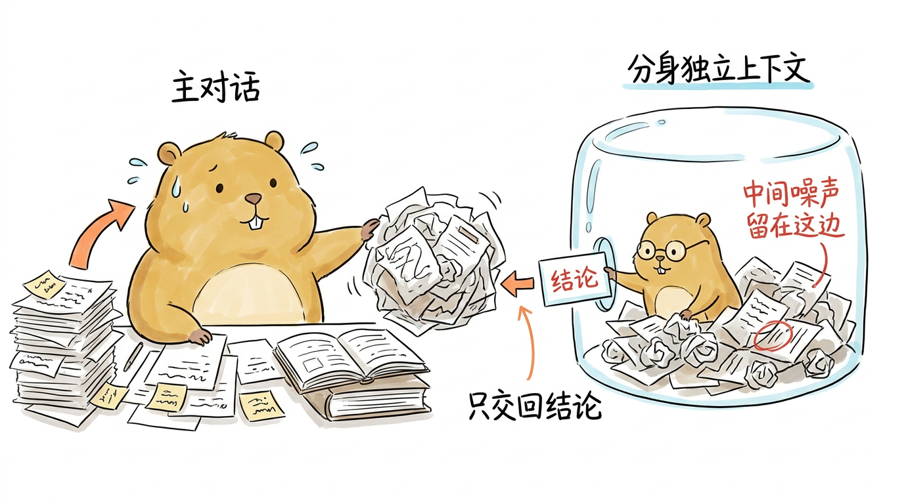
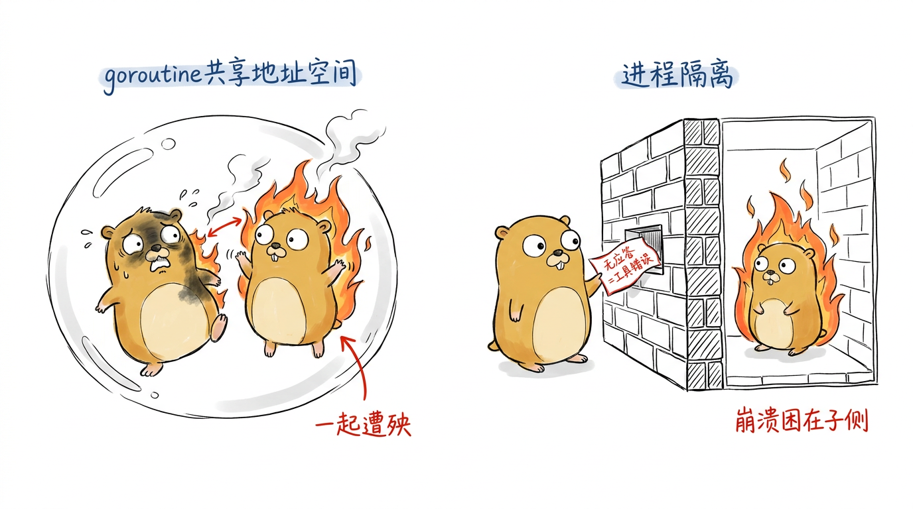
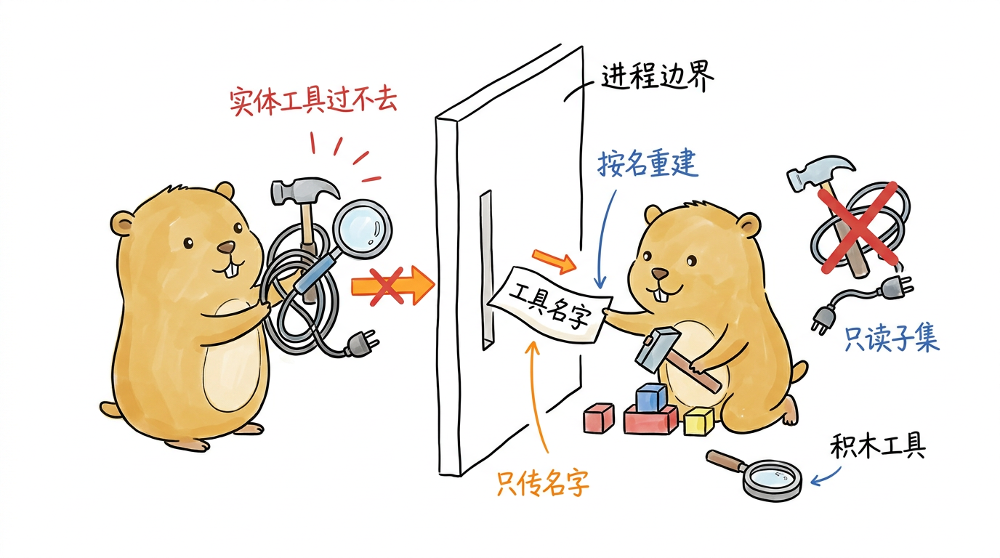
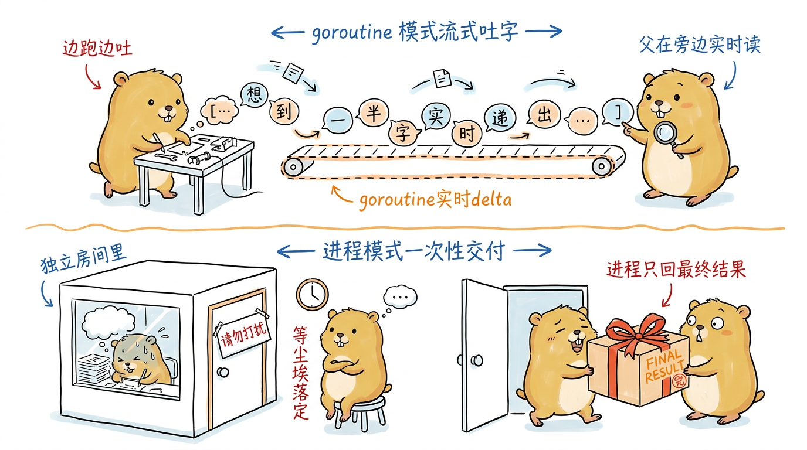
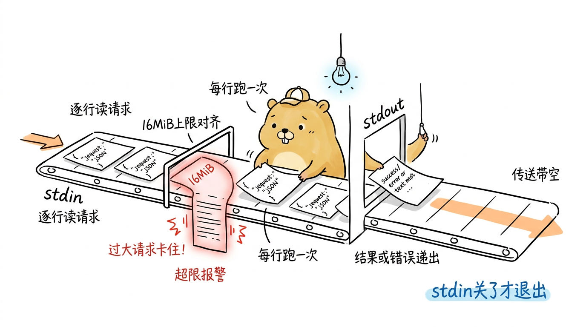
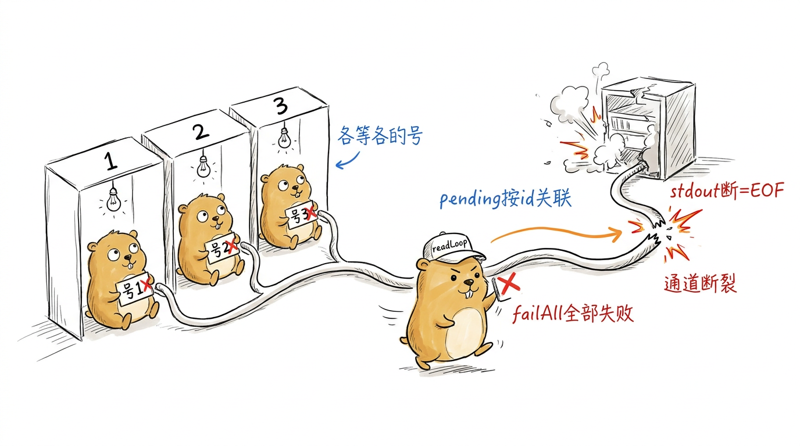
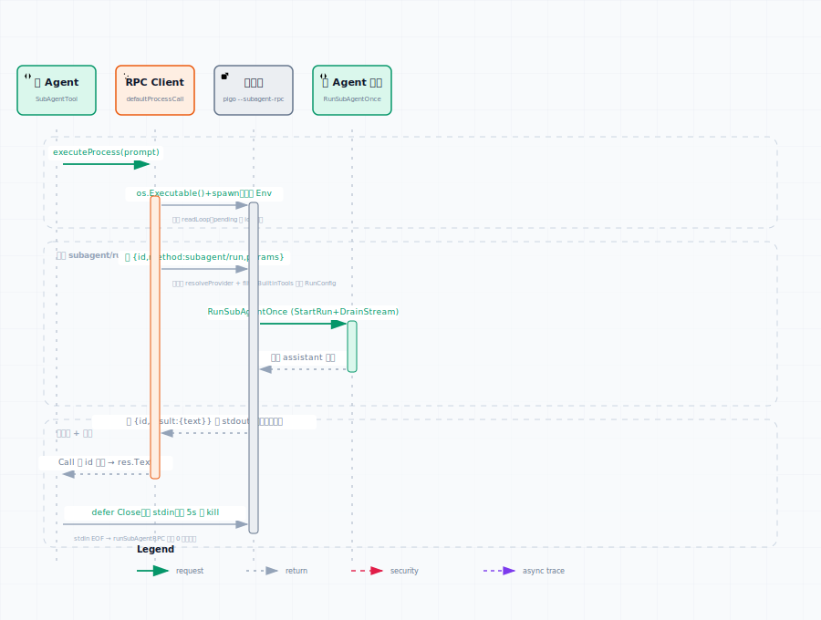

# 子 Agent 编排：把一次委派关进另一个进程

到这里，pigo 的主循环已经能读文件、跑命令、抓网页，也能在逼近 token 上限时压缩上下文。但有一类任务，单靠一条越堆越长的主对话并不划算：让模型先去"调研"一大堆资料、再回来汇报结论。调研过程会往上下文里灌进大量中间文本，等结论出来时，这些原始材料早已没用，却还占着主对话的窗口。更自然的做法是把这类子任务丢给一个"分身"——它带着独立的上下文跑完，只把最终结论交回来，中间的噪声留在它自己那一摊。

这就是子 Agent。pigo 把它设计成一件很朴素的事：**一个子 Agent 就是一次完整的 Agent 循环，有自己独立的 `AgentContext`（独立的系统提示、消息历史、工具集），由父 Agent 通过一次普通的工具调用启动。**子循环跑到收尾，它最后一条 assistant 文本作为工具结果回填给父循环——所以从父循环的视角看，子 Agent 跟 `read`、`bash` 没有本质区别，就是又一个工具。第 5 章讲的批量执行器已经会把并行的工具调用放进各自的 goroutine 里跑，因此多个子 Agent 天然可以并发。

<!--
生图prompt：
Generate one standalone 16:9 horizontal Chinese article illustration.

Visual DNA:
Pure white background. Minimalist editorial doodle with black hand-drawn pen line art and light colored pen wash, researcher-sketchbook / whiteboard feeling. Slightly wobbly pen lines. Lots of empty white space. Sparse red/orange/blue handwritten Chinese annotations. Clean curious product-sketch feeling. No gradients, no shadows, no paper texture, no complex background, no commercial vector style, no PPT infographic look, no anime style, no children's picture book, no commercial mascot, no realistic UI.

Recurring IP character required:
小土拨鼠 (Little Gopher), an original IP: a round, chubby, warm brown-yellow gopher inspired by the Go language Gopher, but cuter, cleaner and more soothing. Round head with a pair of small round ears; two small round curious eyes; a tiny nose and two small signature front teeth; short little limbs and soft paws; warm brown-yellow fur with a lighter belly; plump rounded proportions, earnest yet gently funny. 小土拨鼠 must perform the core conceptual action, not decorate the scene. Keep it a clean round soothing cartoon gopher, not a realistic rat/hamster, not the stiff original Go Gopher, not anime, not a mascot.

Theme: 把一次调研任务委派给带独立上下文的"分身"子 Agent
Structure type: 概念隐喻
Core idea: 父 Agent 主对话被一堆调研原始材料塞满很浪费，于是派出一个分身带着独立上下文去啃资料，最后只把一句结论交回来，噪声留在分身那一摊
Composition: 左侧一只大的小土拨鼠坐在一张已经堆满纸片和便签的书桌前，头顶冒汗；它伸手把一团乱纸推给右侧一只较小的分身小土拨鼠，分身站在一个单独的透明气泡/独立小房间里埋头翻资料；分身只从房间小窗递出一张写着"结论"的干净小卡片回到大土拨鼠手里，那团乱纸留在分身房间里
Suggested elements: 堆满便签的主书桌 / 装着分身的独立气泡房间 / 一大团被丢进去的乱纸 / 递回来的一张干净结论卡片
Chinese handwritten labels: 主对话 / 分身独立上下文 / 中间噪声留在这边 / 只交回结论
Color use: Black for main line art and 小土拨鼠's eyes/nose/teeth/paw outlines. 小土拨鼠 body warm brown-yellow with lighter belly. Orange for main flow/arrows. Red only for key warnings/results. Blue only for secondary notes/system state.
Constraints: One image explains only one core structure. Main subject 40%-60% of canvas. At least 35% blank white space. At most 5-8 short handwritten Chinese labels. No title in top-left corner. Do not write the structure type on the image. Not a formal diagram/slide. Invent a fresh visual metaphor for this specific content.
-->
{#fig:9-1 width=100%}

本章的重点不在"子 Agent 是什么"，而在 pigo 给它准备的第二种活法：**进程隔离**。父进程可以不在自己体内跑子循环，而是 fork 出一个全新的 `pigo` 子进程，通过 stdio 上的 JSON-RPC 把这次运行委派出去。我们会顺着这条链走完：先看两种隔离模式如何在一个 `SubAgentSpec` 里选择（`internal/runtime/subagent.go`），再看父侧 `SubAgentTool` 怎么驱动子进程、子进程侧 `pigo --subagent-rpc` 怎么应答（`cmd/pigo/subagent_rpc.go`），最后拆开垫在两者之间的那层 JSON-RPC 2.0 传输（`internal/jsonrpc`）。

## 两种隔离：goroutine 与进程

一个子 Agent 该在哪儿跑？pigo 用 `SubAgentIsolation` 给出两个选项：

```go
const (
	// 在进程内的 goroutine 里跑子循环。默认，也是最早的行为。
	SubAgentIsolationGoroutine SubAgentIsolation = iota
	// 在一个全新的 pigo 子进程里跑，通过 stdio JSON-RPC 委派。
	SubAgentIsolationProcess
)
```

零值是 `Goroutine`，所以什么都不设时，子 Agent 就在父进程内的一个 goroutine 里跑——它和父进程共享同一个地址空间，靠父循环传下来的 `ctx` 取消。这是最轻的方式，但也意味着子循环里的一次 panic、一处内存泄漏，都可能连累父进程。

`Process` 模式换来的正是这道隔离。父进程 spawn 一个干净的 `pigo` 子进程，子循环跑在独立的进程里，它的崩溃、资源泄漏都困在自己那一侧。父进程只会从传输层察觉到"子进程没给出应答"，然后把它当成一次工具错误上报，父循环不受影响。

<!--
生图prompt：
Generate one standalone 16:9 horizontal Chinese article illustration.

Visual DNA:
Pure white background. Minimalist editorial doodle with black hand-drawn pen line art and light colored pen wash, researcher-sketchbook / whiteboard feeling. Slightly wobbly pen lines. Lots of empty white space. Sparse red/orange/blue handwritten Chinese annotations. Clean curious product-sketch feeling. No gradients, no shadows, no paper texture, no complex background, no commercial vector style, no PPT infographic look, no anime style, no children's picture book, no commercial mascot, no realistic UI.

Recurring IP character required:
小土拨鼠 (Little Gopher), an original IP: a round, chubby, warm brown-yellow gopher inspired by the Go language Gopher, but cuter, cleaner and more soothing. Round head with a pair of small round ears; two small round curious eyes; a tiny nose and two small signature front teeth; short little limbs and soft paws; warm brown-yellow fur with a lighter belly; plump rounded proportions, earnest yet gently funny. 小土拨鼠 must perform the core conceptual action, not decorate the scene. Keep it a clean round soothing cartoon gopher, not a realistic rat/hamster, not the stiff original Go Gopher, not anime, not a mascot.

Theme: goroutine 隔离与进程隔离的故障传染对比
Structure type: 前后对比
Core idea: goroutine 模式下子 Agent 与父共享同一间屋子，子的爆炸会连累父；进程模式把子关进一道防火墙后的独立房间，它炸了父只是收到一张"没应答"的错误条
Composition: 画面左右对比。左半：两只小土拨鼠挤在同一个大气泡里，右边那只（子）冒烟起火，火苗顺势舔到左边父土拨鼠身上，父也被熏黑一脸惊恐。右半：父土拨鼠站在一道砖墙外安然无恙，墙内另一间独立房间里子土拨鼠同样起火冒烟但火被墙挡住，父只是从墙上一个小投递口收到一张写着"无应答=工具错误"的小纸条
Suggested elements: 左侧共享的单一气泡 / 蔓延到父身上的火苗 / 右侧的隔离砖墙 / 从墙口递出的错误纸条
Chinese handwritten labels: goroutine共享地址空间 / 一起遭殃 / 进程隔离 / 崩溃困在子侧
Color use: Black for main line art and 小土拨鼠's eyes/nose/teeth/paw outlines. 小土拨鼠 body warm brown-yellow with lighter belly. Orange for main flow/arrows. Red only for key warnings/results. Blue only for secondary notes/system state.
Constraints: One image explains only one core structure. Main subject 40%-60% of canvas. At least 35% blank white space. At most 5-8 short handwritten Chinese labels. No title in top-left corner. Do not write the structure type on the image. Not a formal diagram/slide. Invent a fresh visual metaphor for this specific content.
-->
{#fig:9-2 width=100%}

两种模式共用一份声明——`SubAgentSpec`，它描述一个"可孵化的子 Agent"：

```go
type SubAgentSpec struct {
	Name         string                // 父 Agent 调用它的工具名
	Description  string                // 注入父工具列表，告诉模型何时委派
	SystemPrompt string                // 子上下文的系统提示
	Tools        []agentcore.AgentTool // 子 Agent 独立的工具集，可与父不同
	NewRunConfig func() RunConfig      // 每次孵化调一次，产出独立的 RunConfig（仅 goroutine 模式）
	Isolation    SubAgentIsolation     // goroutine（默认）或 process
	Process      SubAgentProcessConfig // process 模式的配置（Isolation=Process 时必填）
}
```

值得停一下的是 `NewRunConfig` 和 `Process` 的分工。goroutine 模式下，子循环要的 Provider 流函数（第 4 章的 `StreamFnFromProvider`）是一个进程内的闭包——它握着 HTTP 客户端、凭据解析器，这些东西没法跨进程边界序列化传过去。所以进程模式不用 `NewRunConfig`，改用 `Process` 里那份**可序列化**的配置：父进程只把模型 id（以及可选的 base URL / protocol）递过去，让子进程用第 1 章、第 4 章讲过的同一套 `resolveProvider` 自己把 Provider 重新解析出来，凭据则从继承来的父进程环境变量里取。`SubAgentProcessConfig` 的字段正是围绕这条约束设计的：

```go
type SubAgentProcessConfig struct {
	Command   string   // 要 spawn 的可执行文件，空则用 os.Executable()（即 pigo 自己）
	Args      []string // 追加到 subagent-rpc flag 之后的参数
	Model     string   // 子进程运行的模型 id，必填
	BaseURL   string   // 自定义网关的端点与协议覆盖
	Protocol  string
	ToolNames []string // 把子进程内置工具集限制到这些名字（如只读调研员）
	Env       []string // 子进程环境；nil 则继承父进程（凭据由此而来）
	Dir       string   // 子进程工作目录
	Stderr    io.Writer
}
```

注意 `ToolNames` 而不是工具对象本身。进程模式下，自定义/插件工具跨不过进程边界，所以父进程只转发工具的**名字**，由子进程按名重建对应的内置工具。一个"只读调研员"子 Agent 因此只能用内置工具的子集，这是进程隔离付出的代价之一。

<!--
生图prompt：
Generate one standalone 16:9 horizontal Chinese article illustration.

Visual DNA:
Pure white background. Minimalist editorial doodle with black hand-drawn pen line art and light colored pen wash, researcher-sketchbook / whiteboard feeling. Slightly wobbly pen lines. Lots of empty white space. Sparse red/orange/blue handwritten Chinese annotations. Clean curious product-sketch feeling. No gradients, no shadows, no paper texture, no complex background, no commercial vector style, no PPT infographic look, no anime style, no children's picture book, no commercial mascot, no realistic UI.

Recurring IP character required:
小土拨鼠 (Little Gopher), an original IP: a round, chubby, warm brown-yellow gopher inspired by the Go language Gopher, but cuter, cleaner and more soothing. Round head with a pair of small round ears; two small round curious eyes; a tiny nose and two small signature front teeth; short little limbs and soft paws; warm brown-yellow fur with a lighter belly; plump rounded proportions, earnest yet gently funny. 小土拨鼠 must perform the core conceptual action, not decorate the scene. Keep it a clean round soothing cartoon gopher, not a realistic rat/hamster, not the stiff original Go Gopher, not anime, not a mascot.

Theme: 进程边界只能传工具的名字，子进程按名自建工具
Structure type: 系统局部
Core idea: 实体工具（握着 HTTP 客户端、凭据的活闭包）过不了进程的窄门，只有工具的名字这张纸条能塞过缝，子进程照着名字在自己那侧重新造出同名内置工具
Composition: 中间一道有窄缝的墙。左侧父土拨鼠手里抱着几件带电线和插头的实体工具（画成小锤子/放大镜带缠绕的线缆），想塞过缝却被卡住；只有一张写着工具名字的小纸条能顺利穿过窄缝。右侧子土拨鼠接到纸条，照着名字用积木在自己脚边现搭出一个同名但更简的工具，旁边一件带插头的工具被红叉挡在门外
Suggested elements: 带缝的进程边界墙 / 卡住过不去的带线缆实体工具 / 穿过缝的工具名字纸条 / 子侧照名重建的积木工具
Chinese handwritten labels: 实体工具过不去 / 只传名字 / 按名重建 / 只读子集
Color use: Black for main line art and 小土拨鼠's eyes/nose/teeth/paw outlines. 小土拨鼠 body warm brown-yellow with lighter belly. Orange for main flow/arrows. Red only for key warnings/results. Blue only for secondary notes/system state.
Constraints: One image explains only one core structure. Main subject 40%-60% of canvas. At least 35% blank white space. At most 5-8 short handwritten Chinese labels. No title in top-left corner. Do not write the structure type on the image. Not a formal diagram/slide. Invent a fresh visual metaphor for this specific content.
-->
{#fig:9-3 width=100%}

## SubAgentTool：把 spec 变成一件工具

`SubAgentTool` 把 `SubAgentSpec` 适配成第 5 章那套 `agentcore.AgentTool` 接口。`Schema()` 返回一个极简的 JSON Schema——只有一个必填的 `prompt` 字段：

```go
var subAgentSchema = json.RawMessage(`{
  "type": "object",
  "properties": {
    "prompt": {
      "type": "string",
      "description": "The task for the sub-agent to perform, described in full since the sub-agent runs with a fresh context."
    }
  },
  "required": ["prompt"],
  "additionalProperties": false
}`)
```

Schema 的描述里点明了一个使用约定：因为子 Agent 带着一张白纸似的新上下文起跑，父模型必须把任务**完整**描述清楚，不能依赖"你刚才看到的那些"这类指代。`ExecutionMode()` 声明为 `ToolExecutionParallel`——每个子 Agent 各起一套上下文与运行，彼此没有共享的可变状态，放心并发。

真正分岔的是 `Execute`。它先校验前置条件，再按 `Isolation` 把活派给两条不同的执行路径：

```go
func (t *SubAgentTool) Execute(ctx context.Context, id string, args json.RawMessage, onUpdate agentcore.ToolUpdateFunc) (agentcore.AgentToolResult, error) {
	// goroutine 模式需要 NewRunConfig（它供给进程内的 Provider 流）；
	// process 模式不需要——子进程自己解析 Provider——所以这道检查只管 goroutine 模式。
	if t.spec.Isolation != SubAgentIsolationProcess && t.spec.NewRunConfig == nil {
		return agentcore.AgentToolResult{}, fmt.Errorf("sub-agent %q: no run configuration", t.spec.Name)
	}
	var a subAgentArgs
	if len(args) > 0 {
		if err := json.Unmarshal(args, &a); err != nil {
			return agentcore.AgentToolResult{}, fmt.Errorf("sub-agent %q: decode args: %w", t.spec.Name, err)
		}
	}
	if a.Prompt == "" {
		return agentcore.AgentToolResult{}, fmt.Errorf("sub-agent %q: empty prompt", t.spec.Name)
	}

	if t.spec.Isolation == SubAgentIsolationProcess {
		return t.executeProcess(ctx, a.Prompt)
	}
	return t.executeGoroutine(ctx, a.Prompt, onUpdate)
}
```

这里有个容易忽略的细节：`onUpdate` 只传给了 `executeGoroutine`。goroutine 模式下子循环就在同一个进程里，可以把子 Agent 的流式文本实时转成工具更新事件吐回去；而进程模式的 JSON-RPC 协议只回传最终结果、不流式传增量，所以 `executeProcess` 干脆不接 `onUpdate`——调用方在这种模式下拿不到中间 delta，只能等子进程尘埃落定后一次性收到完整结果。

<!--
生图prompt：
Generate one standalone 16:9 horizontal Chinese article illustration.

Visual DNA:
Pure white background. Minimalist editorial doodle with black hand-drawn pen line art and light colored pen wash, researcher-sketchbook / whiteboard feeling. Slightly wobbly pen lines. Lots of empty white space. Sparse red/orange/blue handwritten Chinese annotations. Clean curious product-sketch feeling. No gradients, no shadows, no paper texture, no complex background, no commercial vector style, no PPT infographic look, no anime style, no children's picture book, no commercial mascot, no realistic UI.

Recurring IP character required:
小土拨鼠 (Little Gopher), an original IP: a round, chubby, warm brown-yellow gopher inspired by the Go language Gopher, but cuter, cleaner and more soothing. Round head with a pair of small round ears; two small round curious eyes; a tiny nose and two small signature front teeth; short little limbs and soft paws; warm brown-yellow fur with a lighter belly; plump rounded proportions, earnest yet gently funny. 小土拨鼠 must perform the core conceptual action, not decorate the scene. Keep it a clean round soothing cartoon gopher, not a realistic rat/hamster, not the stiff original Go Gopher, not anime, not a mascot.

Theme: goroutine 模式流式吐字 vs 进程模式一次性交付
Structure type: 前后对比
Core idea: 同一进程里的子 Agent 能一边想一边把半句话实时递出来（有 onUpdate），进程模式则闷头干完才把完整结果一次交出（不流式）
Composition: 画面上下两条。上条：子土拨鼠一边工作一边把一个个小字气泡连续不断地顺着传送带递给父土拨鼠，父在旁边实时读，气泡首尾相连成一串。下条：另一只子土拨鼠躲在关着门的独立房间里，门上贴"请勿打扰"，父土拨鼠在门外空等；直到门开，子一次性递出一个封好的大包裹给父
Suggested elements: 上条连续的小字气泡传送带 / 实时旁读的父 / 下条紧闭的独立房间门 / 最后交付的封口大包裹
Chinese handwritten labels: goroutine实时delta / 边跑边吐 / 进程只回最终结果 / 等尘埃落定
Color use: Black for main line art and 小土拨鼠's eyes/nose/teeth/paw outlines. 小土拨鼠 body warm brown-yellow with lighter belly. Orange for main flow/arrows. Red only for key warnings/results. Blue only for secondary notes/system state.
Constraints: One image explains only one core structure. Main subject 40%-60% of canvas. At least 35% blank white space. At most 5-8 short handwritten Chinese labels. No title in top-left corner. Do not write the structure type on the image. Not a formal diagram/slide. Invent a fresh visual metaphor for this specific content.
-->
{#fig:9-4 width=100%}

goroutine 模式的实现值得对照第 3 章看：它拼一个子 `AgentContext`，用 `StartRun` 启动循环，再用 `DrainStream` 排干事件流。转发流式文本靠的正是第 3 章那个统一的 `StreamHandler`：

```go
var h StreamHandler
if onUpdate != nil {
	h.OnText = func(delta string) {
		onUpdate(agentcore.AgentToolResult{Content: agentcore.ContentList{agentcore.NewTextContent(delta)}})
	}
}
final, err := DrainStream(ctx, stream, h)
```

子循环若以 `StopReasonError` 或 `StopReasonAborted` 收尾，`executeGoroutine` 会把它转成一个 Go error 返回——这样父侧的工具执行器会把结果标记为 `IsError`，父模型就能收到"这次委派失败了"的信号。否则一次停在 error 上的子运行会伪装成一次"携带错误文本的成功委派"，把父模型带偏。

## 子进程侧：pigo --subagent-rpc

进程模式的另一端，是被 spawn 出来的那个 `pigo`。第 1 章拆 `dispatch` 时我们见过它的四条岔路，其中第一条就是这里：

```go
if opts.subagentRPC {
	return runSubAgentRPC(ctx, os.Stdin, out, errOut)
}
```

`--subagent-rpc` 是一条与交互/无头完全无关的独立模式。进入 `runSubAgentRPC`（`cmd/pigo/subagent_rpc.go`）后，它就变成一个极简的 JSON-RPC 服务器：从 stdin 逐行读请求，每行跑一次子 Agent，把结果（或错误）写到 stdout，直到 stdin 关闭才退出。

```go
func runSubAgentRPC(ctx context.Context, in io.Reader, out, errOut io.Writer) int {
	scanner := bufio.NewScanner(in)
	// 子 Agent 的 prompt 可能很大；与 jsonrpc 客户端的行上限对齐。
	scanner.Buffer(make([]byte, 0, 64*1024), 16*1024*1024)
	enc := json.NewEncoder(out)
	for scanner.Scan() {
		line := bytes.TrimSpace(scanner.Bytes())
		if len(line) == 0 {
			continue
		}
		var req jsonrpc.Request
		if err := json.Unmarshal(line, &req); err != nil {
			writeSubAgentError(enc, nil, -32700, "parse error: "+err.Error())
			continue
		}
		handleSubAgentRequest(ctx, enc, &req)
	}
	if err := scanner.Err(); err != nil {
		fmt.Fprintf(errOut, "pigo: subagent-rpc stdin: %v\n", err)
		return 1
	}
	return 0
}
```

两处防御值得记住。一是 16 MiB 的行缓冲上限，和客户端那边严格对齐——子 Agent 的 prompt 可能很长，双方必须同意同一个上限，否则一方写得出、另一方读不进。二是错误码的用法：解析失败回一个 `-32700`（JSON-RPC 规范里的 parse error），但这条请求没有 id，响应 id 只能是 null，而客户端会丢弃 id 为 null 的响应（无法关联）——所以这种情况实际只在子进程的 stderr 上可见。区分"干净退出"和"异常退出"也很讲究：正常读到 stdin 关闭返回 0；只有 scanner 本身出错（比如某行超过 16 MiB 上限）才写 stderr 并返回非零，让父进程的传输层看到一个诊断而非一次静默的干净收场。

<!--
生图prompt：
Generate one standalone 16:9 horizontal Chinese article illustration.

Visual DNA:
Pure white background. Minimalist editorial doodle with black hand-drawn pen line art and light colored pen wash, researcher-sketchbook / whiteboard feeling. Slightly wobbly pen lines. Lots of empty white space. Sparse red/orange/blue handwritten Chinese annotations. Clean curious product-sketch feeling. No gradients, no shadows, no paper texture, no complex background, no commercial vector style, no PPT infographic look, no anime style, no children's picture book, no commercial mascot, no realistic UI.

Recurring IP character required:
小土拨鼠 (Little Gopher), an original IP: a round, chubby, warm brown-yellow gopher inspired by the Go language Gopher, but cuter, cleaner and more soothing. Round head with a pair of small round ears; two small round curious eyes; a tiny nose and two small signature front teeth; short little limbs and soft paws; warm brown-yellow fur with a lighter belly; plump rounded proportions, earnest yet gently funny. 小土拨鼠 must perform the core conceptual action, not decorate the scene. Keep it a clean round soothing cartoon gopher, not a realistic rat/hamster, not the stiff original Go Gopher, not anime, not a mascot.

Theme: pigo --subagent-rpc 逐行读请求、逐行应答的极简服务器循环
Structure type: 系统局部
Core idea: 子进程像个窗口小职员，从 stdin 传送带上一行行接过 JSON 请求，每行跑一次子 Agent，把结果或错误从 stdout 递出，直到传送带没了才关灯下班
Composition: 中央一只小土拨鼠坐在一个开着小窗的柜台后。左边一条 stdin 传送带一行行送来写着 JSON 请求的纸条，柜台前立着一块限高杆写"16MiB"，一张过厚的纸条被限高杆卡住冒红光；小土拨鼠处理完一张就从右边 stdout 窗口递出一张结果纸条。传送带尽头空了，小土拨鼠伸手去关一盏灯
Suggested elements: 左侧stdin请求传送带 / 16MiB限高杆卡住的超长纸条 / 右侧stdout结果出口 / 传送带到头后关灯的动作
Chinese handwritten labels: 逐行读请求 / 16MiB上限对齐 / 每行跑一次 / stdin关了才退出
Color use: Black for main line art and 小土拨鼠's eyes/nose/teeth/paw outlines. 小土拨鼠 body warm brown-yellow with lighter belly. Orange for main flow/arrows. Red only for key warnings/results. Blue only for secondary notes/system state.
Constraints: One image explains only one core structure. Main subject 40%-60% of canvas. At least 35% blank white space. At most 5-8 short handwritten Chinese labels. No title in top-left corner. Do not write the structure type on the image. Not a formal diagram/slide. Invent a fresh visual metaphor for this specific content.
-->
{#fig:9-5 width=100%}

单条请求的处理在 `handleSubAgentRequest` 里。它把"方法不对、参数非法、Provider 解析失败、子运行失败"统统变成 RPC 错误响应，只有成功跑完才回一个带子 Agent 文本的结果。中段是这次委派真正的装配：

```go
prov, providerName, err := resolveProvider(params.Model, params.BaseURL, params.Protocol, "")
if err != nil {
	writeSubAgentError(enc, req.ID, -32603, "resolve provider: "+err.Error())
	return
}
cwd, _ := os.Getwd()
tools := filterBuiltinTools(builtinTools(cwd, false), params.Tools)
reg := toolRegistry(tools)
creds := provider.NewCredentialStore(nil) // 从环境解析
runCfg := runtime.RunConfig{
	LoopConfig: runtime.LoopConfig{
		Model:     params.Model,
		Provider:  providerName,
		Stream:    provider.StreamFnFromProvider(prov),
		GetAPIKey: creds.GetAPIKey,
	},
	Batch: agenttool.BatchConfig{ToolExecutorConfig: agenttool.ToolExecutorConfig{Registry: reg}},
}
text, err := runtime.RunSubAgentOnce(ctx, params.SystemPrompt, params.Prompt, tools, runCfg)
```

把这段和第 1 章的 `newRunConfig`、`setupAgentEnv` 并排看，会发现它其实是同一套装配在子进程里的一次"重演"：用同样的 `resolveProvider` 解析 Provider，用同样的 `builtinTools` 造工具集，拼出结构一致的 `RunConfig`。区别只在于工具集被 `filterBuiltinTools` 按父进程转发来的名字裁剪过——父侧传 `ToolNames`，子侧据此重建，这就是上一节"只转发名字"约定的落地处。凭据 `NewCredentialStore(nil)` 走环境解析，取的正是父进程继承下来的那些 API Key。

真正跑循环的是 `RunSubAgentOnce`（`internal/runtime/subagent.go`），它是进程模式与 goroutine 模式共享的执行内核：给一份解析好的 `RunConfig` 和 prompt，建一个新的子上下文，用 `StartRun` + `DrainStream` 跑到底。它对失败的处理比 goroutine 版更细一层——当循环合成了一个错误轮次（比如 Provider 连接失败），诊断信息落在 `final.ErrorMessage` 而不是 `Content` 里，所以它会回退去取 `ErrorMessage`，好让子进程把真正的病因（而非一句干巴巴的 "error" 停止原因）通过 RPC 错误上报出去。

## JSON-RPC 传输：垫在父子之间的那层线

父子两端说的是同一种语言：line-delimited JSON-RPC 2.0。这层传输收在 `internal/jsonrpc` 里，它不是为子 Agent 专门造的——正如包注释所说，它是 MCP 客户端、插件系统（第 10 章）和进程隔离子 Agent 共享的传输地基，每一个都要 spawn 一个外部可执行文件、在它的 stdin/stdout 上说 JSON-RPC。

消息信封在 `message.go` 里，就是规范里那几样东西：每条消息都带 `"jsonrpc":"2.0"`；请求有 id、期待一条 id 匹配的响应，通知省掉 id、不期待响应。

```go
type Request struct {
	JSONRPC string          `json:"jsonrpc"`
	ID      *ID             `json:"id,omitempty"`
	Method  string          `json:"method"`
	Params  json.RawMessage `json:"params,omitempty"`
}

type Response struct {
	JSONRPC string          `json:"jsonrpc"`
	ID      *ID             `json:"id,omitempty"`
	Result  json.RawMessage `json:"result,omitempty"`
	Error   *Error          `json:"error,omitempty"`
}
```

`ID` 类型藏着一点周到：规范允许 id 是字符串或数字，这个客户端自己只生成数字 id，但 `ID` 会原样 round-trip 对端回传的东西——哪怕某个服务器把数字 id 回成字符串，靠 `MarshalJSON`/`UnmarshalJSON` 两个方法兼容，响应关联依然对得上。

真正的客户端在 `transport.go` 里。`NewClient` 启动子进程、接好 stdin/stdout 管道，然后拉起一个后台的 `readLoop` goroutine 专门读子进程 stdout。这套设计的关键是**按 id 关联**：一张 `pending` map 把每个未决请求的 id 映到一个等待它的 channel，于是 `Call` 对并发调用是安全的——每个调用者只阻塞在自己那条响应 channel 上。

```go
func (c *Client) Call(ctx context.Context, method string, params any) (json.RawMessage, error) {
	id := NumID(c.nextID.Add(1))
	req, err := newRequest(&id, method, params)
	// ... 把 id -> ch 登进 pending，再 write(req) ...
	select {
	case <-ctx.Done():
		c.mu.Lock()
		delete(c.pending, id.String())
		c.mu.Unlock()
		return nil, ctx.Err()
	case r := <-ch:
		if r.err != nil {
			return nil, r.err
		}
		if r.resp.Error != nil {
			return nil, r.resp.Error   // 服务器错误直接作为 error 返回
		}
		return r.resp.Result, nil
	}
}
```

`select` 的两条分支正好对应子 Agent 的两种收场：要么父 `ctx` 被取消（父运行被 Ctrl-C），`Call` 立刻摘掉自己的 pending 并返回；要么等到响应，按 `Error` 是否为空决定是回结果还是回一个服务器错误。而 `readLoop` 一旦读到 stdout 的 EOF（子进程崩了、退了），会 `failAll` 把所有未决调用统统以错误完结——这就是"子进程崩溃被父侧感知为一次工具错误"在传输层的真身：不是收到了错误响应，而是响应通道直接断了。

<!--
生图prompt：
Generate one standalone 16:9 horizontal Chinese article illustration.

Visual DNA:
Pure white background. Minimalist editorial doodle with black hand-drawn pen line art and light colored pen wash, researcher-sketchbook / whiteboard feeling. Slightly wobbly pen lines. Lots of empty white space. Sparse red/orange/blue handwritten Chinese annotations. Clean curious product-sketch feeling. No gradients, no shadows, no paper texture, no complex background, no commercial vector style, no PPT infographic look, no anime style, no children's picture book, no commercial mascot, no realistic UI.

Recurring IP character required:
小土拨鼠 (Little Gopher), an original IP: a round, chubby, warm brown-yellow gopher inspired by the Go language Gopher, but cuter, cleaner and more soothing. Round head with a pair of small round ears; two small round curious eyes; a tiny nose and two small signature front teeth; short little limbs and soft paws; warm brown-yellow fur with a lighter belly; plump rounded proportions, earnest yet gently funny. 小土拨鼠 must perform the core conceptual action, not decorate the scene. Keep it a clean round soothing cartoon gopher, not a realistic rat/hamster, not the stiff original Go Gopher, not anime, not a mascot.

Theme: 按 id 关联的取号等待，子进程崩溃即通道断裂唤醒全部等待者
Structure type: 概念隐喻
Core idea: 每个并发调用像抽了一个号码牌坐在自己那格窗口前只等自己那号被叫；子进程崩溃不是叫错号，而是整条广播线路"啪"地断电，看守（readLoop）一把把所有还在等的号码牌全标记为失败
Composition: 一排编了号(1/2/3)的小格子等待窗口，每格坐一只举着号码牌的小土拨鼠盯着自己头顶的号码灯。中央一只大一点的 readLoop 小土拨鼠守在一条通往右侧子进程房间的电缆前。右侧子进程房间冒烟塌了，电缆末端"啪"地断开火花四溅；readLoop 土拨鼠随即在每只等待者的号码牌上盖一个红"×"
Suggested elements: 一排编号的等待窗口与号码牌 / 各自盯着的号码灯 / 通往子进程的电缆断口火花 / 挨个盖上的红叉
Chinese handwritten labels: pending按id关联 / 各等各的号 / stdout断=EOF / failAll全部失败
Color use: Black for main line art and 小土拨鼠's eyes/nose/teeth/paw outlines. 小土拨鼠 body warm brown-yellow with lighter belly. Orange for main flow/arrows. Red only for key warnings/results. Blue only for secondary notes/system state.
Constraints: One image explains only one core structure. Main subject 40%-60% of canvas. At least 35% blank white space. At most 5-8 short handwritten Chinese labels. No title in top-left corner. Do not write the structure type on the image. Not a formal diagram/slide. Invent a fresh visual metaphor for this specific content.
-->
{#fig:9-6 width=100%}

父侧把这套客户端串起来的是 `defaultProcessCall`（`internal/runtime/subagent.go`），它是生产环境的子进程传输：

```go
func defaultProcessCall(ctx context.Context, cfg SubAgentProcessConfig, params SubAgentRunParams) (string, error) {
	command := cfg.Command
	if command == "" {
		exe, err := os.Executable()   // 默认用 pigo 自己
		if err != nil {
			return "", fmt.Errorf("resolve pigo executable: %w", err)
		}
		command = exe
	}
	args := append([]string{SubAgentRPCFlag}, cfg.Args...)
	client, err := jsonrpc.NewClient(jsonrpc.Config{
		Command: command, Args: args, Env: cfg.Env, Dir: cfg.Dir, Stderr: cfg.Stderr,
	})
	if err != nil {
		return "", err
	}
	defer client.Close()
	raw, err := client.Call(ctx, SubAgentRPCMethod, params)
	// ... 把 raw 解成 SubAgentRunResult，返回 res.Text ...
}
```

一次委派的全貌于是清晰了：父进程 spawn `pigo --subagent-rpc`，往它 stdin 发一条 `subagent/run` 请求，等一条响应，然后 `Close`。`Close` 本身也有讲究——它先关子进程 stdin（示意优雅退场），再等一小段 `closeGrace`（5 秒），子进程若不识趣地赖着不走，就强杀。这样一个卡死的子进程（忽略 stdin EOF、又攥着 stdout 不放）也没法把父进程永远拖住。父 `ctx` 取消时，`Call` 返回、`defer client.Close()` 触发，子进程随之被终结——第 3 章那种"父运行被中断，在途的一切也应一并中止"的语义，在进程边界上依然成立。

{#fig:9-7 width=100%}

## 实验 9-1 ★：手动扮演父进程，用 stdio 驱动一次 subagent/run {.unnumbered}

**目标**：绕开 `SubAgentTool`，亲手往 `pigo --subagent-rpc` 的 stdin 喂一条 JSON-RPC 请求，观察它作为子进程如何应答——先看一条"参数缺失"如何变成结构化的 RPC 错误，从而印证 `handleSubAgentRequest` 的校验分支，且全程不需要任何真实 API Key。

**前置**：在仓库根目录能 `go run ./cmd/pigo`（或已 `go build -o pigo ./cmd/pigo`）。

**步骤 1**：发一条**缺 `model`** 的 `subagent/run` 请求（`params` 只给了 `prompt`），看子进程如何拒绝。JSON-RPC 是行分隔的，一行一条：

```bash
echo '{"jsonrpc":"2.0","id":1,"method":"subagent/run","params":{"prompt":"你好"}}' \
  | go run ./cmd/pigo --subagent-rpc
```

**预期输出**（一行 JSON 响应，`id` 与请求一致，`error.code` 为 `-32602`，即规范里的 invalid params）：

```json
{"jsonrpc":"2.0","id":1,"error":{"code":-32602,"message":"invalid params: prompt and model are required"}}
```

这正对应 `handleSubAgentRequest` 里 `params.Prompt == "" || params.Model == ""` 那道校验。子进程没有崩溃，也没有非零退出——它"以一条错误响应回答"，而这与"子进程崩溃"（父侧靠 stdout 关闭无响应来判定）是两种不同的失败，`runSubAgentRPC` 的注释特意强调了这一点。

**步骤 2**：发一条**方法名不对**的请求，观察 `-32601`（method not found）：

```bash
echo '{"jsonrpc":"2.0","id":2,"method":"subagent/nope","params":{}}' \
  | go run ./cmd/pigo --subagent-rpc
```

**预期**：`error.code` 为 `-32601`，消息形如 `method not found: subagent/nope`。

**观察点**：把这两条响应和 `cmd/pigo/subagent_rpc.go` 的 `handleSubAgentRequest` 逐行对照，你会看到一条完整的错误分层——方法不对是 `-32601`、参数非法是 `-32602`、Provider 解析失败是 `-32603`、子运行失败是自定义的 `-32000`。它们都走 `writeSubAgentError` 写成一条带 id 的错误响应，因此父侧 `Client.Call` 能把每一种都还原成一个 Go error，最终由 `executeProcess` 标记成父模型看得见的工具错误。若想再进一步，给 `params` 补上一个真实的 `model` 和环境里配好的 Key，就能看到子进程真的跑完一次循环、回一条 `result.text`——那正是一次成功委派的样子。

## 本章小结

本章拆解了 pigo 的子 Agent 编排，尤其是它的进程隔离模式：

- **子 Agent 即工具**：一个子 Agent 是一次带独立 `AgentContext` 的完整循环，由父 Agent 通过普通工具调用启动，最终 assistant 文本回填给父循环。`SubAgentTool`（`internal/runtime/subagent.go`）把 `SubAgentSpec` 适配成 `agentcore.AgentTool`，声明为可并发。
- **两种隔离**：`SubAgentIsolationGoroutine`（默认）在父进程内的 goroutine 里跑，轻但不隔离故障；`SubAgentIsolationProcess` spawn 一个新 `pigo` 子进程，子循环的崩溃被困在子侧、父侧感知为工具错误。进程模式只能转发可序列化配置（模型 id、工具**名字**），由子进程自行解析 Provider。
- **子进程侧**：`pigo --subagent-rpc` 经 `dispatch` 进入 `runSubAgentRPC`（`cmd/pigo/subagent_rpc.go`），逐行读 JSON-RPC 请求，用与 CLI 一致的 `resolveProvider` + `builtinTools` 重演装配，交 `RunSubAgentOnce` 跑循环；方法/参数/Provider/子运行的各类失败分别映射成 `-32601`/`-32602`/`-32603`/`-32000` 错误码。
- **JSON-RPC 传输**：`internal/jsonrpc` 提供一套 spawn 子进程、在 stdio 上说 line-delimited JSON-RPC 2.0 的最小客户端，被 MCP、插件与子 Agent 共享。`Client.Call` 靠 id 关联响应、对并发安全；子进程崩溃表现为 stdout EOF，`readLoop` 借此 `failAll`，把它翻译成父侧的一次工具错误。

从主循环到工具，再到把一次委派关进独立进程，pigo 的"内核"部分至此拆完。下一步（第 10 章）我们走向最外层：Skills、斜杠命令、Plugins 与包管理器如何让这台 Agent 可插拔地生长——而它们复用的，正是本章这套 JSON-RPC 传输地基。

## 思考题

1. 进程模式为什么只能转发工具的**名字**、而不能像 goroutine 模式那样直接把 `Tools []agentcore.AgentTool` 传给子进程？对照 `SubAgentProcessConfig` 的注释与 `filterBuiltinTools`，说说自定义/插件工具跨不过进程边界的根本原因。
2. `runSubAgentRPC` 把"子进程以错误响应回答"与"子进程崩溃"设计成两种可区分的失败。前者走 RPC 错误码，后者靠什么被父侧感知？（提示：看 `transport.go` 的 `readLoop` 在 stdout EOF 时做了什么。）
3. `Client.Call` 用一张 `pending` map 按 id 关联响应，因此对并发调用安全。如果子进程（服务器）把请求的数字 id 回成了字符串，响应还能被正确关联吗？`ID` 类型的哪个设计保证了这一点？
4. goroutine 模式会把子 Agent 的流式文本经 `StreamHandler.OnText` 转成工具更新回传，进程模式却不流式、只回最终结果。这个差异来自协议限制还是实现选择？如果要让进程模式也支持流式，`subagent/run` 的响应模型需要怎么改？
5. `defaultProcessCall` 用 `defer client.Close()` 收尾，而 `Close` 会先关 stdin、等 `closeGrace` 再强杀。设想一个子进程忽略 stdin 的 EOF、又一直不关 stdout——如果没有那个 5 秒的 grace timer，父进程会发生什么？
