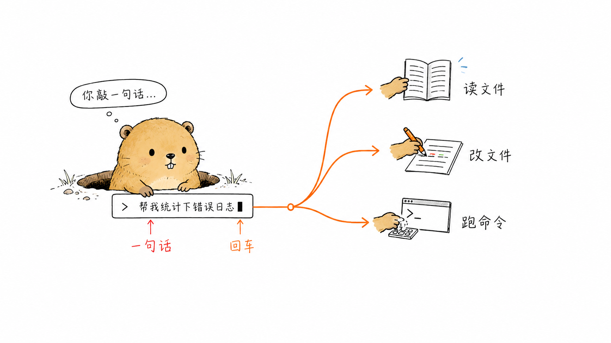
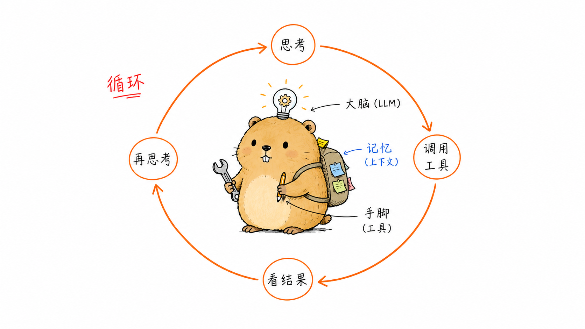
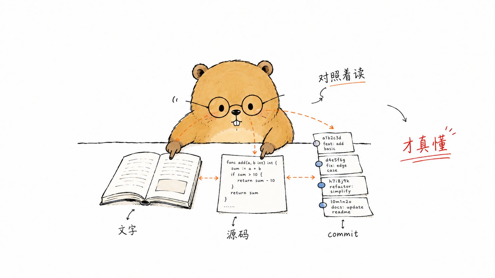

# 引言：从一行命令说起 {.unnumbered}

你在终端里敲下一句话，回车。几秒钟后，代码被读懂、文件被改写、命令被执行。这背后没有魔法，只是一套可以拆开、看清、复现的机制。本书要做的，就是把它彻底拆解，再用 Go 从零装配回来。

解剖对象是 `pi`，一个短小精悍的命令行 AI Agent。手里的刀，是它的 Go 复刻版 **pigo**（github.com/smallnest/pigo）。接下来我会像庖丁解牛那样，顺着源码的纹理，一刀一刀把一个真实可用的 Agent 剖开给你看。

{#fig:0-1 width=100%}

## Agent 到底是什么 {.unnumbered}

抛开营销话术，一个命令行 AI Agent 的本质可以写成一个朴素的公式：

> **Agent = LLM + 上下文（context） + 工具（tools）**

- **LLM** 是大脑。它理解你的意图、做出判断、决定下一步。但它本身既看不到你的文件，也执行不了任何命令，它只会输出文本。
- **上下文（context）** 是记忆与视野。系统提示、历史对话、文件内容、工具返回结果，都要被塞进有限的上下文窗口里，喂给 LLM。上下文怎么构造、怎么压缩、怎么持久化，直接决定了 Agent 是"聪明"还是"健忘"。
- **工具（tools）** 是手脚。读文件、写文件、执行 shell、搜索代码……LLM 通过结构化的工具调用把意图落到实处，再把执行结果作为新的上下文回传。

把三者用一个循环串起来——LLM 思考、调用工具、观察结果、再思考——就得到了 Agent 的核心运行时。这本书的每一章，说到底都在回答同一个问题：**这三样东西，以及串联它们的循环，在工程上到底怎么实现？**

{#fig:0-2 width=100%}

## 为什么是 pigo：pi 的 Go 复刻 {.unnumbered}

`pi` 用脚本语言写成，胜在直观。**pigo 是它的一次 Go 复刻（reimplementation）**：在保持行为对齐的前提下，用 Go 的类型系统、并发模型和清晰的包边界，把每个模块重写一遍。

选"复刻"而不是"发明"，是我刻意的教学策略：

- **有参照系**：每一处实现都能对照原版 `pi` 的行为，对错有据可依，不是凭空设计。
- **看得见取舍**：从动态语言迁到静态类型的 Go，接口怎么抽象、错误怎么传递、并发怎么组织，这些工程决策都会摊到台面上讨论。
- **能跑、能改**：pigo 是一个真实、完整、跑得起来的项目，不是教学玩具。每读完一章，你都能回到仓库里亲手验证、改写、扩展。

## 本书的读法：对照源码与 commit，逐模块「庖丁解牛」 {.unnumbered}

这不是一本讲概念的书，而是一本"拿着源码逐行拆解"的书。建议你这样读：

1. **对照源码读**：每一章都锚定 pigo 仓库里的具体模块与文件。读到关键实现时，请打开对应源码同步看——文字负责讲清"为什么这样写"，源码负责呈现"到底怎么写"。
2. **顺着 commit 读**：一个功能往往不是一步到位的。我会借助提交历史，还原某个模块从雏形到成型的过程，让你看见设计是怎么被一点点逼近的。
3. **逐模块下刀**：全书按 Agent 的自然结构切分——从最外层的 CLI 装配，到核心的 Agent 循环，再到 Provider 层、工具系统、上下文管理，直至安全与生态。每一刀都落在结构的关节处，拆开一个自洽的模块，看清它的输入、输出与边界，再拼回整体。

换句话说：**文字 + 源码 + commit** 三者对照，才是本书的完整读法。只读文字，你会觉得"好像懂了"；配上源码和提交历史，你才能真正庖丁解牛，游刃有余。

{#fig:0-3 width=100%}

## 读前须知：前置知识 {.unnumbered}

为了顺畅地跟上拆解节奏，建议你具备以下基础：

- **Go 语言**：能读写 Go 代码，理解 struct、interface、goroutine 与 channel、error 处理惯例，以及 Go Modules 的基本用法。不需要是专家，但要能读懂中等复杂度的 Go 工程。
- **LLM API 基础**：了解和大模型交互的基本概念——system/user/assistant 消息、token 与上下文窗口、流式输出（streaming），以及"函数调用 / 工具调用（function calling / tool use）"的请求与响应格式。知道一次 Chat Completions 调用长什么样就够了。
- **命令行与 Git**：熟悉终端操作，会用 `git log`、`git diff` 看提交历史——这是"顺着 commit 读"的前提。

某一项还不熟也不必却步：正文会在关键处补上必要背景，边读边补完全来得及。

## 建议阅读路径 {.unnumbered}

全书章节按 Agent 的构造顺序编排，**从头到尾顺序读**能获得最完整的体验。如果你想按需切入，这里给一条推荐路线：

先读第 1 章打地基，搞清 pigo 怎么从一条命令启动、把各个组件装配成一个可运行的程序。接着精读第 2 章的 Agent 循环——这是全书的心脏，LLM、上下文与工具正是在这里被串成整体；理解了它，其余章节都是对它的展开。

然后看接入与执行：第 3 章讲 Provider 层，即如何统一对接不同的大模型服务；第 4 章讲工具系统，即 LLM 的"手脚"怎么被定义、调用与约束。第 5 章的上下文压缩和第 6 章的会话持久化，回答"如何在有限窗口里记住足够多、并把对话存下来"。第 7 章聚焦信任与安全——一个能执行命令的 Agent，怎么才能不闯祸。第 8 章的子 Agent（sub-agent）机制，展示怎么用 Agent 调度 Agent 来拆解复杂任务。最后借讲生态与扩展的章节，把 pigo 放回更大的工具版图里审视。

如果你时间有限、只想抓精髓，那么第 1 章和第 2 章无论如何都不该跳过：它们分别交代了"程序怎么搭起来"和"Agent 怎么转起来"。

好了，磨刀已毕。让我们从第1章开始，看 pigo 是如何把一条命令，变成一个会思考、会动手的 AI Agent 的。
