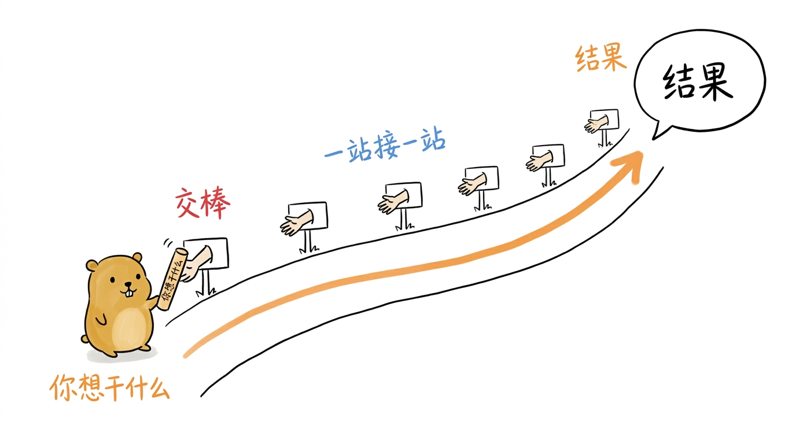
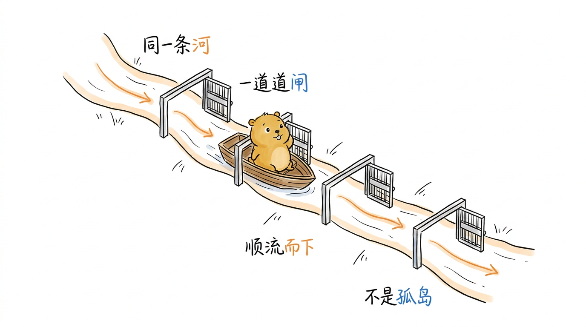

# 主线导读：一条命令的生命周期 {.unnumbered}

在正式下刀之前，先给你一根贯穿全书的红线。

后面十章会逐个包地解剖 pigo：CLI、agentcore、循环、Provider、工具、压缩、会话、信任、子 Agent、生态。如果你把它们当成十篇彼此独立的"包介绍"来读，很容易读成一盘散沙——每一章似乎都讲清楚了，可合起来却拼不成一个活的系统。问题不在某一章，而在于缺一条把它们串起来的线。

这一节就是那条线。我们只做一件事：**挑一条真实的命令，从你敲下回车的那一刻起，一路追到屏幕上打出结果为止，看清这中间十个包各自在什么时候被唤醒、又把结果交给了谁。** 读完你会得到一张"全书地图"——之后每进入一章，你都知道自己正站在这条主线的哪一站，上一棒是谁递过来的、这一章又要把它交给谁。

## 我们要追的那条命令 {.unnumbered}

```bash
pigo "读一下 main.go，帮我总结它做了什么"
```

这条命令朴素得不能再朴素，却足以驱动 pigo 的绝大部分核心机制转起来一整圈：它要启动、要装配模型与工具、要把你的话发给大模型、模型会决定"我得先读文件"、于是要真的去读 `main.go`、把内容回喂给模型、模型再据此写出总结、最后打到你的终端上。

我们把这一整圈拆成 **12 个交接点**。每个交接点我都标出：**哪个包在动**、**它做了什么**、以及**它把接力棒交给了谁**。方括号里的章号，就是这一站在书里细讲的那一章。

<!--
生图prompt：
Generate one standalone 16:9 horizontal Chinese article illustration.

Visual DNA:
Pure white background. Minimalist editorial doodle with black hand-drawn pen line art and light colored pen wash, researcher-sketchbook / whiteboard feeling. Slightly wobbly pen lines. Lots of empty white space. Sparse red/orange/blue handwritten Chinese annotations. Clean curious product-sketch feeling. No gradients, no shadows, no paper texture, no complex background, no commercial vector style, no PPT infographic look, no anime style, no children's picture book, no commercial mascot, no realistic UI.

Recurring IP character required:
小土拨鼠 (Little Gopher), an original IP: a round, chubby, warm brown-yellow gopher inspired by the Go language Gopher, but cuter, cleaner and more soothing. Round head with a pair of small round ears; two small round curious eyes; a tiny nose and two small signature front teeth; short little limbs and soft paws; warm brown-yellow fur with a lighter belly; plump rounded proportions, earnest yet gently funny. 小土拨鼠 must perform the core conceptual action, not decorate the scene. Keep it a clean round soothing cartoon gopher, not a realistic rat/hamster, not the stiff original Go Gopher, not anime, not a mascot.

Theme: 一条命令从敲下回车到打出结果，控制权像接力棒一样在一连串站点间依次传递
Core idea: 小土拨鼠是第一棒的交棒者，把一根贴着"你想干什么"标签的接力棒递向一条弯曲跑道上排开的若干接棒小站，接力棒一站站往前传，最后一站冒出"结果"
Structure type: 承接路径
Composition: 画面主体是一条从左下弯向右上的手绘跑道，跑道上等距立着几个小站牌（不必凑满十二个，示意五六个即可），每个站牌顶端有一只小手准备接棒。最左侧小土拨鼠双手把一根接力棒递给第一站，一条橙色流动箭头顺着跑道把棒一路带到右上角一个画着对话气泡"结果"的终点。中间留大量白。信息从左下流向右上
Suggested elements: 弯曲的接力跑道 / 递出接力棒的小土拨鼠 / 几个等距的接棒小站 / 顺跑道流动的橙色箭头 / 右上角"结果"对话气泡
Chinese handwritten labels: 你想干什么 / 交棒 / 一站接一站 / 结果
Color use: Black for main line art and 小土拨鼠's eyes/nose/teeth/paw outlines. 小土拨鼠 body warm brown-yellow with lighter belly. Orange for main flow/arrows. Red only for key warnings/results. Blue only for secondary notes/system state.
Constraints: One image explains only one core structure. Main subject 40%-60% of canvas. At least 35% blank white space. At most 5-8 short handwritten Chinese labels. No title in top-left corner. Do not write the structure type on the image. Not a formal diagram/slide. Invent a fresh visual metaphor for this specific content.
-->
{#fig:G-1 width=100%}

## 十二个交接点：接力棒是怎么传递的 {.unnumbered}

**① 进程启动，解析意图 —— `cmd/pigo` ﹝第 1 章﹞**

`main()` 拿到你的命令行。它先把 `pigo install` 这类包管理子命令择出去，剩下的交给 `pflag` 解析：`"读一下 main.go…"` 是本次的提示词，没有 `-p` 就意味着走交互/无头之外的默认运行。此刻还没有任何网络请求，程序只是在**搞清楚你想干什么**。

> 交棒：把"用哪个模型、带哪些工具、系统提示是什么"这些散落的意图，收敛成一个 `RunConfig`，交给下一站装配。

**② 装配一次运行 —— `cmd/pigo` + `internal/provider` ﹝第 1、4 章﹞**

`newRunConfig` 是"一次运行如何接线"的唯一定义。它在这里把三样东西装到位：解析出的 Provider（比如根据 `--model` 落到某个 OpenAI 兼容网关，见 ﹝第 4 章﹞ 的 `resolveProvider`）、注册好的工具集（`read`/`write`/`bash`… 见 ﹝第 5 章﹞）、以及拼好的系统提示。

> 交棒：装配完成，控制权沿 `StartRun` 交给运行时——**从这里开始，就是 Agent 循环的地盘了。**

**③ 循环启动，发出第一个事件 —— `internal/runtime` ﹝第 3 章﹞**

`StartRun` 拉起一个 producer goroutine 跑 `runLoop`。它做的第一件事是 `emit(AgentStartEvent)`——**在任何网络请求之前**就宣告"一次 run 开始了"，好让下游消费者（终端渲染、会话记录、计费）有个明确的起点。随后进入两层循环的**内层**。

> 交棒：内层循环要做的第一件事，是把当前上下文变成一次流式回复——交给 `streamAssistantResponse`。

**④ 一次流式回复：塑形、发送、回填 —— `internal/runtime` ﹝第 3 章﹞**

`streamAssistantResponse` 把 `agentcore` 里的消息、系统提示、工具定义（﹝第 2 章﹞ 的核心契约）塑形成一次请求，解析出 API Key，然后调用 `cfg.Stream(...)`——**这就是循环与 Provider 之间那道协议无关的接口**。它不关心对面是 OpenAI 还是 Anthropic，只知道会拿回一段增量事件流。

> 交棒：`cfg.Stream` 这个函数值，要由 Provider 层兑现成真实的 HTTP + SSE。

**⑤ 把函数调用兑现成线上流量 —— `internal/provider` ﹝第 4 章﹞**

Provider 层接手：发起 HTTP 请求，逐行解析 SSE，用**有状态解码器**把 OpenAI/Anthropic 两套完全不同的事件序列，累积成同一套 `AssistantMessageEvent` 增量。这段流里，模型没有直接回答"总结"，而是吐出了一个**工具调用**：`read_file(path="main.go")`——它判断"我得先看到文件才能总结"。

> 交棒：增量流回到 ④，`streamAssistantResponse` 把碎片拼成一条完整的 `AssistantMessage`（`emit(MessageStart/Update/End)`），里面带着那个 `read` 工具调用，返回给内层循环。

**⑥ 内层循环发现：有工具要跑 —— `internal/runtime` ﹝第 3 章﹞**

`runLoop` 检查这条 assistant 消息：它点名了工具，所以这一轮**不能自然收尾**。循环把收集到的工具调用交给执行器。

> 交棒：一批工具调用交给 `ExecuteToolCalls`。

**⑦ 执行前的安全闸门 —— `internal/trust` ﹝第 8 章﹞**

在 `read` 真正落地前，工具执行器的准备阶段会过一道 `BeforeToolCall` 钩子。信任闸门在这里判断当前目录是否受信、这个工具是否有副作用。`read` 是只读的，放行；如果模型点名的是 `bash rm -rf` 这类副作用操作，闸门会在此拦下、要你确认。

> 交棒：放行的调用继续进入真正的执行。

**⑧ 真的去读文件 —— `internal/agenttool` ﹝第 5 章﹞**

`ExecuteToolCalls` 走批量执行：单个或并发地跑每个工具。`ReadTool` 打开 `main.go`、读出内容、`emit(ToolStart/ToolEnd)`，把文件正文包装成一条 `ToolResultMessage`。

> 交棒：工具结果作为**新的上下文消息**回填进 `agentCtx`，控制权回到内层循环。

**⑨ 带着文件内容，再转一圈 —— 回到 ④/⑤ ﹝第 3、4 章﹞**

内层循环拿着新回填的文件内容，**再次**调用 `streamAssistantResponse` → `cfg.Stream` → Provider。这一回模型看得见 `main.go` 的正文了，于是它不再点名工具，而是直接流式吐出那段总结文字。

> 交棒：这条 assistant 消息**没有工具调用**——内层循环的自然收尾条件满足了。

**⑩ 一轮收尾，逐轮钩子登场 —— `internal/runtime` + `internal/compaction` ﹝第 3、6 章﹞**

内层循环收尾，`emit(TurnEndEvent)`，进入 `afterTurn`。这里挂着几个逐轮钩子：`GetSteeringMessages`（有没有要插队的话）、`PrepareNextTurn`（要不要换模型/思考等级）、还有 `maybeAutoCompact`——如果这轮读文件把上下文顶到接近 token 上限，就触发 ﹝第 6 章﹞ 的压缩：选切点、做摘要、`RebuildContext`，在不丢关键信息的前提下腾出窗口。我们这条短命令用不到压缩，但闸门每轮都在。

> 交棒：钩子跑完，`afterTurn` 决定要不要停；不停就把控制权交给**外层循环**。

**⑪ 外层循环：还有下文吗？ —— `internal/runtime` ﹝第 3 章﹞**

内层已经自然收尾，外层这时才问一句：`GetFollowUpMessages` 有没有返回新的输入？我们这条一次性命令没有后续消息，所以外层循环也到头了。（如果是 REPL 里连续追问，或有 steering 消息，就会从这里再驱动一整圈。）

> 交棒：没有下文，run 正式结束。

**⑫ 收尾并落盘 —— `internal/runtime` + `internal/session` ﹝第 3、7 章﹞**

`finish()` 发出 `emit(AgentEndEvent)`。与此同时，本轮产生的消息被 ﹝第 7 章﹞ 的会话存储作为分支追加进那个 JSONL 会话文件——这样明天 `--resume` 还能接上。终端把流式吐出的总结渲染完毕。**你看到了答案。**

## 把这张地图记在心里 {.unnumbered}

上面十二步，就是全书的骨架。把它压成一句话：

> **CLI 装配出一次运行﹝1﹞→ 循环﹝3﹞ 反复地「让 Provider﹝4﹞ 流式回复 → 过信任闸门﹝8﹞ → 执行工具﹝5﹞ → 回填」，直到某轮不再点名工具；逐轮之间还夹着压缩﹝6﹞ 等钩子；一次 run 收尾后落盘到会话﹝7﹞。**

<!--
生图prompt：
Generate one standalone 16:9 horizontal Chinese article illustration.

Visual DNA:
Pure white background. Minimalist editorial doodle with black hand-drawn pen line art and light colored pen wash, researcher-sketchbook / whiteboard feeling. Slightly wobbly pen lines. Lots of empty white space. Sparse red/orange/blue handwritten Chinese annotations. Clean curious product-sketch feeling. No gradients, no shadows, no paper texture, no complex background, no commercial vector style, no PPT infographic look, no anime style, no children's picture book, no commercial mascot, no realistic UI.

Recurring IP character required:
小土拨鼠 (Little Gopher), an original IP: a round, chubby, warm brown-yellow gopher inspired by the Go language Gopher, but cuter, cleaner and more soothing. Round head with a pair of small round ears; two small round curious eyes; a tiny nose and two small signature front teeth; short little limbs and soft paws; warm brown-yellow fur with a lighter belly; plump rounded proportions, earnest yet gently funny. 小土拨鼠 must perform the core conceptual action, not decorate the scene. Keep it a clean round soothing cartoon gopher, not a realistic rat/hamster, not the stiff original Go Gopher, not anime, not a mascot.

Theme: 十个包不是十座孤岛，而是同一条河上依次开合的水闸，让一次对话之水顺流而下
Core idea: 小土拨鼠划着一条小船顺着一条蜿蜒的河往下游漂，河上依次立着几道水闸，每漂到一道闸门就开启放行、船继续往前，一道道闸把水（一次对话）平稳送到下游
Structure type: 概念隐喻
Composition: 一条从左上蜿蜒流到右下的手绘河道，河上等距横跨三四道简笔水闸门，每道闸门此刻都开着。小土拨鼠坐在一条小船上正漂过其中一道闸门，好奇地回头望。橙色水流箭头顺河而下贯穿所有闸门。大量留白，河岸只用几笔勾出。信息从左上流向右下
Suggested elements: 蜿蜒的河道 / 依次开启的几道水闸 / 划着小船漂流的小土拨鼠 / 顺流而下的橙色水流箭头
Chinese handwritten labels: 同一条河 / 一道道闸 / 顺流而下 / 不是孤岛
Color use: Black for main line art and 小土拨鼠's eyes/nose/teeth/paw outlines. 小土拨鼠 body warm brown-yellow with lighter belly. Orange for main flow/arrows. Blue only for water/secondary notes. Red only for key emphasis.
Constraints: One image explains only one core structure. Main subject 40%-60% of canvas. At least 35% blank white space. At most 5-8 short handwritten Chinese labels. No title in top-left corner. Do not write the structure type on the image. Not a formal diagram/slide. Invent a fresh visual metaphor for this specific content.
-->
{#fig:G-2 width=100%}

而这张地图上还有几处我们这条短命令没走到、但同样重要的岔路，后面各章会补齐：

- **﹝第 2 章 agentcore﹞** 不是主线上的某一"站"，而是**贯穿每一站的血管**——上面每一步传递的消息、事件、工具、钩子，用的都是它定义的类型。所以它排在最前面讲。
- **﹝第 9 章 子 Agent﹞** 是第 ⑧ 步的一个特例：当模型点名的"工具"其实是一次委派，执行器会拉起**另一个进程**跑一整圈独立的循环，只把结论交回来。
- **﹝第 10 章 生态﹞** 决定了第 ② 步装配时，工具集和命令**从哪来**——除了编译进二进制的内置工具，还能由 Skills、Plugins、包管理器在不改源码的前提下挂载进来。

现在你有了红线。接下来每翻开一章，先回到这张地图上定位一下："我在第几站？上一棒是谁给的？这一章要把它交给谁？" 带着这个问题读，十个包就不再是十座孤岛，而是同一条河上依次开合的水闸。

磨刀已毕，我们从第 1 章——这条河的源头，一条命令如何启动一个程序——开始。
