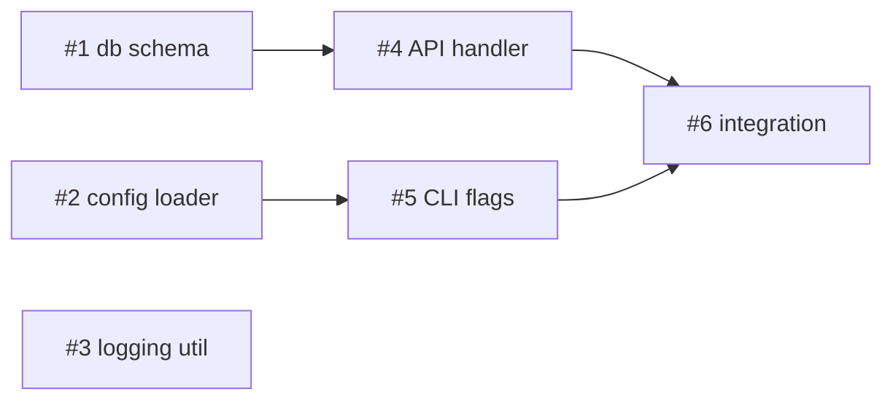

# graph — Task/PRD to Parallel Execution Graph

Turn a task (or PRD / SPEC / issue set) into a **directed acyclic graph** of work units, layer it into **supersteps (waves)**, and implement each wave's independent nodes **concurrently** using subagents. Each node runs the full `/goal → /review-it → /ship-it` pipeline inside its **own git worktree**, so parallel nodes never clobber each other's working tree. Between waves, a **fan-in barrier** merges results and re-plans the next wave.

This is the parallel sibling of `/loop-it`. `/loop-it` is strictly sequential (one worktree, one issue at a time). `/graph` fans out every independent node in a wave at once.

---

## Mental Model (borrowed from LangGraph / graph engineering)

| Concept | Here |
|---------|------|
| **Node** | One implementable unit of work (an issue / subtask) |
| **Edge** | A dependency: `B depends on A` → edge `A → B` |
| **Superstep / wave** | A set of nodes whose deps are all satisfied — run concurrently |
| **Fan-out** | Dispatch one subagent per node in the current wave |
| **Fan-in (barrier)** | Wait for **all** nodes in the wave before starting the next |
| **State channel** | `.graph_state` — shared checkpoint, rewritten between waves (resume source) |
| **Live tracker** | `graph.html` — Claude-style light-theme dashboard, re-rendered from `.graph_state` at every checkpoint |
| **Dynamic re-plan** | After a wave, revise the graph if new work/deps emerged |

**Core principle:** Independent nodes in the same wave have *no shared state and no ordering dependency*, so they can run in true parallel. Dependencies define the *only* ordering. Everything else runs at once.

---

## Overview

```
Input (task / PRD / SPEC / issues)
        │
        ▼
1. Decompose into nodes  ─────────►  nodes = {id, title, deps, criteria, scope}
        │
        ▼
2. Build DAG + validate  ─────────►  detect cycles, orphan deps
        │
        ▼
3. Topological layering  ─────────►  waves = [[n1,n2,n3], [n4,n5], [n6]]
        │
        ▼
4. Render graph + confirm with user
        │
        ▼  (write .graph_state + graph.html — open graph.html to watch live)
┌──────────── per wave (superstep) ────────────┐
│                                               │
│  FAN-OUT: 1 subagent per node (parallel)      │
│    each subagent, in its own git worktree:    │
│      /goal (inline implement) → /review-it    │
│                              → /ship-it        │
│                                               │
│  FAN-IN barrier: wait for ALL nodes           │
│    integrate, update .graph_state             │
│    re-render graph.html                        │
│    re-plan next wave if graph changed         │
│                                               │
└───────────────────────────────────────────────┘
        │
        ▼
All waves done → final summary
```

---

## Step 1: Locate & Decompose Input

Accept any of: a free-form task description, a PRD/SPEC file, or an existing issue set (GitHub / local `.md` / iCafe).

- **PRD/SPEC** → reuse `/to-issues` decomposition rules (one node per User Story; split large, merge tiny).
- **Existing issues** → each issue is a node; parse dependencies from issue bodies (`Depends on: #3`, `Dependencies: #3, #5`).
- **Free-form task** → break into the smallest independently-shippable units yourself.

Each node MUST have:

```
Node #N
  title:      short imperative title
  deps:       [list of node ids] or []
  criteria:   acceptance criteria (checklist) — how the subagent knows it's done
  type:       backend | frontend | fullstack | ui | infra | docs
  scope_hint: which files/dirs this node is expected to touch (for conflict analysis)
```

`scope_hint` matters: two nodes with no dependency edge but overlapping file scope are **not** truly independent — see Step 3.

---

## Step 2: Build the DAG & Validate

Construct edges from `deps`. Then validate:

| Check | Action on failure |
|-------|-------------------|
| **Cycle** (`A → B → A`) | Print `⚠️ 循环依赖: #A ↔ #B`. Break by node id order, warn user, ask to confirm or fix. |
| **Dangling dep** (`#7 depends on #99`, no such node) | Print warning, drop the phantom edge. |
| **Scope collision** (two dep-free nodes edit same files) | Add a *soft edge* to serialize them (lower id first), OR flag for user. Never let two parallel worktrees fight over the same files. |

**Hot-file exception:** A shared *wiring* file that nearly every node must touch (e.g. `router.go`, `main.go`, `mod.rs`, a DI container, an `__init__` re-export) does NOT count as a scope collision — treating it as one would serialize the entire graph into a chain. For such files, assume append-only edits merge cleanly, and prefer one of: (a) designate a single node that *owns* wiring and have others expose a registration hook, or (b) do a tiny follow-up "wire everything" node in the last wave. Reserve the collision rule for nodes that edit the *same logic* in the same file (e.g. two handlers rewriting the same function).

---

## Step 3: Topological Layering into Waves

Compute waves via Kahn's algorithm:

1. **Wave 0** = all nodes with `deps == []` and no scope collision among themselves.
2. Remove wave-0 nodes; **Wave 1** = nodes whose deps are now all satisfied.
3. Repeat until all nodes placed.
4. Within a wave, if two nodes edit the **same logic in the same file** (real collision, per the hot-file exception in Step 2), push the higher-id one to the next wave. Bare wiring-file overlap does not trigger this.

**ID conventions (used consistently):** lower id wins — cycles break by lowest id first (Step 2), and scope collisions serialize with the lower id first (higher id deferred to the next wave).

Print the layered plan:

```
📊 Graph: 6 nodes, 3 waves

Wave 0 (parallel ×3):  #1 db schema   #2 config loader   #3 logging util
Wave 1 (parallel ×2):  #4 API handler (deps #1)   #5 CLI flags (deps #2)
Wave 2 (parallel ×1):  #6 integration (deps #4,#5)

Max parallelism: 3 subagents in Wave 0.
```

Also emit a Mermaid diagram for the user:

````

````

**Wait for user confirmation** before dispatching any subagent. Let them adjust nodes, deps, or the max-parallelism cap.

---

## Step 4: Pre-flight Checks

Before the first wave (same spirit as `/loop-it`):

```bash
git rev-parse --is-inside-work-tree   # in a repo?
git status --porcelain                # clean tree? (dirty → stash/abort)
git branch --show-current             # on main/master?
git ls-remote --heads origin          # remote reachable?
gh auth status                        # if shipping to GitHub
```

Any hard failure → print the error and stop. Confirm a **max concurrency cap** with the user (default 3–4 parallel subagents; more risks rate limits and review noise).

Then **initialize the state channel + live tracker** (do this once, right after the plan is confirmed and before the first fan-out):

```bash
# 1. Write the initial checkpoint (all nodes pending, current_wave 0).
cat > .graph_state <<'JSON'
{ "version": 1, "task": "...", "repo": "owner/repo",
  "waves": [[1,2,3],[4,5],[6]], "current_wave": 0,
  "nodes": { "1": {"title":"...","deps":[],"status":"pending","wave":0}, ... } }
JSON

# 2. Keep it out of git.
grep -qxF '.graph_state' .gitignore || printf '.graph_state\ngraph.html\n' >> .gitignore

# 3. Render the Claude-style light-theme dashboard.
python3 skills/graph/scripts/render_graph_html.py .graph_state graph.html
```

Tell the user: **open `graph.html` in a browser** — it auto-refreshes every 5s, so it tracks execution live (waves, node statuses, progress bar, and a Mermaid DAG colored by status). Re-run the render command at every checkpoint (see Step 5b) to push updates.

---

## Step 5: Execute Wave by Wave (fan-out → fan-in)

For each wave, in order:

### 5a. FAN-OUT — one subagent per node, in parallel

**Dispatch all nodes of the wave in a single response** (multiple Agent/subagent calls in one message = concurrent). Each subagent works in its **own git worktree** so parallel file edits never collide:

```bash
# The orchestrator creates a worktree per node BEFORE dispatching:
git worktree add -b feat/node-{N}-{slug} ../.graph-worktrees/node-{N} main
```

Each subagent receives a **self-contained** prompt (it does NOT inherit orchestrator context):

```markdown
You are implementing ONE node of a task graph, working in an ISOLATED git worktree.

Worktree:  ../.graph-worktrees/node-{N}   (already created on branch feat/node-{N}-{slug})
Node #{N}: {title}
Type:      {type}
Scope:     {scope_hint}  — stay within these files; do not touch other nodes' scope

Acceptance criteria (all must pass):
- [ ] {criterion 1}
- [ ] {criterion 2}

Context (deps already merged into main, pull first):
{summaries of dependency nodes' outputs, or the referenced PRD/SPEC excerpt}

Your pipeline (run all three, in order):
1. IMPLEMENT (inline /goal): read the node + any referenced PRD/SPEC, read adjacent
   code, implement to satisfy EVERY acceptance criterion, run build + tests + lint
   (e.g. go build ./... && go vet ./... && go test ./...). Iterate until all green.
2. REVIEW (/review-it): run code review on your changes, apply accepted findings,
   re-run focused tests, repeat until review is clean (max 2 rounds).
3. SHIP (/ship-it): commit (message references the node/issue), push branch,
   create PR, merge, close the issue.

Constraints:
- Work ONLY inside your worktree. Do NOT edit files outside {scope_hint}.
- Do NOT try to call `goal` via the Skill tool (it's a UI command, not a skill) —
  "implement" means you write the code yourself. /review-it and /ship-it ARE skills.
- If you cannot satisfy a criterion, STOP and report what's blocking — don't fake it.

Return: node id, PASS/FAIL, PR/commit refs, files changed, and — if you discovered new required work or a dependency the graph didn't capture — a `NEW_WORK:` line describing it (title + which nodes it blocks). Emit `NEW_WORK: none` if there's nothing.
```

> **Why worktrees, not branches alone:** `/goal` mutates the working tree. Two subagents editing the same checkout would corrupt each other. A worktree per node gives each its own filesystem checkout on its own branch — that's what makes the wave genuinely parallel and safe.

### 5b. FAN-IN — barrier, integrate, re-plan

Wait for **every** subagent in the wave to return (BSP barrier — the next wave cannot start until this one commits). Then:

1. Read each subagent's summary. Mark node `shipped` or `failed`.
2. `git checkout main && git pull` — dependency outputs are now on main for the next wave.
3. Remove finished worktrees: `git worktree remove ../.graph-worktrees/node-{N}` (keep failed ones for investigation).
4. Write checkpoint to `.graph_state`, then re-render the tracker:
   `python3 skills/graph/scripts/render_graph_html.py .graph_state graph.html` (the open `graph.html` picks it up on its next auto-refresh).
5. **Dynamic re-plan** (LangGraph-style conditional edge): scan each subagent's `NEW_WORK:` line. If any is not `none`, add the new node(s)/edge(s) and re-layer the *remaining* nodes before starting the next wave. Show the user the delta.
6. If any node in the wave **failed**, mark all nodes that depend on it as `blocked` and skip them (their inputs aren't ready).

Proceed to the next wave.

---

## State File: `.graph_state` (+ live tracker `graph.html`)

`.graph_state` lives at the repo root and **must be in `.gitignore`**. It's the single source of truth: checkpoint it after every wave so a crash resumes at the wave boundary, and re-render `graph.html` from it so the browser dashboard stays live. `graph.html` is a *derived* view — never hand-edit it; regenerate it from `.graph_state`.

```json
{
  "version": 1,
  "updated_at": "2026-07-21T10:30:00Z",
  "task": "Add user auth",
  "repo": "owner/repo",
  "waves": [[1, 2, 3], [4, 5], [6]],
  "current_wave": 1,
  "nodes": {
    "1": { "title": "db schema", "deps": [], "status": "shipped", "branch": "feat/node-1-db-schema", "pr": 43, "wave": 0 },
    "2": { "title": "config loader", "deps": [], "status": "shipped", "wave": 0 },
    "3": { "title": "logging util", "deps": [], "status": "failed", "wave": 0, "error": "test TestLog failed", "attempts": 2 },
    "4": { "title": "API handler", "deps": [1], "status": "in_progress", "wave": 1 },
    "6": { "title": "integration", "deps": [4, 5], "status": "blocked", "wave": 2, "reason": "depends on #3 (failed)" }
  }
}
```

Status values: `pending | in_progress | shipped | failed | blocked | skipped`. Each node carries `title` + `deps` so `graph.html` can draw the DAG and cards straight from the checkpoint.

Render the tracker any time with:

```bash
python3 skills/graph/scripts/render_graph_html.py .graph_state graph.html
```

On resume: read `.graph_state`, skip `shipped`, ask about `failed` (retry/skip), re-derive remaining waves, and re-render `graph.html`.

---

## Safety Guards

- **Worktree isolation is mandatory** — never run two parallel `/goal` sessions in the same checkout.
- **Fan-in barrier is mandatory** — never start wave N+1 before every node in wave N returns and merges.
- **Scope collisions serialize** — dep-free nodes touching the same files go in different waves.
- **Never skip /review-it** before `/ship-it`.
- **Cap concurrency** — default 3–4; more invites rate limits and merge contention.
- **Never force-push to main.** Each node ships via its own branch/PR.
- **Failed node blocks its dependents** — don't ship on top of unmet inputs.
- **Max retries per node** — reuse `/loop-it`'s error classes; don't loop forever.
- **Confirm the plan** before the first fan-out.

---

## Common Mistakes

| Mistake | Fix |
|---------|-----|
| Dispatching subagents in separate responses | One response, multiple calls = parallel. Separate = sequential. |
| No worktree → parallel edits corrupt the tree | One `git worktree` per node. |
| Two "independent" nodes edit the same file | Add a soft edge; put them in different waves. |
| Starting the next wave before all nodes merge | Enforce the fan-in barrier. |
| Over-decomposing into 20 trivial nodes | Merge tiny units; a node should be a meaningful shippable unit. |
| Ignoring a failed node's dependents | Mark them `blocked`, skip them. |

---

## Relationship to Other Skills

```
/prd → /prd-to-spec → /to-issues ─┬─► /loop-it   (sequential: one node at a time)
                                   └─► /graph     (parallel: whole wave at once)
                                          │
                     each node: inline /goal → /review-it → /ship-it (in its own worktree)
```

- **`/to-issues`** — decomposition rules reused for building nodes.
- **`/loop-it`** — sequential counterpart; use it when nodes heavily share files or serial safety matters.
- **`/graph`** — this skill; use it when the DAG has genuine parallelism (independent subsystems).
- **`/review-it`, `/ship-it`** — real skills each node's subagent invokes.
```
